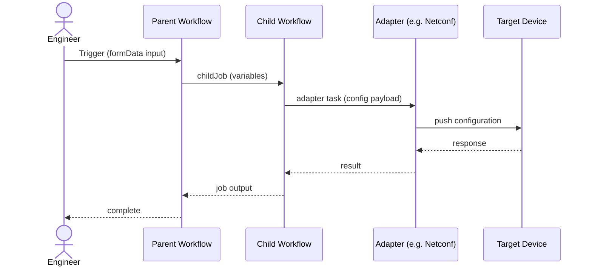

# Builder Skills Repository Transfer — Part 002 of 011

**Git commit:** `982d97c1573ca7ea892b39acced9b0d15955c4a9` on branch `main`  
**Generated:** 2026-08-31 21:28:30 UTC  
**See also:** `builder-skills-transfer-manifest.md` for the full repository manifest, directory tree, and complete checksum index across all parts.

This part contains **110** file(s):

- `LICENSE`
- `README.md`
- `SECURITY.md`
- `docs/builder-flow.md`
- `docs/developer-flow.md`
- `docs/quickstart.md`
- `docs/troubleshooting.md`
- `environments/cloud-lab.env`
- `environments/local-dev.env`
- `environments/staging.env`
- `eos-ab-upgrade/.github/workflows/validate-eos-project.yml`
- `eos-ab-upgrade/.gitignore`
- `eos-ab-upgrade/MVP1-DEPLOYMENT-CHECKLIST.md`
- `eos-ab-upgrade/MVP1-INTEGRATION.md`
- `eos-ab-upgrade/README.md`
- `eos-ab-upgrade/docs/acceptance-test-plan.md`
- `eos-ab-upgrade/docs/architecture.md`
- `eos-ab-upgrade/docs/device-broker-map.md`
- `eos-ab-upgrade/docs/itential-task-map.md`
- `eos-ab-upgrade/docs/python-action-map.md`
- `eos-ab-upgrade/docs/rollback-plan.md`
- `eos-ab-upgrade/iag/eos-precheck-service.yaml`
- `eos-ab-upgrade/iag/eos-readiness-service.yaml`
- `eos-ab-upgrade/integration-contracts.md`
- `eos-ab-upgrade/pyproject.toml`
- `eos-ab-upgrade/services/eos_upgrade/__init__.py`
- `eos-ab-upgrade/services/eos_upgrade/cli.py`
- `eos-ab-upgrade/services/eos_upgrade/device_broker.py`
- `eos-ab-upgrade/services/eos_upgrade/iag_entrypoint.py`
- `eos-ab-upgrade/services/eos_upgrade/maintenance.py`
- `eos-ab-upgrade/services/eos_upgrade/models.py`
- `eos-ab-upgrade/services/eos_upgrade/precheck.py`
- `eos-ab-upgrade/services/eos_upgrade/readiness.py`
- `eos-ab-upgrade/services/eos_upgrade/readiness_entrypoint.py`
- `eos-ab-upgrade/services/eos_upgrade/reporting.py`
- `eos-ab-upgrade/services/eos_upgrade/upgrade.py`
- `eos-ab-upgrade/services/eos_upgrade/validation.py`
- `eos-ab-upgrade/specs/spec-arista-eos-ab-upgrade.md`
- `eos-ab-upgrade/specs/workflow-task-map.md`
- `eos-ab-upgrade/tests/fixtures/fake_broker.py`
- `eos-ab-upgrade/tests/fixtures/readiness_payloads.py`
- `eos-ab-upgrade/tests/test_device_broker.py`
- `eos-ab-upgrade/tests/test_maintenance.py`
- `eos-ab-upgrade/tests/test_precheck.py`
- `eos-ab-upgrade/tests/test_readiness.py`
- `eos-ab-upgrade/tests/test_reporting.py`
- `eos-ab-upgrade/tests/test_validation.py`
- `eos-ab-upgrade/workflows/eos-postcheck.json`
- `eos-ab-upgrade/workflows/eos-precheck.json`
- `eos-ab-upgrade/workflows/eos-upgrade-orchestrator.json`
- `eos-ab-upgrade/workflows/eos-upgrade-readiness.json`
- `eos-ab-upgrade/workflows/eos-upgrade-single-device.json`
- `eos-readiness-engine/.gitignore`
- `eos-readiness-engine/README.md`
- `eos-readiness-engine/eos_readiness/__init__.py`
- `eos-readiness-engine/eos_readiness/checks/__init__.py`
- `eos-readiness-engine/eos_readiness/checks/bgp.py`
- `eos-readiness-engine/eos_readiness/checks/collection.py`
- `eos-readiness-engine/eos_readiness/checks/interfaces.py`
- `eos-readiness-engine/eos_readiness/checks/mlag.py`
- `eos-readiness-engine/eos_readiness/checks/version.py`
- `eos-readiness-engine/eos_readiness/engine.py`
- `eos-readiness-engine/eos_readiness/errors.py`
- `eos-readiness-engine/eos_readiness/iag_entrypoint.py`
- `eos-readiness-engine/eos_readiness/models.py`
- `eos-readiness-engine/eos_readiness/profiles/__init__.py`
- `eos-readiness-engine/eos_readiness/profiles/registry.py`
- `eos-readiness-engine/eos_readiness/raw/__init__.py`
- `eos-readiness-engine/eos_readiness/raw/collectors.py`
- `eos-readiness-engine/eos_readiness/raw/normalize.py`
- `eos-readiness-engine/eos_readiness/raw/parsers.py`
- `eos-readiness-engine/eos_readiness/status.py`
- `eos-readiness-engine/iag/eos-readiness-service.yaml`
- `eos-readiness-engine/pyproject.toml`
- `eos-readiness-engine/tests/factories.py`
- `eos-readiness-engine/tests/fixtures/raw/USILD001LAB01A__show_version.json`
- `eos-readiness-engine/tests/fixtures/raw/command_results_pair_sample.json`
- `eos-readiness-engine/tests/test_checks_bgp.py`
- `eos-readiness-engine/tests/test_checks_collection.py`
- `eos-readiness-engine/tests/test_checks_interfaces.py`
- `eos-readiness-engine/tests/test_checks_mlag.py`
- `eos-readiness-engine/tests/test_checks_version.py`
- `eos-readiness-engine/tests/test_collectors.py`
- `eos-readiness-engine/tests/test_engine_decision_contract.py`
- `eos-readiness-engine/tests/test_evaluate_pair.py`
- `eos-readiness-engine/tests/test_normalize.py`
- `eos-readiness-engine/tests/test_parse_show_version.py`
- `eos-readiness-engine/tests/test_profiles.py`
- `eos-readiness-engine/tests/test_status.py`
- `eos-readiness-engine/workflows/eos-ab-readiness.json`
- `evals/COVERAGE-REPORT.md`
- `evals/e2e/e2e-results.json`
- `evals/e2e/run-e2e-tests.sh`
- `evals/e2e/test1-utility-chain.json`
- `evals/e2e/test2-child-workflow.json`
- `evals/e2e/test2-parent-loop.json`
- `evals/e2e/test3-adapter-servicenow.json`
- `evals/evals.json`
- `evals/trigger-evals/README.md`
- `evals/trigger-evals/builder-agent-results.json`
- `evals/trigger-evals/builder-agent.json`
- `evals/trigger-evals/documentation-results.json`
- `evals/trigger-evals/documentation.json`
- `evals/trigger-evals/explore-results.json`
- `evals/trigger-evals/explore.json`
- `evals/trigger-evals/solution-arch-agent-results.json`
- `evals/trigger-evals/solution-arch-agent.json`
- `evals/trigger-evals/spec-agent-results.json`
- `evals/trigger-evals/spec-agent.json`
- `helpers/assets/flowagent-sample-agent-project.json`

---

============================================================
FILE: LICENSE
DIRECTORY: ./
FILENAME: LICENSE
============================================================
SHA256: d89bfd34f67eb6ec72bd6e3f1aaaeccaff520a97bdc6fcf6a99315336c91b532

````text
                    GNU GENERAL PUBLIC LICENSE
                       Version 3, 29 June 2007

 Copyright (C) 2007 Free Software Foundation, Inc. <https://fsf.org/>
 Everyone is permitted to copy and distribute verbatim copies
 of this license document, but changing it is not allowed.

                            Preamble

  The GNU General Public License is a free, copyleft license for
software and other kinds of works.

  The licenses for most software and other practical works are designed
to take away your freedom to share and change the works.  By contrast,
the GNU General Public License is intended to guarantee your freedom to
share and change all versions of a program--to make sure it remains free
software for all its users.  We, the Free Software Foundation, use the
GNU General Public License for most of our software; it applies also to
any other work released this way by its authors.  You can apply it to
your programs, too.

  When we speak of free software, we are referring to freedom, not
price.  Our General Public Licenses are designed to make sure that you
have the freedom to distribute copies of free software (and charge for
them if you wish), that you receive source code or can get it if you
want it, that you can change the software or use pieces of it in new
free programs, and that you know you can do these things.

  To protect your rights, we need to prevent others from denying you
these rights or asking you to surrender the rights.  Therefore, you have
certain responsibilities if you distribute copies of the software, or if
you modify it: responsibilities to respect the freedom of others.

  For example, if you distribute copies of such a program, whether
gratis or for a fee, you must pass on to the recipients the same
freedoms that you received.  You must make sure that they, too, receive
or can get the source code.  And you must show them these terms so they
know their rights.

  Developers that use the GNU GPL protect your rights with two steps:
(1) assert copyright on the software, and (2) offer you this License
giving you legal permission to copy, distribute and/or modify it.

  For the developers' and authors' protection, the GPL clearly explains
that there is no warranty for this free software.  For both users' and
authors' sake, the GPL requires that modified versions be marked as
changed, so that their problems will not be attributed erroneously to
authors of previous versions.

  Some devices are designed to deny users access to install or run
modified versions of the software inside them, although the manufacturer
can do so.  This is fundamentally incompatible with the aim of
protecting users' freedom to change the software.  The systematic
pattern of such abuse occurs in the area of products for individuals to
use, which is precisely where it is most unacceptable.  Therefore, we
have designed this version of the GPL to prohibit the practice for those
products.  If such problems arise substantially in other domains, we
stand ready to extend this provision to those domains in future versions
of the GPL, as needed to protect the freedom of users.

  Finally, every program is threatened constantly by software patents.
States should not allow patents to restrict development and use of
software on general-purpose computers, but in those that do, we wish to
avoid the special danger that patents applied to a free program could
make it effectively proprietary.  To prevent this, the GPL assures that
patents cannot be used to render the program non-free.

  The precise terms and conditions for copying, distribution and
modification follow.

                       TERMS AND CONDITIONS

  0. Definitions.

  "This License" refers to version 3 of the GNU General Public License.

  "Copyright" also means copyright-like laws that apply to other kinds of
works, such as semiconductor masks.

  "The Program" refers to any copyrightable work licensed under this
License.  Each licensee is addressed as "you".  "Licensees" and
"recipients" may be individuals or organizations.

  To "modify" a work means to copy from or adapt all or part of the work
in a fashion requiring copyright permission, other than the making of an
exact copy.  The resulting work is called a "modified version" of the
earlier work or a work "based on" the earlier work.

  A "covered work" means either the unmodified Program or a work based
on the Program.

  To "propagate" a work means to do anything with it that, without
permission, would make you directly or secondarily liable for
infringement under applicable copyright law, except executing it on a
computer or modifying a private copy.  Propagation includes copying,
distribution (with or without modification), making available to the
public, and in some countries other activities as well.

  To "convey" a work means any kind of propagation that enables other
parties to make or receive copies.  Mere interaction with a user through
a computer network, with no transfer of a copy, is not conveying.

  An interactive user interface displays "Appropriate Legal Notices"
to the extent that it includes a convenient and prominently visible
feature that (1) displays an appropriate copyright notice, and (2)
tells the user that there is no warranty for the work (except to the
extent that warranties are provided), that licensees may convey the
work under this License, and how to view a copy of this License.  If
the interface presents a list of user commands or options, such as a
menu, a prominent item in the list meets this criterion.

  1. Source Code.

  The "source code" for a work means the preferred form of the work
for making modifications to it.  "Object code" means any non-source
form of a work.

  A "Standard Interface" means an interface that either is an official
standard defined by a recognized standards body, or, in the case of
interfaces specified for a particular programming language, one that
is widely used among developers working in that language.

  The "System Libraries" of an executable work include anything, other
than the work as a whole, that (a) is included in the normal form of
packaging a Major Component, but which is not part of that Major
Component, and (b) serves only to enable use of the work with that
Major Component, or to implement a Standard Interface for which an
implementation is available to the public in source code form.  A
"Major Component", in this context, means a major essential component
(kernel, window system, and so on) of the specific operating system
(if any) on which the executable work runs, or a compiler used to
produce the work, or an object code interpreter used to run it.

  The "Corresponding Source" for a work in object code form means all
the source code needed to generate, install, and (for an executable
work) run the object code and to modify the work, including scripts to
control those activities.  However, it does not include the work's
System Libraries, or general-purpose tools or generally available free
programs which are used unmodified in performing those activities but
which are not part of the work.  For example, Corresponding Source
includes interface definition files associated with source files for
the work, and the source code for shared libraries and dynamically
linked subprograms that the work is specifically designed to require,
such as by intimate data communication or control flow between those
subprograms and other parts of the work.

  The Corresponding Source need not include anything that users
can regenerate automatically from other parts of the Corresponding
Source.

  The Corresponding Source for a work in source code form is that
same work.

  2. Basic Permissions.

  All rights granted under this License are granted for the term of
copyright on the Program, and are irrevocable provided the stated
conditions are met.  This License explicitly affirms your unlimited
permission to run the unmodified Program.  The output from running a
covered work is covered by this License only if the output, given its
content, constitutes a covered work.  This License acknowledges your
rights of fair use or other equivalent, as provided by copyright law.

  You may make, run and propagate covered works that you do not
convey, without conditions so long as your license otherwise remains
in force.  You may convey covered works to others for the sole purpose
of having them make modifications exclusively for you, or provide you
with facilities for running those works, provided that you comply with
the terms of this License in conveying all material for which you do
not control copyright.  Those thus making or running the covered works
for you must do so exclusively on your behalf, under your direction
and control, on terms that prohibit them from making any copies of
your copyrighted material outside their relationship with you.

  Conveying under any other circumstances is permitted solely under
the conditions stated below.  Sublicensing is not allowed; section 10
makes it unnecessary.

  3. Protecting Users' Legal Rights From Anti-Circumvention Law.

  No covered work shall be deemed part of an effective technological
measure under any applicable law fulfilling obligations under article
11 of the WIPO copyright treaty adopted on 20 December 1996, or
similar laws prohibiting or restricting circumvention of such
measures.

  When you convey a covered work, you waive any legal power to forbid
circumvention of technological measures to the extent such circumvention
is effected by exercising rights under this License with respect to
the covered work, and you disclaim any intention to limit operation or
modification of the work as a means of enforcing, against the work's
users, your or third parties' legal rights to forbid circumvention of
technological measures.

  4. Conveying Verbatim Copies.

  You may convey verbatim copies of the Program's source code as you
receive it, in any medium, provided that you conspicuously and
appropriately publish on each copy an appropriate copyright notice;
keep intact all notices stating that this License and any
non-permissive terms added in accord with section 7 apply to the code;
keep intact all notices of the absence of any warranty; and give all
recipients a copy of this License along with the Program.

  You may charge any price or no price for each copy that you convey,
and you may offer support or warranty protection for a fee.

  5. Conveying Modified Source Versions.

  You may convey a work based on the Program, or the modifications to
produce it from the Program, in the form of source code under the
terms of section 4, provided that you also meet all of these conditions:

    a) The work must carry prominent notices stating that you modified
    it, and giving a relevant date.

    b) The work must carry prominent notices stating that it is
    released under this License and any conditions added under section
    7.  This requirement modifies the requirement in section 4 to
    "keep intact all notices".

    c) You must license the entire work, as a whole, under this
    License to anyone who comes into possession of a copy.  This
    License will therefore apply, along with any applicable section 7
    additional terms, to the whole of the work, and all its parts,
    regardless of how they are packaged.  This License gives no
    permission to license the work in any other way, but it does not
    invalidate such permission if you have separately received it.

    d) If the work has interactive user interfaces, each must display
    Appropriate Legal Notices; however, if the Program has interactive
    interfaces that do not display Appropriate Legal Notices, your
    work need not make them do so.

  A compilation of a covered work with other separate and independent
works, which are not by their nature extensions of the covered work,
and which are not combined with it such as to form a larger program,
in or on a volume of a storage or distribution medium, is called an
"aggregate" if the compilation and its resulting copyright are not
used to limit the access or legal rights of the compilation's users
beyond what the individual works permit.  Inclusion of a covered work
in an aggregate does not cause this License to apply to the other
parts of the aggregate.

  6. Conveying Non-Source Forms.

  You may convey a covered work in object code form under the terms
of sections 4 and 5, provided that you also convey the
machine-readable Corresponding Source under the terms of this License,
in one of these ways:

    a) Convey the object code in, or embodied in, a physical product
    (including a physical distribution medium), accompanied by the
    Corresponding Source fixed on a durable physical medium
    customarily used for software interchange.

    b) Convey the object code in, or embodied in, a physical product
    (including a physical distribution medium), accompanied by a
    written offer, valid for at least three years and valid for as
    long as you offer spare parts or customer support for that product
    model, to give anyone who possesses the object code either (1) a
    copy of the Corresponding Source for all the software in the
    product that is covered by this License, on a durable physical
    medium customarily used for software interchange, for a price no
    more than your reasonable cost of physically performing this
    conveying of source, or (2) access to copy the
    Corresponding Source from a network server at no charge.

    c) Convey individual copies of the object code with a copy of the
    written offer to provide the Corresponding Source.  This
    alternative is allowed only occasionally and noncommercially, and
    only if you received the object code with such an offer, in accord
    with subsection 6b.

    d) Convey the object code by offering access from a designated
    place (gratis or for a charge), and offer equivalent access to the
    Corresponding Source in the same way through the same place at no
    further charge.  You need not require recipients to copy the
    Corresponding Source along with the object code.  If the place to
    copy the object code is a network server, the Corresponding Source
    may be on a different server (operated by you or a third party)
    that supports equivalent copying facilities, provided you maintain
    clear directions next to the object code saying where to find the
    Corresponding Source.  Regardless of what server hosts the
    Corresponding Source, you remain obligated to ensure that it is
    available for as long as needed to satisfy these requirements.

    e) Convey the object code using peer-to-peer transmission, provided
    you inform other peers where the object code and Corresponding
    Source of the work are being offered to the general public at no
    charge under subsection 6d.

  A separable portion of the object code, whose source code is excluded
from the Corresponding Source as a System Library, need not be
included in conveying the object code work.

  A "User Product" is either (1) a "consumer product", which means any
tangible personal property which is normally used for personal, family,
or household purposes, or (2) anything designed or sold for incorporation
into a dwelling.  In determining whether a product is a consumer product,
doubtful cases shall be resolved in favor of coverage.  For a particular
product received by a particular user, "normally used" refers to a
typical or common use of that class of product, regardless of the status
of the particular user or of the way in which the particular user
actually uses, or expects or is expected to use, the product.  A product
is a consumer product regardless of whether the product has substantial
commercial, industrial or non-consumer uses, unless such uses represent
the only significant mode of use of the product.

  "Installation Information" for a User Product means any methods,
procedures, authorization keys, or other information required to install
and execute modified versions of a covered work in that User Product from
a modified version of its Corresponding Source.  The information must
suffice to ensure that the continued functioning of the modified object
code is in no case prevented or interfered with solely because
modification has been made.

  If you convey an object code work under this section in, or with, or
specifically for use in, a User Product, and the conveying occurs as
part of a transaction in which the right of possession and use of the
User Product is transferred to the recipient in perpetuity or for a
fixed term (regardless of how the transaction is characterized), the
Corresponding Source conveyed under this section must be accompanied
by the Installation Information.  But this requirement does not apply
if neither you nor any third party retains the ability to install
modified object code on the User Product (for example, the work has
been installed in ROM).

  The requirement to provide Installation Information does not include a
requirement to continue to provide support service, warranty, or updates
for a work that has been modified or installed by the recipient, or for
the User Product in which it has been modified or installed.  Access to a
network may be denied when the modification itself materially and
adversely affects the operation of the network or violates the rules and
protocols for communication across the network.

  Corresponding Source conveyed, and Installation Information provided,
in accord with this section must be in a format that is publicly
documented (and with an implementation available to the public in
source code form), and must require no special password or key for
unpacking, reading or copying.

  7. Additional Terms.

  "Additional permissions" are terms that supplement the terms of this
License by making exceptions from one or more of its conditions.
Additional permissions that are applicable to the entire Program shall
be treated as though they were included in this License, to the extent
that they are valid under applicable law.  If additional permissions
apply only to part of the Program, that part may be used separately
under those permissions, but the entire Program remains governed by
this License without regard to the additional permissions.

  When you convey a copy of a covered work, you may at your option
remove any additional permissions from that copy, or from any part of
it.  (Additional permissions may be written to require their own
removal in certain cases when you modify the work.)  You may place
additional permissions on material, added by you to a covered work,
for which you have or can give appropriate copyright permission.

  Notwithstanding any other provision of this License, for material you
add to a covered work, you may (if authorized by the copyright holders of
that material) supplement the terms of this License with terms:

    a) Disclaiming warranty or limiting liability differently from the
    terms of sections 15 and 16 of this License; or

    b) Requiring preservation of specified reasonable legal notices or
    author attributions in that material or in the Appropriate Legal
    Notices displayed by works containing it; or

    c) Prohibiting misrepresentation of the origin of that material, or
    requiring that modified versions of such material be marked in
    reasonable ways as different from the original version; or

    d) Limiting the use for publicity purposes of names of licensors or
    authors of the material; or

    e) Declining to grant rights under trademark law for use of some
    trade names, trademarks, or service marks; or

    f) Requiring indemnification of licensors and authors of that
    material by anyone who conveys the material (or modified versions of
    it) with contractual assumptions of liability to the recipient, for
    any liability that these contractual assumptions directly impose on
    those licensors and authors.

  All other non-permissive additional terms are considered "further
restrictions" within the meaning of section 10.  If the Program as you
received it, or any part of it, contains a notice stating that it is
governed by this License along with a term that is a further
restriction, you may remove that term.  If a license document contains
a further restriction but permits relicensing or conveying under this
License, you may add to a covered work material governed by the terms
of that license document, provided that the further restriction does
not survive such relicensing or conveying.

  If you add terms to a covered work in accord with this section, you
must place, in the relevant source files, a statement of the
additional terms that apply to those files, or a notice indicating
where to find the applicable terms.

  Additional terms, permissive or non-permissive, may be stated in the
form of a separately written license, or stated as exceptions;
the above requirements apply either way.

  8. Termination.

  You may not propagate or modify a covered work except as expressly
provided under this License.  Any attempt otherwise to propagate or
modify it is void, and will automatically terminate your rights under
this License (including any patent licenses granted under the third
paragraph of section 11).

  However, if you cease all violation of this License, then your
license from a particular copyright holder is reinstated (a)
provisionally, unless and until the copyright holder explicitly and
finally terminates your license, and (b) permanently, if the copyright
holder fails to notify you of the violation by some reasonable means
prior to 60 days after the cessation.

  Moreover, your license from a particular copyright holder is
reinstated permanently if the copyright holder notifies you of the
violation by some reasonable means, this is the first time you have
received notice of violation of this License (for any work) from that
copyright holder, and you cure the violation prior to 30 days after
your receipt of the notice.

  Termination of your rights under this section does not terminate the
licenses of parties who have received copies or rights from you under
this License.  If your rights have been terminated and not permanently
reinstated, you do not qualify to receive new licenses for the same
material under section 10.

  9. Acceptance Not Required for Having Copies.

  You are not required to accept this License in order to receive or
run a copy of the Program.  Ancillary propagation of a covered work
occurring solely as a consequence of using peer-to-peer transmission
to receive a copy likewise does not require acceptance.  However,
nothing other than this License grants you permission to propagate or
modify any covered work.  These actions infringe copyright if you do
not accept this License.  Therefore, by modifying or propagating a
covered work, you indicate your acceptance of this License to do so.

  10. Automatic Licensing of Downstream Recipients.

  Each time you convey a covered work, the recipient automatically
receives a license from the original licensors, to run, modify and
propagate that work, subject to this License.  You are not responsible
for enforcing compliance by third parties with this License.

  An "entity transaction" is a transaction transferring control of an
organization, or substantially all assets of one, or subdividing an
organization, or merging organizations.  If propagation of a covered
work results from an entity transaction, each party to that
transaction who receives a copy of the work also receives whatever
licenses to the work the party's predecessor in interest had or could
give under the previous paragraph, plus a right to possession of the
Corresponding Source of the work from the predecessor in interest, if
the predecessor has it or can get it with reasonable efforts.

  You may not impose any further restrictions on the exercise of the
rights granted or affirmed under this License.  For example, you may
not impose a license fee, royalty, or other charge for exercise of
rights granted under this License, and you may not initiate litigation
(including a cross-claim or counterclaim in a lawsuit) alleging that
any patent claim is infringed by making, using, selling, offering for
sale, or importing the Program or any portion of it.

  11. Patents.

  A "contributor" is a copyright holder who authorizes use under this
License of the Program or a work on which the Program is based.  The
work thus licensed is called the contributor's "contributor version".

  A contributor's "essential patent claims" are all patent claims
owned or controlled by the contributor, whether already acquired or
hereafter acquired, that would be infringed by some manner, permitted
by this License, of making, using, or selling its contributor version,
but do not include claims that would be infringed only as a
consequence of further modification of the contributor version.  For
purposes of this definition, "control" includes the right to grant
patent sublicenses in a manner consistent with the requirements of
this License.

  Each contributor grants you a non-exclusive, worldwide, royalty-free
patent license under the contributor's essential patent claims, to
make, use, sell, offer for sale, import and otherwise run, modify and
propagate the contents of its contributor version.

  In the following three paragraphs, a "patent license" is any express
agreement or commitment, however denominated, not to enforce a patent
(such as an express permission to practice a patent or covenant not to
sue for patent infringement).  To "grant" such a patent license to a
party means to make such an agreement or commitment not to enforce a
patent against the party.

  If you convey a covered work, knowingly relying on a patent license,
and the Corresponding Source of the work is not available for anyone
to copy, free of charge and under the terms of this License, through a
publicly available network server or other readily accessible means,
then you must either (1) cause the Corresponding Source to be so
available, or (2) arrange to deprive yourself of the benefit of the
patent license for this particular work, or (3) arrange, in a manner
consistent with the requirements of this License, to extend the patent
license to downstream recipients.  "Knowingly relying" means you have
actual knowledge that, but for the patent license, your conveying the
covered work in a country, or your recipient's use of the covered work
in a country, would infringe one or more identifiable patents in that
country that you have reason to believe are valid.

  If, pursuant to or in connection with a single transaction or
arrangement, you convey, or propagate by procuring conveyance of, a
covered work, and grant a patent license to some of the parties
receiving the covered work authorizing them to use, propagate, modify
or convey a specific copy of the covered work, then the patent license
you grant is automatically extended to all recipients of the covered
work and works based on it.

  A patent license is "discriminatory" if it does not include within
the scope of its coverage, prohibits the exercise of, or is
conditioned on the non-exercise of one or more of the rights that are
specifically granted under this License.  You may not convey a covered
work if you are a party to an arrangement with a third party that is
in the business of distributing software, under which you make payment
to the third party based on the extent of your activity of conveying
the work, and under which the third party grants, to any of the
parties who would receive the covered work from you, a discriminatory
patent license (a) in connection with copies of the covered work
conveyed by you (or copies made from those copies), or (b) primarily
for and in connection with specific products or compilations that
contain the covered work, unless you entered into that arrangement,
or that patent license was granted, prior to 28 March 2007.

  Nothing in this License shall be construed as excluding or limiting
any implied license or other defenses to infringement that may
otherwise be available to you under applicable patent law.

  12. No Surrender of Others' Freedom.

  If conditions are imposed on you (whether by court order, agreement or
otherwise) that contradict the conditions of this License, they do not
excuse you from the conditions of this License.  If you cannot convey a
covered work so as to satisfy simultaneously your obligations under this
License and any other pertinent obligations, then as a consequence you may
not convey it at all.  For example, if you agree to terms that obligate you
to collect a royalty for further conveying from those to whom you convey
the Program, the only way you could satisfy both those terms and this
License would be to refrain entirely from conveying the Program.

  13. Use with the GNU Affero General Public License.

  Notwithstanding any other provision of this License, you have
permission to link or combine any covered work with a work licensed
under version 3 of the GNU Affero General Public License into a single
combined work, and to convey the resulting work.  The terms of this
License will continue to apply to the part which is the covered work,
but the special requirements of the GNU Affero General Public License,
section 13, concerning interaction through a network will apply to the
combination as such.

  14. Revised Versions of this License.

  The Free Software Foundation may publish revised and/or new versions of
the GNU General Public License from time to time.  Such new versions will
be similar in spirit to the present version, but may differ in detail to
address new problems or concerns.

  Each version is given a distinguishing version number.  If the
Program specifies that a certain numbered version of the GNU General
Public License "or any later version" applies to it, you have the
option of following the terms and conditions either of that numbered
version or of any later version published by the Free Software
Foundation.  If the Program does not specify a version number of the
GNU General Public License, you may choose any version ever published
by the Free Software Foundation.

  If the Program specifies that a proxy can decide which future
versions of the GNU General Public License can be used, that proxy's
public statement of acceptance of a version permanently authorizes you
to choose that version for the Program.

  Later license versions may give you additional or different
permissions.  However, no additional obligations are imposed on any
author or copyright holder as a result of your choosing to follow a
later version.

  15. Disclaimer of Warranty.

  THERE IS NO WARRANTY FOR THE PROGRAM, TO THE EXTENT PERMITTED BY
APPLICABLE LAW.  EXCEPT WHEN OTHERWISE STATED IN WRITING THE COPYRIGHT
HOLDERS AND/OR OTHER PARTIES PROVIDE THE PROGRAM "AS IS" WITHOUT WARRANTY
OF ANY KIND, EITHER EXPRESSED OR IMPLIED, INCLUDING, BUT NOT LIMITED TO,
THE IMPLIED WARRANTIES OF MERCHANTABILITY AND FITNESS FOR A PARTICULAR
PURPOSE.  THE ENTIRE RISK AS TO THE QUALITY AND PERFORMANCE OF THE PROGRAM
IS WITH YOU.  SHOULD THE PROGRAM PROVE DEFECTIVE, YOU ASSUME THE COST OF
ALL NECESSARY SERVICING, REPAIR OR CORRECTION.

  16. Limitation of Liability.

  IN NO EVENT UNLESS REQUIRED BY APPLICABLE LAW OR AGREED TO IN WRITING
WILL ANY COPYRIGHT HOLDER, OR ANY OTHER PARTY WHO MODIFIES AND/OR CONVEYS
THE PROGRAM AS PERMITTED ABOVE, BE LIABLE TO YOU FOR DAMAGES, INCLUDING ANY
GENERAL, SPECIAL, INCIDENTAL OR CONSEQUENTIAL DAMAGES ARISING OUT OF THE
USE OR INABILITY TO USE THE PROGRAM (INCLUDING BUT NOT LIMITED TO LOSS OF
DATA OR DATA BEING RENDERED INACCURATE OR LOSSES SUSTAINED BY YOU OR THIRD
PARTIES OR A FAILURE OF THE PROGRAM TO OPERATE WITH ANY OTHER PROGRAMS),
EVEN IF SUCH HOLDER OR OTHER PARTY HAS BEEN ADVISED OF THE POSSIBILITY OF
SUCH DAMAGES.

  17. Interpretation of Sections 15 and 16.

  If the disclaimer of warranty and limitation of liability provided
above cannot be given local legal effect according to their terms,
reviewing courts shall apply local law that most closely approximates
an absolute waiver of all civil liability in connection with the
Program, unless a warranty or assumption of liability accompanies a
copy of the Program in return for a fee.

                     END OF TERMS AND CONDITIONS

            How to Apply These Terms to Your New Programs

  If you develop a new program, and you want it to be of the greatest
possible use to the public, the best way to achieve this is to make it
free software which everyone can redistribute and change under these terms.

  To do so, attach the following notices to the program.  It is safest
to attach them to the start of each source file to most effectively
state the exclusion of warranty; and each file should have at least
the "copyright" line and a pointer to where the full notice is found.

    <one line to give the program's name and a brief idea of what it does.>
    Copyright (C) <year>  <name of author>

    This program is free software: you can redistribute it and/or modify
    it under the terms of the GNU General Public License as published by
    the Free Software Foundation, either version 3 of the License, or
    (at your option) any later version.

    This program is distributed in the hope that it will be useful,
    but WITHOUT ANY WARRANTY; without even the implied warranty of
    MERCHANTABILITY or FITNESS FOR A PARTICULAR PURPOSE.  See the
    GNU General Public License for more details.

    You should have received a copy of the GNU General Public License
    along with this program.  If not, see <https://www.gnu.org/licenses/>.

Also add information on how to contact you by electronic and paper mail.

  If the program does terminal interaction, make it output a short
notice like this when it starts in an interactive mode:

    builder-skills Copyright (C) 2026 Itential, LLC
    This program comes with ABSOLUTELY NO WARRANTY; for details type `show w'.
    This is free software, and you are welcome to redistribute it
    under certain conditions; type `show c' for details.

The hypothetical commands `show w' and `show c' should show the appropriate
parts of the General Public License.  Of course, your program's commands
might be different; for a GUI interface, you would use an "about box".

  You should also get your employer (if you work as a programmer) or school,
if any, to sign a "copyright disclaimer" for the program, if necessary.
For more information on this, and how to apply and follow the GNU GPL, see
<https://www.gnu.org/licenses/>.

  The GNU General Public License does not permit incorporating your program
into proprietary programs.  If your program is a subroutine library, you
may consider it more useful to permit linking proprietary applications with
the library.  If this is what you want to do, use the GNU Lesser General
Public License instead of this License.  But first, please read
<https://www.gnu.org/licenses/why-not-lgpl.html>.

````

============================================================
FILE: README.md
DIRECTORY: ./
FILENAME: README.md
============================================================
SHA256: ca905da00f2e2ff0adc210020b6bbfd9aff2cdb0cd13885656e5ce97bfc88b15

````markdown
# Itential — Agentic Builder Skills

[](LICENSE)

Spec-driven infrastructure automation and orchestration — delivered by AI agents on Itential.

---

## Table of Contents

- [Prerequisites](#prerequisites)
- [Getting Started](#getting-started)
- [How to Use It](#how-to-use-it)
- [Skills](#skills)
- [Spec Library](#spec-library)
- [Demo Specs](#demo-specs)
- [Docs](#docs)
- [Contributing](#contributing)
- [Support](#support)

---

Most infrastructure automation is built without a delivery model. No consistent stages, no traceability, no repeatable process — just ad hoc builds that are hard to maintain, document, or hand off.

This repository introduces **Spec-Driven Development** for infrastructure automation. Every delivery follows six structured stages, with AI agents executing each stage and engineers approving the artifacts that gate the next one.

```
Requirements → Feasibility →   Design    →  Build   →    Test    →  As-Built
      │              │             │            │             │            │
 /spec-agent   /solution-     /solution-   /builder-     /qa-agent   /qa-agent
                arch-agent     arch-agent    agent
      │              │             │            │             │            │
  customer-      feasibility.md solution-    assets     test-plan.md  as-built.md
  spec.md        (approved)     design.md   (delivered) (approved),   (approved)
  (approved)                    (approved)              test-report.md
```

The result is infrastructure automation that is traceable, repeatable, and delivered faster.

---

## Prerequisites

| Requirement | Version | Notes |
|-------------|---------|-------|
| Itential Platform | 6.x | |
| IAG | 5.x | Required only for the `/iag` skill |
| Claude Code | Latest | [Install guide](https://claude.ai/code) |

---

## Getting Started

**Install the plugin:**

```bash
/plugin marketplace add itential/builder-skills
/plugin install itential-builder@itential-builder
```

**Already installed? Update to the latest version:**

```bash
/plugin update itential-builder@itential-builder
```

**First-time setup:**

Create a folder for your use case and add a `.env` file with your platform credentials:

```bash
mkdir my-use-case && cd my-use-case
```

**Cloud / OAuth:**
```bash
# my-use-case/.env
PLATFORM_URL=https://your-instance.itential.io
AUTH_METHOD=oauth
CLIENT_ID=your-client-id
CLIENT_SECRET=your-client-secret
```

**Local / Password:**
```bash
# my-use-case/.env
PLATFORM_URL=http://localhost:4000
AUTH_METHOD=password
USERNAME=admin
PASSWORD=admin
```

Then start your first delivery from inside that folder:

```
/itential-builder:spec-agent
```

See [`docs/quickstart.md`](docs/quickstart.md) for the full setup and first delivery walkthrough.

---

## How to Use It

```
"I need to automate VLAN provisioning on my platform"
→ /itential-builder:spec-agent

"I have a FlowAgent that's been running in production — productionize it"
→ /itential-builder:flowagent-to-spec

"I have an existing project with no documentation"
→ /itential-builder:project-to-spec

"Document all my global workflows and group them by use case"
→ /itential-builder:documentation

"I want to explore what's available on my platform"
→ /itential-builder:explore

"Help me build a golden config for my devices and run compliance"
→ /itential-builder:itential-golden-config
```

---

## Skills

**Delivery**

| Skill | What It Does |
|-------|-------------|
| `/itential-builder:spec-agent` | Refines a use case into an approved requirements spec (HLD). Picks from 22 built-in specs or starts from scratch. Produces `customer-spec.md` — the input to every downstream stage. |
| `/itential-builder:solution-arch-agent` | Connects to your platform, assesses what it can support, and produces a feasibility decision and a concrete implementation plan. Outputs `feasibility.md` and `solution-design.md`. |
| `/itential-builder:builder-agent` | Implements the approved solution design end-to-end — workflows, templates, configs, projects. Tests each component individually, then hands off to `/qa-agent`. |
| `/itential-builder:qa-agent` | Drafts a test plan from the approved acceptance criteria (engineer approves before anything runs live), generates and runs static + acceptance test cases against the delivered build, and produces `test-report.md` and `as-built.md`. The last technical stage before customer sign-off. |
| `/itential-builder:flowagent-to-spec` | Reads a FlowAgent's config and mission history, reconstructs what it actually did, and produces a `customer-spec.md` for the deterministic equivalent. Turns agentic exploration into a governed delivery path. |
| `/itential-builder:project-to-spec` | Reads an existing Itential project — workflows, templates, MOP — and reverse-engineers a `customer-spec.md` and `solution-design.md`. Use to document undocumented automation or create a baseline for a rebuild. |
| `/itential-builder:documentation` | Surveys global assets on a platform — collects workflows, templates, LCM models, golden config, and OM automations, discovers their relationships, groups them into use cases, and produces `customer-spec.md` + `solution-design.md` per use case plus a master README. Optionally creates a project per use case and moves assets in with a reference impact report. For a named project, use `/project-to-spec` instead. |
| `/itential-builder:explore` | Authenticates to a platform, pulls live data, and lets you browse capabilities freely. Use for ad-hoc investigation before starting a delivery or when you need to work outside the lifecycle. |

**Platform**

| Skill | What It Does |
|-------|-------------|
| `/itential-builder:flowagent` | Creates and runs AI agents on the Itential Platform. Configures LLM providers, registers tools (adapters, workflows, IAG services), and runs agent sessions. Use when building or operating Flow AI agents. |
| `/itential-builder:iag` | Builds and runs IAG 5 services — Python scripts, Ansible playbooks, OpenTofu plans. Manages YAML service definitions, imports via `iagctl`, and calls services from Itential workflows via GatewayManager. |
| `/itential-builder:itential-mop` | Builds Method of Procedure command templates with variable substitution and validation rules. Runs CLI pre-checks and post-checks against devices, and uses analytic templates for before/after config comparison. |
| `/itential-builder:itential-devices` | Manages network devices in Itential Configuration Manager — onboard devices, take config backups, diff configurations, organize device groups, and apply device templates. |
| `/itential-builder:itential-golden-config` | Builds golden config trees and node-level config specs that define the expected configuration standard for your devices. Runs compliance plans, grades results, and generates remediation configs for violations. |
| `/itential-builder:itential-inventory` | Builds and manages device inventories in Itential Inventory Manager. Populates nodes in bulk, assigns tags, runs actions against inventory devices, and manages inventory-level access and grouping. |
| `/itential-builder:itential-lcm` | Defines reusable service resource models in Itential Lifecycle Manager, creates and manages resource instances, runs lifecycle actions, and tracks execution history. Use for service models that have create, update, and delete lifecycle phases. |
| `/itential-builder:itential-json-forms` | Builds IAP JSON Forms — static-enum dropdowns, REST-bound dropdowns (live data from IAP endpoints), and cascading dropdowns (field dependency). Use when wiring structured input panels for manual triggers or manual tasks. |

---

## Spec Library

22 technology-agnostic HLD specs in [`spec-files/`](spec-files/). Each spec is ready to use with `/itential-builder:spec-agent` as the starting point for a delivery.

| Category | Specs |
|----------|-------|
| **Networking** | [Port Turn-Up](spec-files/spec-port-turn-up.md) · [VLAN Provisioning](spec-files/spec-vlan-provisioning.md) · [Circuit Provisioning](spec-files/spec-circuit-provisioning.md) · [BGP Peer Provisioning](spec-files/spec-bgp-peer-provisioning.md) · [VPN Tunnel Provisioning](spec-files/spec-vpn-tunnel-provisioning.md) · [WAN Bandwidth Modification](spec-files/spec-wan-bandwidth-modification.md) |
| **Operations** | [Software Upgrade](spec-files/spec-software-upgrade.md) · [Config Backup & Compliance](spec-files/spec-config-backup-compliance.md) · [Network Health Check](spec-files/spec-network-health-check.md) · [Device Onboarding](spec-files/spec-device-onboarding.md) · [Device Decommissioning](spec-files/spec-device-decommissioning.md) · [Change Management](spec-files/spec-change-management.md) · [Incident Auto-Remediation](spec-files/spec-incident-auto-remediation.md) |
| **Security** | [Firewall Rule Lifecycle](spec-files/spec-firewall-rule-lifecycle.md) · [Cloud Security Groups](spec-files/spec-cloud-security-groups.md) · [SSL Certificate Lifecycle](spec-files/spec-ssl-certificate-lifecycle.md) |
| **Infrastructure** | [DNS Record Management](spec-files/spec-dns-record-management.md) · [IPAM Lifecycle](spec-files/spec-ipam-lifecycle.md) · [Load Balancer VIP](spec-files/spec-load-balancer-vip.md) · [Config Drift Remediation](spec-files/spec-config-drift-remediation.md) · [Network Compliance Audit](spec-files/spec-network-compliance-audit.md) · [AWS Webserver Deploy](spec-files/spec-aws-webserver-deploy.md) |

---

## Demo Specs

Ready-to-run specs in [`spec-files/demo/`](spec-files/demo/) for walkthroughs and demonstrations.

| Spec | Description |
|------|-------------|
| [Device Health Troubleshooting Agent](spec-files/demo/device-health-agent.md) | FlowAI agent spec for device health triage — runs diagnostics and surfaces findings |
| [Linux Diagnostics Agent](spec-files/demo/linux-diagnostics-agent.md) | FlowAI agent spec for Linux system diagnostics |
| [DNS A Record Provisioning — Simple](spec-files/demo/spec-dns-a-record-infoblox-simple.md) | Simplified DNS A record provisioning via Infoblox |
| [DNS A Record Provisioning](spec-files/demo/spec-dns-a-record-provisioning.md) | Full DNS A record provisioning lifecycle |

---

## Docs

- [`docs/quickstart.md`](docs/quickstart.md) — install, setup, and first delivery walkthrough
- [`docs/developer-flow.md`](docs/developer-flow.md) — full lifecycle diagram and design principles
- [`docs/builder-flow.md`](docs/builder-flow.md) — build sequence, asset structure, and import pattern
- [`docs/troubleshooting.md`](docs/troubleshooting.md) — common issues and fixes
- [`helpers/`](helpers/) — JSON scaffolds for workflows, templates, projects, and reference patterns

---

## Contributing

Contributions are welcome! Please read our [Contributing Guide](CONTRIBUTING.md) to get started. Before contributing, you'll need to sign our [Contributor License Agreement](CLA.md).

---

## Support

- **Bug Reports**: [Open an issue](https://github.com/itential/builder-skills/issues/new)
- **Questions**: [Start a discussion](https://github.com/itential/builder-skills/discussions)
- **Lead Maintainer**: [@keepithuman](https://github.com/keepithuman)
- **Maintainer**: [@wcollins](https://github.com/wcollins)

---

## License

This project is licensed under the GNU General Public License v3.0 — see the [LICENSE](LICENSE) file for details.

---

<p align="center">
  Made with ❤️ by the <a href="https://github.com/itential">Itential</a> community
</p>

````

============================================================
FILE: SECURITY.md
DIRECTORY: ./
FILENAME: SECURITY.md
============================================================
SHA256: f9ca508818d631e68bfedb296d3f3e89452739baa81e611813004987ac2493e5

````markdown
# Security Policy

## Supported Versions

<!-- MAINTAINER: Replace the example rows below with your project's actual versions and support status -->

| Version | Supported          |
| ------- | ------------------ |
| x.x.x   | :white_check_mark: |
| x.x.x   | :x:                |

## Reporting a Vulnerability

If you discover a security vulnerability in this project:

1. **Do not** create a public GitHub issue
2. Report via one of the following:
   - **Preferred:** [GitHub Security Advisories](https://github.com/itential/builder-skills/security/advisories/new) (report privately)
   - **Alternative:** security@itential.com
3. Include in your report:
   - Description of the vulnerability
   - Steps to reproduce
   - Affected versions
   - Impact assessment
   - Suggested fix (if any)

We will acknowledge your report within 48 hours and provide regular updates on our progress toward a fix. We follow coordinated disclosure practices.

## Security Best Practices

<!-- MAINTAINER: Update the sections below for your project's technology stack. Remove items that don't apply and add stack-specific guidance (e.g., SQL injection prevention for database projects, CSRF protection for web apps). -->

- **Credentials:** Never hardcode secrets, API keys, or passwords. Use environment variables or a secrets manager.
- **Dependencies:** Keep dependencies up to date. Run security scans regularly and monitor advisories.
- **Input validation:** Validate and sanitize all external input at system boundaries.
- **Error handling:** Sanitize error messages before exposing them. Avoid logging sensitive data.
- **TLS:** Always use HTTPS in production environments.
- **Access control:** Follow the principle of least privilege for all credentials and permissions.

<!-- MAINTAINER: Add any project-specific security considerations below. Examples:
- Authentication/authorization requirements
- Data encryption standards
- Compliance requirements (SOC 2, GDPR, etc.)
- Security testing tools used in CI/CD
-->

````

============================================================
FILE: docs/builder-flow.md
DIRECTORY: docs/
FILENAME: builder-flow.md
============================================================
SHA256: 6e882bab5a3975aae233870c2d2a0607e171e7c666c01637c13a50380a2c9567

````markdown
```
SOLUTION DESIGN (locked)
     │
     │  Component Inventory:
     │  ┌────┬───────────────────┬──────────────────┬────────┐
     │  │ #  │ Component         │ Type             │ Action │
     │  ├────┼───────────────────┼──────────────────┼────────┤
     │  │ 1  │ Pre-Check         │ Command Template │ Build  │
     │  │ 2  │ Config Template   │ Jinja2 Template  │ Build  │
     │  │ 3  │ Parse Template    │ TextFSM Template │ Build  │
     │  │ 4  │ Device Backup     │ Child Workflow   │ Reuse  │
     │  │ 5  │ Config Push       │ Child Workflow   │ Build  │
     │  │ 6  │ Orchestrator      │ Parent Workflow  │ Build  │
     │  └────┴───────────────────┴──────────────────┴────────┘
     │
     ▼
BUILD SEQUENCE (build locally, import atomically, test, iterate)
     │
     │  Phase 1: PREPARE
     │    Generate project ID (24-char hex)
     │    All asset names will use @{projectId}: prefix
     │
     │  Phase 2: BUILD LOCALLY (dependency order: leaves → composites)
     │    Command templates (MOP)     ← no deps
     │    Jinja2 / TextFSM templates  ← no deps
     │    Child workflows             ← may use templates
     │    Parent workflow             ← uses children + templates + MOP
     │
     │  Phase 3: IMPORT + SET MEMBERSHIP
     │    POST /automation-studio/projects/import
     │    All assets created inside the project in one call
     │    childJob refs already correct (pre-wired with @projectId:)
     │    PATCH membership immediately — resolve spec owners/groups to platform IDs
     │
     │  Phase 4: TEST
     │    Test leaf assets standalone (MOP, Jinja2 render)
     │    Test each child workflow via jobs/start
     │    Test parent end-to-end via jobs/start
     │
     │  Phase 5: ITERATE
     │    On failure: fix local JSON → PUT to update → re-test
     │    Never recreate — updating preserves IDs
     │
     │  Phase 6: VERIFY + HAND OFF
     │    Verify membership (set in Phase 3)
     │    Confirm solution-design.md §D has real IDs, not placeholders
     │    Acceptance criteria are NOT verified here — that's /qa-agent's job
     │
     ▼
HANDED OFF TO /qa-agent (acceptance testing + as-built)
```

---

## Design Principle

**Build everything locally first. Import atomically. Test after import.**

The old pattern (create globally → move into project → fix refs) caused:
- Project-locking issues during move
- childJob `workflow` refs breaking because move renames but doesn't update internal references
- Intermediate state where workflows exist outside the project

The import pattern avoids all of this:
- Single `POST /automation-studio/projects/import` creates the project with all assets inside it
- Pre-compute the project ID so childJob `@projectId:` refs can be wired before push
- The import auto-prefixes workflow names — childJob refs just work
- No intermediate state, no fixup pass

**Verified on live platform:** Parent workflow with childJob calling a child — both imported atomically, childJob ref resolved correctly, job completed successfully.

---

## Phase 1: PREPARE

### Generate IDs up front

Before building any JSON, generate the project ID and workflow UUIDs. This lets you pre-wire all `@projectId:` references.

```python
import secrets, uuid

project_id = secrets.token_hex(12)    # 24-char hex for MongoDB ObjectId
child_uuid = str(uuid.uuid4())         # UUID for each workflow
parent_uuid = str(uuid.uuid4())
```

Now every asset knows its project prefix: `@{project_id}: Workflow Name`

---

## Phase 2: BUILD LOCALLY

Build all asset JSON in `{use-case}/` directory. Dependency order: leaves first, composites last.

### 2A. Command Templates (MOP)

Pre-checks, post-checks, validation. Read-only — never push config.

**Build cycle:**
1. Read `helpers/create-command-template.json`
2. Define commands with `<!var!>` syntax and validation rules
3. Save to `{use-case}/cmd-{name}.json`

No platform call yet — just build the JSON.

### 2B. Jinja2 / TextFSM Templates

Config generation (`{{ var }}`) and output parsing.

**Build cycle:**
1. Read `helpers/create-template-jinja2.json` or `helpers/create-template-textfsm.json`
2. Write the template content
3. Set `data` field with sample values (JSON string, not object)
4. Save to `{use-case}/tmpl-{name}.json`

### 2C. Child Workflows

Each child is independently testable. Build each one:

**Step 1: Find tasks.** Search `tasks.json`:
```bash
jq '.[] | select(.name | test("keyword"; "i")) | {name, app, location, canvasName, displayName}' {use-case}/tasks.json
```

**Step 2: Resolve app names.** `app` in tasks.json is WRONG for adapters. Look up from `apps.json`:
```bash
jq '.[] | select(.name | test("keyword"; "i")) | {name, type}' {use-case}/apps.json
```

**Step 3: Fetch schemas.** Check `task-schemas.json` first. Only call API for missing tasks:
```
POST /automation-studio/multipleTaskDetails?dereferenceSchemas=true
{"inputsArray": [{"location": "...", "pckg": "...", "method": "..."}]}
```
Append results to `{use-case}/task-schemas.json`.

**Step 4: Build workflow JSON.**
1. Read `helpers/create-workflow.json` for scaffold
2. Read task helpers for each task type
3. Map schema → task JSON:
   - `name`, `canvasName`, `displayName` from tasks.json
   - `app`, `locationType` from apps.json
   - `adapter_id` from adapters.json (adapter tasks only)
   - `type`: `"automatic"` (adapter) or `"operation"` (utility)
   - `actor`: `"Pronghorn"` (all except childJob → `"job"`)
4. Wire transitions — error transitions on every adapter task
5. Add inputSchema/outputSchema
6. **Error handling pattern:** every child catches errors so parent can check status:
   ```
   task --success--> newVariable("taskStatus" = "success") -> workflow_end
   task --error---> newVariable("taskStatus" = "error")   -> workflow_end
   ```

**Step 5: Pre-submit checklist.**
- [ ] Task IDs are hex-only `[0-9a-f]{1,4}`
- [ ] `app` values from apps.json
- [ ] Every adapter task has `adapter_id` in incoming
- [ ] Every adapter task has error transition
- [ ] No `$var` inside nested objects (use merge)
- [ ] merge uses `"variable"`, childJob uses `"value"`
- [ ] `workflow_end` transition is `{}`

**Step 6: Save** to `{use-case}/wf-{name}.json`.

### 2D. Parent Workflow

Same steps as children, plus:

**childJob wiring:**
- `actor: "job"`, `task: ""`, `job_details: null`
- `workflow` = `"@{project_id}: Child Workflow Name"` (pre-wired with project prefix)
- Variables use `{"task": "job", "value": "varName"}` — NOT `$var`
- For loops: `data_array` + `loopType`, `variables: {}`

**After each childJob — extract and check:**
```
childJob → query (extract taskStatus from job_details) → evaluation (== "success"?)
  ├── success → continue
  └── failure → handle error / rollback
```

Save to `{use-case}/wf-{name}.json`.

---

## Phase 3: IMPORT

### Assemble the import payload

Combine all locally-built assets into a single import document:

```json
{
  "project": {
    "_id": "{project_id}",
    "iid": 1,
    "name": "My Project",
    "description": "...",
    "thumbnail": "",
    "backgroundColor": "#FFFFFF",
    "components": [
      {
        "iid": 1,
        "type": "workflow",
        "reference": "{child_uuid}",
        "folder": "/",
        "document": { ...child workflow JSON (from wf-child.json)... }
      },
      {
        "iid": 2,
        "type": "workflow",
        "reference": "{parent_uuid}",
        "folder": "/",
        "document": { ...parent workflow JSON (from wf-parent.json)... }
      },
      {
        "iid": 3,
        "type": "mopCommandTemplate",
        "reference": "@{project_id}: MOP Template Name",
        "folder": "/",
        "document": { ...MOP JSON (from cmd-precheck.json, without the {mop:} wrapper)... }
      },
      {
        "iid": 4,
        "type": "template",
        "reference": "{template_id}",
        "folder": "/",
        "document": { ...template JSON (from tmpl-config.json, without the {template:} wrapper)... }
      }
    ],
    "created": "2026-03-13T00:00:00.000Z",
    "createdBy": {
      "_id": "000000000000000000000000",
      "provenance": "CloudAAA",
      "username": "admin@itential"
    },
    "lastUpdated": "2026-03-13T00:00:00.000Z",
    "lastUpdatedBy": {
      "_id": "000000000000000000000000",
      "provenance": "CloudAAA",
      "username": "admin@itential"
    }
  }
}
```

### Import format rules

These were discovered through testing. The import format differs from create/export endpoints:

| Field | Import format | Notes |
|-------|--------------|-------|
| `encodingVersion` | **OMIT** from workflow documents | Not valid in import — causes silent component failure |
| `created_by` (workflow) | `{username, provenance, firstname, inactive, sso}` — NO `_id` | Different from project-level `createdBy` |
| `createdBy` (project) | `{_id, username, provenance}` — HAS `_id` | Different from workflow-level `created_by` |
| `_id` (project) | 24-char hex string | Pre-compute so childJob refs can use it |
| Workflow `name` | Clean names — no `@projectId:` prefix | Import adds the prefix automatically |
| childJob `workflow` | Must include `@{projectId}:` prefix | Pre-compute using the same `_id` |
| `reference` (workflow components) | UUID | Becomes the workflow's `uuid` |
| `reference` (MOP components) | `@{projectId}: Template Name` | String reference, not UUID |
| `iid` (components) | Sequential integers starting at 1 | Incrementing ID per component |

### Execute the import

```
POST /automation-studio/projects/import
```

With the assembled payload. Response:
```json
{
  "message": "Successfully imported project",
  "data": {"_id": "...", "name": "...", "components": [...]},
  "metadata": {"failedComponents": []}
}
```

**Check `metadata.failedComponents`** — if any components failed, they'll be listed here with the reason. A successful import has an empty array.

Save the import payload to `{use-case}/project-import.json` for reference.

### Set project membership (immediately after import)

Import sets the OAuth service account as project owner — not the UI user from the spec. PATCH membership immediately to grant the correct owners/editors access.

1. Build a membership lookup table by scanning existing projects (the list endpoint doesn't include usernames — individual GETs are required). See SKILL.md "Resolve membership references from spec" for the full procedure.
2. Match spec members to platform reference IDs using the lookup table.
3. PATCH `/automation-studio/projects/{projectId}` with the resolved members array.

If a member can't be resolved, stop and ask — don't guess or skip.

---

## Phase 4: TEST

Now that everything is on the platform, test each piece.

### 4A. Test leaf assets standalone

**MOP:** `POST /mop/RunCommandTemplate` with test device + variables
```json
{
  "template": "@{projectId}: Pre-Check Template",
  "variables": {"interface": "GigabitEthernet0/1"},
  "devices": ["IOS-CAT8KV-1"]
}
```

**Jinja2:** `POST /template_builder/templates/{name}/renderJinja` with `{context: {...}}`

### 4B. Test child workflows

```
POST /operations-manager/jobs/start
{
  "workflow": "@{projectId}: Child Workflow Name",
  "options": {"type": "automation", "variables": {...test inputs...}}
}
```

Check results:
```
GET /operations-manager/jobs/{jobId}
```
- `data.status` = `"complete"` → check task outputs, verify `taskStatus`
- `data.status` = `"error"` → read `data.error[].message.IAPerror.displayString`

### 4C. Test parent end-to-end

```
POST /operations-manager/jobs/start
{
  "workflow": "@{projectId}: Parent Orchestrator",
  "options": {"type": "automation", "variables": {...full input set...}}
}
```

Verify: all children completed, MOP checks passed, templates rendered, adapters called.

---

## Phase 5: ITERATE

When something fails, fix locally and update on the platform.

**Edit locally → PUT to update → re-test.** Don't recreate — updating preserves IDs and references.

| Asset | Update endpoint |
|-------|----------------|
| Workflow | `PUT /automation-studio/automations/{uuid}` with `{"update": {...}}` |
| Template | `PUT /automation-studio/templates/{id}` with `{"update": {...}}` |
| Command Template | `POST /mop/updateTemplate/{name}` with `{"mop": {...}}` (full replacement) |

### Debug checklist

**Check local files FIRST, not the API:**

| Problem | Check |
|---------|-------|
| Wrong endpoint / payload | `jq '.paths["/the/endpoint"]' openapi.json` |
| Task not found | `grep -i "keyword" tasks.json` |
| Wrong app name | `jq '.[].name' apps.json` |
| Need task schema | `task-schemas.json` before calling API |
| Job error | `data.error[].message.IAPerror.displayString` |
| $var not resolving | Task ID hex-only? Inside nested object? |
| Adapter response wrong shape | Test adapter directly, inspect actual output |

---

## Phase 6: VERIFY + HAND OFF

**Acceptance criteria are NOT run here.** That's `/qa-agent`'s job, running against the completed build with real test data the engineer confirms — component-level testing in Phase 4 only proves each piece runs without erroring, not that the delivered solution satisfies what the customer actually asked for.

### Verify membership (set in Phase 3)

Confirm that membership was correctly applied after import:
```
GET /automation-studio/projects/{projectId}
```
Check `data.members` — verify the spec's owner and editors are listed, not just the OAuth service account. If membership is missing or wrong, re-run the Phase 3 membership procedure.

### Confirm real IDs are in solution-design.md §D

Component Inventory should now have real workflow/template/project IDs, not placeholders. `/qa-agent` needs these to run acceptance tests.

### Deliverables

```
{use-case}/
  customer-spec.md          ← what they asked for (HLD)
  solution-design.md        ← how it was built (LLD), §D updated with real IDs
  customer-context.md       ← business rules
  project-import.json       ← full import payload (reproducible)
  cmd-*.json                ← command templates
  tmpl-*.json               ← Jinja2/TextFSM templates
  wf-*.json                 ← workflows (children + parent)
```

Summary to the engineer:
- What was built and where to find it
- How to run it (input variables, trigger)
- What it expects (devices, adapters, credentials)
- That it's ready to hand off to `/qa-agent` for acceptance testing

---

## The Build Cycle (every asset)

```
1. Search local files     (tasks.json, apps.json, adapters.json)
2. Fetch schema           (multipleTaskDetails → task-schemas.json)
3. Read helper template   (helpers/*.json)
4. Build JSON locally     ({use-case}/wf-*.json, tmpl-*.json, cmd-*.json)
5. ── after all assets built locally ──
6. Assemble import payload (project-import.json)
7. POST import             (single atomic call)
8. Test                    (jobs/start or standalone endpoint)
9. Check results           (job status, task output, stdout)
10. Fix + PUT              (edit local JSON, PUT to update — don't recreate)
```

---

## Dependency Graph

```
                    ┌──────────────────┐
                    │ GENERATE IDs     │  ← Phase 1: project_id, UUIDs
                    └──────┬───────────┘
                           │
            ┌──────────────┼──────────────┐
            │              │              │
     ┌──────▼──────┐ ┌────▼─────┐ ┌──────▼──────┐
     │ MOP (cmd)   │ │ Jinja2   │ │  TextFSM    │  ← Phase 2: build locally
     │ templates   │ │ templates│ │  templates   │     (no deps)
     └──────┬──────┘ └────┬─────┘ └──────┬──────┘
            │              │              │
            │         ┌────▼──────────────▼───┐
            │         │   CHILD WORKFLOWS     │  ← build locally
            │         │   (use templates)     │     (reference templates)
            │         └────────────┬──────────┘
            │                      │
            └──────────┬───────────┘
                       │
               ┌───────▼────────┐
               │ PARENT WORKFLOW │  ← build locally
               │ (childJob refs │     (pre-wire @projectId:)
               │  pre-wired)    │
               └───────┬────────┘
                       │
               ┌───────▼────────┐
               │     IMPORT     │  ← Phase 3: single atomic POST
               │ (all assets    │     creates everything inside project
               │  in one call)  │
               └───────┬────────┘
                       │
               ┌───────▼────────┐
               │   TEST + FIX   │  ← Phase 4-5: test each, PUT to fix
               └───────┬────────┘
                       │
               ┌───────▼────────┐
               │ VERIFY+HANDOFF │  ← Phase 6: membership + real IDs, hand off to /qa-agent
               └────────────────┘
```

---

## Why Import Instead of Create + Move

| Problem | Old pattern (create + move) | Import pattern |
|---------|---------------------------|----------------|
| childJob refs | Break on move — must manually fix | Pre-wired with `@projectId:` — just work |
| Project locking | Race conditions during move | Single atomic call — no intermediate state |
| Intermediate state | Workflows exist outside project temporarily | Never — all created inside project |
| Multiple API calls | Create project + create each asset + move each + fix refs | One POST for everything |
| Reproducibility | Hard to replay the exact sequence | `project-import.json` is the complete artifact |

**Tested and verified:** Parent + child workflow imported atomically, childJob ref resolved, job completed successfully with `childStatus: "success"`.

````

============================================================
FILE: docs/developer-flow.md
DIRECTORY: docs/
FILENAME: developer-flow.md
============================================================
SHA256: b19b44c379d8a984479c0ffbc73efc2448709c30da1f9b4e2b4630c0052a96ba

````markdown
## Interaction Modes

**1. Deliver from Spec**
Start with a use case, refine it into a requirements spec, assess the platform, design the solution, build it, test it against the approved acceptance criteria, and record what was delivered. Use this when you are delivering automation end-to-end with full traceability.

**2. FlowAgent to Spec**
Take an existing FlowAgent, read what it did across its missions, and produce a deterministic workflow spec that captures the same logic without an LLM in the execution path. Use this when an agent has proven a pattern and you want to productionize it as a structured workflow.

**3. Generate Spec from Project**
Take an existing project, analyze what was built, and extract the requirements spec and solution design that should exist alongside it. Use this when automation is already running but the formal documentation is missing.

**4. Explore**
Connect to a platform, see what is available, and build freely without following a delivery lifecycle. Use this when you want to investigate, experiment, or build something without committing to a spec.

---

```
Four interaction modes — pick the one you need.

 ┌──────────────────────────────────────────────────────────────────────────────────┐
 │  1. DELIVER FROM SPEC                                                            │
 │                                                                                  │
 │  /spec-agent              Pick a spec, fork, refine, engineer approves           │
 │                           → customer-spec.md locked                             │
 │                                                                                  │
 │  /solution-arch-agent     Auth + pull platform data          ← first API call   │
 │                           Assess capabilities, check adapters, find reuse       │
 │                           Engineer approves → feasibility.md locked             │
 │                           Component inventory, adapter mappings, build plan     │
 │                           Engineer approves → solution-design.md locked         │
 │                                                                                  │
 │  /builder-agent           Build all assets, test each component individually    │
 │                                                                                  │
 │  /qa-agent                Draft test-plan.md from acceptance criteria           │
 │                           Engineer approves → run static + acceptance tests     │
 │                           test-report.md → record delivered state, learnings   │
 │                           Engineer signs off → as-built.md                      │
 └──────────────────────────────────────────────────────────────────────────────────┘

 ┌──────────────────────────────────────────────────────────────────────────────────┐
 │  2. FLOWAGENT TO SPEC                                                            │
 │                                                                                  │
 │  /flowagent-to-spec       Read agent config + mission history                   │
 │                           Map tool call patterns to deterministic workflow       │
 │                           → customer-spec.md (deterministic equivalent)         │
 │                                                                                  │
 │  Then continue with Deliver from Spec → /solution-arch-agent → /builder-agent  │
 │  → /qa-agent                                                                    │
 └──────────────────────────────────────────────────────────────────────────────────┘

 ┌──────────────────────────────────────────────────────────────────────────────────┐
 │  3. GENERATE SPEC FROM PROJECT                                                   │
 │                                                                                  │
 │  /project-to-spec         Read all project components                           │
 │                           Analyze tasks, adapters, transitions, data flows      │
 │                           → customer-spec.md + solution-design.md              │
 └──────────────────────────────────────────────────────────────────────────────────┘

 ┌──────────────────────────────────────────────────────────────────────────────────┐
 │  4. EXPLORE                                                                      │
 │                                                                                  │
 │  /explore                 Auth, pull platform data, summarize environment       │
 │                           Use skills freely — no delivery lifecycle             │
 │                           /builder-agent  /qa-agent  /itential-devices  /iag    │
 │                           /flowagent  /itential-golden-config  /itential-lcm    │
 └──────────────────────────────────────────────────────────────────────────────────┘
```

---

## Design Principles

Requirements defines what is needed.
Feasibility confirms what the platform can support.
Design defines how the solution will be delivered.
Build implements the approved design.
Test proves the delivered solution actually does what was asked — building it doesn't prove it works; running it against real acceptance criteria does.
As-Built records what was actually delivered and what changed.

### Core Rules

1. **Each skill owns one stage.** `/explore` = freeform. `/spec-agent` = requirements. `/solution-arch-agent` = feasibility + design. `/builder-agent` = build. `/qa-agent` = test + as-built.

2. **Approvals gate each transition.** Engineer approves `customer-spec.md` before feasibility. Engineer approves `feasibility.md` before design. Engineer approves `solution-design.md` before build. Engineer approves `test-plan.md` before any live test execution.

3. **Pull late.** Platform data is pulled only after requirements are locked. Early pulls are wasted when scope changes.

4. **Handoffs are artifact-based.** Skills pass files, not verbal summaries.

5. **Builder does not reinterpret.** Once design is approved, `/builder-agent` executes the plan. If a file is missing, that's an upstream failure.

6. **QA does not build.** `/qa-agent` reports test failures with evidence and hands back to `/builder-agent` for a fix — it never edits a workflow, template, or task itself, even for a trivial-looking fix. The asset and its test evidence never come from the same hand.

---

## Artifact Progression

```
spec-files/spec-*.md              Generic library spec (never modified)
        │
        │  /spec-agent: fork + refine
        ▼
{use-case}/customer-spec.md       HLD — approved
        │
        │  /solution-arch-agent: assess platform
        ▼
{use-case}/feasibility.md         Feasibility assessment — approved
        │
        │  /solution-arch-agent: design
        ▼
{use-case}/solution-design.md     Solution Design / LLD — approved
        │                         (includes ## Sequence Diagram)
{use-case}/diagrams/              Architecture diagram — optional draw.io
        │
        │  /builder-agent: build
        ▼
{use-case}/assets/                Delivered assets
        │
        │  /qa-agent: draft test plan, engineer approves
        ▼
{use-case}/test-plan.md           Test plan — approved
        │
        │  /qa-agent: generate + run static and acceptance test cases
        ▼
{use-case}/test-cases.json        Executable test cases (static + acceptance)
{use-case}/test-report.md         Evidence per acceptance criterion
        │
        │  /qa-agent: record
        ▼
{use-case}/as-built.md            Delivered state, deviations, learnings, backed by test evidence
                                  + ## As-Built appended to solution-design.md
                                  + ## Amendments appended to customer-spec.md (if scope changed)
```

On rebuild: start from the reconciled artifacts — amended spec and as-built design are the new baseline.

---

## Data Classification

| File | Pulled by | When |
|------|-----------|------|
| `openapi.json` | `/explore` or `/solution-arch-agent` | Explore: immediately. Delivery: during Feasibility. |
| `tasks.json` | same | same |
| `apps.json` | same | same |
| `adapters.json` | same | same |
| `applications.json` | same | same |
| `devices.json` | `/solution-arch-agent` | During Feasibility (if spec involves devices) |
| `workflows.json` | `/solution-arch-agent` | During Feasibility (if reuse is possible) |

---

## Solution Design — Required Diagrams

The solution design stage produces two diagrams alongside `solution-design.md`. Both are required before the engineer approves the design and build begins.

### Sequence Diagram (Mermaid — embedded in `solution-design.md`)

A Mermaid sequence diagram is embedded directly in `solution-design.md` under a `## Sequence Diagram` heading. It shows the runtime flow: what triggers the automation, which workflows are called, which adapter tasks execute, what data is passed, and how errors are handled.

**Minimum elements to include:**
- Trigger (API call, schedule, UI form submission)
- Parent workflow and any child workflows (childJob tasks)
- Each adapter task with the target system it calls
- Key data passed between steps (job variables, task outputs)
- Error paths and terminal states

**Example structure:**



### Architecture Diagram (draw.io — optional)

A draw.io file at `{use-case}/diagrams/solution-architecture.drawio` provides a visual topology of the solution: platform components, adapter connections, and target systems. This is optional but recommended for complex solutions with multiple adapters or integrations.

Reference it in `solution-design.md` under a `## Architecture Diagram` heading:

```markdown
## Architecture Diagram

See [diagrams/solution-architecture.drawio](diagrams/solution-architecture.drawio).
```

### Artifact Placement

```
{use-case}/
  customer-spec.md
  feasibility.md
  solution-design.md        ← includes ## Sequence Diagram (Mermaid)
  diagrams/
    solution-architecture.drawio   ← optional
  assets/
  test-plan.md
  test-cases.json
  test-report.md
  as-built.md
```

---

## Roles by Stage

| Stage | PM | Solution Architect | Infrastructure SME | Platform Engineer | QA | Product Owner |
|-------|----|--------------------|---------------------|-------------------|----|---------------|
| **Requirements** | Facilitates, manages timeline | Translates business need into spec | Validates technical feasibility | — | Reviews acceptance criteria | Defines business need |
| **Feasibility** | — | Guides discovery priorities | Provides environment context | Runs discovery, maps capabilities | — | — |
| **Design** | Reviews for timeline impact | Produces solution design | Validates device/protocol assumptions | Confirms platform capabilities | Plans test strategy, agrees the criteria-to-test mapping | — |
| **Build** | Tracks progress | Available for clarification | Available for infrastructure questions | Builds and tests each component | Available for clarification | — |
| **Test** | Tracks progress | Available for clarification | Confirms test devices/data are safe to use | Fixes issues `/qa-agent` reports | Approves `test-plan.md`, reviews `test-report.md`, supplies test data | — |
| **As-Built** | Reviews actuals | Reviews deviations for future patterns | Reviews infrastructure findings | Documents deviations | Signs off on `as-built.md` | Acknowledges scope amendments |

````

============================================================
FILE: docs/quickstart.md
DIRECTORY: docs/
FILENAME: quickstart.md
============================================================
SHA256: 289defe37c23cc0224f19f3badb3654d963507e4b5602e4350df290d21c37e78

````markdown
# Quickstart Guide

Infrastructure delivery has never had a real operating model. Teams build automation ad hoc — no consistent structure, no traceability, no repeatable process from requirements through delivery.

These skills introduce a new way of working: **Spec-Driven Development** for infrastructure automation. Every delivery follows the same six stages — Requirements → Feasibility → Design → Build → Test → As-Built — with AI agents doing the heavy lifting at each stage and engineers approving the artifacts that move it forward.

The result is infrastructure automation that is traceable, repeatable, and delivered faster.

---

## How It Works

```
Requirements → Feasibility → Design → Build → Test → As-Built
```

Each stage has a named agent, a clear input, and an artifact the engineer approves before moving forward. Nothing skips a stage. Nothing moves without sign-off.

---

## Four Ways to Work

**01 — Deliver from Spec**
End-to-end delivery with artifact-based approvals at every stage.
```
/itential-builder:spec-agent → /itential-builder:solution-arch-agent → /itential-builder:builder-agent → /itential-builder:qa-agent
```

**02 — FlowAgent to Spec**
An agent proves a pattern. Spec-Driven Development productionizes it as a deterministic workflow.
```
/itential-builder:flowagent-to-spec → /itential-builder:solution-arch-agent → /itential-builder:builder-agent → /itential-builder:qa-agent
```

**03 — Generate Spec from Project**
Existing automation, no documentation. Extract the spec and design from what was built.
```
/itential-builder:project-to-spec
```

**04 — Explore**
Connect to a platform, browse capabilities, build freely. No lifecycle required.
```
/itential-builder:explore
```

---

---

## 1. Install the Plugin

Open Claude Code and run:

```bash
/plugin marketplace add itential/builder-skills
/plugin install itential-builder@itential-builder
```

This gives you all the skills as slash commands, available anywhere in Claude Code.

---

## 2. Set Up Your Environment

Copy one of the environment templates to your use-case directory and edit it with your platform credentials:

```bash
# Cloud / OAuth
cp environments/cloud-lab.env my-use-case/.env

# Local dev
cp environments/local-dev.env my-use-case/.env

# Staging
cp environments/staging.env my-use-case/.env
```

Open `.env` and fill in your values:

```bash
PLATFORM_URL=https://your-platform.itential.io
AUTH_METHOD=oauth
CLIENT_ID=your-client-id
CLIENT_SECRET=your-client-secret
```

> The agent reads `.env` automatically — you authenticate once and every skill reuses the token.

---

## 3. Pick Your Flow

### Deliver from Spec _(recommended for new automation)_

Start with a use case, build it end-to-end with full traceability.

```
/itential-builder:spec-agent
```
Claude refines your use case and produces an approved `customer-spec.md`.

```
/itential-builder:solution-arch-agent
```
Claude connects to your platform, assesses feasibility, and produces `solution-design.md`.

```
/itential-builder:builder-agent
```
Claude builds all assets and tests each component individually.

```
/itential-builder:qa-agent
```
Claude drafts a test plan from your acceptance criteria (you approve it before anything runs live), runs static + acceptance tests against the delivered build, and produces `test-report.md` and `as-built.md`.

---

### Explore _(no spec, freestyle)_

Connect to a platform and build freely without following a delivery lifecycle.

```
/itential-builder:explore
```

---

### FlowAgent to Spec _(convert an agent to a workflow)_

Take an existing FlowAgent and convert its proven pattern to a deterministic workflow.

```
/itential-builder:flowagent-to-spec
```
Then continue with `/itential-builder:solution-arch-agent` → `/itential-builder:builder-agent` → `/itential-builder:qa-agent`.

---

### Generate Spec from Project _(document existing automation)_

Read an existing project and extract the spec and solution design.

```
/itential-builder:project-to-spec
```

---

## 4. What Gets Produced

| Stage | Artifact | What It Is |
|-------|----------|------------|
| Requirements | `customer-spec.md` | Approved HLD — scope, flow, acceptance criteria |
| Feasibility | `feasibility.md` | Platform capability assessment |
| Design | `solution-design.md` | Component inventory, adapter mappings, build plan |
| Build | `assets/` | Delivered workflows, templates, configs |
| Test | `test-plan.md`, `test-report.md` | Approved test plan + evidence per acceptance criterion |
| As-Built | `as-built.md` | Delivered state, deviations, learnings |

Each artifact is approved by the engineer before the next stage begins.

---

## 5. Troubleshooting

**Auth fails on first run**
- Check `PLATFORM_URL` has no trailing slash
- For OAuth: verify `CLIENT_ID` and `CLIENT_SECRET` are correct
- For local: default is `USERNAME=admin` / `PASSWORD=admin`

**Skill not found after install**
- Restart Claude Code after installing the plugin
- Verify install: `/plugin list`

**Platform data not pulling**
- Run `/itential-builder:explore` first to confirm connectivity
- Check that your platform is reachable from your machine

---

## Reference

- [`docs/developer-flow.md`](developer-flow.md) — full lifecycle diagram and design principles
- [`docs/builder-flow.md`](builder-flow.md) — build sequence and import pattern
- [`helpers/`](../helpers/) — JSON scaffolds for workflows, templates, and projects
- [`spec-files/`](../spec-files/) — 22 ready-to-use infrastructure automation specs

````

============================================================
FILE: docs/troubleshooting.md
DIRECTORY: docs/
FILENAME: troubleshooting.md
============================================================
SHA256: d943c4b5d3bdb5ee9a234b81c2d90503cec311547fbb49873cce5cdd69a4eebb

````markdown
# Troubleshooting

## Installation

### Plugin not found or fails to install

**Fix:** Make sure you are on the latest version of Claude Code, then retry:

```bash
/plugin install itential-builder@claude-plugins-official
```

---

## Environment Setup

### Skills can't connect to the platform

**Symptom:** Agent errors on first run, authentication failures, or "platform not reachable."

**Fix:** Verify your `.env` file exists in the folder where you are running the skill and contains the correct values for your platform:

```bash
# Cloud / OAuth
PLATFORM_URL=https://your-instance.itential.io
AUTH_METHOD=oauth
CLIENT_ID=your-client-id
CLIENT_SECRET=your-client-secret
```

```bash
# Local / Password
PLATFORM_URL=http://localhost:4000
AUTH_METHOD=password
USERNAME=admin
PASSWORD=admin
```

The `.env` file must be in your use-case directory, not the plugin directory.

---

## Getting Help

- [Open an issue](https://github.com/itential/builder-skills/issues/new)
- [Start a discussion](https://github.com/itential/builder-skills/discussions)

````

============================================================
FILE: environments/cloud-lab.env
DIRECTORY: environments/
FILENAME: cloud-lab.env
============================================================
SHA256: 62d148d9413da01ced2d44a226a76530153829cd37f30ffb6759b1052269b0c0

````text
# Itential Platform — Cloud Lab Environment
# Copy this file to your use-case directory as .env and modify as needed

# Platform
PLATFORM_URL=https://your-cloud-instance.itential.io
AUTH_METHOD=oauth
CLIENT_ID=[REDACTED — SECRET MUST BE RECREATED IN DESTINATION ENVIRONMENT]
CLIENT_SECRET=[REDACTED — SECRET MUST BE RECREATED IN DESTINATION ENVIRONMENT]

# Optional: bearer token (set after oauth, or let the agent handle it)
# TOKEN=

# IAG (Automation Gateway)
# IAG_MODE=server
# IAG_USERNAME=admin
# IAG_PASSWORD=your-password

````

============================================================
FILE: environments/local-dev.env
DIRECTORY: environments/
FILENAME: local-dev.env
============================================================
SHA256: fd987879e8cce7ab66762dce7cce2fd0f5647599f62a2c47fa6c1f66368d7e52

````text
# Itential Platform — Local Development Environment
# Copy this file to your use-case directory as .env and modify as needed

# Platform
PLATFORM_URL=http://localhost:4000
AUTH_METHOD=password
USERNAME=[REDACTED — SECRET MUST BE RECREATED IN DESTINATION ENVIRONMENT]
PASSWORD=[REDACTED — SECRET MUST BE RECREATED IN DESTINATION ENVIRONMENT]

# Optional: token auth (set after login, or let the agent handle it)
# TOKEN=

# IAG (Automation Gateway) — only needed for server/client mode
# IAG_MODE=local
# IAG_USERNAME=admin
# IAG_PASSWORD=admin

````

============================================================
FILE: environments/staging.env
DIRECTORY: environments/
FILENAME: staging.env
============================================================
SHA256: 7ad5189207f41a9f4dabfa30bbd8bada19271f659ae9fc904ca73eae9935c91d

````text
# Itential Platform — Staging Environment
# Copy this file to your use-case directory as .env and modify as needed

# Platform
PLATFORM_URL=https://your-staging-instance.itential.io
AUTH_METHOD=oauth
CLIENT_ID=[REDACTED — SECRET MUST BE RECREATED IN DESTINATION ENVIRONMENT]
CLIENT_SECRET=[REDACTED — SECRET MUST BE RECREATED IN DESTINATION ENVIRONMENT]

# Optional: bearer token
# TOKEN=

# IAG (Automation Gateway)
# IAG_MODE=server
# IAG_USERNAME=admin
# IAG_PASSWORD=your-password

````

============================================================
FILE: eos-ab-upgrade/.github/workflows/validate-eos-project.yml
DIRECTORY: eos-ab-upgrade/.github/workflows/
FILENAME: validate-eos-project.yml
============================================================
SHA256: 6dc0126b55851f8bb9980f11e6156e12ab57300110606dc280f34528c71deef8

````yaml
name: Validate EOS A/B Upgrade Project

on:
  push:
    paths:
      - "eos-ab-upgrade/**"
  pull_request:
    paths:
      - "eos-ab-upgrade/**"

jobs:
  test-python:
    runs-on: ubuntu-latest
    defaults:
      run:
        working-directory: eos-ab-upgrade
    steps:
      - uses: actions/checkout@v4
      - uses: actions/setup-python@v5
        with:
          python-version: "3.12"
      - run: pip install -e ".[dev]"
      - run: ruff check services tests
      - run: pytest -v

  validate-workflow-json:
    runs-on: ubuntu-latest
    defaults:
      run:
        working-directory: eos-ab-upgrade
    steps:
      - uses: actions/checkout@v4
      - name: Validate JSON syntax
        run: |
          for f in workflows/*.json; do
            echo "Checking $f"
            python3 -m json.tool "$f" > /dev/null
          done

````

============================================================
FILE: eos-ab-upgrade/.gitignore
DIRECTORY: eos-ab-upgrade/
FILENAME: .gitignore
============================================================
SHA256: c6d1f6ba18525a490e5d8f93b342613720474606aa6dff7f90e5913250e79e07

````text
__pycache__/
*.pyc
.pytest_cache/
.ruff_cache/
*.egg-info/
.venv/
.env
.auth.json
*.json.bak
platform-summary.json
openapi.json
tasks.json
apps.json
adapters.json
applications.json
workflows.json
projects.json
devices.json
device-groups.json
task-schemas.json

````

============================================================
FILE: eos-ab-upgrade/MVP1-DEPLOYMENT-CHECKLIST.md
DIRECTORY: eos-ab-upgrade/
FILENAME: MVP1-DEPLOYMENT-CHECKLIST.md
============================================================
SHA256: 8e6b6af5afd5504ff42318942c6cf2db1fa0d937053b55a71eec6517c67d7f5f

````markdown
# MVP1 Deployment Checklist — Read-Only EOS Precheck

Companion to `MVP1-INTEGRATION.md`: a review of the completed MVP1 implementation, framed as what's needed to actually deploy and test it against a lab Arista pair.

## 1. Files that must be deployed/imported

| File | Deployed to | How |
|---|---|---|
| `services/eos_upgrade/` package | IAG-accessible git repo | IAG clones the `repositories[].url` in the service YAML — see §3 |
| `iag/eos-precheck-service.yaml` | IAG/Torero | `iagctl db import` |
| `workflows/eos-precheck.json` | Itential Automation Studio | **Not deployable as-is** — see §2 |

`cli.py` isn't deployed anywhere — it's a local dev tool for dry runs (§7), never invoked by the platform.

## 2. What `eos-precheck.json` represents

**A reference scaffold, not an importable workflow.** It's structurally valid (13 hex-ID nodes, all transitions resolve), but 11 of 13 non-start/end nodes carry the literal sentinel `app: "INTEGRATION_PLACEHOLDER"` — that will fail Itential's import-time validation, and the file's own top-level `description` says so. Only `Evaluate pair readiness` (`000a`) uses a real, verified task shape (`GatewayManager`/`runService`). Treat this as a design document showing intended sequencing and per-node data contracts, not something to click "import" on.

Two things still open inside `000a` itself: `clusterId` is a placeholder string, and `params.side_a`/`side_b` need a merge/makeData task immediately upstream (per `AGENTS.md` Key Rule 8 — `$var` refs don't resolve inside nested objects).

## 3. How `iag/eos-precheck-service.yaml` is deployed

```bash
iagctl db import iag/eos-precheck-service.yaml --validate
iagctl db import iag/eos-precheck-service.yaml --check
iagctl db import iag/eos-precheck-service.yaml
```

**Blocking issue:** `repositories[0].url` is a literal placeholder string, not a real git URL — IAG needs somewhere real to clone `services/eos_upgrade/` from. Fix this before any import attempt. No `secrets` block is needed or defined — the service never touches a device or Device Broker.

## 4. How `iag_entrypoint.py` is invoked

Via the service YAML (`filename: services/eos_upgrade/iag_entrypoint.py`). **This is the single biggest unverified assumption in the whole build.** It reads its full payload from stdin and writes evidence JSON to stdout (exit 0/1). That's a guess — the decorator schema also supports `argument_order`, implying IAG might instead pass fields as ordered CLI args to a `filename`-based script, a different contract entirely. Both the YAML and the entrypoint flag this by name. **Test this first**, before anything else (§7 step 3).

## 5. Exact inputs/outputs

**Input** (identical for CLI, IAG, and the payload function):

```json
{
  "pair_id": "optional",
  "target_version": "4.31.1",
  "side_a": {
    "hostname": "required", "management_ip": "required", "adapter_id": "required",
    "facts": {"version": "...", "interface_capacity_headroom_pct": 100, "interfaces_down": 0},
    "peer_state": {"healthy": true}
  },
  "side_b": { "...same shape..." }
}
```

Missing `side_a`/`side_b`/`target_version` → `ValueError`. Missing `hostname`/`management_ip`/`adapter_id` inside a side → `ValueError`. Missing `facts`/`peer_state` don't error — they just make checks fail closed.

**Output** (always this shape, never raises on a failed precheck):

```json
{
  "pair_id": "...", "side_a_hostname": "...", "side_b_hostname": "...",
  "target_version": "4.31.1", "passed": true,
  "details": {"side_a_reachable": true, "...six more booleans..."},
  "generated_at": "2026-08-07T00:00:00+00:00"
}
```

No `backups` key ever appears — hardcoded off, and the client's `backup_config()` raises if anything tried anyway.

## 6. Device Broker operations still needing ID in your Dev environment

| Node | Needs to become |
|---|---|
| `0001` Validate Request | Maybe nothing — check if `inputSchema.required` alone suffices |
| `0002`/`0003` Resolve Side A/B | Inventory/Device Broker lookup → `{hostname, management_ip, adapter_id, source_version}` |
| `0004`/`0005` Check connectivity | Device Broker generic-dispatch, reachability |
| `0006` Collect EOS versions | → `version`, `interface_capacity_headroom_pct` |
| `0007` Collect MLAG status | → `healthy` |
| `0008` Collect BGP summaries | Evidence-only, doesn't gate pass/fail |
| `0009` Collect interface status | → `interfaces_down` |
| `000a` Evaluate pair readiness | Resolved — only `clusterId` + upstream merge task remain |
| `000b` Generate evidence | Confirm if a dedicated task is needed or plain variable mapping suffices |
| `000c` Handle Pre-Check Error | Error-status task producing a halted evidence shape |

Also unresolved: the EOS adapter's real `app` type name vs. instance name (never the same string), and whether the adapter's actual response field names match this implementation's assumed contract (`version`, `interface_capacity_headroom_pct`, `interfaces_down`, `healthy`) — none of these are verified against a live response.

## 7. Smallest possible test against one Arista lab device

1. **Already done, zero platform needed:** `pytest -v` (31/31 passing) + manual CLI run against a synthetic payload.
2. **Smallest real-device test:** run one existing Device Broker "get facts" task against one lab device, compare its real response fields to this implementation's assumed names. Cheapest possible signal — no IAG, no workflow, no second device.
3. **Confirm the IAG invocation mechanism** (§4), still with synthetic data: import the service YAML (after fixing the repo URL), invoke `eos-precheck` directly via `iagctl` or a throwaway one-node `runService` workflow, using one device's data duplicated as both `side_a`/`side_b`.
4. **Only once 2 and 3 both pass:** combine them — real facts from step 2, through step 3's confirmed path, still one device standing in for both sides.

A real A/B pair only becomes necessary once you're testing `check_redundancy_healthy()`'s cross-device logic — everything before that works with one device or synthetic peer data.

````

============================================================
FILE: eos-ab-upgrade/MVP1-INTEGRATION.md
DIRECTORY: eos-ab-upgrade/
FILENAME: MVP1-INTEGRATION.md
============================================================
SHA256: 637f18076895775297c6eb8881b6f40315173e0fff74d238445120a5fe1ba105

````markdown
# MVP 1 Integration Audit — Read-Only EOS Pre-Check

Scope: what it takes to execute `eos-precheck.json` from Itential against a lab Arista A/B pair, read-only. No GSHUT, reload, image staging, backup, or config push.

**Status: integration layer implemented.** This document started as a read-only audit (§1–§10 below are mostly unchanged from that pass) and now also records what closed the gaps it found: `services/eos_upgrade/device_broker.py` (production `DeviceBrokerClient`), the `precheck`/`iag_entrypoint.py` CLI entrypoints, `iag/eos-precheck-service.yaml`, and `workflows/eos-precheck.json`'s 13-node MVP1 structure. What's still unconfirmed against a live platform is called out inline — everything else here reflects the current, committed code.

## Bottom line

**Resolved:** config backup is confirmed **out of scope for MVP 1** — `run_pre_check()` now defaults to `include_backup=False` and never calls `backup_pair()` in the payload-driven path (`run_pre_check_from_payload()` hardcodes `include_backup=False`). The production `CollectedFactsDeviceBrokerClient` additionally raises `NotImplementedError` on every write-capable method (`backup_config` included) as a structural guarantee, not just a default.

**Still open:** every Device Broker/Inventory task name and field-name mapping is unverified against a live platform (§3, §5, §9 below) — `eos-precheck.json`'s placeholder nodes and `device_broker.py`'s comments both flag exactly where.

---

## 1. Which Python functions are ready to execute

All of `services/eos_upgrade/precheck.py` is implemented and covered by passing unit tests (`tests/test_precheck.py`, `tests/test_device_broker.py` — 31/31 passing across the whole suite):

| Function | Status | Notes |
|---|---|---|
| `check_reachable()` | Ready | `bool(client.get_facts(device))` |
| `check_source_version()` | Ready | String-prefix match against `SUPPORTED_SOURCE_VERSIONS = {"4.28", "4.29", "4.30", "4.31"}` |
| `check_redundancy_healthy()` | Ready | Reads `.get("healthy")` from both sides' `get_peer_state()` |
| `check_gshut_eligibility()` | Ready | Reads `.get("interface_capacity_headroom_pct")` from the peer's facts, requires `>= 100` |
| `backup_pair()` | Implemented, **excluded from MVP1** | Only called when `include_backup=True`; MVP1's payload path always passes `False`. Kept for a later phase. |
| `run_pre_check()` | Ready | Now takes `include_backup: bool = False`. Returns `(passed: bool, details: dict)` |
| `run_pre_check_from_payload()` | Ready — new | Validates a JSON payload, builds `Device`/`RedundantPair` + `CollectedFactsDeviceBrokerClient`, calls `run_pre_check(..., include_backup=False)`, returns evidence via `build_precheck_evidence()` |
| `build_precheck_evidence()` | Ready — new | `{pair_id, side_a_hostname, side_b_hostname, target_version, passed, details, generated_at}` |

`services/eos_upgrade/reporting.py` (`to_dict`, `to_json`, `to_markdown`) still isn't used for precheck — it renders a `PairUpgradeReport`/`Outcome`, which has no "precheck-only" concept. `build_precheck_evidence()` (above) is the MVP1-scoped alternative, deliberately kept separate rather than extending `Outcome`.

Everything in `maintenance.py`, `upgrade.py`, and `validation.py` is implemented and tested but is **out of scope for MVP 1** by the terms of this task (GSHUT, reload, image, post-upgrade validation) and is not wired into `eos-precheck.json`.

## 2. Which functions are currently mocks/stubs

- **Resolved:** `services/eos_upgrade/device_broker.py` now provides a production `DeviceBrokerClient` implementation, `CollectedFactsDeviceBrokerClient`. It's not a live-calling client — see the push/collected-facts model in §4 and `docs/architecture.md` — but it's real, tested code, not a test-only fake. `tests/fixtures/fake_broker.py`'s `FakeDeviceBrokerClient` remains test-only and is unchanged.
- **Resolved:** `eos-precheck.json` now has 13 task nodes (was start/end only). Only one, `Evaluate pair readiness`, uses a verified real task pattern (`GatewayManager`/`runService`); the other 11 use an explicit `INTEGRATION_PLACEHOLDER` sentinel because no generic Device Broker dispatch task is verified anywhere in this repo (§3, §9). **The workflow will not import into a real Itential platform as-is** — the placeholder `app` values will fail platform-side validation. `eos-upgrade-orchestrator.json`, `eos-upgrade-single-device.json`, and `eos-postcheck.json` remain untouched start/end scaffolds — out of scope for MVP1.
- **Resolved:** `services/eos_upgrade/cli.py` now has a `precheck` subcommand (`eos-upgrade precheck <payload.json|->`), and a separate minimal `services/eos_upgrade/iag_entrypoint.py` (stdin-only) is what the IAG service actually invokes. Both call the same `run_pre_check_from_payload()`. Manually verified against a hand-built payload fixture: correct evidence JSON and exit code (0/1) for both a passing and failing case.

## 3. Which Itential tasks must call Device Broker

Six placeholder nodes in `eos-precheck.json` (`Resolve Side A/B`, `Check Side A/B connectivity`, `Collect EOS versions`, `Collect MLAG status`, `Collect BGP summaries`, `Collect interface status`) are meant to call Device Broker, but none has a verified task name — every one carries `app: "INTEGRATION_PLACEHOLDER"` and a `description` explaining what it should become. Backup is **not** among them — it's excluded from MVP1 (§Bottom line). No task node, task name, or Device Broker endpoint has been created or confirmed against a live platform.

## 4. Which tasks invoke the Python service

One: `Evaluate pair readiness` (`000a`) in `eos-precheck.json`, using the verified real `GatewayManager`/`runService` task shape (reused from `helpers/assets/vendor-juniper-junos.json`, not invented). **Resolved architecture decision** (was open in §9's earlier draft): the workflow's own structure settles "IAG vs. native Python Action" for Pre-Check specifically — collection happens in native Device Broker tasks upstream (§3), and this node only *evaluates* already-collected facts via the `eos-precheck` IAG service (`iag/eos-precheck-service.yaml` → `services/eos_upgrade/iag_entrypoint.py`). It never calls Device Broker itself. Still unconfirmed: the real `clusterId`, and — per `AGENTS.md` Key Rule 8 — a merge/makeData task is likely needed immediately upstream of this node to assemble the nested `params.side_a`/`side_b` objects, since `$var` references don't resolve inside nested object values.

## 5. Exact input/output JSON at every boundary

**Workflow boundary** (`eos-precheck.json`, as committed):

```
in:  { "side_a_device": string, "side_b_device": string, "target_version": string, "pair_id"?: string }
out: { "evidence": object }
```

`side_a_device`/`side_b_device` are still bare strings — that gap is now pushed explicitly onto the `Resolve Side A`/`Resolve Side B` placeholder nodes, whose job is to resolve an identifier into the full record shape below before anything else runs. This wasn't solved by adding Python code; it's a workflow-side responsibility now clearly marked as unverified in both the workflow JSON and here.

**Payload contract** (our own, not Itential's) — this is what `run_pre_check_from_payload()`, the CLI's `precheck` subcommand, and the IAG entrypoint all consume identically:

```json
{
  "pair_id": "lab-pair-01",
  "target_version": "4.31.1",
  "side_a": {
    "hostname": "...", "management_ip": "...", "adapter_id": "...", "source_version": "...",
    "facts": { "version": "...", "interface_capacity_headroom_pct": 100, "interfaces_down": 0 },
    "peer_state": { "healthy": true }
  },
  "side_b": { "...same shape..." }
}
```

`facts`/`peer_state` per side are expected to already be populated by the workflow's Collect/Check nodes (§3, §4) before `Evaluate pair readiness` runs — the Python layer never fetches them itself. `device_broker.device_from_record()` requires exact keys `hostname`, `management_ip`, `adapter_id` and raises `ValueError` naming whatever's missing; it does not guess at Itential's real field names (see §9).

**`build_precheck_evidence()` output** (verified via manual CLI run, both passing and failing cases):

```json
{
  "pair_id": "lab-pair-01",
  "side_a_hostname": "...",
  "side_b_hostname": "...",
  "target_version": "4.31.1",
  "passed": true,
  "details": {
    "side_a_reachable": true,
    "side_b_reachable": true,
    "side_a_source_version_supported": true,
    "side_b_source_version_supported": true,
    "redundancy_healthy": true,
    "side_a_gshut_eligible": true,
    "side_b_gshut_eligible": true
  },
  "generated_at": "2026-08-06T22:19:29.573820+00:00"
}
```

**Resolved:** `details` never contains a `backups` key in the MVP1 path — `run_pre_check_from_payload()` hardcodes `include_backup=False`. The old "KeyError trap" this section used to warn about no longer applies to the payload-driven path (it would still apply if someone called `run_pre_check(..., include_backup=True)` directly and then failed the pass, since `backups` is still conditional on `passed and include_backup` — same shape, just opt-in now).

**`CollectedFactsDeviceBrokerClient` contract** (what upstream Collect/Check nodes must ultimately populate — still our own invented field names, still unverified against a real adapter response):

| Method | Expected return shape | Consumed by |
|---|---|---|
| `get_facts(device)` | `dict` with keys `version` (str), `interface_capacity_headroom_pct` (int/float), `interfaces_down` (int) | `check_reachable`, `check_source_version`, `check_gshut_eligibility` |
| `get_peer_state(device, peer)` | `dict` with key `healthy` (bool) | `check_redundancy_healthy` |

`backup_config` and every other write method are implemented to raise `NotImplementedError` — see `device_broker.py`. Per `AGENTS.md` rule 20, these field names must still be checked against the live adapter's actual output before the Collect/Check placeholder nodes are wired for real.

## 6. Environment variables / secrets required

**Resolved for MVP1: none.** `CollectedFactsDeviceBrokerClient` never authenticates to Device Broker or a device — it only reads pre-collected data handed to it — so `services/eos_upgrade`'s Pre-Check path needs zero device credentials, confirmed by design (§4) and still zero grep hits for `os.environ`/`os.getenv`. `iag/eos-precheck-service.yaml` correspondingly has no `secrets:` block. This will change once a later phase needs a client that makes live calls (GSHUT, upgrade) — out of scope here.

Platform credentials (`PLATFORM_URL`, `CLIENT_ID`, `CLIENT_SECRET` in `.env`, per `scripts/use_case_init.py`'s convention) remain irrelevant to this Python layer; they'd only matter for a script that calls Itential's own REST API directly, which nothing here does.

## 7. How the Python package should run from IAG/Torero

**Resolved, pending lab confirmation.** `iag/eos-precheck-service.yaml` now exists: one decorator (`eos-precheck-input`, JSON Schema matching §5's payload contract), one `python-script` service pointing at `services/eos_upgrade/iag_entrypoint.py` (chosen over `cli.py`'s `precheck` subcommand or `runtime.pyproj-script` — a minimal, single-purpose, stdin-only entrypoint has less surface for IAG's invocation mechanism to trip over).

**Still unverified — the single biggest integration risk found in this whole exercise:** how IAG hands decorator-validated input to a `filename`-based python-script. `iag_entrypoint.py` assumes IAG pipes the full JSON payload to stdin. But `helpers/iag/service-file-schema.md`'s decorator spec also defines `argument_order` ("optional: ordered arg list"), which implies IAG's `python-script` path may instead pass validated fields as **CLI arguments**, not a stdin blob — a materially different invocation contract. Both the YAML and the entrypoint file flag this by name. **First thing to test in the lab**, before anything else in §10's sequence past step 1.

No `requirements.txt` needed yet — `iag_entrypoint.py` and everything it calls is pure stdlib.

## 8. Which workflow JSON artifacts can actually be imported into Itential

**None, still — by design.** `eos-precheck.json` is now a 13-node structure (`python3 -m json.tool` and a hex-task-ID/transition-integrity check both pass), but 11 of those nodes carry the sentinel `app: "INTEGRATION_PLACEHOLDER"`, which will fail platform-side validation on import. This is intentional and stated in the workflow's own top-level `description` field — it's a structurally correct design draft for the lab session, not an import-ready artifact. The other three workflows (`eos-upgrade-orchestrator.json`, `eos-upgrade-single-device.json`, `eos-postcheck.json`) remain untouched start/end scaffolds — still out of scope.

**Unconfirmed:** which import endpoint any of these are meant for. The `{"automation": {...}}` shape matches an individual workflow create/import call, not the `{"project": {...}}` wrapper `POST /automation-studio/projects/import` expects (per `AGENTS.md` rule 11). Confirm the exact endpoint and body wrapper against `openapi.json` before attempting an import.

## 9. Task names / schemas that are assumptions and must be verified

**Resolved since the first audit pass:** the IAG-vs-native-Python-Action architecture fork — `Evaluate pair readiness` now uses a verified `GatewayManager`/`runService` pattern, settling this for Pre-Check specifically (§4).

**Still open** — every one of these is called out inline in `eos-precheck.json`'s node `description` fields, not just here:

- The Device Broker generic-action task name/schema for the six Collect/Check/Resolve nodes (§3) — `AGENTS.md` Key Rule 10's `genericAdapterRequest` is the only documented (not lab-verified) lead
- The registered EOS adapter's `app` type name (`apps.json`) and instance name (`adapters.json`) — per `AGENTS.md` rule 3/23, these are never the same string
- The real `clusterId` for the `runService` call, and whether a merge/makeData task is needed upstream to assemble `params.side_a`/`side_b` (§4, `AGENTS.md` Key Rule 8)
- Whether IAG passes decorator input via stdin or `argument_order` CLI args (§7) — the single highest-risk item in this list
- The exact workflow import endpoint (§8)
- The real field names returned by Device Broker's get-facts / get-peer-state actions (§5)

## 10. Exact test sequence for MVP 1

Backup scope question is resolved — no step below touches it.

1. **Static baseline — done.** `pytest -v` from `eos-ab-upgrade/` — 31/31 passing, including `test_device_broker.py`'s coverage of hostname/peer-keying and every write method raising `NotImplementedError`. `ruff check services tests` — clean. Confirms the business logic is internally correct; proves nothing about the platform yet.
2. **Local CLI dry run — done, against a synthetic payload, not the lab pair.** `eos-upgrade precheck <payload.json>` and `... precheck -` (stdin) both verified manually: correct evidence JSON, exit 0 on pass, exit 1 on fail (unhealthy redundancy case), no `backups` key present. **Next:** re-run this same command with a payload built from *real* lab device data once §3's Collect/Check nodes exist to produce it.
3. **Platform discovery (not yet done):** pull/read the lab environment's `tasks.json`, `apps.json`, `adapters.json`. Confirm the EOS adapter is registered, resolve its `app` type name and instance name.
4. **Confirm the IAG invocation mechanism (not yet done — do this before anything else below):** stdin vs. `argument_order` CLI args (§7). This determines whether `iag_entrypoint.py` needs rework before it's worth importing the service YAML at all.
5. **Import the IAG service (not yet done):** `iagctl db import iag/eos-precheck-service.yaml --validate`, then `--check`, then real import (after fixing the repository URL placeholder). Confirm `eos-precheck` is callable via GatewayManager from a throwaway test workflow before touching `eos-precheck.json`.
6. **Resolve the Device Broker task name/schema (not yet done)** for the six Collect/Check/Resolve placeholder nodes (§3, §9), and the merge/makeData task needed to assemble `Evaluate pair readiness`'s nested `params` (§4).
7. **Replace every `INTEGRATION_PLACEHOLDER`** in `eos-precheck.json` with the confirmed real task nodes from steps 3–6.
8. **Confirm the workflow import endpoint (§8)** and import `eos-precheck.json` into Automation Studio. Patch project membership per `AGENTS.md` rule 11a if it's inside a project.
9. **Run the workflow against the lab pair.** Compare the actual job output to `build_precheck_evidence()`'s shape (§5). Iterate on any field-name mismatches between what Device Broker actually returns and what `precheck.py`/`device_broker.py` expect.
10. **Confirm zero device state changed** — config diff on both lab devices before and after the run, verify it's empty. This is the actual acceptance bar for "read-only," and it's now structurally reinforced: `CollectedFactsDeviceBrokerClient` has no working write path even if something upstream tried to use one.

````

============================================================
FILE: eos-ab-upgrade/README.md
DIRECTORY: eos-ab-upgrade/
FILENAME: README.md
============================================================
SHA256: 77d255853dc99c8a464e13b7b4f620d763f8dc8d0f3a89fd8a405d1688d2ac08

````markdown
# EOS A/B Software Upgrade

This project hosts two additive tracks — related but independently scoped, don't confuse one for the other:

| Track | Scope | Spec | Workflow | Integration doc |
|---|---|---|---|---|
| **Pair-based A/B upgrade** | Redundant-pair upgrade lifecycle (MLAG, GSHUT drain, per-side rollback) | [`specs/spec-arista-eos-ab-upgrade.md`](specs/spec-arista-eos-ab-upgrade.md) | `workflows/eos-precheck.json` + 3 scaffolds | [`MVP1-INTEGRATION.md`](MVP1-INTEGRATION.md), [`MVP1-DEPLOYMENT-CHECKLIST.md`](MVP1-DEPLOYMENT-CHECKLIST.md) |
| **MVP Track 1 — Upgrade readiness** | Single-device read-only readiness check (no pair, no GSHUT) | Not yet covered by an approved customer-spec — built ahead of Requirements at the engineer's request | `workflows/eos-upgrade-readiness.json` | [`integration-contracts.md`](integration-contracts.md) |

Automated A/B software upgrade for Arista EOS redundant pairs (MLAG peers, dual-homed leaf pairs) on the Itential Platform: pre-check → GSHUT drain → upgrade → validate → operator approval → repeat on the peer → restore → evidence report, with per-side rollback on failure. That's the pair-based track. MVP Track 1 is a separate, single-device readiness assessment — see `integration-contracts.md` for its scope and open integration questions.

## Structure

| Path | Contents |
|---|---|
| `specs/` | Use case spec and the phase → workflow → service map |
| `docs/` | Architecture, platform task mapping, Device Broker mapping, Python Action mapping, acceptance test plan, rollback runbook |
| `workflows/` | Itential Automation Studio workflow scaffolds (orchestrator + 3 subworkflows) |
| `services/eos_upgrade/` | Python reference implementation of the drain-confirmation, validation, and reporting logic — the business logic Python Actions in the workflows call into |
| `tests/` | Unit tests for `services/eos_upgrade` against a fake Device Broker client |

## Status

The workflow JSON files in `workflows/` are scaffolds (start/end + input/output schema only). Per this repo's [AGENTS.md](../AGENTS.md) Key Rule 1, task names are never invented — the actual task graph inside each workflow gets wired during the Build stage (`/builder-agent`) against the live platform's `tasks.json`, using `docs/itential-task-map.md` and `docs/device-broker-map.md` as the design reference.

The `services/eos_upgrade` package, by contrast, is a real, testable implementation — it doesn't depend on any specific Itential task names, only on a generic `DeviceBrokerClient` interface (see `services/eos_upgrade/models.py`) that a Device Broker-backed Python Action implements at build time.

## Quickstart

```bash
cd eos-ab-upgrade
pip install -e ".[dev]"
pytest -v
ruff check services tests
```

## Delivery Lifecycle

This project follows the standard spec-driven delivery lifecycle (see root `AGENTS.md`):

```
Requirements → Feasibility → Design → Build → Test → As-Built
     spec-agent    solution-arch-agent   builder-agent   qa-agent
```

`specs/spec-arista-eos-ab-upgrade.md` is the approved Requirements deliverable. `docs/` covers the Design-stage detail. `workflows/` and `services/` are the Build-stage assets. `docs/acceptance-test-plan.md` feeds the Test stage.

````

============================================================
FILE: eos-ab-upgrade/docs/acceptance-test-plan.md
DIRECTORY: eos-ab-upgrade/docs/
FILENAME: acceptance-test-plan.md
============================================================
SHA256: aae07461dbe604048dd5fcc93feba576708813c0aac493e60d56b14a02cea0b3

````markdown
# Acceptance Test Plan

Derived from `specs/spec-arista-eos-ab-upgrade.md` §9. Each criterion below becomes a test case at the Test stage (`/qa-agent`). "Static" cases are covered today by `tests/` against `FakeDeviceBrokerClient`; "Live" cases require a real platform connection and lab devices and are drafted here for `/qa-agent` to execute against the built workflows.

| # | Acceptance Criterion | Test Layer | Covered by |
|---|---|---|---|
| 1 | Side B upgrade never starts until Side A post-validation passes **and** operator approval is recorded | Static + Live | `tests/test_reporting.py` (report shape), live: orchestrator halts at Approval Gate with no auto-proceed |
| 2 | GSHUT drain is confirmed (route/neighbor convergence) before either side is reloaded | Static + Live | `tests/test_maintenance.py::test_wait_for_drain_convergence_detects_convergence`, `..._times_out` |
| 3 | Each side runs the target EOS version after its upgrade | Static + Live | `tests/test_validation.py::test_validate_side_passes_when_all_checks_clear` |
| 4 | Peer/MLAG redundancy state is healthy and matches expected state after each side's post-validation | Static + Live | `tests/test_validation.py::test_validate_side_checks_peer_version_match_when_requested` |
| 5 | Config backup exists before and after each side's upgrade; diff shows only expected changes | Live only | Requires live Configuration Manager backup/diff — no static equivalent |
| 6 | Restore (un-GSHUT) is executed and confirmed on both sides before the run is marked complete | Static + Live | `tests/test_maintenance.py::test_restore_side_removes_gshut`; live: orchestrator's unconditional Restore phase |
| 7 | Rollback restores the affected side to its prior version and prior GSHUT/routing state on post-validation failure, without touching the other side | Static + Live | `services/eos_upgrade/upgrade.py::rollback_side()` unit coverage (add `test_upgrade.py` at Build time once orchestrator wiring is final); live: induced failure on one side only |
| 8 | Evidence report is generated for every run — complete, rolled back, or halted awaiting approval | Static | `tests/test_reporting.py` (all three `Outcome` values serialize correctly) |
| 9 | Operator approval event is captured with approver identity and timestamp in the evidence report | Static | `tests/test_reporting.py::test_to_dict_serializes_enums_to_values` (approval block) |
| 10 | Batch runs respect the configured pair concurrency and failure-rate threshold across multiple pairs | Live only | Out of scope for `services/eos_upgrade` (single-pair logic) — validated at the batch-orchestration layer once Batch Strategy (spec §8) is implemented |

## Live test prerequisites

- Lab pair of Arista EOS devices in a real MLAG or dual-homed topology, with GSHUT policy already configured on both (per Discovery Question 2)
- Target image staged in the configured image repository
- A test engineer available to act as approver for the Approval Gate
- Non-critical maintenance window — Post-Validate and Rollback tests intentionally exercise a reload cycle

## Failure-injection cases (for Rollback coverage)

| Scenario | Expected outcome |
|---|---|
| Side A reload succeeds but lands on the wrong version | Post-Validate A fails → Rollback A only → `Outcome.ROLLED_BACK`, Side B never touched |
| Side A validates clean, Side B fails post-validation | Rollback B only → Side A remains on target version, untouched |
| Rollback itself fails (device doesn't return on prior image) | `RollbackResult.escalated = True`, no retry loop, evidence report reflects actual current state of both sides |

````

============================================================
FILE: eos-ab-upgrade/docs/architecture.md
DIRECTORY: eos-ab-upgrade/docs/
FILENAME: architecture.md
============================================================
SHA256: dab8b4456ba3902cce12c899e87cf67a46ca7ab5be34210a8ea65edf583cafaf

````markdown
# Architecture

## Two layers

**Workflow layer** (Itential Automation Studio) — owns orchestration, sequencing, the human approval gate, and childJob composition. Lives in `workflows/`.

**Service layer** (`services/eos_upgrade`) — owns the logic that a static task graph can't express: drain-convergence polling, eligibility checks, validation comparisons, and evidence report assembly. Invoked from workflow tasks as Python Actions (via IAG or the platform's native Python Action task, confirmed at build time — see `docs/python-action-map.md`).

Device access itself is abstracted behind a `DeviceBrokerClient` interface (`services/eos_upgrade/models.py`) so the service layer never talks to EOS directly — in production, the Python Action's implementation of that interface calls the platform's Device Broker.

**Resolved for Pre-Check (MVP1) specifically:** the model is push, not pull. `eos-precheck.json`'s workflow structure separates data *collection* (native Device Broker tasks: Check connectivity, Collect EOS versions, Collect MLAG status, Collect BGP summaries, Collect interface status) from *evaluation* (`Evaluate pair readiness`, a single Python Action). The Python layer never calls Device Broker itself — it's handed a `CollectedFactsDeviceBrokerClient` (`services/eos_upgrade/device_broker.py`) built from already-collected data, which satisfies the same `DeviceBrokerClient` interface `run_pre_check()` always expected. Consequence: the Pre-Check Python service needs zero device credentials. This settles the IAG-vs-native-Python-Action question for Pre-Check only — later phases (GSHUT, upgrade) that need live device calls may still choose differently.

## Call graph

```
eos-upgrade-orchestrator
 │
 ├─ childJob → eos-precheck (pair)
 │
 ├─ childJob → eos-upgrade-single-device (side=A)   [GSHUT drain A → stage/reload A]
 ├─ childJob → eos-postcheck (side=A)
 │
 ├─ ▶ Approval Gate (manual task, pauses for operator)
 │
 ├─ childJob → eos-upgrade-single-device (side=B)   [GSHUT drain B → stage/reload B]
 ├─ childJob → eos-postcheck (side=B, check_peer_match=true)
 │
 ├─ Restore (both sides, unconditional on success path)
 ├─ Rollback (conditional — only the side that failed post-validation)
 └─ Reporting / Close Out
```

`eos-upgrade-single-device` and `eos-postcheck` are generic subworkflows, parameterized by `side` — the orchestrator calls each twice rather than duplicating the workflow per side.

## Platform components (by category)

| Component | Role | Confirm at build time against |
|---|---|---|
| Device Broker | Generic, adapter-agnostic dispatch for facts, CLI/config push, image staging, reload | live `tasks.json` / `apps.json` for the registered EOS adapter |
| Python Actions (IAG or native) | Runs `services/eos_upgrade` functions: drain confirmation, eligibility, validation, report rendering | IAG service definition or native Python Action task schema |
| Configuration Manager | Backup + diff of running config, before and after each side's upgrade | `openapi.json` config-manager endpoints |
| Approval / manual task | Pauses the orchestrator between Side A and Side B; records approver identity + timestamp | Ops Manager manual trigger or workflow manual task, per `/itential-mop`-style patterns |
| Templates | Renders the evidence report (or delegates to `reporting.to_markdown()`) | template engine task |

Per this repo's `AGENTS.md` Key Rule 1, none of the above are wired to specific task names here — that happens during Build (`/builder-agent`), against the live platform. See `docs/itential-task-map.md`.

## Why the service layer is separate from the workflow

Drain convergence isn't a fixed wait — it's "poll until route/neighbor counts show the peer absorbed full traffic, or time out." That control flow (loop, threshold check, timeout) is native to Python and awkward to express as a workflow task graph. Keeping it in `services/eos_upgrade/maintenance.py` makes it independently unit-testable (see `tests/test_maintenance.py`) without needing a live platform connection, and it's the same code path whether invoked from a workflow's Python Action or run standalone via `services/eos_upgrade/cli.py`.

````

============================================================
FILE: eos-ab-upgrade/docs/device-broker-map.md
DIRECTORY: eos-ab-upgrade/docs/
FILENAME: device-broker-map.md
============================================================
SHA256: 920619d40a194038662683a9c3f66aba614da988496d74d63f7b2b05f9d9adb0

````markdown
# Device Broker Map

The spec requires all device dispatch to go through Device Broker rather than a hardcoded EOS adapter, so the same workflow works against whichever adapter is registered for a given device's OS/type (spec §4, "Device Broker for all device actions"). This document maps the generic `DeviceBrokerClient` interface used throughout `services/eos_upgrade` (see `models.py`) to the Device Broker action each method stands in for.

| `DeviceBrokerClient` method | Device Broker action | Used by |
|---|---|---|
| `get_facts(device)` | Get device facts (version, interfaces, capacity) | `precheck.py`, `validation.py` |
| `run_show(device, command)` | Run a CLI show command | ad hoc diagnostics, not on the critical path |
| `push_config(device, config)` | Push a config change | GSHUT policy application (if not pre-configured) |
| `backup_config(device)` | Backup running config | `precheck.py` (pre-upgrade), orchestrator (post-upgrade, for diff). **Out of scope for MVP1** — `CollectedFactsDeviceBrokerClient` (the production client used for Pre-Check) raises `NotImplementedError` |
| `stage_image(device, image_filename)` | Stage/transfer target image | `upgrade.py` |
| `activate_and_reload(device)` | Set boot image, save, reload | `upgrade.py` |
| `wait_for_online(device, timeout)` | Poll reachability until the device returns | `upgrade.py` |
| `apply_gshut(device)` | Apply the GSHUT drain mechanism (community/local-pref per existing policy) | `maintenance.py` |
| `remove_gshut(device)` | Remove the GSHUT condition | `maintenance.py` |
| `get_route_count(device)` | Route/neighbor count, for drain convergence polling | `maintenance.py` |
| `get_peer_state(device, peer)` | MLAG/redundancy state relative to peer | `precheck.py`, `validation.py` |

## Production implementation for Pre-Check (MVP1)

`services/eos_upgrade/device_broker.py`'s `CollectedFactsDeviceBrokerClient` implements only `get_facts()`/`get_peer_state()` (returning data already collected by upstream native Device Broker tasks — see `docs/architecture.md`'s push model). Every other method in the table above — `run_show`, `push_config`, `backup_config`, `stage_image`, `activate_and_reload`, `wait_for_online`, `apply_gshut`, `remove_gshut`, `get_route_count` — raises `NotImplementedError` unconditionally. This is the structural mechanism that makes MVP1 actually read-only, not just conventionally read-only.

## What this workflow does *not* assume

- **No hardcoded adapter name.** The Python Action's real implementation of `DeviceBrokerClient` resolves the adapter instance/type from `apps.json`/`adapters.json` at runtime — this interface only defines the contract, not the binding.
- **No GSHUT policy authoring.** `apply_gshut()`/`remove_gshut()` trigger an existing BGP community or local-preference policy already configured on the device; they don't push new routing policy. See spec §5 (Out of Scope) and Discovery Question 2.
- **Route/neighbor threshold is configurable, not fixed.** `maintenance.py`'s `CONVERGENCE_ROUTE_THRESHOLD_PCT` and timeout constants are defaults — confirm the real threshold with the engineer per Discovery Question 3 before Build.

## Confirming the real binding

Before Build, resolve against the live platform (see root `AGENTS.md` §"Key Rule: Look Up Before You Act"):

1. `apps.json` → the EOS adapter's type name (`app` field for adapter tasks).
2. `adapters.json` → the specific adapter instance name (`adapter_id` field).
3. `openapi.json` → the exact Device Broker generic-action endpoint(s) and request/response schema for each row above.

````

============================================================
FILE: eos-ab-upgrade/docs/itential-task-map.md
DIRECTORY: eos-ab-upgrade/docs/
FILENAME: itential-task-map.md
============================================================
SHA256: e692d48e9498e44c9c2891a510b2b78ddb267300800c7889709bc9867488923b

````markdown
# Itential Task Map

> **Placeholder — confirm before Build.** Per `AGENTS.md` Key Rule 1 ("never invent task names"), nothing below is a confirmed task name. This table maps each phase to the *category* of platform capability required; the actual task to drop into the workflow canvas must be looked up from the live platform's `tasks.json` / `apps.json` during `/builder-agent`'s Build stage, per `AGENTS.md`'s "Look Up Before You Act" rule. Update this table with real task names once confirmed — that's the point of keeping it in version control next to the workflows.

| Phase | Capability category | Likely task family (to confirm) | Wired in |
|---|---|---|---|
| Pre-Check (collection) | Device Broker: get facts, peer/MLAG/BGP/interface state | Device Broker generic action task(s) | `eos-precheck.json` nodes `0002`-`0009` (all `INTEGRATION_PLACEHOLDER`) |
| Pre-Check | Device Broker: config backup | **Out of scope for MVP1** — `run_pre_check()` defaults to `include_backup=False`, `CollectedFactsDeviceBrokerClient.backup_config()` raises `NotImplementedError` | not wired |
| Pre-Check (evaluation) | Python Action: evaluate collected facts | **Resolved for MVP1:** `GatewayManager`/`runService` calling the `eos-precheck` IAG service (verified pattern, reused from `helpers/assets/vendor-juniper-junos.json`) | `eos-precheck.json` node `000a`, `iag/eos-precheck-service.yaml` |
| GSHUT Drain (A/B) | Device Broker: push GSHUT config | Device Broker generic action task | `eos-upgrade-single-device.json` |
| GSHUT Drain (A/B) | Python Action: convergence polling | Python Action / IAG Python service task | `eos-upgrade-single-device.json` |
| Upgrade (A/B) | Device Broker: stage image, set boot, reload | Device Broker generic action task(s) | `eos-upgrade-single-device.json` |
| Upgrade (A/B) | Wait-for-online | Device Broker generic action task, polled, or a native wait/poll task | `eos-upgrade-single-device.json` |
| Post-Validate (A/B) | Device Broker: get facts, peer/MLAG state | Device Broker generic action task | `eos-postcheck.json` |
| Post-Validate (A/B) | Python Action: comparison against baseline | Python Action / IAG Python service task | `eos-postcheck.json` |
| Approval Gate | Manual approval / pause | Ops Manager manual trigger or workflow manual task | `eos-upgrade-orchestrator.json` |
| Restore | Device Broker: remove GSHUT config | Device Broker generic action task | `eos-upgrade-orchestrator.json` |
| Rollback (per side) | Device Broker: restore prior image/config, reload | Device Broker generic action task(s) | `eos-upgrade-orchestrator.json` |
| Reporting | Template render or Python Action | Template task, or `reporting.py` via Python Action | `eos-upgrade-orchestrator.json` |
| Reporting | ITSM ticket update (optional) | ServiceNow/ITSM adapter task | `eos-upgrade-orchestrator.json` |

## Lookup checklist for `/builder-agent`

1. `jq '.paths["/workflow_builder/tasks/list"]' platform/openapi.json` (or the use-case-local `tasks.json`) to enumerate available tasks.
2. Confirm the registered EOS adapter's `app` type name from `apps.json` and instance name from `adapters.json` — do not assume `Arista` or `EOS` naming.
3. Confirm whether GSHUT drain convergence and eligibility logic run as an IAG Python service (see `helpers/iag/example-python-service.yaml`) or a native Python Action task — this determines the exact task family in the "Wired in" column above.
4. Fetch schemas for every task above via `multipleTaskDetails?dereferenceSchemas=true` and cache to the use-case's `task-schemas.json` before wiring.
5. Replace the "to confirm" placeholders in this file with the real task names once verified, so this document stays accurate for future maintainers.

````

============================================================
FILE: eos-ab-upgrade/docs/python-action-map.md
DIRECTORY: eos-ab-upgrade/docs/
FILENAME: python-action-map.md
============================================================
SHA256: 5400d9fd6b414aff540da6b91ee9f105630f353c850942afc05f8b2217270d7c

````markdown
# Python Action Map

Maps each `services/eos_upgrade` module to the workflow phase(s) that invoke it as a Python Action, and what it returns.

| Module | Function(s) | Invoked from | Phase | Returns |
|---|---|---|---|---|
| `precheck.py` | `run_pre_check()` | `eos-precheck.json` | Pre-Check | `(passed: bool, details: dict)` — reachability, source version, redundancy health, GSHUT eligibility. No `backups` key in MVP1 (`include_backup=False`, hardcoded by the payload path) |
| `precheck.py` | `run_pre_check_from_payload()`, `build_precheck_evidence()` | `eos-precheck.json` node `000a` (via `iag/eos-precheck-service.yaml` → `services/eos_upgrade/iag_entrypoint.py`), and `cli.py`'s `precheck` subcommand | Pre-Check (evaluation) | Evidence dict — `{pair_id, side_a_hostname, side_b_hostname, target_version, passed, details, generated_at}`. Single shared implementation for both the CLI and the IAG-invoked path — see `MVP1-INTEGRATION.md` §4-§7 |
| `device_broker.py` | `device_from_record()`, `CollectedFactsDeviceBrokerClient` | called by `run_pre_check_from_payload()` | Pre-Check (evaluation) | `Device` / a `DeviceBrokerClient` built from pre-collected facts, not live calls — see `docs/architecture.md`'s push model |
| `maintenance.py` | `drain_side()`, `restore_side()` | `eos-upgrade-single-device.json`, `eos-upgrade-orchestrator.json` | GSHUT Drain (A/B), Restore | `DrainResult` (converged, route counts, duration, timed_out) |
| `upgrade.py` | `stage_and_reload()`, `rollback_side()`, `upgrade_one_side()` | `eos-upgrade-single-device.json`, `eos-upgrade-orchestrator.json` | Upgrade (A/B), Rollback | `UpgradeResult` / `RollbackResult` |
| `validation.py` | `validate_side()` | `eos-postcheck.json` | Post-Validate (A/B) | `ValidationResult` (version, redundancy, interfaces, peer match, `.passed`) |
| `reporting.py` | `to_dict()`, `to_json()`, `to_markdown()` | `eos-upgrade-orchestrator.json` | Reporting / Close Out | Serialized evidence report |
| `upgrade.py` | `run_pair_upgrade()` | — (not called from a workflow) | — | Full-pair orchestration in pure Python — reference implementation of the orchestrator's control flow, used for local dry runs and as the spec the orchestrator workflow is built against. Not itself a Python Action; the workflow re-implements this control flow as a task graph so the Approval Gate can actually pause for a human. |

## Interface contract

Every function above takes a `DeviceBrokerClient` as its first argument (see `docs/device-broker-map.md`). The Python Action task wraps a concrete implementation of that interface — built against the live platform's Device Broker — and passes it in. None of `services/eos_upgrade`'s business logic changes when the underlying adapter changes; only the `DeviceBrokerClient` implementation does.

## Testing without a platform connection

`tests/fixtures/fake_broker.py` provides an in-memory `FakeDeviceBrokerClient` so every function in this map is unit-tested (see `tests/test_precheck.py`, `test_maintenance.py`, `test_validation.py`, `test_reporting.py`) without a live platform. This is what `docs/acceptance-test-plan.md` calls the "static" test layer — acceptance tests still require the live platform and real devices.

````

============================================================
FILE: eos-ab-upgrade/docs/rollback-plan.md
DIRECTORY: eos-ab-upgrade/docs/
FILENAME: rollback-plan.md
============================================================
SHA256: 55ecdad0e22f4b7f8b725c31afd0958940c81f908dc1585c2e60b954506474e7

````markdown
# Rollback Plan

Implements spec §3 "Rollback (conditional, per side)" and §6 risk "Rollback fails on the side being upgraded."

## Trigger

Rollback for a side runs **only** when that side's Post-Validate phase fails (`ValidationResult.passed == False`). It never runs pre-emptively and never runs for the untouched side.

## Procedure (per side)

1. Stage the side's prior image (`source_version`, captured during Pre-Check) via Device Broker.
2. Activate and reload on the prior image.
3. Wait for the device to come back online within the standard reload timeout.
4. Confirm the returned version matches the prior version.
5. Remove GSHUT from that side (`maintenance.restore_side()`) — a rolled-back device must not be left drained.
6. Record the result as a `RollbackResult` (`restored_version`, `restored_gshut_state`, `escalated`).

Implemented in `services/eos_upgrade/upgrade.py::rollback_side()`.

## Blast radius

| Side mid-upgrade | What gets rolled back | What's left alone |
|---|---|---|
| A | Side A only | Side B (not yet touched) |
| B | Side B only | Side A (already upgraded and validated healthy) |

The pair is never rolled back as a unit — a side that already validated healthy is not undone, per spec §4 "Rollback is per-side, not whole-pair."

## Escalation

If rollback itself fails (the device doesn't return on the prior image, or GSHUT can't be removed), `rollback_side()` sets `RollbackResult.escalated = True` and returns immediately — it does **not** retry indefinitely. The evidence report must reflect the actual confirmed state of both sides, not an assumed one. Escalation in the live workflow means alerting the engineer for console access, per spec §3 Upgrade phase's existing "device doesn't come back" handling.

## What Rollback does not do

- It does not attempt Side B if Side A's rollback fails — the run halts at `Outcome.FAILED` or with `escalated = True` surfaced in the report.
- It does not silently retry a failed reload — repeated reload attempts against a device that isn't coming back risks masking a hardware/console issue behind automation.
- It does not touch the other side's GSHUT state.

````

============================================================
FILE: eos-ab-upgrade/iag/eos-precheck-service.yaml
DIRECTORY: eos-ab-upgrade/iag/
FILENAME: eos-precheck-service.yaml
============================================================
SHA256: a919757c3cfb67f1ef25a1411e00fb7273cfe921f529d52ff2a4ccf70b228123

````yaml
# INTEGRATION DRAFT — not yet verified against a live IAG install. See callouts below.
decorators:
  - name: eos-precheck-input
    schema:
      $id: eos-precheck-input
      $schema: https://json-schema.org/draft/2020-12/schema
      type: object
      required: [side_a, side_b, target_version]
      properties:
        pair_id:
          type: string
        target_version:
          type: string
          description: "Target EOS version, e.g. 4.31.1M"
        side_a:
          $ref: "#/$defs/device_side"
        side_b:
          $ref: "#/$defs/device_side"
      $defs:
        device_side:
          type: object
          required: [hostname, management_ip, adapter_id, facts, peer_state]
          properties:
            hostname:
              type: string
            management_ip:
              type: string
            adapter_id:
              type: string
            source_version:
              type: string
            facts:
              type: object
              description: "Pre-collected via native Device Broker tasks upstream in eos-precheck.json — not fetched by this service"
            peer_state:
              type: object
              description: "Pre-collected MLAG/redundancy state upstream — not fetched by this service"
      additionalProperties: false
    # UNVERIFIED: does IAG pass this decorator's fields to a filename-based python-script
    # via stdin, or as ordered CLI args (see this schema doc's `argument_order` option)?
    # services/eos_upgrade/iag_entrypoint.py assumes stdin. Confirm in the lab before
    # relying on this — if IAG uses argument_order instead, the entrypoint needs rework.

repositories:
  - name: builder-skills-eos-ab-upgrade
    url: "PLACEHOLDER — confirm the real git URL/branch IAG should clone for this repo"
    reference: main

services:
  - name: eos-precheck
    type: python-script
    description: "Read-only EOS A/B precheck evaluation (MVP1). Evaluates already-collected device facts; does not call Device Broker or touch devices itself."
    repository: builder-skills-eos-ab-upgrade
    working-directory: eos-ab-upgrade
    filename: services/eos_upgrade/iag_entrypoint.py
    decorator: eos-precheck-input
    tags:
      - network
      - eos
      - precheck
      - read-only
    # No secrets: this service never authenticates to a device or Device Broker —
    # all device I/O happens in upstream native Itential tasks. See docs/architecture.md.

````

============================================================
FILE: eos-ab-upgrade/iag/eos-readiness-service.yaml
DIRECTORY: eos-ab-upgrade/iag/
FILENAME: eos-readiness-service.yaml
============================================================
SHA256: 479f66ae13445576b64c916bfa32094ae4e4dc5adaaf09addd0b7af3dbb7c296

````yaml
# INTEGRATION DRAFT — not yet verified against a live IAG install. See callouts below.
decorators:
  - name: eos-readiness-input
    schema:
      $id: eos-readiness-input
      $schema: https://json-schema.org/draft/2020-12/schema
      type: object
      required: [device, target_version, connectivity, facts, mlag_status, bgp_summary, interfaces]
      properties:
        device:
          type: object
          required: [hostname, management_ip, adapter_id]
          properties:
            hostname:
              type: string
            management_ip:
              type: string
            adapter_id:
              type: string
            source_version:
              type: string
        target_version:
          type: string
          description: "Target EOS version, e.g. 4.31.1M"
        connectivity:
          type: object
          description: "Pre-collected via the Connectivity Check node upstream — not fetched by this service"
        facts:
          type: object
          description: "Pre-collected via the EOS Version node upstream — not fetched by this service"
        mlag_status:
          type: object
          description: "Pre-collected via the MLAG Status node upstream — not fetched by this service"
        bgp_summary:
          type: object
          description: "Pre-collected via the BGP Summary node upstream — evidence-only, does not gate pass/fail"
        interfaces:
          type: object
          description: "Pre-collected via the Interface Status node upstream — not fetched by this service"
      additionalProperties: false
    # UNVERIFIED: does IAG pass this decorator's fields to a filename-based python-script
    # via stdin, or as ordered CLI args (see this schema doc's `argument_order` option)?
    # services/eos_upgrade/readiness_entrypoint.py assumes stdin. Confirm in the lab before
    # relying on this — if IAG uses argument_order instead, the entrypoint needs rework.

repositories:
  - name: builder-skills-eos-ab-upgrade
    url: "PLACEHOLDER — confirm the real git URL/branch IAG should clone for this repo"
    reference: main

services:
  - name: eos-readiness
    type: python-script
    description: "Read-only single-device EOS upgrade readiness evaluation (MVP Track 1). Evaluates already-collected device facts; does not call Device Broker, Inventory Manager, or GatewayManager itself."
    repository: builder-skills-eos-ab-upgrade
    working-directory: eos-ab-upgrade
    filename: services/eos_upgrade/readiness_entrypoint.py
    decorator: eos-readiness-input
    tags:
      - network
      - eos
      - readiness
      - read-only
    # No secrets: this service never authenticates to a device or any adapter —
    # all data collection happens in upstream native Itential tasks. See integration-contracts.md.

````

============================================================
FILE: eos-ab-upgrade/integration-contracts.md
DIRECTORY: eos-ab-upgrade/
FILENAME: integration-contracts.md
============================================================
SHA256: d90036f945a28ccb800c393830ef85c1e9f372e5a87d421a9b41ddb9583fac9f

````markdown
# Integration Contracts — MVP Track 1 (EOS Upgrade Readiness)

This document is the single source of truth for every unresolved Itential platform integration boundary in `workflows/eos-upgrade-readiness.json`. It exists because this build was done **offline, with no live platform connection** (see "How this was built" below) — every input/output shape below is **our own invented contract**, not a verified Itential schema, unless explicitly marked otherwise.

**No task name or schema for CloudVision, Device Broker, Inventory Manager, or GatewayManager is invented in this document or in the workflow JSON**, except where a task is cited as a real, verified example pulled from `helpers/assets/` (only `GatewayManager`'s `runService` task qualifies — see §4). Everywhere else, the workflow uses the literal sentinel `app: "INTEGRATION_PLACEHOLDER"` and this doc states the data contract that whatever real task replaces it must satisfy.

## How this was built

No `.auth.json`, `.env` with real credentials, `tasks.json`, `apps.json`, `adapters.json`, or `solution-design.md` exist for this track — confirmed by checking the repo directly, not assumed. `/builder-agent` correctly refused to build without a workspace contract; `/solution-arch-agent`'s Feasibility stage got as far as authentication and found `environments/cloud-lab.env` unfilled. The engineer chose to proceed offline rather than wait on real credentials. Every contract below is therefore a design placeholder for Design-stage confirmation, not a Feasibility-verified fact.

## Workflow sequence (as built)

```
Validate Request → Resolve Device → Connectivity Check → EOS Version → MLAG Status
→ BGP Summary → Interface Status → Evaluate Readiness → Generate Report
```

Nine named phases, matching `workflows/eos-precheck.json`'s proven granular collection pattern (pair-based → collapsed to a single device here). A tenth node, `Handle Readiness Check Error`, exists beyond the requested nine — added per `AGENTS.md` Key Rule 19/21: every external/adapter-calling task needs an error transition or the job gets permanently stuck.

## CloudVision — unresolved gap, not represented by any node

**This is the most important open item in this document.** The original request for this track asked for a "retrieve CloudVision state" step. CloudVision appears **zero times anywhere in this repo** — no adapter, no task, no doc, confirmed by a full-repo search before this build started. There is no evidence a CloudVision adapter is even registered on any target platform.

Per the engineer's explicit instruction ("Preserve the workflow sequence: Validate Request → Resolve Device → Connectivity Check → EOS Version → MLAG Status → BGP Summary → Interface Status → Evaluate Readiness → Generate Report"), **the built workflow has no CloudVision node** — that sequence doesn't include one. This document records that gap rather than silently resolving it either way. Two real options exist for Design to choose between, neither implemented here:

1. Fold CloudVision-sourced attributes into `Resolve Device` (§2) — if CloudVision is the system of record for device identity/inventory in the target environment, its data could enrich the device record there.
2. Add a dedicated `Retrieve CloudVision State` node back into the sequence, if CloudVision provides data that `Connectivity Check` / `EOS Version` / `MLAG Status` / `Interface Status` don't already cover from Device Broker.

**Before Design starts on this track, confirm with the engineer:** does the target platform have a CloudVision adapter registered at all? If not, this entire requirement may need to be dropped or replaced with a different data source, not just re-routed to a different node.

## 1. Validate Request

**Node:** `0001` — `INTEGRATION_PLACEHOLDER`

No integration boundary — likely resolved by the workflow's own `inputSchema.required` (already declares `device_identifier` and `target_version` as required) rather than a dedicated task. Confirm during Design whether a separate condition/validation task is actually needed, or whether this node can be eliminated.

## 2. Resolve Device — Inventory Manager / Device Broker

**Node:** `0002` — `INTEGRATION_PLACEHOLDER`

**Input:** `device_identifier` (string) — same open question as `eos-precheck.json` had for `side_a_device`/`side_b_device`: is this a bare hostname, or does Itential's real inventory boundary expect something richer at this point?

**Output contract (ours, unverified):**
```json
{
  "hostname": "string, required",
  "management_ip": "string, required",
  "adapter_id": "string, required",
  "source_version": "string, optional"
}
```
Matches `services/eos_upgrade/device_broker.py:device_from_record()`'s exact required-field set — that function raises `ValueError` naming whatever's missing. This contract is deliberately our own, not a guess at Itential's real device schema.

**What to verify in the lab:** whether device resolution goes through Inventory Manager, Device Broker, or both — see the `/itential-inventory` skill for the real task catalog. Neither task name is invented here.

## 3. Connectivity Check — Device Broker

**Node:** `0003` — `INTEGRATION_PLACEHOLDER`

**Input:** the device record from §2.

**Output contract (ours, unverified):**
```json
{ "reachable": true }
```
Consumed by `services/eos_upgrade/readiness.py:check_reachable()`.

**What to verify:** the real Device Broker generic-dispatch task. `AGENTS.md` Key Rule 10's `genericAdapterRequest` is the only documented (not lab-verified) lead. Resolve the adapter `app` type name and `adapter_id` instance name from the lab's `apps.json`/`adapters.json` — never assume `Arista` or `EOS` naming (Key Rule 3/23).

## 4. EOS Version — Device Broker

**Node:** `0004` — `INTEGRATION_PLACEHOLDER`

**Input:** the device record from §2.

**Output contract (ours, unverified):**
```json
{ "version": "4.31.1" }
```
Consumed by `check_source_version_supported()` — string-prefix match against `SUPPORTED_SOURCE_VERSIONS = {"4.28", "4.29", "4.30", "4.31"}`.

**What to verify:** same Device Broker generic-dispatch task family as §3 (likely a "get facts" style call). Confirm the real response field name — `version` is our contract, not a proven adapter response shape (per `AGENTS.md` Key Rule 20: adapters reshape upstream responses).

## 5. MLAG Status — Device Broker

**Node:** `0005` — `INTEGRATION_PLACEHOLDER`

**Input:** the device record from §2.

**Output contract (ours, unverified):**
```json
{ "healthy": true }
```
Consumed by `check_mlag_healthy()`.

**Important scope note:** because this track is single-device, this reports the device's *own* MLAG/peer-link state — not a cross-device pair comparison like `eos-precheck.json`'s `check_redundancy_healthy()`, which checks both sides of a redundant pair. Don't reuse that pair-based function here; the semantics differ.

## 6. BGP Summary — Device Broker (evidence-only)

**Node:** `0006` — `INTEGRATION_PLACEHOLDER`

**Input:** the device record from §2.

**Output contract (ours, unverified):** any object — passed through unmodified into the final report's `bgp_summary` field, never inspected by `evaluate_readiness()`. No requirement in this track defines a BGP-summary gating rule, so none is invented. Same evidence-only treatment `eos-precheck.json` gave its BGP Summary node.

## 7. Interface Status — Device Broker

**Node:** `0007` — `INTEGRATION_PLACEHOLDER`

**Input:** the device record from §2.

**Output contract (ours, unverified):**
```json
{ "down_count": 0 }
```
Consumed by `check_interfaces_healthy()` — passes when `down_count == 0`.

## 8. Evaluate Readiness — GatewayManager (verified real pattern)

**Node:** `0008` — `runService`, `app: "GatewayManager"`

**This is the one node in this workflow built from a verified, real task** — the exact `runService` shape confirmed from `helpers/assets/vendor-juniper-junos.json`'s live-exported project JSON (fields: `serviceName`, `clusterId`, `params`, `inventory`; outgoing `result`). Nothing about the task name or schema is invented.

**What's still unresolved:**
- `clusterId` — a literal placeholder string; needs the real registered Gateway cluster ID from the lab.
- `params.device`/`connectivity`/`facts`/`mlag_status`/`bgp_summary`/`interfaces` — placeholder strings noting that an upstream merge/makeData task is required, per `AGENTS.md` Key Rule 8 (`$var` references don't resolve inside nested object values).

**Engineer decision on record:** the original request asked for GatewayManager specifically for "read-only EOS health commands" as its own step. During planning, research confirmed no Arista asset file in this repo uses GatewayManager for device commands — the real, verified Arista pattern for read-only health commands is MOP command templates (`Show Version`, `Software Upgrade Checks` in `helpers/assets/vendor-arista-eos.json`). The engineer was asked and chose to keep GatewayManager per their original instruction. This build resolved that by using GatewayManager only for the evaluation step (a legitimate, verified use of `runService` — see the identical pattern in `eos-precheck.json`'s `Evaluate pair readiness` node) and treating the five data-collection nodes (§3–§7) as generic `INTEGRATION_PLACEHOLDER` rather than guessing at a GatewayManager `runCode` schema for raw device commands that no Arista asset attests to. **If Design instead wants GatewayManager `runCode` executing device commands directly** (the literal original ask), or wants to switch §3–§7 to the more-grounded MOP pattern, both are live options — neither is built here, and this doc exists so that choice can be made deliberately instead of by default.

**Python contract:** the service calls `services/eos_upgrade/readiness.py:run_readiness_check_from_payload()`, which requires exactly the payload shape below (validated, raises `ValueError` naming any missing top-level key):
```json
{
  "device": { "hostname": "...", "management_ip": "...", "adapter_id": "...", "source_version": "..." },
  "target_version": "4.31.1",
  "connectivity": { "reachable": true },
  "facts": { "version": "4.31.1" },
  "mlag_status": { "healthy": true },
  "bgp_summary": { "...any shape..." },
  "interfaces": { "down_count": 0 }
}
```

**Output** — `build_readiness_evidence()`'s shape, always returned, never raises on a failed readiness check:
```json
{
  "device_hostname": "lab-leaf-a",
  "target_version": "4.31.1",
  "passed": true,
  "details": {
    "reachable": true,
    "source_version_supported": true,
    "mlag_healthy": true,
    "interfaces_healthy": true
  },
  "bgp_summary": { "...whatever §6 collected..." },
  "generated_at": "2026-08-10T17:30:22.187450+00:00"
}
```
Verified via manual CLI run (`eos-upgrade readiness <payload.json>`) against both a passing and failing synthetic payload — see `tests/fixtures/readiness_payloads.py`.

## 9. Generate Report

**Node:** `0009` — `INTEGRATION_PLACEHOLDER`

`0008`'s result is already the complete report — this node's only job is exposing it as the workflow's `outputSchema.report`. Confirm during Design whether that needs a dedicated task or is a plain variable mapping.

## IAG invocation mechanism — unresolved, highest-risk item for Build

`iag/eos-readiness-service.yaml` → `services/eos_upgrade/readiness_entrypoint.py` reads its full payload from **stdin** and writes evidence JSON to stdout (exit 0/1). This is an assumption, carried over unchanged from the same open question in the precheck track (`MVP1-DEPLOYMENT-CHECKLIST.md` §4): the decorator schema also supports `argument_order`, implying IAG might instead pass fields as ordered CLI arguments to a `filename`-based script. Confirm which mechanism the real IAG install uses before relying on this.

## Read-only guarantee

`services/eos_upgrade/readiness.py` has no live-call surface at all — unlike `precheck.py`, it doesn't take a `DeviceBrokerClient`; every function operates directly on already-collected dicts passed in from the workflow. There is no write path to disable, because none exists. This is a stronger structural guarantee than the precheck track's `CollectedFactsDeviceBrokerClient` (which has to raise `NotImplementedError` on write methods it defines) — here, those methods were never defined in the first place.

## Environment variables / secrets

None. Same rationale as the precheck track: the IAG service only evaluates already-collected data and never authenticates to a device, Device Broker, Inventory Manager, CloudVision, or any adapter.

````

============================================================
FILE: eos-ab-upgrade/pyproject.toml
DIRECTORY: eos-ab-upgrade/
FILENAME: pyproject.toml
============================================================
SHA256: abac7a4acd4095d0d82dbf812d60bfb43d3c5f1fd29f8b3c978d18fdeee7bd07

````toml
[project]
name = "eos-ab-upgrade"
version = "0.1.0"
description = "Reference services package for the Arista EOS A/B software upgrade use case"
requires-python = ">=3.10"
dependencies = []

[project.optional-dependencies]
dev = ["pytest>=7.4", "ruff>=0.4"]

[project.scripts]
eos-upgrade = "services.eos_upgrade.cli:main"

[build-system]
requires = ["setuptools>=68", "wheel"]
build-backend = "setuptools.build_meta"

[tool.setuptools.packages.find]
include = ["services*"]

[tool.pytest.ini_options]
pythonpath = ["."]
testpaths = ["tests"]

[tool.ruff]
line-length = 100
target-version = "py310"

````

============================================================
FILE: eos-ab-upgrade/services/eos_upgrade/__init__.py
DIRECTORY: eos-ab-upgrade/services/eos_upgrade/
FILENAME: __init__.py
============================================================
SHA256: d20ac91f39a421d5724e8196df1b900f17dca06098216939b68099ede38c11bf

````python
from .models import (
    ApprovalRecord,
    Device,
    DeviceBrokerClient,
    DrainResult,
    Outcome,
    PairUpgradeReport,
    RedundantPair,
    RollbackResult,
    Side,
    UpgradeResult,
    ValidationResult,
)

__all__ = [
    "ApprovalRecord",
    "Device",
    "DeviceBrokerClient",
    "DrainResult",
    "Outcome",
    "PairUpgradeReport",
    "RedundantPair",
    "RollbackResult",
    "Side",
    "UpgradeResult",
    "ValidationResult",
]

__version__ = "0.1.0"

````

============================================================
FILE: eos-ab-upgrade/services/eos_upgrade/cli.py
DIRECTORY: eos-ab-upgrade/services/eos_upgrade/
FILENAME: cli.py
============================================================
SHA256: 7af4f1bc8e4c93ac3e714e999de3021593bd14eeab6948812d846b080387f7f4

````python
from __future__ import annotations

import argparse
import json
import sys

from . import precheck, readiness


def main(argv: list[str] | None = None) -> int:
    parser = argparse.ArgumentParser(prog="eos-upgrade", description="EOS A/B upgrade service utilities")
    sub = parser.add_subparsers(dest="command", required=True)

    render = sub.add_parser("render-report", help="Pretty-print a saved evidence report JSON file")
    render.add_argument("report_json", help="Path to a JSON evidence report produced by reporting.to_json()")

    run_precheck = sub.add_parser("precheck", help="Run the read-only EOS A/B precheck from a JSON payload")
    run_precheck.add_argument("payload", help="Path to a precheck payload JSON file, or '-' to read from stdin")

    run_readiness = sub.add_parser(
        "readiness", help="Run the read-only single-device EOS upgrade readiness check from a JSON payload"
    )
    run_readiness.add_argument("payload", help="Path to a readiness payload JSON file, or '-' to read from stdin")

    args = parser.parse_args(argv)

    if args.command == "render-report":
        with open(args.report_json) as f:
            data = json.load(f)
        print(json.dumps(data, indent=2))
        return 0

    if args.command == "precheck":
        if args.payload == "-":
            raw = sys.stdin.read()
        else:
            with open(args.payload) as f:
                raw = f.read()
        payload = json.loads(raw)
        evidence = precheck.run_pre_check_from_payload(payload)
        print(json.dumps(evidence, indent=2))
        return 0 if evidence["passed"] else 1

    if args.command == "readiness":
        if args.payload == "-":
            raw = sys.stdin.read()
        else:
            with open(args.payload) as f:
                raw = f.read()
        payload = json.loads(raw)
        evidence = readiness.run_readiness_check_from_payload(payload)
        print(json.dumps(evidence, indent=2))
        return 0 if evidence["passed"] else 1

    return 1


if __name__ == "__main__":
    sys.exit(main())

````

============================================================
FILE: eos-ab-upgrade/services/eos_upgrade/device_broker.py
DIRECTORY: eos-ab-upgrade/services/eos_upgrade/
FILENAME: device_broker.py
============================================================
SHA256: fc3cbe328e32e3ebdf15093982dc657a992f6e2643362ac1c8256dc673a68fff

````python
from __future__ import annotations

from .models import Device

REQUIRED_DEVICE_FIELDS = ("hostname", "management_ip", "adapter_id")


def device_from_record(record: dict) -> Device:
    # Our own payload contract, not a mapping of Itential's real device schema — see docs/device-broker-map.md
    missing = [f for f in REQUIRED_DEVICE_FIELDS if not record.get(f)]
    if missing:
        raise ValueError(f"device record missing required field(s): {missing}")
    return Device(
        hostname=record["hostname"],
        management_ip=record["management_ip"],
        adapter_id=record["adapter_id"],
        source_version=record.get("source_version"),
    )


class CollectedFactsDeviceBrokerClient:
    # Built from pre-collected data (push model), not live calls — see docs/architecture.md
    def __init__(self, facts: dict[str, dict], peer_states: dict[str, dict]):
        self._facts = facts
        self._peer_states = peer_states

    def get_facts(self, device: Device) -> dict:
        return self._facts.get(device.hostname, {})

    def get_peer_state(self, device: Device, peer: Device) -> dict:
        return self._peer_states.get(device.hostname, {})

    def run_show(self, device: Device, command: str) -> str:
        raise NotImplementedError("run_show is not available in MVP1 read-only mode")

    def push_config(self, device: Device, config: str) -> None:
        raise NotImplementedError("push_config is not available in MVP1 read-only mode")

    def backup_config(self, device: Device) -> str:
        raise NotImplementedError("backup_config is not available in MVP1 read-only mode")

    def stage_image(self, device: Device, image_filename: str) -> bool:
        raise NotImplementedError("stage_image is not available in MVP1 read-only mode")

    def activate_and_reload(self, device: Device) -> bool:
        raise NotImplementedError("activate_and_reload is not available in MVP1 read-only mode")

    def wait_for_online(self, device: Device, timeout: int) -> bool:
        raise NotImplementedError("wait_for_online is not available in MVP1 read-only mode")

    def apply_gshut(self, device: Device) -> None:
        raise NotImplementedError("apply_gshut is not available in MVP1 read-only mode")

    def remove_gshut(self, device: Device) -> None:
        raise NotImplementedError("remove_gshut is not available in MVP1 read-only mode")

    def get_route_count(self, device: Device) -> int:
        raise NotImplementedError("get_route_count is not available in MVP1 read-only mode")

````

============================================================
FILE: eos-ab-upgrade/services/eos_upgrade/iag_entrypoint.py
DIRECTORY: eos-ab-upgrade/services/eos_upgrade/
FILENAME: iag_entrypoint.py
============================================================
SHA256: 57bb512d7a22d881b4dfaf2b9f74823fb15a64a83d8af4e02295706e831b97bb

````python
from __future__ import annotations

import json
import sys

from . import precheck

# IAG's exact input-passing mechanism for a filename-based python-script is unverified
# (stdin vs. per-field CLI args via the decorator's argument_order — see
# iag/eos-precheck-service.yaml). This assumes stdin; confirm against the lab install.


def main() -> int:
    payload = json.loads(sys.stdin.read())
    evidence = precheck.run_pre_check_from_payload(payload)
    print(json.dumps(evidence, indent=2))
    return 0 if evidence["passed"] else 1


if __name__ == "__main__":
    sys.exit(main())

````

============================================================
FILE: eos-ab-upgrade/services/eos_upgrade/maintenance.py
DIRECTORY: eos-ab-upgrade/services/eos_upgrade/
FILENAME: maintenance.py
============================================================
SHA256: 49405497ad12324af8fb6e136fcddcd90dfb512f11cffc030677434a15af64f0

````python
from __future__ import annotations

import time

from .models import Device, DeviceBrokerClient, DrainResult, Side

DEFAULT_POLL_INTERVAL_SECONDS = 5
DEFAULT_DRAIN_TIMEOUT_SECONDS = 300
CONVERGENCE_ROUTE_THRESHOLD_PCT = 0.95


def apply_gshut(client: DeviceBrokerClient, device: Device) -> None:
    client.apply_gshut(device)


def remove_gshut(client: DeviceBrokerClient, device: Device) -> None:
    client.remove_gshut(device)


def wait_for_drain_convergence(
    client: DeviceBrokerClient,
    device: Device,
    side: Side,
    timeout_seconds: int = DEFAULT_DRAIN_TIMEOUT_SECONDS,
    poll_interval_seconds: int = DEFAULT_POLL_INTERVAL_SECONDS,
) -> DrainResult:
    route_count_before = client.get_route_count(device)
    drop_threshold = route_count_before * (1 - CONVERGENCE_ROUTE_THRESHOLD_PCT)
    elapsed = 0
    while elapsed < timeout_seconds:
        route_count_now = client.get_route_count(device)
        if route_count_before == 0 or route_count_now <= drop_threshold:
            return DrainResult(
                side=side,
                converged=True,
                route_count_before=route_count_before,
                route_count_after=route_count_now,
                duration_seconds=elapsed,
            )
        time.sleep(poll_interval_seconds)
        elapsed += poll_interval_seconds
    return DrainResult(
        side=side,
        converged=False,
        route_count_before=route_count_before,
        route_count_after=client.get_route_count(device),
        duration_seconds=elapsed,
        timed_out=True,
    )


def drain_side(
    client: DeviceBrokerClient,
    device: Device,
    side: Side,
    timeout_seconds: int = DEFAULT_DRAIN_TIMEOUT_SECONDS,
) -> DrainResult:
    apply_gshut(client, device)
    return wait_for_drain_convergence(client, device, side, timeout_seconds=timeout_seconds)


def restore_side(client: DeviceBrokerClient, device: Device) -> None:
    remove_gshut(client, device)

````

============================================================
FILE: eos-ab-upgrade/services/eos_upgrade/models.py
DIRECTORY: eos-ab-upgrade/services/eos_upgrade/
FILENAME: models.py
============================================================
SHA256: 13794b557695f0eb917f36dcf486afc87febbb8ed10b625433432524b2389a1d

````python
from __future__ import annotations

from dataclasses import dataclass, field
from datetime import datetime, timezone
from enum import Enum
from typing import Protocol


class Side(str, Enum):
    A = "A"
    B = "B"


class Outcome(str, Enum):
    COMPLETE = "complete"
    ROLLED_BACK = "rolled_back"
    HALTED_AWAITING_APPROVAL = "halted_awaiting_approval"
    FAILED = "failed"


@dataclass
class Device:
    hostname: str
    management_ip: str
    adapter_id: str
    source_version: str | None = None


@dataclass
class RedundantPair:
    pair_id: str
    side_a: Device
    side_b: Device
    redundancy_type: str


class DeviceBrokerClient(Protocol):
    def get_facts(self, device: Device) -> dict: ...
    def run_show(self, device: Device, command: str) -> str: ...
    def push_config(self, device: Device, config: str) -> None: ...
    def backup_config(self, device: Device) -> str: ...
    def stage_image(self, device: Device, image_filename: str) -> bool: ...
    def activate_and_reload(self, device: Device) -> bool: ...
    def wait_for_online(self, device: Device, timeout: int) -> bool: ...
    def apply_gshut(self, device: Device) -> None: ...
    def remove_gshut(self, device: Device) -> None: ...
    def get_route_count(self, device: Device) -> int: ...
    def get_peer_state(self, device: Device, peer: Device) -> dict: ...


@dataclass
class DrainResult:
    side: Side
    converged: bool
    route_count_before: int
    route_count_after: int
    duration_seconds: float
    timed_out: bool = False


@dataclass
class UpgradeResult:
    side: Side
    staged: bool
    reloaded: bool
    version_confirmed: bool
    came_back_online: bool
    duration_seconds: float


@dataclass
class ValidationResult:
    side: Side
    target_version_confirmed: bool
    redundancy_state_healthy: bool
    interfaces_reestablished: bool
    peer_matches: bool | None = None

    @property
    def passed(self) -> bool:
        checks = [
            self.target_version_confirmed,
            self.redundancy_state_healthy,
            self.interfaces_reestablished,
        ]
        if self.peer_matches is not None:
            checks.append(self.peer_matches)
        return all(checks)


@dataclass
class ApprovalRecord:
    approver: str
    timestamp: datetime
    notes: str = ""


@dataclass
class RollbackResult:
    side: Side
    restored_version: bool
    restored_gshut_state: bool
    escalated: bool = False


@dataclass
class PairUpgradeReport:
    pair: RedundantPair
    target_version: str
    outcome: Outcome
    pre_check_passed: bool
    drains: list[DrainResult] = field(default_factory=list)
    upgrades: list[UpgradeResult] = field(default_factory=list)
    validations: list[ValidationResult] = field(default_factory=list)
    approval: ApprovalRecord | None = None
    rollbacks: list[RollbackResult] = field(default_factory=list)
    config_diffs: dict[str, str] = field(default_factory=dict)
    started_at: datetime = field(default_factory=lambda: datetime.now(timezone.utc))
    finished_at: datetime | None = None

````

============================================================
FILE: eos-ab-upgrade/services/eos_upgrade/precheck.py
DIRECTORY: eos-ab-upgrade/services/eos_upgrade/
FILENAME: precheck.py
============================================================
SHA256: 78a693ae6aa62d371dffde6604ed8a2e9e3b9fd54cf4b8350df02c62cda9ef35

````python
from __future__ import annotations

from datetime import datetime, timezone

from .device_broker import CollectedFactsDeviceBrokerClient, device_from_record
from .models import Device, DeviceBrokerClient, RedundantPair

SUPPORTED_SOURCE_VERSIONS = {"4.28", "4.29", "4.30", "4.31"}
FULL_HEADROOM_PCT = 100


def check_reachable(client: DeviceBrokerClient, device: Device) -> bool:
    return bool(client.get_facts(device))


def check_source_version(
    client: DeviceBrokerClient, device: Device, supported: set[str] = SUPPORTED_SOURCE_VERSIONS
) -> bool:
    version = client.get_facts(device).get("version", "")
    return any(version.startswith(v) for v in supported)


def check_redundancy_healthy(client: DeviceBrokerClient, pair: RedundantPair) -> bool:
    state_a = client.get_peer_state(pair.side_a, pair.side_b)
    state_b = client.get_peer_state(pair.side_b, pair.side_a)
    return state_a.get("healthy", False) and state_b.get("healthy", False)


def check_gshut_eligibility(client: DeviceBrokerClient, side: Device, peer: Device) -> bool:
    peer_facts = client.get_facts(peer)
    return peer_facts.get("interface_capacity_headroom_pct", 0) >= FULL_HEADROOM_PCT


def backup_pair(client: DeviceBrokerClient, pair: RedundantPair) -> dict[str, str]:
    return {
        pair.side_a.hostname: client.backup_config(pair.side_a),
        pair.side_b.hostname: client.backup_config(pair.side_b),
    }


def run_pre_check(
    client: DeviceBrokerClient, pair: RedundantPair, target_version: str, include_backup: bool = False
) -> tuple[bool, dict]:
    results = {
        "side_a_reachable": check_reachable(client, pair.side_a),
        "side_b_reachable": check_reachable(client, pair.side_b),
        "side_a_source_version_supported": check_source_version(client, pair.side_a),
        "side_b_source_version_supported": check_source_version(client, pair.side_b),
        "redundancy_healthy": check_redundancy_healthy(client, pair),
        "side_a_gshut_eligible": check_gshut_eligibility(client, pair.side_a, pair.side_b),
        "side_b_gshut_eligible": check_gshut_eligibility(client, pair.side_b, pair.side_a),
    }
    passed = all(results.values())
    if passed and include_backup:
        results["backups"] = backup_pair(client, pair)
    return passed, results


def build_precheck_evidence(pair: RedundantPair, target_version: str, passed: bool, details: dict) -> dict:
    return {
        "pair_id": pair.pair_id,
        "side_a_hostname": pair.side_a.hostname,
        "side_b_hostname": pair.side_b.hostname,
        "target_version": target_version,
        "passed": passed,
        "details": details,
        "generated_at": datetime.now(timezone.utc).isoformat(),
    }


def run_pre_check_from_payload(payload: dict) -> dict:
    required = ("side_a", "side_b", "target_version")
    missing = [k for k in required if k not in payload]
    if missing:
        raise ValueError(f"precheck payload missing required key(s): {missing}")

    side_a_record = payload["side_a"]
    side_b_record = payload["side_b"]
    side_a = device_from_record(side_a_record)
    side_b = device_from_record(side_b_record)
    pair = RedundantPair(
        pair_id=payload.get("pair_id", f"{side_a.hostname}-{side_b.hostname}"),
        side_a=side_a,
        side_b=side_b,
        redundancy_type=payload.get("redundancy_type", "mlag"),
    )
    client = CollectedFactsDeviceBrokerClient(
        facts={
            side_a.hostname: side_a_record.get("facts", {}),
            side_b.hostname: side_b_record.get("facts", {}),
        },
        peer_states={
            side_a.hostname: side_a_record.get("peer_state", {}),
            side_b.hostname: side_b_record.get("peer_state", {}),
        },
    )
    target_version = payload["target_version"]
    passed, details = run_pre_check(client, pair, target_version, include_backup=False)
    return build_precheck_evidence(pair, target_version, passed, details)

````

============================================================
FILE: eos-ab-upgrade/services/eos_upgrade/readiness.py
DIRECTORY: eos-ab-upgrade/services/eos_upgrade/
FILENAME: readiness.py
============================================================
SHA256: 34ad9f4db81f9730a73d792586e8c50d860486658217e1bb0eed50d96cafb3f4

````python
from __future__ import annotations

from datetime import datetime, timezone

from .device_broker import device_from_record
from .models import Device

SUPPORTED_SOURCE_VERSIONS = {"4.28", "4.29", "4.30", "4.31"}


def check_reachable(connectivity: dict) -> bool:
    return bool(connectivity.get("reachable"))


def check_source_version_supported(facts: dict, supported: set[str] = SUPPORTED_SOURCE_VERSIONS) -> bool:
    version = facts.get("version", "")
    return any(version.startswith(v) for v in supported)


def check_mlag_healthy(mlag_status: dict) -> bool:
    return bool(mlag_status.get("healthy"))


def check_interfaces_healthy(interfaces: dict) -> bool:
    return interfaces.get("down_count", 1) == 0


def evaluate_readiness(
    device: Device,
    target_version: str,
    connectivity: dict,
    facts: dict,
    mlag_status: dict,
    interfaces: dict,
) -> tuple[bool, dict]:
    results = {
        "reachable": check_reachable(connectivity),
        "source_version_supported": check_source_version_supported(facts),
        "mlag_healthy": check_mlag_healthy(mlag_status),
        "interfaces_healthy": check_interfaces_healthy(interfaces),
    }
    passed = all(results.values())
    return passed, results


def build_readiness_evidence(
    device: Device, target_version: str, passed: bool, details: dict, bgp_summary: dict
) -> dict:
    return {
        "device_hostname": device.hostname,
        "target_version": target_version,
        "passed": passed,
        "details": details,
        "bgp_summary": bgp_summary,
        "generated_at": datetime.now(timezone.utc).isoformat(),
    }


def run_readiness_check_from_payload(payload: dict) -> dict:
    required = ("device", "target_version", "connectivity", "facts", "mlag_status", "bgp_summary", "interfaces")
    missing = [k for k in required if k not in payload]
    if missing:
        raise ValueError(f"readiness payload missing required key(s): {missing}")

    device = device_from_record(payload["device"])
    target_version = payload["target_version"]
    passed, details = evaluate_readiness(
        device,
        target_version,
        payload["connectivity"],
        payload["facts"],
        payload["mlag_status"],
        payload["interfaces"],
    )
    return build_readiness_evidence(device, target_version, passed, details, payload["bgp_summary"])

````

============================================================
FILE: eos-ab-upgrade/services/eos_upgrade/readiness_entrypoint.py
DIRECTORY: eos-ab-upgrade/services/eos_upgrade/
FILENAME: readiness_entrypoint.py
============================================================
SHA256: 126aa551f9e11718420f6fad890808f66c063e8d96ec4f1df33703a9fed09798

````python
from __future__ import annotations

import json
import sys

from . import readiness

# IAG's exact input-passing mechanism for a filename-based python-script is unverified
# (stdin vs. per-field CLI args via the decorator's argument_order — see
# iag/eos-readiness-service.yaml). This assumes stdin; confirm against the lab install.


def main() -> int:
    payload = json.loads(sys.stdin.read())
    evidence = readiness.run_readiness_check_from_payload(payload)
    print(json.dumps(evidence, indent=2))
    return 0 if evidence["passed"] else 1


if __name__ == "__main__":
    sys.exit(main())

````

============================================================
FILE: eos-ab-upgrade/services/eos_upgrade/reporting.py
DIRECTORY: eos-ab-upgrade/services/eos_upgrade/
FILENAME: reporting.py
============================================================
SHA256: 722d18aa1c2719e0ff6041dd999f4fc87029f257e826f424ad8769d7c40df4df

````python
from __future__ import annotations

import json

from .models import PairUpgradeReport


def to_dict(report: PairUpgradeReport) -> dict:
    return {
        "pair_id": report.pair.pair_id,
        "target_version": report.target_version,
        "outcome": report.outcome.value,
        "pre_check_passed": report.pre_check_passed,
        "drains": [{**d.__dict__, "side": d.side.value} for d in report.drains],
        "upgrades": [{**u.__dict__, "side": u.side.value} for u in report.upgrades],
        "validations": [{**v.__dict__, "side": v.side.value} for v in report.validations],
        "approval": (
            {
                "approver": report.approval.approver,
                "timestamp": report.approval.timestamp.isoformat(),
                "notes": report.approval.notes,
            }
            if report.approval
            else None
        ),
        "rollbacks": [{**r.__dict__, "side": r.side.value} for r in report.rollbacks],
        "config_diffs": report.config_diffs,
        "started_at": report.started_at.isoformat(),
        "finished_at": report.finished_at.isoformat() if report.finished_at else None,
    }


def to_json(report: PairUpgradeReport, indent: int = 2) -> str:
    return json.dumps(to_dict(report), indent=indent)


def to_markdown(report: PairUpgradeReport) -> str:
    d = to_dict(report)
    lines = [
        f"# Upgrade Evidence Report — {d['pair_id']}",
        "",
        f"**Outcome:** {d['outcome']}",
        f"**Target version:** {d['target_version']}",
        f"**Started:** {d['started_at']}",
        f"**Finished:** {d['finished_at']}",
        "",
        "## Pre-Check",
        f"- Passed: {d['pre_check_passed']}",
        "",
        "## Drain",
    ]
    for drain in d["drains"]:
        lines.append(
            f"- Side {drain['side']}: converged={drain['converged']} "
            f"({drain['route_count_before']} -> {drain['route_count_after']} routes, "
            f"{drain['duration_seconds']}s)"
        )
    lines += ["", "## Upgrade"]
    for up in d["upgrades"]:
        lines.append(
            f"- Side {up['side']}: staged={up['staged']} reloaded={up['reloaded']} "
            f"online={up['came_back_online']} version_confirmed={up['version_confirmed']}"
        )
    lines += ["", "## Validation"]
    for v in d["validations"]:
        lines.append(
            f"- Side {v['side']}: version={v['target_version_confirmed']} "
            f"redundancy={v['redundancy_state_healthy']} "
            f"interfaces={v['interfaces_reestablished']} peer_match={v['peer_matches']}"
        )
    if d["approval"]:
        lines += [
            "",
            "## Approval",
            f"- Approver: {d['approval']['approver']}",
            f"- Timestamp: {d['approval']['timestamp']}",
        ]
    if d["rollbacks"]:
        lines += ["", "## Rollback"]
        for r in d["rollbacks"]:
            lines.append(
                f"- Side {r['side']}: version_restored={r['restored_version']} "
                f"gshut_restored={r['restored_gshut_state']} escalated={r['escalated']}"
            )
    return "\n".join(lines)

````

============================================================
FILE: eos-ab-upgrade/services/eos_upgrade/upgrade.py
DIRECTORY: eos-ab-upgrade/services/eos_upgrade/
FILENAME: upgrade.py
============================================================
SHA256: 545d3eb88653fa4cf4f618e5889884f5657351b396815a90a85fc41722379203

````python
from __future__ import annotations

import time
from collections.abc import Callable
from datetime import datetime, timezone

from . import maintenance, precheck, validation
from .models import (
    ApprovalRecord,
    Device,
    DeviceBrokerClient,
    Outcome,
    PairUpgradeReport,
    RedundantPair,
    RollbackResult,
    Side,
    UpgradeResult,
)

DEFAULT_RELOAD_TIMEOUT_SECONDS = 900


class UpgradeAborted(Exception):
    pass


def stage_and_reload(
    client: DeviceBrokerClient,
    device: Device,
    side: Side,
    image_filename: str,
    reload_timeout_seconds: int = DEFAULT_RELOAD_TIMEOUT_SECONDS,
) -> UpgradeResult:
    start = time.monotonic()
    staged = client.stage_image(device, image_filename)
    reloaded = client.activate_and_reload(device)
    came_back = client.wait_for_online(device, timeout=reload_timeout_seconds)
    facts = client.get_facts(device) if came_back else {}
    return UpgradeResult(
        side=side,
        staged=staged,
        reloaded=reloaded,
        version_confirmed=bool(facts.get("version")),
        came_back_online=came_back,
        duration_seconds=time.monotonic() - start,
    )


def rollback_side(client: DeviceBrokerClient, device: Device, side: Side, prior_version: str) -> RollbackResult:
    try:
        client.stage_image(device, f"{prior_version}.swi")
        client.activate_and_reload(device)
        came_back = client.wait_for_online(device, timeout=DEFAULT_RELOAD_TIMEOUT_SECONDS)
        facts = client.get_facts(device) if came_back else {}
        restored_version = facts.get("version", "").startswith(prior_version)
        maintenance.restore_side(client, device)
        return RollbackResult(side=side, restored_version=restored_version, restored_gshut_state=True)
    except Exception:  # noqa: BLE001 -- any device-broker failure during rollback must escalate, not crash
        return RollbackResult(side=side, restored_version=False, restored_gshut_state=False, escalated=True)


def upgrade_one_side(
    client: DeviceBrokerClient,
    device: Device,
    peer: Device,
    side: Side,
    target_version: str,
    image_filename: str,
    check_peer_match: bool = False,
) -> tuple[UpgradeResult, validation.ValidationResult]:
    drain = maintenance.drain_side(client, device, side)
    if not drain.converged:
        raise UpgradeAborted(f"GSHUT drain did not converge on side {side.value}")

    upgrade_result = stage_and_reload(client, device, side, image_filename)
    if not upgrade_result.came_back_online:
        raise UpgradeAborted(f"Side {side.value} did not come back online after reload")

    result = validation.validate_side(
        client, device, peer, target_version, side, check_peer_match=check_peer_match
    )
    return upgrade_result, result


def run_pair_upgrade(
    client: DeviceBrokerClient,
    pair: RedundantPair,
    target_version: str,
    image_filename: str,
    approve_side_b: Callable[[PairUpgradeReport], ApprovalRecord | None],
) -> PairUpgradeReport:
    report = PairUpgradeReport(
        pair=pair, target_version=target_version, outcome=Outcome.FAILED, pre_check_passed=False
    )

    passed, pre_check_details = precheck.run_pre_check(client, pair, target_version)
    report.pre_check_passed = passed
    report.config_diffs.update(pre_check_details.get("backups", {}))
    if not passed:
        report.outcome = Outcome.HALTED_AWAITING_APPROVAL
        report.finished_at = datetime.now(timezone.utc)
        return report

    try:
        upgrade_a, validate_a = upgrade_one_side(
            client, pair.side_a, pair.side_b, Side.A, target_version, image_filename
        )
        report.upgrades.append(upgrade_a)
        report.validations.append(validate_a)
        if not validate_a.passed:
            report.rollbacks.append(rollback_side(client, pair.side_a, Side.A, pair.side_a.source_version or ""))
            report.outcome = Outcome.ROLLED_BACK
            report.finished_at = datetime.now(timezone.utc)
            return report
    except UpgradeAborted:
        report.outcome = Outcome.FAILED
        report.finished_at = datetime.now(timezone.utc)
        return report

    approval = approve_side_b(report)
    report.approval = approval
    if approval is None:
        report.outcome = Outcome.HALTED_AWAITING_APPROVAL
        report.finished_at = datetime.now(timezone.utc)
        return report

    try:
        upgrade_b, validate_b = upgrade_one_side(
            client, pair.side_b, pair.side_a, Side.B, target_version, image_filename, check_peer_match=True
        )
        report.upgrades.append(upgrade_b)
        report.validations.append(validate_b)
        if not validate_b.passed:
            report.rollbacks.append(rollback_side(client, pair.side_b, Side.B, pair.side_b.source_version or ""))
            report.outcome = Outcome.ROLLED_BACK
            report.finished_at = datetime.now(timezone.utc)
            return report
    except UpgradeAborted:
        report.outcome = Outcome.FAILED
        report.finished_at = datetime.now(timezone.utc)
        return report

    maintenance.restore_side(client, pair.side_a)
    maintenance.restore_side(client, pair.side_b)
    report.outcome = Outcome.COMPLETE
    report.finished_at = datetime.now(timezone.utc)
    return report

````

============================================================
FILE: eos-ab-upgrade/services/eos_upgrade/validation.py
DIRECTORY: eos-ab-upgrade/services/eos_upgrade/
FILENAME: validation.py
============================================================
SHA256: 353f4db4389fbc42be4f15acf136852857fae77e721bf299ab5a4384504bf36f

````python
from __future__ import annotations

from .models import Device, DeviceBrokerClient, Side, ValidationResult


def confirm_target_version(client: DeviceBrokerClient, device: Device, target_version: str) -> bool:
    return client.get_facts(device).get("version", "").startswith(target_version)


def confirm_redundancy_healthy(client: DeviceBrokerClient, device: Device, peer: Device) -> bool:
    return client.get_peer_state(device, peer).get("healthy", False)


def confirm_interfaces_reestablished(client: DeviceBrokerClient, device: Device) -> bool:
    return client.get_facts(device).get("interfaces_down", 1) == 0


def confirm_pair_versions_match(client: DeviceBrokerClient, side_a: Device, side_b: Device) -> bool:
    return client.get_facts(side_a).get("version") == client.get_facts(side_b).get("version")


def validate_side(
    client: DeviceBrokerClient,
    device: Device,
    peer: Device,
    target_version: str,
    side: Side,
    check_peer_match: bool = False,
) -> ValidationResult:
    peer_matches = confirm_pair_versions_match(client, device, peer) if check_peer_match else None
    return ValidationResult(
        side=side,
        target_version_confirmed=confirm_target_version(client, device, target_version),
        redundancy_state_healthy=confirm_redundancy_healthy(client, device, peer),
        interfaces_reestablished=confirm_interfaces_reestablished(client, device),
        peer_matches=peer_matches,
    )

````

============================================================
FILE: eos-ab-upgrade/specs/spec-arista-eos-ab-upgrade.md
DIRECTORY: eos-ab-upgrade/specs/
FILENAME: spec-arista-eos-ab-upgrade.md
============================================================
SHA256: 9ea36939ceabcb76909ed46a1ec7df7504d7c50e72b65bac442532eaaedb0e6d

````markdown
# Use Case: Arista EOS A/B Software Upgrade

## 1. Problem Statement

Arista EOS switches are commonly deployed in redundant pairs — MLAG peers, dual-homed leaf pairs, or any topology where two devices share the same traffic path. Upgrading EOS on these pairs safely means taking only one side out of service at a time ("A/B" upgrade): drain traffic off the device being upgraded, upgrade it, confirm it's healthy, then repeat on the other side. Done manually, this requires an engineer to track BGP/MLAG state across two terminal sessions, decide by eye whether traffic has actually drained before reloading, and remember to restore normal routing afterward. There's no consistent evidence trail, and a mistimed cutover to Side B can take the entire pair down at once.

**Goal:** Automate the full A/B EOS upgrade lifecycle — pre-check, graceful traffic drain (GSHUT) on Side A, upgrade and validate Side A, gate the cutover on operator approval, drain and upgrade Side B, validate, restore normal routing on both sides, roll back on failure, and produce auditable evidence — using the platform's Device Broker for OS-agnostic device dispatch and Python Actions for the drain-confirmation and eligibility logic that off-the-shelf tasks can't express.

---

## 2. High-Level Flow

```
Pre-Check   →  GSHUT A    →  Upgrade A   →  Validate A   →  Approval Gate  →  GSHUT B     →  Upgrade B   →  Validate B   →  Restore      →  Report
    │              │             │              │                │               │              │              │              │              │
 Confirm        Drain BGP/    Stage +        Confirm peer     Engineer         Drain           Stage +       Confirm both    Un-GSHUT      Evidence
 pair health,   IGP traffic   activate       (Side B) is      confirms Side    traffic off     activate      sides on       both sides,    report,
 identify       off Side A    image,         carrying full    A is healthy     Side B (Side    image on      target         normal         update
 which side     via GSHUT,    reload         traffic, Side    before Side B    A now back      Side B,       version,       routing        ticket,
 is A / B,      confirm                      A on target      is touched      and carrying    reload        MLAG/peer      restored,      close
 backup both    convergence                  version                                          traffic)                     state healthy   evidence
 devices                                                                                                                                   captured
                                                                                                                                     │
                                                                                                                          FAIL (either side)? → Rollback that
                                                                                                                          side only, restore its GSHUT state,
                                                                                                                          alert — other side is left untouched
```

---

## 3. Phases

### Pre-Check
Use Device Broker to pull facts and health state from both devices in the pair (generic action dispatch — no hardcoded EOS adapter, so the same workflow works regardless of which adapter is registered for that device type). Confirm both devices are reachable, running a supported source version, and that the pair's redundancy state (MLAG, dual-homing) is currently healthy. Run a Python Action to determine GSHUT eligibility — e.g., confirm the peer can absorb full traffic before any drain begins. Back up the running config on both devices. If any critical check fails, **stop — do not begin draining either side**.

### GSHUT Drain — Side A
Apply the GSHUT mechanism to Side A (advertise the well-known GSHUT community / adjust local-preference per the environment's existing policy — this workflow triggers the drain, it does not design the policy). A Python Action polls route/neighbor state on Side A and confirms traffic has actually shifted to Side B — not just that the command was issued. If drain doesn't converge within the configured timeout, **abort — do not reload a device that hasn't actually drained**.

### Upgrade — Side A
Stage the target image on Side A via Device Broker, verify integrity, set boot config, save, and reload. Wait for Side A to come back online within a configurable timeout. If it doesn't return, **alert the engineer — this requires console access**.

### Post-Validate — Side A
Confirm Side A is running the target version, its MLAG/peer state is healthy, and its interfaces/neighbors have re-established. Compare against the Pre-Check baseline. This is the gate that determines whether Side B is allowed to start — **Side B never begins on a failed Side A validation.**

### Approval Gate
Pause the workflow and present the Side A results to the operator. **Side B only starts on an explicit, recorded operator approval** — this transition is never fully automatic, because Side B is the only remaining active path for the pair. Capture the approver's identity and timestamp for the evidence report.

### GSHUT Drain — Side B
Same as GSHUT Drain — Side A, applied to Side B, now that Side A is back in service and able to carry full traffic. Same Python Action convergence check and timeout/abort behavior.

### Upgrade — Side B
Same as Upgrade — Side A, applied to Side B.

### Post-Validate — Side B
Same as Post-Validate — Side A, applied to Side B. Additionally confirms both sides now report matching target versions and healthy mutual redundancy state (both members of the pair, not just Side B in isolation).

### Restore
Remove the GSHUT condition from both sides and confirm normal routing/traffic distribution has resumed on both. This phase runs unconditionally on the success path — a successful upgrade that leaves a device in a drained state is not considered complete.

### Rollback (conditional, per side)
Triggered only by the side currently mid-upgrade failing its post-validation. Restores that side's previous image/boot config, reloads, re-verifies it returns on the prior version, and restores its GSHUT state to normal. **The other side of the pair — whether already upgraded and validated, or not yet touched — is left alone.** If rollback itself fails, **escalate immediately**.

### Reporting / Close Out
Generate an evidence report covering both sides: pre/post state, config diffs, GSHUT drain confirmation and timing for each side, the operator approval record, and final outcome (complete / rolled back / halted). Update the change ticket and restore monitoring on both devices.

---

## 4. Key Design Decisions

| Decision | Choice | Rationale |
|----------|--------|-----------|
| Device Broker for all device actions | Dispatch facts, CLI, and config-push through Device Broker rather than a hardcoded EOS adapter | Same workflow works across any adapter registered for the device's OS/type; avoids per-vendor hardcoding |
| Never upgrade both sides of a pair concurrently | Strict A-then-B sequencing; Side B does not start until Side A is validated and approved | Guarantees one side of every redundant pair is always in service |
| GSHUT before every reload | Drain traffic off the side being upgraded and confirm convergence before it reloads | A hard reload without draining first causes a traffic drop instead of a graceful cutover |
| GSHUT eligibility and drain confirmation via Python Actions | Custom Python logic checks route/neighbor counts pre- and post-GSHUT, not a static wait | Drain convergence isn't reliably expressible as a single fixed-duration wait or one off-the-shelf task |
| Mandatory operator approval between Side A and Side B | Workflow pauses after Side A validation; engineer must explicitly approve before Side B starts | Side B is the pair's only remaining active path — this cutover is never left to unattended automation |
| Rollback is per-side, not whole-pair | Only the side currently mid-upgrade is rolled back | Minimizes blast radius; a side that already validated healthy is not undone |
| Restore (un-GSHUT) is unconditional on success | Both sides' GSHUT state is cleared before the run is marked complete | A "successful" upgrade that leaves a device permanently drained is a silent failure |
| Evidence generated regardless of outcome | Report produced for success, rollback, and halted-for-approval states alike | Audit trail is non-negotiable |

---

## 5. Scope

**In scope:** A/B upgrade of Arista EOS redundant pairs (MLAG peers or equivalent dual-homed pairs), pre-checks, GSHUT drain and restore per side, image staging and activation via Device Broker, custom drain/eligibility logic via Python Actions, post-validation per side and pair-wide, mandatory operator approval gate between sides, per-side rollback, evidence generation, ITSM integration.

**Out of scope:** Upgrading a single non-redundant device (see the general Software Upgrade use case). Designing or configuring the GSHUT/BGP policy itself — this workflow triggers an existing policy, it does not author one. Initial MLAG/pair topology design. Image selection and approval (input to this workflow). Physical console recovery. Orchestration across more than one pair in a single run beyond what's defined in Batch Strategy below.

---

## 6. Risks & Mitigations

| Risk | Impact | Mitigation |
|------|--------|------------|
| GSHUT drain doesn't converge before reload | Traffic loss/blackhole instead of a graceful cutover | Python Action polls route/neighbor counts with a timeout; abort the upgrade if drain hasn't converged |
| Side B starts before Side A is confirmed fully healthy | Both sides down at once — full outage for the pair | Operator approval gate is a hard stop with no auto-proceed option for this specific transition |
| New image incompatible with peer's current version mid-upgrade | MLAG/redundancy protocol mismatch, split-brain risk | Post-Validate — Side A explicitly checks MLAG/peer compatibility before Side B is allowed to begin |
| Device doesn't come back after reload | Extended single-sided operation, pair left with no redundancy | Configurable reload timeout, immediate alert requiring console access |
| Rollback fails on the side being upgraded | Pair left in a mismatched or degraded state | Escalate immediately, do not retry indefinitely, report the confirmed current state of both sides |
| Un-GSHUT forgotten after a successful upgrade | Device stays in a drained, artificially low-preference state indefinitely | Restore is an unconditional phase on every success path, always verified before Close Out |
| Approval identity not captured | No accountable record of who authorized the Side B cutover | Approval Gate always records approver identity and timestamp into the evidence report |

---

## 7. Requirements

### What the platform must be able to do

| Capability | Required | If Not Available |
|-----------|----------|------------------|
| Dispatch generic device actions (facts, CLI, config push) through Device Broker | Yes | Cannot proceed generically — would require a hardcoded EOS-specific adapter per device |
| Run custom Python Actions for GSHUT drain-confirmation and upgrade-eligibility logic | Yes | Cannot proceed — drain convergence and pair-health checks require logic beyond a static task |
| Execute CLI/config commands on EOS devices (image staging, boot config, reload) | Yes | Cannot proceed |
| Backup and diff device configuration before and after each side's upgrade | Yes | Cannot proceed |
| Orchestrate multi-step workflows with a manual approval/pause step | Yes | Cannot proceed |
| Test device and peer/MLAG state after reload | Yes | Cannot proceed |
| Generate reports from templates | Yes | Cannot proceed |

### What external systems are involved

| System | Purpose | Required | If Not Available |
|--------|---------|----------|------------------|
| ITSM / ticketing | Track the change, record the operator approval event | No | Approval captured in the workflow only; ticket updated manually |
| Monitoring | Suppress alerts per side during its maintenance window, restore after | No | Engineer handles manually or adds a pause |
| Image repository | Source for the target EOS image | Yes | Engineer pre-stages the image |

### Discovery Questions

Ask the engineer before designing the solution:

1. How are redundant pairs defined and discovered? (MLAG domain, dual-homed leaf pair, other?) Is pairing data sourced from inventory tags, an LCM resource instance, or a manual list?
2. What GSHUT mechanism is already in use? (BGP well-known community 65535:0, local-preference adjustment, IGP metric change?) Is the policy already configured on devices, or does the workflow also need to apply it?
3. What counts as "drained enough" to proceed with a reload — a route/neighbor count threshold, a fixed wait, or both?
4. Who is the approving operator for the Side A → Side B cutover? Is a specific role or group required, or any on-call engineer?
5. What is the target EOS version and image filename? Where is the image stored?
6. Should Restore (un-GSHUT) happen automatically after successful post-validation, or does it also require operator approval?
7. Should rollback be automatic on failure, or pause for review — and does that answer differ for Side A vs. Side B?
8. Do you use a ticketing system for change records? Which one?
9. How many redundant pairs are in scope for a single run — one pair, or a fleet of pairs run under a batch strategy?
10. Are there existing automations to reuse (backup workflows, health-check templates, GSHUT trigger scripts)?

---

## 8. Batch Strategy

| Strategy | Behavior | When to Use |
|----------|----------|-------------|
| Single pair | One A/B pair per run, full choreography start to finish | Default, safest — first production runs |
| Sequential pairs | One pair at a time; a pair's full cycle (including approval and Restore) completes before the next pair starts | Small-to-medium fleet, conservative |
| Rolling pairs | N pairs in flight at once, each independently gated by its own approval step; stop launching new pairs if the failure rate exceeds threshold | Larger fleet, production |
| Parallel pairs | All pairs simultaneously | Lab/non-prod only — never for pairs sharing upstream/spine capacity |

**Note:** Batch Strategy governs how many independent pairs run concurrently. It never changes the A/B order *within* a pair — Side A and Side B are always strictly sequential, regardless of batch strategy.

---

## 9. Acceptance Criteria

1. Side B upgrade never starts until Side A post-validation passes **and** operator approval is recorded
2. GSHUT drain is confirmed (route/neighbor convergence) before either side is reloaded
3. Each side runs the target EOS version after its upgrade
4. Peer/MLAG redundancy state is healthy and matches the expected state after each side's post-validation
5. Config backup exists before and after each side's upgrade; the diff shows only expected changes
6. Restore (un-GSHUT) is executed and confirmed on both sides before the run is marked complete
7. Rollback restores the affected side to its prior version and prior GSHUT/routing state when post-validation fails, without touching the other side
8. Evidence report is generated for every run — complete, rolled back, or halted awaiting approval
9. The operator approval event is captured with approver identity and timestamp in the evidence report
10. Batch runs respect the configured pair concurrency and failure-rate threshold across multiple pairs

````

============================================================
FILE: eos-ab-upgrade/specs/workflow-task-map.md
DIRECTORY: eos-ab-upgrade/specs/
FILENAME: workflow-task-map.md
============================================================
SHA256: 75fd9d3b104142be0ead00ed6e4ac69f5bcf0772f7f078eead98492f6f4c16e4

````markdown
# Workflow → Service Map

Maps each phase of the spec ([`spec-arista-eos-ab-upgrade.md`](spec-arista-eos-ab-upgrade.md) §3) to the workflow that implements it and the `services/eos_upgrade` module backing its logic. This is the top-level index; see `docs/itential-task-map.md` for platform task detail and `docs/python-action-map.md` for service-module detail.

| Spec Phase | Workflow | Service Module | Notes |
|---|---|---|---|
| Pre-Check | `workflows/eos-precheck.json` | `precheck.py` | Called once per pair, before either side is touched |
| GSHUT Drain — Side A | `workflows/eos-upgrade-single-device.json` (side=A) | `maintenance.py` | `drain_side()` |
| Upgrade — Side A | `workflows/eos-upgrade-single-device.json` (side=A) | `upgrade.py` | `stage_and_reload()` |
| Post-Validate — Side A | `workflows/eos-postcheck.json` (side=A) | `validation.py` | `validate_side()`, `check_peer_match=False` |
| Approval Gate | `workflows/eos-upgrade-orchestrator.json` | — | Manual/approval task inside the orchestrator; no service logic, just a pause + record capture |
| GSHUT Drain — Side B | `workflows/eos-upgrade-single-device.json` (side=B) | `maintenance.py` | Same function, opposite side |
| Upgrade — Side B | `workflows/eos-upgrade-single-device.json` (side=B) | `upgrade.py` | Same function, opposite side |
| Post-Validate — Side B | `workflows/eos-postcheck.json` (side=B) | `validation.py` | `check_peer_match=True` — confirms both sides match |
| Restore | `workflows/eos-upgrade-orchestrator.json` | `maintenance.py` | `restore_side()` called for both sides, unconditional on the success path |
| Rollback (per side) | `workflows/eos-upgrade-orchestrator.json` | `upgrade.py` | `rollback_side()`, triggered only by the side that failed post-validation |
| Reporting / Close Out | `workflows/eos-upgrade-orchestrator.json` | `reporting.py` | `to_markdown()` / `to_json()` |

`eos-upgrade-single-device.json` and `eos-postcheck.json` are generic, reusable subworkflows — the orchestrator calls each twice (once per side) via `childJob`, passing `side` as an input rather than duplicating the workflow.

`services/eos_upgrade/upgrade.py`'s `run_pair_upgrade()` mirrors this entire call graph in Python, for use in local testing, dry runs, and as the reference the Python Actions in each workflow are built against.

````

============================================================
FILE: eos-ab-upgrade/tests/fixtures/fake_broker.py
DIRECTORY: eos-ab-upgrade/tests/fixtures/
FILENAME: fake_broker.py
============================================================
SHA256: 86aebabc0879b0ec7c194f7d76d630f35c20dca0a1d978809f4026857aa7074c

````python
from __future__ import annotations

from services.eos_upgrade.models import Device


class FakeDeviceBrokerClient:
    def __init__(self):
        self.facts: dict[str, dict] = {}
        self.route_counts: dict[str, int | list[int]] = {}
        self.peer_states: dict[str, dict] = {}
        self.online: dict[str, bool] = {}
        self.gshut_applied: dict[str, bool] = {}
        self.backups: dict[str, str] = {}

    def get_facts(self, device: Device) -> dict:
        return self.facts.get(device.hostname, {})

    def run_show(self, device: Device, command: str) -> str:
        return ""

    def push_config(self, device: Device, config: str) -> None:
        pass

    def backup_config(self, device: Device) -> str:
        backup_id = f"backup-{device.hostname}"
        self.backups[device.hostname] = backup_id
        return backup_id

    def stage_image(self, device: Device, image_filename: str) -> bool:
        return True

    def activate_and_reload(self, device: Device) -> bool:
        return True

    def wait_for_online(self, device: Device, timeout: int) -> bool:
        return self.online.get(device.hostname, True)

    def apply_gshut(self, device: Device) -> None:
        self.gshut_applied[device.hostname] = True

    def remove_gshut(self, device: Device) -> None:
        self.gshut_applied[device.hostname] = False

    def get_route_count(self, device: Device) -> int:
        seq = self.route_counts.get(device.hostname)
        if isinstance(seq, list):
            return seq.pop(0) if len(seq) > 1 else seq[0]
        return seq or 0

    def get_peer_state(self, device: Device, peer: Device) -> dict:
        return self.peer_states.get(device.hostname, {"healthy": True})

````

============================================================
FILE: eos-ab-upgrade/tests/fixtures/readiness_payloads.py
DIRECTORY: eos-ab-upgrade/tests/fixtures/
FILENAME: readiness_payloads.py
============================================================
SHA256: 0cd3d13127709e8bae076a0122a44962c57a723446ba1e745631059a25e04df5

````python
DEVICE = {
    "hostname": "lab-leaf-a",
    "management_ip": "10.10.10.1",
    "adapter_id": "arista-eos-lab",
    "source_version": "4.29.2",
}

CONNECTIVITY_UP = {"reachable": True}
CONNECTIVITY_DOWN = {"reachable": False}

FACTS_SUPPORTED_VERSION = {"version": "4.31.1"}
FACTS_UNSUPPORTED_VERSION = {"version": "4.20.9"}

MLAG_HEALTHY = {"healthy": True}
MLAG_UNHEALTHY = {"healthy": False}

BGP_SUMMARY_SAMPLE = {"established_peers": 4, "total_peers": 4}

INTERFACES_CLEAN = {"down_count": 0}
INTERFACES_DEGRADED = {"down_count": 2}

PASSING_PAYLOAD = {
    "device": DEVICE,
    "target_version": "4.31.1",
    "connectivity": CONNECTIVITY_UP,
    "facts": FACTS_SUPPORTED_VERSION,
    "mlag_status": MLAG_HEALTHY,
    "bgp_summary": BGP_SUMMARY_SAMPLE,
    "interfaces": INTERFACES_CLEAN,
}


def payload_with(**overrides) -> dict:
    payload = {k: dict(v) if isinstance(v, dict) else v for k, v in PASSING_PAYLOAD.items()}
    payload.update(overrides)
    return payload

````

============================================================
FILE: eos-ab-upgrade/tests/test_device_broker.py
DIRECTORY: eos-ab-upgrade/tests/
FILENAME: test_device_broker.py
============================================================
SHA256: e0d328929a034f7f8ffaff210401a5c682c083b5b42493ec539e49755598926a

````python
import pytest

from services.eos_upgrade.device_broker import CollectedFactsDeviceBrokerClient, device_from_record
from services.eos_upgrade.models import Device

WRITE_METHODS = (
    "run_show",
    "push_config",
    "backup_config",
    "stage_image",
    "activate_and_reload",
    "wait_for_online",
    "apply_gshut",
    "remove_gshut",
    "get_route_count",
)


def test_device_from_record_builds_device():
    record = {
        "hostname": "leaf-a",
        "management_ip": "10.0.0.1",
        "adapter_id": "arista-eos",
        "source_version": "4.29.2",
    }

    device = device_from_record(record)

    assert device == Device(
        hostname="leaf-a", management_ip="10.0.0.1", adapter_id="arista-eos", source_version="4.29.2"
    )


def test_device_from_record_raises_on_missing_required_field():
    record = {"hostname": "leaf-a", "management_ip": "10.0.0.1"}

    with pytest.raises(ValueError, match="adapter_id"):
        device_from_record(record)


def test_get_facts_and_peer_state_return_collected_data():
    side_a = Device(hostname="leaf-a", management_ip="10.0.0.1", adapter_id="arista-eos")
    side_b = Device(hostname="leaf-b", management_ip="10.0.0.2", adapter_id="arista-eos")
    client = CollectedFactsDeviceBrokerClient(
        facts={
            "leaf-a": {"version": "4.31.1"},
            "leaf-b": {"version": "4.29.2"},
        },
        peer_states={
            "leaf-a": {"healthy": True},
            "leaf-b": {"healthy": False},
        },
    )

    assert client.get_facts(side_a) == {"version": "4.31.1"}
    assert client.get_peer_state(side_a, side_b) == {"healthy": True}


def test_get_facts_indexed_by_hostname_when_called_with_the_peer():
    # precheck.check_gshut_eligibility() calls get_facts() on the *peer* device,
    # not just "the device being checked" — this must resolve to the peer's own data.
    side_a = Device(hostname="leaf-a", management_ip="10.0.0.1", adapter_id="arista-eos")
    side_b = Device(hostname="leaf-b", management_ip="10.0.0.2", adapter_id="arista-eos")
    client = CollectedFactsDeviceBrokerClient(
        facts={
            "leaf-a": {"interface_capacity_headroom_pct": 100},
            "leaf-b": {"interface_capacity_headroom_pct": 60},
        },
        peer_states={},
    )

    assert client.get_facts(side_b) == {"interface_capacity_headroom_pct": 60}
    assert client.get_facts(side_a) == {"interface_capacity_headroom_pct": 100}


@pytest.mark.parametrize("method_name", WRITE_METHODS)
def test_write_methods_raise_not_implemented(method_name):
    device = Device(hostname="leaf-a", management_ip="10.0.0.1", adapter_id="arista-eos")
    client = CollectedFactsDeviceBrokerClient(facts={}, peer_states={})
    method = getattr(client, method_name)

    with pytest.raises(NotImplementedError):
        if method_name == "run_show":
            method(device, "show version")
        elif method_name == "push_config":
            method(device, "some config")
        elif method_name == "stage_image":
            method(device, "eos-4.31.1.swi")
        elif method_name == "wait_for_online":
            method(device, timeout=60)
        else:
            method(device)

````

============================================================
FILE: eos-ab-upgrade/tests/test_maintenance.py
DIRECTORY: eos-ab-upgrade/tests/
FILENAME: test_maintenance.py
============================================================
SHA256: 1a7cb7b3c5e09ba16d95c099878c4c169da73d085caa72e59b78885c90ca771c

````python
from services.eos_upgrade import maintenance
from services.eos_upgrade.models import Device, Side
from tests.fixtures.fake_broker import FakeDeviceBrokerClient


def make_device() -> Device:
    return Device(hostname="leaf-a", management_ip="10.0.0.1", adapter_id="arista-eos")


def test_wait_for_drain_convergence_detects_convergence(monkeypatch):
    monkeypatch.setattr(maintenance.time, "sleep", lambda s: None)
    device = make_device()
    client = FakeDeviceBrokerClient()
    client.route_counts[device.hostname] = [1000, 1000, 40]

    result = maintenance.wait_for_drain_convergence(
        client, device, Side.A, timeout_seconds=60, poll_interval_seconds=5
    )

    assert result.converged is True
    assert result.timed_out is False


def test_wait_for_drain_convergence_times_out(monkeypatch):
    monkeypatch.setattr(maintenance.time, "sleep", lambda s: None)
    device = make_device()
    client = FakeDeviceBrokerClient()
    client.route_counts[device.hostname] = 1000

    result = maintenance.wait_for_drain_convergence(
        client, device, Side.A, timeout_seconds=10, poll_interval_seconds=5
    )

    assert result.converged is False
    assert result.timed_out is True


def test_drain_side_applies_gshut_before_polling(monkeypatch):
    monkeypatch.setattr(maintenance.time, "sleep", lambda s: None)
    device = make_device()
    client = FakeDeviceBrokerClient()
    client.route_counts[device.hostname] = [1000, 20]

    maintenance.drain_side(client, device, Side.A, timeout_seconds=60)

    assert client.gshut_applied[device.hostname] is True


def test_restore_side_removes_gshut():
    device = make_device()
    client = FakeDeviceBrokerClient()
    client.gshut_applied[device.hostname] = True

    maintenance.restore_side(client, device)

    assert client.gshut_applied[device.hostname] is False

````

============================================================
FILE: eos-ab-upgrade/tests/test_precheck.py
DIRECTORY: eos-ab-upgrade/tests/
FILENAME: test_precheck.py
============================================================
SHA256: c698fedee3691a78b624df41104161421a9564f8688b0aa08e33ac6ffec0ad88

````python
import pytest

from services.eos_upgrade import precheck
from services.eos_upgrade.models import Device, RedundantPair
from tests.fixtures.fake_broker import FakeDeviceBrokerClient


def make_pair() -> RedundantPair:
    side_a = Device(hostname="leaf-a", management_ip="10.0.0.1", adapter_id="arista-eos", source_version="4.29.2")
    side_b = Device(hostname="leaf-b", management_ip="10.0.0.2", adapter_id="arista-eos", source_version="4.29.2")
    return RedundantPair(pair_id="pair-01", side_a=side_a, side_b=side_b, redundancy_type="mlag")


def test_run_pre_check_passes_when_all_checks_pass():
    pair = make_pair()
    client = FakeDeviceBrokerClient()
    for device in (pair.side_a, pair.side_b):
        client.facts[device.hostname] = {"version": "4.29.2", "interface_capacity_headroom_pct": 100}
        client.peer_states[device.hostname] = {"healthy": True}

    passed, details = precheck.run_pre_check(client, pair, target_version="4.31.1")

    assert passed is True
    assert details["side_a_reachable"] is True
    assert "backups" not in details


def test_run_pre_check_includes_backups_when_explicitly_requested():
    pair = make_pair()
    client = FakeDeviceBrokerClient()
    for device in (pair.side_a, pair.side_b):
        client.facts[device.hostname] = {"version": "4.29.2", "interface_capacity_headroom_pct": 100}
        client.peer_states[device.hostname] = {"healthy": True}

    passed, details = precheck.run_pre_check(client, pair, target_version="4.31.1", include_backup=True)

    assert passed is True
    assert "backups" in details


def test_run_pre_check_fails_on_unhealthy_redundancy():
    pair = make_pair()
    client = FakeDeviceBrokerClient()
    for device in (pair.side_a, pair.side_b):
        client.facts[device.hostname] = {"version": "4.29.2", "interface_capacity_headroom_pct": 100}
    client.peer_states[pair.side_a.hostname] = {"healthy": False}
    client.peer_states[pair.side_b.hostname] = {"healthy": True}

    passed, details = precheck.run_pre_check(client, pair, target_version="4.31.1")

    assert passed is False
    assert "backups" not in details


def test_check_gshut_eligibility_requires_full_headroom():
    pair = make_pair()
    client = FakeDeviceBrokerClient()
    client.facts[pair.side_b.hostname] = {"interface_capacity_headroom_pct": 60}

    assert precheck.check_gshut_eligibility(client, pair.side_a, pair.side_b) is False


def make_payload(*, side_a_healthy=True, side_b_healthy=True):
    return {
        "pair_id": "pair-01",
        "target_version": "4.31.1",
        "side_a": {
            "hostname": "leaf-a",
            "management_ip": "10.0.0.1",
            "adapter_id": "arista-eos",
            "source_version": "4.29.2",
            "facts": {"version": "4.31.1", "interface_capacity_headroom_pct": 100, "interfaces_down": 0},
            "peer_state": {"healthy": side_a_healthy},
        },
        "side_b": {
            "hostname": "leaf-b",
            "management_ip": "10.0.0.2",
            "adapter_id": "arista-eos",
            "source_version": "4.29.2",
            "facts": {"version": "4.31.1", "interface_capacity_headroom_pct": 100, "interfaces_down": 0},
            "peer_state": {"healthy": side_b_healthy},
        },
    }


def test_run_pre_check_from_payload_happy_path():
    evidence = precheck.run_pre_check_from_payload(make_payload())

    assert evidence["passed"] is True
    assert evidence["pair_id"] == "pair-01"
    assert evidence["side_a_hostname"] == "leaf-a"
    assert "backups" not in evidence["details"]


def test_run_pre_check_from_payload_reports_failure_without_raising():
    evidence = precheck.run_pre_check_from_payload(make_payload(side_a_healthy=False))

    assert evidence["passed"] is False
    assert evidence["details"]["redundancy_healthy"] is False


def test_run_pre_check_from_payload_raises_on_missing_top_level_key():
    payload = make_payload()
    del payload["target_version"]

    with pytest.raises(ValueError, match="target_version"):
        precheck.run_pre_check_from_payload(payload)


def test_build_precheck_evidence_shape():
    pair = make_pair()

    evidence = precheck.build_precheck_evidence(pair, "4.31.1", True, {"side_a_reachable": True})

    assert evidence["pair_id"] == pair.pair_id
    assert evidence["target_version"] == "4.31.1"
    assert evidence["passed"] is True
    assert evidence["details"] == {"side_a_reachable": True}
    assert "generated_at" in evidence

````

============================================================
FILE: eos-ab-upgrade/tests/test_readiness.py
DIRECTORY: eos-ab-upgrade/tests/
FILENAME: test_readiness.py
============================================================
SHA256: 296e58c954c1bacf5074600cab472edd02d90c615044118d11e91630d4bd047b

````python
import pytest

from services.eos_upgrade import readiness
from services.eos_upgrade.models import Device
from tests.fixtures.readiness_payloads import (
    BGP_SUMMARY_SAMPLE,
    CONNECTIVITY_DOWN,
    CONNECTIVITY_UP,
    FACTS_SUPPORTED_VERSION,
    FACTS_UNSUPPORTED_VERSION,
    INTERFACES_CLEAN,
    INTERFACES_DEGRADED,
    MLAG_HEALTHY,
    MLAG_UNHEALTHY,
    PASSING_PAYLOAD,
    payload_with,
)


def make_device() -> Device:
    return Device(hostname="lab-leaf-a", management_ip="10.10.10.1", adapter_id="arista-eos-lab")


def test_check_reachable_true():
    assert readiness.check_reachable(CONNECTIVITY_UP) is True


def test_check_reachable_false():
    assert readiness.check_reachable(CONNECTIVITY_DOWN) is False


def test_check_source_version_supported_true():
    assert readiness.check_source_version_supported(FACTS_SUPPORTED_VERSION) is True


def test_check_source_version_supported_false():
    assert readiness.check_source_version_supported(FACTS_UNSUPPORTED_VERSION) is False


def test_check_mlag_healthy_true():
    assert readiness.check_mlag_healthy(MLAG_HEALTHY) is True


def test_check_mlag_healthy_false():
    assert readiness.check_mlag_healthy(MLAG_UNHEALTHY) is False


def test_check_interfaces_healthy_true():
    assert readiness.check_interfaces_healthy(INTERFACES_CLEAN) is True


def test_check_interfaces_healthy_false():
    assert readiness.check_interfaces_healthy(INTERFACES_DEGRADED) is False


def test_evaluate_readiness_passes_when_all_checks_clear():
    device = make_device()

    passed, details = readiness.evaluate_readiness(
        device, "4.31.1", CONNECTIVITY_UP, FACTS_SUPPORTED_VERSION, MLAG_HEALTHY, INTERFACES_CLEAN
    )

    assert passed is True
    assert details == {
        "reachable": True,
        "source_version_supported": True,
        "mlag_healthy": True,
        "interfaces_healthy": True,
    }


def test_evaluate_readiness_fails_closed_on_single_bad_check():
    device = make_device()

    passed, details = readiness.evaluate_readiness(
        device, "4.31.1", CONNECTIVITY_UP, FACTS_SUPPORTED_VERSION, MLAG_UNHEALTHY, INTERFACES_CLEAN
    )

    assert passed is False
    assert details["mlag_healthy"] is False


def test_build_readiness_evidence_shape():
    device = make_device()

    evidence = readiness.build_readiness_evidence(
        device, "4.31.1", True, {"reachable": True}, BGP_SUMMARY_SAMPLE
    )

    assert evidence["device_hostname"] == "lab-leaf-a"
    assert evidence["target_version"] == "4.31.1"
    assert evidence["passed"] is True
    assert evidence["details"] == {"reachable": True}
    assert evidence["bgp_summary"] == BGP_SUMMARY_SAMPLE
    assert "generated_at" in evidence


def test_run_readiness_check_from_payload_happy_path():
    evidence = readiness.run_readiness_check_from_payload(PASSING_PAYLOAD)

    assert evidence["passed"] is True
    assert evidence["device_hostname"] == "lab-leaf-a"
    assert evidence["bgp_summary"] == BGP_SUMMARY_SAMPLE


def test_run_readiness_check_from_payload_reports_failure_without_raising():
    payload = payload_with(interfaces=INTERFACES_DEGRADED)

    evidence = readiness.run_readiness_check_from_payload(payload)

    assert evidence["passed"] is False
    assert evidence["details"]["interfaces_healthy"] is False


def test_run_readiness_check_from_payload_raises_on_missing_top_level_key():
    payload = payload_with()
    del payload["mlag_status"]

    with pytest.raises(ValueError, match="mlag_status"):
        readiness.run_readiness_check_from_payload(payload)

````

============================================================
FILE: eos-ab-upgrade/tests/test_reporting.py
DIRECTORY: eos-ab-upgrade/tests/
FILENAME: test_reporting.py
============================================================
SHA256: 21b641d92e38f7f6c85ff68a7b39f7861ebda3fad5ba664d9c6f3e0c188bc53b

````python
import json
from datetime import datetime, timezone

from services.eos_upgrade import reporting
from services.eos_upgrade.models import (
    ApprovalRecord,
    Device,
    DrainResult,
    Outcome,
    PairUpgradeReport,
    RedundantPair,
    Side,
    UpgradeResult,
    ValidationResult,
)


def make_report() -> PairUpgradeReport:
    side_a = Device(hostname="leaf-a", management_ip="10.0.0.1", adapter_id="arista-eos", source_version="4.29.2")
    side_b = Device(hostname="leaf-b", management_ip="10.0.0.2", adapter_id="arista-eos", source_version="4.29.2")
    pair = RedundantPair(pair_id="pair-01", side_a=side_a, side_b=side_b, redundancy_type="mlag")

    report = PairUpgradeReport(
        pair=pair,
        target_version="4.31.1",
        outcome=Outcome.COMPLETE,
        pre_check_passed=True,
        started_at=datetime(2026, 8, 6, 2, 0, 0, tzinfo=timezone.utc),
        finished_at=datetime(2026, 8, 6, 2, 45, 0, tzinfo=timezone.utc),
    )
    report.drains.append(
        DrainResult(side=Side.A, converged=True, route_count_before=1000, route_count_after=10, duration_seconds=25)
    )
    report.upgrades.append(
        UpgradeResult(
            side=Side.A, staged=True, reloaded=True, version_confirmed=True, came_back_online=True, duration_seconds=310
        )
    )
    report.validations.append(
        ValidationResult(
            side=Side.A, target_version_confirmed=True, redundancy_state_healthy=True, interfaces_reestablished=True
        )
    )
    report.approval = ApprovalRecord(approver="jdoe", timestamp=datetime(2026, 8, 6, 2, 20, 0, tzinfo=timezone.utc))
    return report


def test_to_dict_serializes_enums_to_values():
    report = make_report()

    d = reporting.to_dict(report)

    assert d["outcome"] == "complete"
    assert d["drains"][0]["side"] == "A"
    assert d["approval"]["approver"] == "jdoe"


def test_to_json_round_trips_through_json_loads():
    report = make_report()

    parsed = json.loads(reporting.to_json(report))

    assert parsed["pair_id"] == "pair-01"


def test_to_markdown_includes_key_sections():
    report = make_report()

    md = reporting.to_markdown(report)

    assert "# Upgrade Evidence Report" in md
    assert "## Approval" in md
    assert "jdoe" in md

````

============================================================
FILE: eos-ab-upgrade/tests/test_validation.py
DIRECTORY: eos-ab-upgrade/tests/
FILENAME: test_validation.py
============================================================
SHA256: b787446c11fe04fe4d10ec2012cd246c5b109444c9f6101b701b7b1955748b5d

````python
from services.eos_upgrade import validation
from services.eos_upgrade.models import Device, Side
from tests.fixtures.fake_broker import FakeDeviceBrokerClient


def make_devices() -> tuple[Device, Device]:
    device = Device(hostname="leaf-a", management_ip="10.0.0.1", adapter_id="arista-eos")
    peer = Device(hostname="leaf-b", management_ip="10.0.0.2", adapter_id="arista-eos")
    return device, peer


def test_validate_side_passes_when_all_checks_clear():
    device, peer = make_devices()
    client = FakeDeviceBrokerClient()
    client.facts[device.hostname] = {"version": "4.31.1", "interfaces_down": 0}
    client.peer_states[device.hostname] = {"healthy": True}

    result = validation.validate_side(client, device, peer, target_version="4.31.1", side=Side.A)

    assert result.passed is True


def test_validate_side_fails_on_version_mismatch():
    device, peer = make_devices()
    client = FakeDeviceBrokerClient()
    client.facts[device.hostname] = {"version": "4.29.2", "interfaces_down": 0}
    client.peer_states[device.hostname] = {"healthy": True}

    result = validation.validate_side(client, device, peer, target_version="4.31.1", side=Side.A)

    assert result.passed is False
    assert result.target_version_confirmed is False


def test_validate_side_checks_peer_version_match_when_requested():
    device, peer = make_devices()
    client = FakeDeviceBrokerClient()
    client.facts[device.hostname] = {"version": "4.31.1", "interfaces_down": 0}
    client.facts[peer.hostname] = {"version": "4.29.2"}
    client.peer_states[device.hostname] = {"healthy": True}

    result = validation.validate_side(
        client, device, peer, target_version="4.31.1", side=Side.B, check_peer_match=True
    )

    assert result.peer_matches is False
    assert result.passed is False

````

============================================================
FILE: eos-ab-upgrade/workflows/eos-postcheck.json
DIRECTORY: eos-ab-upgrade/workflows/
FILENAME: eos-postcheck.json
============================================================
SHA256: 73dd1c75d1614a8e1a96c41889e6cffd366371a2f680ba9a52bf51f48588ca47

````json
{
  "automation": {
    "name": "EOS A/B Upgrade — Post-Check",
    "description": "Generic, reusable per-side post-validation: confirm target version, redundancy/MLAG health, and interface/neighbor re-establishment against the Pre-Check baseline. When check_peer_match is true (Side B), additionally confirms both sides report matching versions. Called twice by the orchestrator. Task graph is a scaffold pending task wiring at Build time — see docs/itential-task-map.md and services/eos_upgrade/validation.py.",
    "type": "automation",
    "canvasVersion": 3,
    "encodingVersion": 1,
    "font_size": 12,
    "tasks": {
      "workflow_start": {
        "name": "workflow_start",
        "groups": [],
        "nodeLocation": { "x": 600, "y": 200 }
      },
      "workflow_end": {
        "name": "workflow_end",
        "groups": [],
        "nodeLocation": { "x": 600, "y": 700 }
      }
    },
    "transitions": {
      "workflow_start": {},
      "workflow_end": {}
    },
    "groups": [],
    "inputSchema": {
      "type": "object",
      "properties": {
        "device": { "type": "string" },
        "peer_device": { "type": "string" },
        "side": { "type": "string", "enum": ["A", "B"] },
        "target_version": { "type": "string" },
        "check_peer_match": { "type": "boolean", "default": false, "description": "True for Side B — confirms both sides now report matching versions" }
      },
      "required": ["device", "peer_device", "side", "target_version"]
    },
    "outputSchema": {
      "type": "object",
      "properties": {
        "validation_result": { "type": "object", "description": "See services/eos_upgrade/models.py:ValidationResult" }
      }
    }
  }
}

````

============================================================
FILE: eos-ab-upgrade/workflows/eos-precheck.json
DIRECTORY: eos-ab-upgrade/workflows/
FILENAME: eos-precheck.json
============================================================
SHA256: f64139d34557a500f1da9e7fbd1cb78bcef3d0032177535485c01612777527f8

````json
{
  "automation": {
    "name": "EOS A/B Upgrade — Pre-Check (MVP1, read-only)",
    "description": "MVP1 read-only pre-check for the EOS A/B upgrade. INTEGRATION DRAFT — this workflow will NOT import successfully into a real Itential platform as-is: every task node whose app is \"INTEGRATION_PLACEHOLDER\" uses a sentinel value because no verified Device Broker generic-dispatch task exists anywhere in this repo (see MVP1-INTEGRATION.md and docs/itential-task-map.md). Only the 'Evaluate pair readiness' node (GatewayManager/runService) reuses a verified real task pattern from helpers/assets/vendor-juniper-junos.json. Does not implement GSHUT, config changes, image installation, reload, backup, or rollback.",
    "type": "automation",
    "canvasVersion": 3,
    "encodingVersion": 1,
    "font_size": 12,
    "tasks": {
      "workflow_start": {
        "name": "workflow_start",
        "groups": [],
        "nodeLocation": { "x": 600, "y": 120 }
      },
      "0001": {
        "name": "INTEGRATION_PLACEHOLDER",
        "canvasName": "Validate Request",
        "summary": "Validate Request",
        "description": "PLACEHOLDER — confirm whether the workflow's own inputSchema.required is sufficient, or whether a dedicated condition/validation task is needed for pair-level checks (e.g. side_a_device != side_b_device) beyond what JSON Schema alone expresses.",
        "location": "Application",
        "locationType": null,
        "app": "INTEGRATION_PLACEHOLDER",
        "type": "automatic",
        "displayName": "INTEGRATION_PLACEHOLDER",
        "variables": {
          "incoming": {
            "pair_id": "$var.job.pair_id",
            "side_a_device": "$var.job.side_a_device",
            "side_b_device": "$var.job.side_b_device",
            "target_version": "$var.job.target_version"
          },
          "outgoing": { "valid": "" },
          "decorators": []
        },
        "actor": "Pronghorn",
        "groups": [],
        "nodeLocation": { "x": 600, "y": 240 }
      },
      "0002": {
        "name": "INTEGRATION_PLACEHOLDER",
        "canvasName": "Resolve Side A",
        "summary": "Resolve Side A",
        "description": "PLACEHOLDER — verify the real Inventory/Device Broker lookup task (see /itential-inventory skill) that resolves a device identifier into a complete device object {hostname, management_ip, adapter_id, source_version}. This is our own contract (see services/eos_upgrade/device_broker.py:device_from_record) — Itential's real device object field names are unverified.",
        "location": "Application",
        "locationType": null,
        "app": "INTEGRATION_PLACEHOLDER",
        "type": "automatic",
        "displayName": "INTEGRATION_PLACEHOLDER",
        "variables": {
          "incoming": { "device_identifier": "$var.job.side_a_device" },
          "outgoing": { "side_a_record": "" },
          "decorators": []
        },
        "actor": "Pronghorn",
        "groups": [],
        "nodeLocation": { "x": 600, "y": 360 }
      },
      "0003": {
        "name": "INTEGRATION_PLACEHOLDER",
        "canvasName": "Resolve Side B",
        "summary": "Resolve Side B",
        "description": "PLACEHOLDER — same resolution as Resolve Side A (0002), applied to Side B.",
        "location": "Application",
        "locationType": null,
        "app": "INTEGRATION_PLACEHOLDER",
        "type": "automatic",
        "displayName": "INTEGRATION_PLACEHOLDER",
        "variables": {
          "incoming": { "device_identifier": "$var.job.side_b_device" },
          "outgoing": { "side_b_record": "" },
          "decorators": []
        },
        "actor": "Pronghorn",
        "groups": [],
        "nodeLocation": { "x": 600, "y": 480 }
      },
      "0004": {
        "name": "INTEGRATION_PLACEHOLDER",
        "canvasName": "Check Side A connectivity",
        "summary": "Check Side A connectivity",
        "description": "PLACEHOLDER — verify the real Device Broker generic-dispatch task/schema (AGENTS.md Key Rule 10's genericAdapterRequest is the closest documented lead, not lab-verified). Resolve the adapter app type name / adapter_id from the lab's apps.json / adapters.json, not from this file.",
        "location": "Application",
        "locationType": null,
        "app": "INTEGRATION_PLACEHOLDER",
        "type": "automatic",
        "displayName": "INTEGRATION_PLACEHOLDER",
        "variables": {
          "incoming": { "device": "$var.0002.side_a_record" },
          "outgoing": { "side_a_reachable": "" },
          "decorators": []
        },
        "actor": "Pronghorn",
        "groups": [],
        "nodeLocation": { "x": 600, "y": 600 }
      },
      "0005": {
        "name": "INTEGRATION_PLACEHOLDER",
        "canvasName": "Check Side B connectivity",
        "summary": "Check Side B connectivity",
        "description": "PLACEHOLDER — same as Check Side A connectivity (0004), applied to Side B.",
        "location": "Application",
        "locationType": null,
        "app": "INTEGRATION_PLACEHOLDER",
        "type": "automatic",
        "displayName": "INTEGRATION_PLACEHOLDER",
        "variables": {
          "incoming": { "device": "$var.0003.side_b_record" },
          "outgoing": { "side_b_reachable": "" },
          "decorators": []
        },
        "actor": "Pronghorn",
        "groups": [],
        "nodeLocation": { "x": 600, "y": 720 }
      },
      "0006": {
        "name": "INTEGRATION_PLACEHOLDER",
        "canvasName": "Collect EOS versions",
        "summary": "Collect EOS versions",
        "description": "PLACEHOLDER — Device Broker generic-dispatch task (see 0004's note). Output must supply, per side, at minimum the fields services/eos_upgrade/precheck.py expects in facts: version, interface_capacity_headroom_pct, interfaces_down — these field names are OUR contract, unverified against the real adapter's response shape (see docs/device-broker-map.md).",
        "location": "Application",
        "locationType": null,
        "app": "INTEGRATION_PLACEHOLDER",
        "type": "automatic",
        "displayName": "INTEGRATION_PLACEHOLDER",
        "variables": {
          "incoming": {
            "side_a_device": "$var.0002.side_a_record",
            "side_b_device": "$var.0003.side_b_record"
          },
          "outgoing": { "side_a_facts": "", "side_b_facts": "" },
          "decorators": []
        },
        "actor": "Pronghorn",
        "groups": [],
        "nodeLocation": { "x": 600, "y": 840 }
      },
      "0007": {
        "name": "INTEGRATION_PLACEHOLDER",
        "canvasName": "Collect MLAG status",
        "summary": "Collect MLAG status",
        "description": "PLACEHOLDER — Device Broker generic-dispatch task (see 0004's note). Output feeds check_redundancy_healthy()'s expected peer_state shape: {healthy: bool} per side — our contract, unverified.",
        "location": "Application",
        "locationType": null,
        "app": "INTEGRATION_PLACEHOLDER",
        "type": "automatic",
        "displayName": "INTEGRATION_PLACEHOLDER",
        "variables": {
          "incoming": {
            "side_a_device": "$var.0002.side_a_record",
            "side_b_device": "$var.0003.side_b_record"
          },
          "outgoing": { "side_a_peer_state": "", "side_b_peer_state": "" },
          "decorators": []
        },
        "actor": "Pronghorn",
        "groups": [],
        "nodeLocation": { "x": 600, "y": 960 }
      },
      "0008": {
        "name": "INTEGRATION_PLACEHOLDER",
        "canvasName": "Collect BGP summaries",
        "summary": "Collect BGP summaries",
        "description": "PLACEHOLDER — Device Broker generic-dispatch task (see 0004's note). This data is evidence/audit-trail only for Generate evidence (000b) — it does not feed any pass/fail gate in services/eos_upgrade/precheck.py, since the approved spec's Pre-Check phase doesn't define a BGP-summary gating rule.",
        "location": "Application",
        "locationType": null,
        "app": "INTEGRATION_PLACEHOLDER",
        "type": "automatic",
        "displayName": "INTEGRATION_PLACEHOLDER",
        "variables": {
          "incoming": {
            "side_a_device": "$var.0002.side_a_record",
            "side_b_device": "$var.0003.side_b_record"
          },
          "outgoing": { "side_a_bgp_summary": "", "side_b_bgp_summary": "" },
          "decorators": []
        },
        "actor": "Pronghorn",
        "groups": [],
        "nodeLocation": { "x": 600, "y": 1080 }
      },
      "0009": {
        "name": "INTEGRATION_PLACEHOLDER",
        "canvasName": "Collect interface status",
        "summary": "Collect interface status",
        "description": "PLACEHOLDER — Device Broker generic-dispatch task (see 0004's note). Output feeds the interfaces_down field expected inside each side's facts (see 0006's note).",
        "location": "Application",
        "locationType": null,
        "app": "INTEGRATION_PLACEHOLDER",
        "type": "automatic",
        "displayName": "INTEGRATION_PLACEHOLDER",
        "variables": {
          "incoming": {
            "side_a_device": "$var.0002.side_a_record",
            "side_b_device": "$var.0003.side_b_record"
          },
          "outgoing": { "side_a_interfaces": "", "side_b_interfaces": "" },
          "decorators": []
        },
        "actor": "Pronghorn",
        "groups": [],
        "nodeLocation": { "x": 600, "y": 1200 }
      },
      "000a": {
        "name": "runService",
        "canvasName": "Evaluate pair readiness",
        "summary": "Evaluate pair readiness",
        "description": "Calls the eos-precheck IAG service (services/eos_upgrade/iag_entrypoint.py via iag/eos-precheck-service.yaml), which evaluates already-collected facts read-only — it does not call Device Broker itself. Reuses the verified real runService/GatewayManager task shape from helpers/assets/vendor-juniper-junos.json. UNVERIFIED: clusterId's real value, and how params.side_a/side_b get assembled — per AGENTS.md Key Rule 8, $var references don't resolve inside nested object values, so a merge/makeData task is likely needed immediately before this node to build the nested side_a/side_b objects from 0002/0003/0006/0007/0009's outputs before they can be passed here.",
        "location": "Application",
        "locationType": null,
        "app": "GatewayManager",
        "type": "automatic",
        "displayName": "GatewayManager",
        "variables": {
          "incoming": {
            "serviceName": "eos-precheck",
            "clusterId": "PLACEHOLDER — confirm the registered Gateway cluster ID in the lab",
            "params": {
              "pair_id": "$var.job.pair_id",
              "target_version": "$var.job.target_version",
              "side_a": "PLACEHOLDER — requires an upstream merge/makeData task per AGENTS.md Key Rule 8; see description",
              "side_b": "PLACEHOLDER — requires an upstream merge/makeData task per AGENTS.md Key Rule 8; see description"
            }
          },
          "outgoing": { "result": "" },
          "decorators": []
        },
        "actor": "Pronghorn",
        "groups": [],
        "nodeLocation": { "x": 600, "y": 1320 }
      },
      "000b": {
        "name": "INTEGRATION_PLACEHOLDER",
        "canvasName": "Generate evidence",
        "summary": "Generate evidence",
        "description": "PLACEHOLDER — 000a's result is already the full evidence object (see services/eos_upgrade/precheck.py:build_precheck_evidence). This node's real job is to expose it as the workflow's job output (outputSchema.evidence) — verify whether that's a plain variable-mapping task or a dedicated task type.",
        "location": "Application",
        "locationType": null,
        "app": "INTEGRATION_PLACEHOLDER",
        "type": "automatic",
        "displayName": "INTEGRATION_PLACEHOLDER",
        "variables": {
          "incoming": { "evaluation_result": "$var.000a.result" },
          "outgoing": { "evidence": "" },
          "decorators": []
        },
        "actor": "Pronghorn",
        "groups": [],
        "nodeLocation": { "x": 600, "y": 1440 }
      },
      "000c": {
        "name": "INTEGRATION_PLACEHOLDER",
        "canvasName": "Handle Pre-Check Error",
        "summary": "Handle Pre-Check Error",
        "description": "Added beyond the requested 12 steps per AGENTS.md Key Rule 19/21: every external/adapter-calling task needs an error transition or the job gets stuck with 'no available transitions'. PLACEHOLDER — verify the real error-status task (e.g. a newVariable-style task per Key Rule 21) that produces a halted/error evidence object for Generate evidence's shape.",
        "location": "Application",
        "locationType": null,
        "app": "INTEGRATION_PLACEHOLDER",
        "type": "automatic",
        "displayName": "INTEGRATION_PLACEHOLDER",
        "variables": {
          "incoming": {},
          "outgoing": { "evidence": "" },
          "decorators": []
        },
        "actor": "Pronghorn",
        "groups": [],
        "nodeLocation": { "x": 1000, "y": 900 }
      },
      "workflow_end": {
        "name": "workflow_end",
        "groups": [],
        "nodeLocation": { "x": 600, "y": 1560 }
      }
    },
    "transitions": {
      "workflow_start": { "0001": { "state": "success", "type": "standard" } },
      "0001": { "0002": { "state": "success", "type": "standard" } },
      "0002": {
        "0003": { "state": "success", "type": "standard" },
        "000c": { "state": "error", "type": "standard" }
      },
      "0003": {
        "0004": { "state": "success", "type": "standard" },
        "000c": { "state": "error", "type": "standard" }
      },
      "0004": {
        "0005": { "state": "success", "type": "standard" },
        "000c": { "state": "error", "type": "standard" }
      },
      "0005": {
        "0006": { "state": "success", "type": "standard" },
        "000c": { "state": "error", "type": "standard" }
      },
      "0006": {
        "0007": { "state": "success", "type": "standard" },
        "000c": { "state": "error", "type": "standard" }
      },
      "0007": {
        "0008": { "state": "success", "type": "standard" },
        "000c": { "state": "error", "type": "standard" }
      },
      "0008": {
        "0009": { "state": "success", "type": "standard" },
        "000c": { "state": "error", "type": "standard" }
      },
      "0009": {
        "000a": { "state": "success", "type": "standard" },
        "000c": { "state": "error", "type": "standard" }
      },
      "000a": {
        "000b": { "state": "success", "type": "standard" },
        "000c": { "state": "error", "type": "standard" }
      },
      "000b": { "workflow_end": { "state": "success", "type": "standard" } },
      "000c": { "workflow_end": { "state": "success", "type": "standard" } },
      "workflow_end": {}
    },
    "groups": [],
    "inputSchema": {
      "type": "object",
      "properties": {
        "pair_id": { "type": "string" },
        "side_a_device": {
          "type": "string",
          "description": "Device identifier for Resolve Side A to look up. PLACEHOLDER — confirm whether Itential's real device reference at this boundary is a bare identifier (as assumed here) or already a full device object."
        },
        "side_b_device": {
          "type": "string",
          "description": "Device identifier for Resolve Side B to look up. Same caveat as side_a_device."
        },
        "target_version": { "type": "string", "description": "Target EOS version, e.g. 4.31.1M" }
      },
      "required": ["side_a_device", "side_b_device", "target_version"]
    },
    "outputSchema": {
      "type": "object",
      "properties": {
        "evidence": {
          "type": "object",
          "description": "See services/eos_upgrade/precheck.py:build_precheck_evidence() — {pair_id, side_a_hostname, side_b_hostname, target_version, passed, details, generated_at}"
        }
      }
    }
  }
}

````

============================================================
FILE: eos-ab-upgrade/workflows/eos-upgrade-orchestrator.json
DIRECTORY: eos-ab-upgrade/workflows/
FILENAME: eos-upgrade-orchestrator.json
============================================================
SHA256: e1b47f233945c88a19f9d52cdd0f6568cbe9d4badfb526d0d272e5fcd64b0044

````json
{
  "automation": {
    "name": "EOS A/B Upgrade Orchestrator",
    "description": "Top-level orchestrator for an Arista EOS A/B redundant-pair upgrade: precheck, GSHUT drain + upgrade + validate Side A, operator approval gate, drain + upgrade + validate Side B, unconditional restore, per-side rollback on failure, evidence report. Task graph is a scaffold pending task wiring at Build time against the live platform's tasks.json — see docs/itential-task-map.md.",
    "type": "automation",
    "canvasVersion": 3,
    "encodingVersion": 1,
    "font_size": 12,
    "tasks": {
      "workflow_start": {
        "name": "workflow_start",
        "groups": [],
        "nodeLocation": { "x": 600, "y": 200 }
      },
      "workflow_end": {
        "name": "workflow_end",
        "groups": [],
        "nodeLocation": { "x": 600, "y": 1600 }
      }
    },
    "transitions": {
      "workflow_start": {},
      "workflow_end": {}
    },
    "groups": [],
    "inputSchema": {
      "type": "object",
      "properties": {
        "pair_id": { "type": "string", "description": "Identifier for the redundant pair being upgraded" },
        "side_a_device": { "type": "string", "description": "Hostname/inventory identifier of Side A" },
        "side_b_device": { "type": "string", "description": "Hostname/inventory identifier of Side B" },
        "target_version": { "type": "string", "description": "Target EOS version, e.g. 4.31.1M" },
        "image_filename": { "type": "string", "description": "Target EOS image filename in the image repository" },
        "batch_strategy": { "type": "string", "enum": ["single", "sequential", "rolling", "parallel"], "description": "See spec §8 — governs cross-pair concurrency, not intra-pair A/B order" }
      },
      "required": ["pair_id", "side_a_device", "side_b_device", "target_version", "image_filename"]
    },
    "outputSchema": {
      "type": "object",
      "properties": {
        "outcome": { "type": "string", "enum": ["complete", "rolled_back", "halted_awaiting_approval", "failed"] },
        "report": { "type": "object", "description": "Evidence report — see services/eos_upgrade/reporting.py:to_dict()" }
      }
    }
  }
}

````

============================================================
FILE: eos-ab-upgrade/workflows/eos-upgrade-readiness.json
DIRECTORY: eos-ab-upgrade/workflows/
FILENAME: eos-upgrade-readiness.json
============================================================
SHA256: d89fc53c344e7a4aefb005cb3d6f54148786a8b0029790525ccd8abfe879b584

````json
{
  "automation": {
    "name": "EOS Upgrade Readiness — MVP Track 1 (read-only)",
    "description": "MVP Track 1: single-device Arista EOS upgrade readiness check. INTEGRATION DRAFT — this workflow will NOT import successfully into a real Itential platform as-is: every task node whose app is \"INTEGRATION_PLACEHOLDER\" uses a sentinel value because no verified Device Broker, Inventory Manager, or CloudVision task exists anywhere in this repo (see integration-contracts.md). Only 'Evaluate Readiness' (GatewayManager/runService) reuses a verified real task pattern from helpers/assets/vendor-juniper-junos.json. Strictly read-only — does not implement GSHUT, config changes, image installation, reload, backup, or rollback. This is a single-device track, separate from the pair-based A/B upgrade build in workflows/eos-precheck.json.",
    "type": "automation",
    "canvasVersion": 3,
    "encodingVersion": 1,
    "font_size": 12,
    "tasks": {
      "workflow_start": {
        "name": "workflow_start",
        "groups": [],
        "nodeLocation": { "x": 600, "y": 120 }
      },
      "0001": {
        "name": "INTEGRATION_PLACEHOLDER",
        "canvasName": "Validate Request",
        "summary": "Validate Request",
        "description": "PLACEHOLDER — confirm whether the workflow's own inputSchema.required is sufficient, or whether a dedicated condition/validation task is needed. No task name invented.",
        "location": "Application",
        "locationType": null,
        "app": "INTEGRATION_PLACEHOLDER",
        "type": "automatic",
        "displayName": "INTEGRATION_PLACEHOLDER",
        "variables": {
          "incoming": {
            "device_identifier": "$var.job.device_identifier",
            "target_version": "$var.job.target_version"
          },
          "outgoing": { "valid": "" },
          "decorators": []
        },
        "actor": "Pronghorn",
        "groups": [],
        "nodeLocation": { "x": 600, "y": 240 }
      },
      "0002": {
        "name": "INTEGRATION_PLACEHOLDER",
        "canvasName": "Resolve Device",
        "summary": "Resolve Device",
        "description": "PLACEHOLDER — verify the real Inventory Manager and/or Device Broker lookup task (see /itential-inventory skill) that resolves a device identifier into a complete device object {hostname, management_ip, adapter_id, source_version}. This is our own contract (see services/eos_upgrade/device_broker.py:device_from_record), not a mapping of Itential's real device schema — no Inventory Manager or Device Broker task name is invented here. See integration-contracts.md.",
        "location": "Application",
        "locationType": null,
        "app": "INTEGRATION_PLACEHOLDER",
        "type": "automatic",
        "displayName": "INTEGRATION_PLACEHOLDER",
        "variables": {
          "incoming": { "device_identifier": "$var.job.device_identifier" },
          "outgoing": { "device_record": "" },
          "decorators": []
        },
        "actor": "Pronghorn",
        "groups": [],
        "nodeLocation": { "x": 600, "y": 360 }
      },
      "0003": {
        "name": "INTEGRATION_PLACEHOLDER",
        "canvasName": "Connectivity Check",
        "summary": "Connectivity Check",
        "description": "PLACEHOLDER — verify the real Device Broker generic-dispatch task/schema (AGENTS.md Key Rule 10's genericAdapterRequest is the closest documented lead, not lab-verified). Resolve the adapter app type name / adapter_id from the lab's apps.json / adapters.json, not from this file. Output contract: {reachable: bool} — our own, unverified. See integration-contracts.md.",
        "location": "Application",
        "locationType": null,
        "app": "INTEGRATION_PLACEHOLDER",
        "type": "automatic",
        "displayName": "INTEGRATION_PLACEHOLDER",
        "variables": {
          "incoming": { "device": "$var.0002.device_record" },
          "outgoing": { "connectivity": "" },
          "decorators": []
        },
        "actor": "Pronghorn",
        "groups": [],
        "nodeLocation": { "x": 600, "y": 480 }
      },
      "0004": {
        "name": "INTEGRATION_PLACEHOLDER",
        "canvasName": "EOS Version",
        "summary": "EOS Version",
        "description": "PLACEHOLDER — Device Broker generic-dispatch task (see 0003's note). Output must supply at minimum {version: string} — this field name is OUR contract, unverified against the real adapter's response shape. See integration-contracts.md and services/eos_upgrade/readiness.py:check_source_version_supported.",
        "location": "Application",
        "locationType": null,
        "app": "INTEGRATION_PLACEHOLDER",
        "type": "automatic",
        "displayName": "INTEGRATION_PLACEHOLDER",
        "variables": {
          "incoming": { "device": "$var.0002.device_record" },
          "outgoing": { "facts": "" },
          "decorators": []
        },
        "actor": "Pronghorn",
        "groups": [],
        "nodeLocation": { "x": 600, "y": 600 }
      },
      "0005": {
        "name": "INTEGRATION_PLACEHOLDER",
        "canvasName": "MLAG Status",
        "summary": "MLAG Status",
        "description": "PLACEHOLDER — Device Broker generic-dispatch task (see 0003's note). Output contract: {healthy: bool} — our own, unverified. For this single-device track this reports the device's own MLAG/peer-link state, not a cross-device pair comparison (unlike the pair-based precheck build in eos-precheck.json). See integration-contracts.md and services/eos_upgrade/readiness.py:check_mlag_healthy.",
        "location": "Application",
        "locationType": null,
        "app": "INTEGRATION_PLACEHOLDER",
        "type": "automatic",
        "displayName": "INTEGRATION_PLACEHOLDER",
        "variables": {
          "incoming": { "device": "$var.0002.device_record" },
          "outgoing": { "mlag_status": "" },
          "decorators": []
        },
        "actor": "Pronghorn",
        "groups": [],
        "nodeLocation": { "x": 600, "y": 720 }
      },
      "0006": {
        "name": "INTEGRATION_PLACEHOLDER",
        "canvasName": "BGP Summary",
        "summary": "BGP Summary",
        "description": "PLACEHOLDER — Device Broker generic-dispatch task (see 0003's note). This data is evidence/audit-trail only for Generate Report (0009) — it does not feed any pass/fail gate in services/eos_upgrade/readiness.py, since no approved requirement defines a BGP-summary gating rule for readiness. See integration-contracts.md.",
        "location": "Application",
        "locationType": null,
        "app": "INTEGRATION_PLACEHOLDER",
        "type": "automatic",
        "displayName": "INTEGRATION_PLACEHOLDER",
        "variables": {
          "incoming": { "device": "$var.0002.device_record" },
          "outgoing": { "bgp_summary": "" },
          "decorators": []
        },
        "actor": "Pronghorn",
        "groups": [],
        "nodeLocation": { "x": 600, "y": 840 }
      },
      "0007": {
        "name": "INTEGRATION_PLACEHOLDER",
        "canvasName": "Interface Status",
        "summary": "Interface Status",
        "description": "PLACEHOLDER — Device Broker generic-dispatch task (see 0003's note). Output contract: {down_count: int} — our own, unverified. See integration-contracts.md and services/eos_upgrade/readiness.py:check_interfaces_healthy.",
        "location": "Application",
        "locationType": null,
        "app": "INTEGRATION_PLACEHOLDER",
        "type": "automatic",
        "displayName": "INTEGRATION_PLACEHOLDER",
        "variables": {
          "incoming": { "device": "$var.0002.device_record" },
          "outgoing": { "interfaces": "" },
          "decorators": []
        },
        "actor": "Pronghorn",
        "groups": [],
        "nodeLocation": { "x": 600, "y": 960 }
      },
      "0008": {
        "name": "runService",
        "canvasName": "Evaluate Readiness",
        "summary": "Evaluate Readiness",
        "description": "Calls the eos-readiness IAG service (services/eos_upgrade/readiness_entrypoint.py via iag/eos-readiness-service.yaml), which evaluates already-collected facts read-only — it does not call Device Broker, Inventory Manager, or any adapter itself. Reuses the verified real runService/GatewayManager task shape from helpers/assets/vendor-juniper-junos.json — the task name and schema are not invented, only clusterId's real value and the upstream data-assembly step are unresolved. UNVERIFIED: clusterId's real value, and how params.device/connectivity/facts/mlag_status/bgp_summary/interfaces get assembled — per AGENTS.md Key Rule 8, $var references don't resolve inside nested object values, so a merge/makeData task is likely needed immediately before this node.",
        "location": "Application",
        "locationType": null,
        "app": "GatewayManager",
        "type": "automatic",
        "displayName": "GatewayManager",
        "variables": {
          "incoming": {
            "serviceName": "eos-readiness",
            "clusterId": "PLACEHOLDER — confirm the registered Gateway cluster ID in the lab",
            "params": {
              "target_version": "$var.job.target_version",
              "device": "PLACEHOLDER — requires an upstream merge/makeData task per AGENTS.md Key Rule 8; see description",
              "connectivity": "PLACEHOLDER — same as device",
              "facts": "PLACEHOLDER — same as device",
              "mlag_status": "PLACEHOLDER — same as device",
              "bgp_summary": "PLACEHOLDER — same as device",
              "interfaces": "PLACEHOLDER — same as device"
            }
          },
          "outgoing": { "result": "" },
          "decorators": []
        },
        "actor": "Pronghorn",
        "groups": [],
        "nodeLocation": { "x": 600, "y": 1080 }
      },
      "0009": {
        "name": "INTEGRATION_PLACEHOLDER",
        "canvasName": "Generate Report",
        "summary": "Generate Report",
        "description": "PLACEHOLDER — 0008's result is already the full readiness evidence object (see services/eos_upgrade/readiness.py:build_readiness_evidence). This node's real job is to expose it as the workflow's job output (outputSchema.report) — verify whether that's a plain variable-mapping task or a dedicated task type.",
        "location": "Application",
        "locationType": null,
        "app": "INTEGRATION_PLACEHOLDER",
        "type": "automatic",
        "displayName": "INTEGRATION_PLACEHOLDER",
        "variables": {
          "incoming": { "evaluation_result": "$var.0008.result" },
          "outgoing": { "report": "" },
          "decorators": []
        },
        "actor": "Pronghorn",
        "groups": [],
        "nodeLocation": { "x": 600, "y": 1200 }
      },
      "000a": {
        "name": "INTEGRATION_PLACEHOLDER",
        "canvasName": "Handle Readiness Check Error",
        "summary": "Handle Readiness Check Error",
        "description": "Added beyond the requested 9 steps per AGENTS.md Key Rule 19/21: every external/adapter-calling task needs an error transition or the job gets stuck with 'no available transitions'. PLACEHOLDER — verify the real error-status task (e.g. a newVariable-style task per Key Rule 21) that produces a halted report shape.",
        "location": "Application",
        "locationType": null,
        "app": "INTEGRATION_PLACEHOLDER",
        "type": "automatic",
        "displayName": "INTEGRATION_PLACEHOLDER",
        "variables": {
          "incoming": {},
          "outgoing": { "report": "" },
          "decorators": []
        },
        "actor": "Pronghorn",
        "groups": [],
        "nodeLocation": { "x": 1000, "y": 720 }
      },
      "workflow_end": {
        "name": "workflow_end",
        "groups": [],
        "nodeLocation": { "x": 600, "y": 1320 }
      }
    },
    "transitions": {
      "workflow_start": { "0001": { "state": "success", "type": "standard" } },
      "0001": { "0002": { "state": "success", "type": "standard" } },
      "0002": {
        "0003": { "state": "success", "type": "standard" },
        "000a": { "state": "error", "type": "standard" }
      },
      "0003": {
        "0004": { "state": "success", "type": "standard" },
        "000a": { "state": "error", "type": "standard" }
      },
      "0004": {
        "0005": { "state": "success", "type": "standard" },
        "000a": { "state": "error", "type": "standard" }
      },
      "0005": {
        "0006": { "state": "success", "type": "standard" },
        "000a": { "state": "error", "type": "standard" }
      },
      "0006": {
        "0007": { "state": "success", "type": "standard" },
        "000a": { "state": "error", "type": "standard" }
      },
      "0007": {
        "0008": { "state": "success", "type": "standard" },
        "000a": { "state": "error", "type": "standard" }
      },
      "0008": {
        "0009": { "state": "success", "type": "standard" },
        "000a": { "state": "error", "type": "standard" }
      },
      "0009": { "workflow_end": { "state": "success", "type": "standard" } },
      "000a": { "workflow_end": { "state": "success", "type": "standard" } },
      "workflow_end": {}
    },
    "groups": [],
    "inputSchema": {
      "type": "object",
      "properties": {
        "device_identifier": {
          "type": "string",
          "description": "Device identifier for Resolve Device to look up. PLACEHOLDER — confirm whether Itential's real device reference at this boundary is a bare identifier (as assumed here) or already a full device object."
        },
        "target_version": { "type": "string", "description": "Target EOS version, e.g. 4.31.1M" }
      },
      "required": ["device_identifier", "target_version"]
    },
    "outputSchema": {
      "type": "object",
      "properties": {
        "report": {
          "type": "object",
          "description": "See services/eos_upgrade/readiness.py:build_readiness_evidence() — {device_hostname, target_version, passed, details, bgp_summary, generated_at}"
        }
      }
    }
  }
}

````

============================================================
FILE: eos-ab-upgrade/workflows/eos-upgrade-single-device.json
DIRECTORY: eos-ab-upgrade/workflows/
FILENAME: eos-upgrade-single-device.json
============================================================
SHA256: 35326eac79dfc9c6889eedbbcc99847e93f4d8f63be0572dabbb7c28ced2cfc5

````json
{
  "automation": {
    "name": "EOS A/B Upgrade — Single Device",
    "description": "Generic, reusable per-side subworkflow: GSHUT drain and confirm convergence, then stage/activate/reload the target image. Called twice by the orchestrator, once per side, with `side` as an input rather than duplicating this workflow. Task graph is a scaffold pending task wiring at Build time — see docs/itential-task-map.md, services/eos_upgrade/maintenance.py, and services/eos_upgrade/upgrade.py.",
    "type": "automation",
    "canvasVersion": 3,
    "encodingVersion": 1,
    "font_size": 12,
    "tasks": {
      "workflow_start": {
        "name": "workflow_start",
        "groups": [],
        "nodeLocation": { "x": 600, "y": 200 }
      },
      "workflow_end": {
        "name": "workflow_end",
        "groups": [],
        "nodeLocation": { "x": 600, "y": 800 }
      }
    },
    "transitions": {
      "workflow_start": {},
      "workflow_end": {}
    },
    "groups": [],
    "inputSchema": {
      "type": "object",
      "properties": {
        "device": { "type": "string", "description": "Hostname/inventory identifier of the side being upgraded" },
        "peer_device": { "type": "string", "description": "Hostname/inventory identifier of the other side, now carrying full traffic" },
        "side": { "type": "string", "enum": ["A", "B"] },
        "target_version": { "type": "string" },
        "image_filename": { "type": "string" }
      },
      "required": ["device", "peer_device", "side", "target_version", "image_filename"]
    },
    "outputSchema": {
      "type": "object",
      "properties": {
        "drain_result": { "type": "object", "description": "See services/eos_upgrade/models.py:DrainResult" },
        "upgrade_result": { "type": "object", "description": "See services/eos_upgrade/models.py:UpgradeResult" }
      }
    }
  }
}

````

============================================================
FILE: eos-readiness-engine/.gitignore
DIRECTORY: eos-readiness-engine/
FILENAME: .gitignore
============================================================
SHA256: 8962e682183305bf1e68766d862524ce1bfec6b635491747a812c3df92a35c8b

````text
__pycache__/
*.pyc
.pytest_cache/
.ruff_cache/
*.egg-info/
.venv/

````

============================================================
FILE: eos-readiness-engine/README.md
DIRECTORY: eos-readiness-engine/
FILENAME: README.md
============================================================
SHA256: 54f8631a63d601aa2f2fe5df5c961e097bea92177153007d083bc371d5106da6

````markdown
# EOS Readiness Engine

A profile-driven Arista EOS upgrade-readiness decision engine, called from Itential. One engine handles every A/B pair topology instead of a separate workflow per topology — the caller passes a `profile` (`mlag_bgp`, `bgp_only`, `mlag_only`, `basic_pair`) and the engine evaluates only the checks that topology requires.

**MVP1 is strictly read-only.** This package never implements configuration changes, software upgrades, reboots, BGP shutdowns, or MLAG changes — it only assesses readiness and returns a decision.

## Status

**Built:** `models.py` (the normalized domain contract), the profile framework (`profiles/`), all five checks (`checks/`), the decision contract (`engine.py:evaluate_normalized`), the raw normalization layer (`raw/` — grouping by device name, `sh mlag`/`show mlag` aliasing, success-based failure detection, all against the confirmed real GatewayManager `sendCommand` envelope contract), the full `evaluate_pair(payload: dict)` entrypoint, and a draft IAG service wrapper (`iag_entrypoint.py`, `iag/eos-readiness-service.yaml`). 98/98 tests passing.

**Partially built — read before trusting a result:** only `parse_show_version` is a real, fixture-verified parser. `parse_show_mlag`, `parse_show_bgp_summary`, and `parse_show_interfaces_status` are explicit `NotImplementedError` stubs — no real captured output exists yet for `sh mlag`, `show ip bgp summary`, or `show interfaces status`, and none is invented. This means **`evaluate_pair()` currently returns `status: FAIL` for every profile** (even `basic_pair`, since `interfaces` is a base check) — not a bug, an honest reflection of what's actually implemented. Only `version` genuinely passes/fails correctly end-to-end today. Provide real captured fixtures for the other three commands to unblock them.

**Also not yet built:** per-pair `critical_interfaces`/`critical_bgp_peers` wiring into `evaluate_pair()` — the current 4-field payload contract (`pair_id`, `target_version`, `profile`, `command_results`) doesn't carry them, so once mlag/bgp/interfaces parsing exists, those checks will default to their no-critical-list `WARNING` fallback rather than `PASS`, until this is added. No IAG service is actually registered on any live platform yet — `iag/eos-readiness-service.yaml` is a draft.

## Architecture

```
Itential (collects commands via GatewayManager sendCommand, owns devices/creds)
        │  raw command_results[] — confirmed real envelope:
        │  {command, elapsed_time, end_time, host, name, output, start_time, success}
        ▼
┌───────────────────────────────────────────────┐
│  RAW NORMALIZATION (raw/)                       │
│  group by device name + sh/show aliasing        │
│  (collectors.py) → per-command parse            │
│  (parsers.py — version real, mlag/bgp/           │
│  interfaces explicit NotImplementedError)        │
└───────────────────────────────────────────────┘
        │  NormalizedPairData (our own contract, see models.py)
        ▼
┌───────────────────────────────────────────────┐
│  PROFILE RESOLUTION (profiles/)                │
│  profile name → which checks are applicable    │
├───────────────────────────────────────────────┤
│  CHECKS (checks/)                               │
│  collection, version, mlag, bgp, interfaces —   │
│  pure functions, PASS/WARNING/FAIL              │
├───────────────────────────────────────────────┤
│  DECISION (engine.py:evaluate_normalized)       │
│  worst-of roll-up, strict ready = (status==PASS)│
└───────────────────────────────────────────────┘
        │  {pair, profile, ready, status, checks, reasons}
        ▼
Itential (branches workflow on `ready`/`status`)
```

Every dataclass in `models.py` is **our own invented contract**, not a mapping of any real EOS/CVP/Torero/Itential payload field — documented inline. `raw/` is the only layer that ever touches real vendor field names — and even there, only the *envelope* fields (`command`/`name`/`output`/`success`) and `show version`'s CLI text are confirmed real; `sh mlag`/`show ip bgp summary`/`show interfaces status` CLI parsing is not invented, it's simply not implemented yet.

## Decision rules

- **Strict readiness**: `ready = (status == "PASS")`. A `WARNING` pair is `ready: false` — WARNING does not automatically qualify as ready in MVP1. Any future override of that belongs in Itential's orchestration/approval layer, not this engine.
- **NOT_APPLICABLE never fails a pair.** It's excluded from the status roll-up entirely — a `bgp_only` pair with `mlag: NOT_APPLICABLE` and everything else `PASS` is `ready: true`.
- **Fail-closed on missing/failed device data.** A command that failed, or a host with no data at all, fails the checks that depend on it — never silently passes, never raises past the check/engine boundary.
- **Output is plain, JSON-serializable data** — no dataclasses or enums leak into the returned dict — ready for a future Torero/Itential wrapper to hand back as-is.

## Quickstart

```bash
cd eos-readiness-engine
pip install -e ".[dev]"
pytest -v
ruff check eos_readiness tests
```

````

============================================================
FILE: eos-readiness-engine/eos_readiness/__init__.py
DIRECTORY: eos-readiness-engine/eos_readiness/
FILENAME: __init__.py
============================================================
SHA256: e1fa9afb22cc9c8546909b95ee30af917b994d8032be416efd2d874841f3f5f4

````python
from .engine import evaluate_normalized, evaluate_pair
from .errors import MalformedPayloadError, ProfileNotFoundError
from .status import Status

__all__ = [
    "MalformedPayloadError",
    "ProfileNotFoundError",
    "Status",
    "evaluate_normalized",
    "evaluate_pair",
]

__version__ = "0.1.0"

````

============================================================
FILE: eos-readiness-engine/eos_readiness/checks/__init__.py
DIRECTORY: eos-readiness-engine/eos_readiness/checks/
FILENAME: __init__.py
============================================================
SHA256: 03bc8337f3553e23bdd19479ac81119d132aac92f54b27790ac4434f47c0f69c

````python
from .bgp import check_bgp
from .collection import check_collection
from .interfaces import check_interfaces
from .mlag import check_mlag
from .version import check_version

__all__ = ["check_bgp", "check_collection", "check_interfaces", "check_mlag", "check_version"]

````

============================================================
FILE: eos-readiness-engine/eos_readiness/checks/bgp.py
DIRECTORY: eos-readiness-engine/eos_readiness/checks/
FILENAME: bgp.py
============================================================
SHA256: 2e6131f68bfba2932dce8fb4b8cc15ec867e5fa358f6b993bfdd4fb61c368d66

````python
from __future__ import annotations

from ..models import CheckResult, CommandFailed, CommandMissing, NormalizedPairData
from ..status import Status, worst_of


def check_bgp(normalized: NormalizedPairData, critical_bgp_peers: dict[str, list[str]]) -> CheckResult:
    fail_reasons: list[str] = []
    for host in normalized.hosts():
        if isinstance(host.bgp, CommandFailed):
            fail_reasons.append(f"bgp failed on {host.hostname}: {host.bgp.error}")
        elif isinstance(host.bgp, CommandMissing):
            fail_reasons.append(f"bgp data missing on {host.hostname}")
    if fail_reasons:
        return CheckResult(Status.FAIL, fail_reasons)

    host_statuses: list[Status] = []
    reasons: list[str] = []

    for host in normalized.hosts():
        peers = host.bgp.parsed.peers

        if len(peers) == 0:
            host_statuses.append(Status.FAIL)
            reasons.append(f"no BGP peers found on {host.hostname}, but profile requires BGP")
            continue

        critical = critical_bgp_peers.get(host.hostname)
        if critical is None:
            host_statuses.append(Status.WARNING)
            reasons.append(f"no critical BGP peer list configured for {host.hostname} — informational only")
            not_established = [p.peer for p in peers if not p.established]
            if not_established:
                reasons.append(f"{host.hostname}: peers not Established: {', '.join(not_established)}")
            continue

        peer_by_id = {p.peer: p for p in peers}
        host_fail_reasons = []
        for critical_peer in critical:
            found = peer_by_id.get(critical_peer)
            if found is None:
                host_fail_reasons.append(f"critical BGP peer {critical_peer} not found on {host.hostname}")
            elif not found.established:
                host_fail_reasons.append(f"critical BGP peer {critical_peer} not Established on {host.hostname}")

        if host_fail_reasons:
            host_statuses.append(Status.FAIL)
            reasons.extend(host_fail_reasons)
        else:
            host_statuses.append(Status.PASS)

    return CheckResult(worst_of(host_statuses), reasons)

````

============================================================
FILE: eos-readiness-engine/eos_readiness/checks/collection.py
DIRECTORY: eos-readiness-engine/eos_readiness/checks/
FILENAME: collection.py
============================================================
SHA256: 9fd034b0d377ef356770bf2fc2baa9ab53c6b9c5b45cee07db56ec82a0cf7b58

````python
from __future__ import annotations

from ..models import CheckResult, CommandFailed, CommandMissing, CommandOutcome, NormalizedPairData
from ..status import Status

ALWAYS_REQUIRED = ("version", "interfaces")
OPTIONAL_BY_PROFILE = ("mlag", "bgp")


def _describe_failure(outcome: CommandOutcome, check_name: str, hostname: str) -> str | None:
    if isinstance(outcome, CommandFailed):
        return f"{check_name} failed on {hostname}: {outcome.error}"
    if isinstance(outcome, CommandMissing):
        return f"{check_name} data missing on {hostname}"
    return None


def check_collection(normalized: NormalizedPairData, required_checks: frozenset[str]) -> CheckResult:
    reasons: list[str] = []
    for host in normalized.hosts():
        for check_name in ALWAYS_REQUIRED:
            reason = _describe_failure(getattr(host, check_name), check_name, host.hostname)
            if reason:
                reasons.append(reason)
        for check_name in OPTIONAL_BY_PROFILE:
            if check_name not in required_checks:
                continue
            reason = _describe_failure(getattr(host, check_name), check_name, host.hostname)
            if reason:
                reasons.append(reason)

    return CheckResult(Status.FAIL, reasons) if reasons else CheckResult(Status.PASS)

````

============================================================
FILE: eos-readiness-engine/eos_readiness/checks/interfaces.py
DIRECTORY: eos-readiness-engine/eos_readiness/checks/
FILENAME: interfaces.py
============================================================
SHA256: ed33977a6fff2967f3e4447ce71315f7a581c6eea02aa96e3324a1a50a5b57ab

````python
from __future__ import annotations

from ..models import CheckResult, CommandFailed, CommandMissing, NormalizedPairData
from ..status import Status, worst_of


def check_interfaces(normalized: NormalizedPairData, critical_interfaces: dict[str, list[str]]) -> CheckResult:
    fail_reasons: list[str] = []
    for host in normalized.hosts():
        if isinstance(host.interfaces, CommandFailed):
            fail_reasons.append(f"interfaces failed on {host.hostname}: {host.interfaces.error}")
        elif isinstance(host.interfaces, CommandMissing):
            fail_reasons.append(f"interfaces data missing on {host.hostname}")
    if fail_reasons:
        return CheckResult(Status.FAIL, fail_reasons)

    host_statuses: list[Status] = []
    reasons: list[str] = []

    for host in normalized.hosts():
        interfaces = host.interfaces.parsed.interfaces

        if len(interfaces) == 0:
            host_statuses.append(Status.FAIL)
            reasons.append(f"no interfaces reported on {host.hostname}")
            continue

        critical = critical_interfaces.get(host.hostname)
        if critical is None:
            host_statuses.append(Status.WARNING)
            reasons.append(
                f"no critical interface list configured for {host.hostname} — informational only"
            )
            down = [i.name for i in interfaces if not i.up]
            if down:
                reasons.append(f"{host.hostname}: interfaces down: {', '.join(down)}")
            continue

        iface_by_name = {i.name: i for i in interfaces}
        host_fail_reasons = []
        for critical_iface in critical:
            found = iface_by_name.get(critical_iface)
            if found is None:
                host_fail_reasons.append(f"critical interface {critical_iface} not found on {host.hostname}")
            elif not found.up:
                host_fail_reasons.append(f"critical interface {critical_iface} is down on {host.hostname}")

        if host_fail_reasons:
            host_statuses.append(Status.FAIL)
            reasons.extend(host_fail_reasons)
        else:
            host_statuses.append(Status.PASS)

    return CheckResult(worst_of(host_statuses), reasons)

````

============================================================
FILE: eos-readiness-engine/eos_readiness/checks/mlag.py
DIRECTORY: eos-readiness-engine/eos_readiness/checks/
FILENAME: mlag.py
============================================================
SHA256: a537e42152e53a7126d2e0a55c0c4bd39b3cef6a7aac45656488e35cba7fa18c

````python
from __future__ import annotations

from ..models import CheckResult, CommandFailed, CommandMissing, NormalizedPairData
from ..status import Status

# Normalized state vocabulary owned by this check, not derived from any real
# EOS/CVP payload field. The (deferred) raw normalization layer is responsible
# for mapping real device output onto these two known values; anything else
# it produces is treated as ambiguous.
STATE_ACTIVE = "active"
STATE_DISABLED = "disabled"


def check_mlag(normalized: NormalizedPairData) -> CheckResult:
    fail_reasons: list[str] = []
    for host in normalized.hosts():
        if isinstance(host.mlag, CommandFailed):
            fail_reasons.append(f"mlag failed on {host.hostname}: {host.mlag.error}")
        elif isinstance(host.mlag, CommandMissing):
            fail_reasons.append(f"mlag data missing on {host.hostname}")

    if fail_reasons:
        return CheckResult(Status.FAIL, fail_reasons)

    device_a, device_b = normalized.device_a, normalized.device_b
    state_a = device_a.mlag.parsed.state
    state_b = device_b.mlag.parsed.state

    disabled_reasons = []
    if state_a == STATE_DISABLED:
        disabled_reasons.append(f"MLAG required by profile but reported disabled on {device_a.hostname}")
    if state_b == STATE_DISABLED:
        disabled_reasons.append(f"MLAG required by profile but reported disabled on {device_b.hostname}")
    if disabled_reasons:
        return CheckResult(Status.FAIL, disabled_reasons)

    if state_a == STATE_ACTIVE and state_b == STATE_ACTIVE:
        return CheckResult(Status.PASS)

    if state_a != state_b:
        return CheckResult(
            Status.WARNING,
            [f"MLAG state disagreement between hosts: {device_a.hostname}={state_a}, {device_b.hostname}={state_b}"],
        )

    return CheckResult(Status.WARNING, [f"ambiguous MLAG state reported by both hosts: {state_a!r}"])

````

============================================================
FILE: eos-readiness-engine/eos_readiness/checks/version.py
DIRECTORY: eos-readiness-engine/eos_readiness/checks/
FILENAME: version.py
============================================================
SHA256: 805342868af82bfcfebd747dfbee69051cd6d223529e90f322a41e088f40710d

````python
from __future__ import annotations

from ..models import CheckResult, CommandFailed, CommandMissing, NormalizedPairData
from ..status import Status


def check_version(normalized: NormalizedPairData, target_version: str | None) -> CheckResult:
    fail_reasons: list[str] = []
    for host in normalized.hosts():
        if isinstance(host.version, CommandFailed):
            fail_reasons.append(f"version failed on {host.hostname}: {host.version.error}")
        elif isinstance(host.version, CommandMissing):
            fail_reasons.append(f"version data missing on {host.hostname}")

    if fail_reasons:
        return CheckResult(Status.FAIL, fail_reasons)

    if target_version is None:
        return CheckResult(
            Status.WARNING,
            ["no target_version configured — version comparison skipped, informational only"],
        )

    mismatch_reasons: list[str] = []
    for host in normalized.hosts():
        reported = host.version.parsed.version
        if not reported.startswith(target_version):
            mismatch_reasons.append(
                f"{host.hostname} reports version {reported!r}, expected {target_version!r}"
            )

    return CheckResult(Status.FAIL, mismatch_reasons) if mismatch_reasons else CheckResult(Status.PASS)

````

============================================================
FILE: eos-readiness-engine/eos_readiness/engine.py
DIRECTORY: eos-readiness-engine/eos_readiness/
FILENAME: engine.py
============================================================
SHA256: 68bd5979117146388aa3b1e14ffc27704a73071ede6f572f3dd4cdc2fb55b7c7

````python
from __future__ import annotations

from .checks import check_bgp, check_collection, check_interfaces, check_mlag, check_version
from .errors import MalformedPayloadError
from .models import CheckResult, NormalizedPairData
from .profiles import resolve_profile
from .raw import group_by_device_and_command, normalize_pair_data
from .status import Status, worst_of


def evaluate_normalized(
    normalized: NormalizedPairData,
    profile_name: str,
    *,
    target_version: str | None = None,
    critical_interfaces: dict[str, list[str]] | None = None,
    critical_bgp_peers: dict[str, list[str]] | None = None,
) -> dict:
    profile = resolve_profile(profile_name)

    results: dict[str, CheckResult] = {
        "collection": check_collection(normalized, profile.checks_enabled),
        "version": check_version(normalized, target_version),
        "interfaces": check_interfaces(normalized, critical_interfaces or {}),
    }

    results["mlag"] = (
        check_mlag(normalized)
        if "mlag" in profile.checks_enabled
        else CheckResult(Status.NOT_APPLICABLE)
    )
    results["bgp"] = (
        check_bgp(normalized, critical_bgp_peers or {})
        if "bgp" in profile.checks_enabled
        else CheckResult(Status.NOT_APPLICABLE)
    )

    overall_status = worst_of(r.status for r in results.values())
    ready = overall_status == Status.PASS

    return {
        "pair": {
            "device_a": normalized.device_a.hostname,
            "device_b": normalized.device_b.hostname,
        },
        "profile": profile_name,
        "ready": ready,
        "status": overall_status.value,
        "checks": {name: result.status.value for name, result in results.items()},
        "reasons": [reason for result in results.values() for reason in result.reasons],
    }


REQUIRED_PAYLOAD_KEYS = ("pair_id", "target_version", "profile", "command_results")


def evaluate_pair(payload: dict) -> dict:
    missing = [k for k in REQUIRED_PAYLOAD_KEYS if k not in payload]
    if missing:
        raise MalformedPayloadError(f"payload missing required key(s): {missing}")

    pair_id = payload["pair_id"]
    target_version = payload["target_version"]
    profile_name = payload["profile"]
    command_results = payload["command_results"]

    profile = resolve_profile(profile_name)

    grouped = group_by_device_and_command(command_results)
    device_names = sorted(grouped.keys())

    if len(device_names) != 2:
        return {
            "pair_id": pair_id,
            "profile": profile_name,
            "ready": False,
            "status": Status.FAIL.value,
            "checks": {},
            "reasons": [
                (
                    "expected exactly 2 distinct devices in command_results (grouped by each "
                    f"result's 'name' field), found {len(device_names)}: {device_names}"
                )
            ],
        }

    device_a_name, device_b_name = device_names
    normalized = normalize_pair_data(grouped, device_a_name, device_b_name, profile.checks_enabled)

    result = evaluate_normalized(normalized, profile_name, target_version=target_version)
    result["pair_id"] = pair_id
    return result

````

============================================================
FILE: eos-readiness-engine/eos_readiness/errors.py
DIRECTORY: eos-readiness-engine/eos_readiness/
FILENAME: errors.py
============================================================
SHA256: e11674f05bdb4a502fce8f5db1ce20d4f3b4c2144cf4979b3a14eb75a3fdd060

````python
class ProfileNotFoundError(Exception):
    def __init__(self, profile_name: str):
        super().__init__(f"unknown readiness profile: {profile_name!r}")
        self.profile_name = profile_name


class MalformedPayloadError(Exception):
    pass

````

============================================================
FILE: eos-readiness-engine/eos_readiness/iag_entrypoint.py
DIRECTORY: eos-readiness-engine/eos_readiness/
FILENAME: iag_entrypoint.py
============================================================
SHA256: f89bff287ded7825d24eec9b50b13661e7642dfec917b49e0dbd8cf98b81fad4

````python
from __future__ import annotations

import json
import sys

from .engine import evaluate_pair

# IAG's exact input-passing mechanism for a filename-based python-script is
# unverified (stdin vs. per-field CLI args via the decorator's
# argument_order — see iag/eos-readiness-service.yaml). This assumes stdin;
# confirm against the lab install. Same open question already flagged for
# the sibling eos-ab-upgrade package's iag_entrypoint.py.


def main() -> int:
    payload = json.loads(sys.stdin.read())
    result = evaluate_pair(payload)
    print(json.dumps(result, indent=2))
    return 0 if result["ready"] else 1


if __name__ == "__main__":
    sys.exit(main())

````

============================================================
FILE: eos-readiness-engine/eos_readiness/models.py
DIRECTORY: eos-readiness-engine/eos_readiness/
FILENAME: models.py
============================================================
SHA256: 23ae4855627e4d3ae4a64877f117c2921b7ec7450774dd16226f07ba037b8b66

````python
from __future__ import annotations

from dataclasses import dataclass, field

from .status import Status

# Everything below is OUR OWN normalized contract for what a check function
# consumes — not a mapping of any real EOS, CVP, Torero, or Itential payload
# field. The (not yet built) raw normalization layer is responsible for
# turning real command output into these shapes once a real fixture exists.


@dataclass(frozen=True)
class CommandOk:
    parsed: object


@dataclass(frozen=True)
class CommandFailed:
    error: str


@dataclass(frozen=True)
class CommandMissing:
    pass


CommandOutcome = CommandOk | CommandFailed | CommandMissing


@dataclass(frozen=True)
class VersionFacts:
    version: str


@dataclass(frozen=True)
class MlagFacts:
    state: str


@dataclass(frozen=True)
class BgpPeerState:
    peer: str
    established: bool


@dataclass(frozen=True)
class BgpFacts:
    peers: list[BgpPeerState] = field(default_factory=list)


@dataclass(frozen=True)
class InterfaceState:
    name: str
    up: bool


@dataclass(frozen=True)
class InterfacesFacts:
    interfaces: list[InterfaceState] = field(default_factory=list)


@dataclass(frozen=True)
class NormalizedHostData:
    hostname: str
    version: CommandOutcome
    mlag: CommandOutcome
    bgp: CommandOutcome
    interfaces: CommandOutcome


@dataclass(frozen=True)
class NormalizedPairData:
    device_a: NormalizedHostData
    device_b: NormalizedHostData

    def hosts(self) -> list[NormalizedHostData]:
        return [self.device_a, self.device_b]


@dataclass(frozen=True)
class CheckResult:
    status: Status
    reasons: list[str] = field(default_factory=list)

````

============================================================
FILE: eos-readiness-engine/eos_readiness/profiles/__init__.py
DIRECTORY: eos-readiness-engine/eos_readiness/profiles/
FILENAME: __init__.py
============================================================
SHA256: aa1b3fee884850dc058923b96d290fc76bebe85e6cc615c9373224f18874035e

````python
from .registry import BASE_CHECKS, PROFILES, ProfileConfig, resolve_profile

__all__ = ["BASE_CHECKS", "PROFILES", "ProfileConfig", "resolve_profile"]

````

============================================================
FILE: eos-readiness-engine/eos_readiness/profiles/registry.py
DIRECTORY: eos-readiness-engine/eos_readiness/profiles/
FILENAME: registry.py
============================================================
SHA256: 1df3d4ad11d9418cb86edc72ff163bdb396f943a7509843cb98438de2af0cc9e

````python
from __future__ import annotations

from dataclasses import dataclass

from ..errors import ProfileNotFoundError

BASE_CHECKS: frozenset[str] = frozenset({"collection", "version", "interfaces"})


@dataclass(frozen=True)
class ProfileConfig:
    name: str
    checks_enabled: frozenset[str]


PROFILES: dict[str, ProfileConfig] = {
    "mlag_bgp": ProfileConfig("mlag_bgp", BASE_CHECKS | {"mlag", "bgp"}),
    "bgp_only": ProfileConfig("bgp_only", BASE_CHECKS | {"bgp"}),
    "mlag_only": ProfileConfig("mlag_only", BASE_CHECKS | {"mlag"}),
    "basic_pair": ProfileConfig("basic_pair", BASE_CHECKS),
}


def resolve_profile(name: str) -> ProfileConfig:
    profile = PROFILES.get(name)
    if profile is None:
        raise ProfileNotFoundError(name)
    return profile

````

============================================================
FILE: eos-readiness-engine/eos_readiness/raw/__init__.py
DIRECTORY: eos-readiness-engine/eos_readiness/raw/
FILENAME: __init__.py
============================================================
SHA256: a3fccc857532a6438c2b1a07de735413d7009262f9427da45c48832011dbd681

````python
from .collectors import RawCommandEntry, canonicalize_command, group_by_device_and_command
from .normalize import normalize_pair_data
from .parsers import (
    ParseError,
    parse_show_bgp_summary,
    parse_show_interfaces_status,
    parse_show_mlag,
    parse_show_version,
)

__all__ = [
    "ParseError",
    "RawCommandEntry",
    "canonicalize_command",
    "group_by_device_and_command",
    "normalize_pair_data",
    "parse_show_bgp_summary",
    "parse_show_interfaces_status",
    "parse_show_mlag",
    "parse_show_version",
]

````

============================================================
FILE: eos-readiness-engine/eos_readiness/raw/collectors.py
DIRECTORY: eos-readiness-engine/eos_readiness/raw/
FILENAME: collectors.py
============================================================
SHA256: 1837c81836800cfc08eb00fed743470f5694fc02a1bbc143a628e8df0fd3dabd

````python
from __future__ import annotations

from dataclasses import dataclass

# Recognized command aliases seen in real Itential GatewayManager sendCommand
# output. Only "sh mlag" is confirmed as an alias of "show mlag" — no other
# aliases are invented here.
COMMAND_ALIASES: dict[str, str] = {
    "sh mlag": "show mlag",
}


def canonicalize_command(command: str) -> str:
    stripped = command.strip()
    return COMMAND_ALIASES.get(stripped, stripped)


@dataclass(frozen=True)
class RawCommandEntry:
    output: str
    success: bool


def group_by_device_and_command(command_results: list[dict]) -> dict[str, dict[str, RawCommandEntry]]:
    # command_results is the verified live GatewayManager sendCommand
    # result.result.results[] array, unmodified — each item carries
    # command/host/name/output/success (plus elapsed_time/start_time/end_time,
    # which this layer never reads).
    grouped: dict[str, dict[str, RawCommandEntry]] = {}
    for item in command_results:
        hostname = item["name"]
        canonical = canonicalize_command(item["command"])
        grouped.setdefault(hostname, {})[canonical] = RawCommandEntry(
            output=item["output"],
            success=item["success"],
        )
    return grouped

````

============================================================
FILE: eos-readiness-engine/eos_readiness/raw/normalize.py
DIRECTORY: eos-readiness-engine/eos_readiness/raw/
FILENAME: normalize.py
============================================================
SHA256: 954c427cd9b7242154732809df23a0bb218e165958acd5119f0bb4e32468ca22

````python
from __future__ import annotations

from ..models import (
    CommandFailed,
    CommandMissing,
    CommandOk,
    CommandOutcome,
    NormalizedHostData,
    NormalizedPairData,
)
from .collectors import RawCommandEntry
from .parsers import (
    ParseError,
    parse_show_bgp_summary,
    parse_show_interfaces_status,
    parse_show_mlag,
    parse_show_version,
)

# Our own mapping from check name to the canonical command it depends on —
# not a mapping of any invented Itential/EOS schema, just which of the four
# confirmed commands each check needs.
CANONICAL_COMMAND_FOR_CHECK: dict[str, str] = {
    "version": "show version",
    "mlag": "show mlag",
    "bgp": "show ip bgp summary",
    "interfaces": "show interfaces status",
}

PARSER_FOR_CHECK = {
    "version": parse_show_version,
    "mlag": parse_show_mlag,
    "bgp": parse_show_bgp_summary,
    "interfaces": parse_show_interfaces_status,
}


def _normalize_check(commands: dict[str, RawCommandEntry], check_name: str) -> CommandOutcome:
    canonical_command = CANONICAL_COMMAND_FOR_CHECK[check_name]
    entry = commands.get(canonical_command)
    if entry is None:
        return CommandMissing()
    if not entry.success:
        return CommandFailed(f"{canonical_command} reported success=false")

    parser = PARSER_FOR_CHECK[check_name]
    try:
        parsed = parser(entry.output)
    except NotImplementedError as exc:
        return CommandFailed(f"{canonical_command} parser not yet implemented: {exc}")
    except ParseError as exc:
        return CommandFailed(f"could not parse {canonical_command} output: {exc}")
    return CommandOk(parsed)


def _normalize_host(
    commands: dict[str, RawCommandEntry], hostname: str, required_checks: frozenset[str]
) -> NormalizedHostData:
    return NormalizedHostData(
        hostname=hostname,
        version=_normalize_check(commands, "version"),
        mlag=_normalize_check(commands, "mlag") if "mlag" in required_checks else CommandMissing(),
        bgp=_normalize_check(commands, "bgp") if "bgp" in required_checks else CommandMissing(),
        interfaces=_normalize_check(commands, "interfaces"),
    )


def normalize_pair_data(
    grouped: dict[str, dict[str, RawCommandEntry]],
    device_a_hostname: str,
    device_b_hostname: str,
    required_checks: frozenset[str],
) -> NormalizedPairData:
    return NormalizedPairData(
        device_a=_normalize_host(grouped.get(device_a_hostname, {}), device_a_hostname, required_checks),
        device_b=_normalize_host(grouped.get(device_b_hostname, {}), device_b_hostname, required_checks),
    )

````

============================================================
FILE: eos-readiness-engine/eos_readiness/raw/parsers.py
DIRECTORY: eos-readiness-engine/eos_readiness/raw/
FILENAME: parsers.py
============================================================
SHA256: 7ed63f84570869a95c6ca8d548e394fd38e9def8cdb3b9a59c19dca9a2243d35

````python
from __future__ import annotations

from ..models import BgpFacts, InterfacesFacts, MlagFacts, VersionFacts

# These parsers operate only on a single command's raw CLI output string.
# They know nothing about Itential, GatewayManager, or CVP — that boundary
# lives in raw/collectors.py and raw/normalize.py.

VERSION_LABEL = "Software image version:"


class ParseError(Exception):
    pass


def parse_show_version(raw_output: str) -> VersionFacts:
    for line in raw_output.splitlines():
        stripped = line.strip()
        if stripped.startswith(VERSION_LABEL):
            value = stripped[len(VERSION_LABEL) :].strip()
            if value:
                return VersionFacts(version=value)
            break
    raise ParseError("could not find a 'Software image version:' line with a value")


def parse_show_mlag(raw_output: str) -> MlagFacts:
    # No real "sh mlag" / "show mlag" output has been captured from the lab
    # yet. Deliberately not implemented rather than guessed — see
    # eos-readiness-engine/README.md's Status section.
    raise NotImplementedError(
        "parse_show_mlag is not implemented — no real 'sh mlag'/'show mlag' output has been "
        "captured from the lab yet"
    )


def parse_show_bgp_summary(raw_output: str) -> BgpFacts:
    raise NotImplementedError(
        "parse_show_bgp_summary is not implemented — no real 'show ip bgp summary' output has "
        "been captured from the lab yet"
    )


def parse_show_interfaces_status(raw_output: str) -> InterfacesFacts:
    raise NotImplementedError(
        "parse_show_interfaces_status is not implemented — no real 'show interfaces status' "
        "output has been captured from the lab yet"
    )

````

============================================================
FILE: eos-readiness-engine/eos_readiness/status.py
DIRECTORY: eos-readiness-engine/eos_readiness/
FILENAME: status.py
============================================================
SHA256: d211ad74252b2ac97c3b6182c68e20a4166a1cd7b4ca0e4a6123c528792f3e14

````python
from __future__ import annotations

from collections.abc import Iterable
from enum import Enum


class Status(str, Enum):
    PASS = "PASS"
    WARNING = "WARNING"
    FAIL = "FAIL"
    NOT_APPLICABLE = "NOT_APPLICABLE"


_SEVERITY = {Status.FAIL: 3, Status.WARNING: 2, Status.PASS: 1}


def worst_of(statuses: Iterable[Status]) -> Status:
    applicable = [s for s in statuses if s != Status.NOT_APPLICABLE]
    if not applicable:
        return Status.PASS
    return max(applicable, key=lambda s: _SEVERITY[s])

````

============================================================
FILE: eos-readiness-engine/iag/eos-readiness-service.yaml
DIRECTORY: eos-readiness-engine/iag/
FILENAME: eos-readiness-service.yaml
============================================================
SHA256: 2ab7d9df291a6f1041be115fbd8030bbb95040c1e26cf8b5c650033d4e116650

````yaml
# INTEGRATION DRAFT — not yet verified against a live IAG install. See callouts below.
decorators:
  - name: eos-readiness-input
    schema:
      $id: eos-readiness-input
      $schema: https://json-schema.org/draft/2020-12/schema
      type: object
      required: [pair_id, target_version, profile, command_results]
      properties:
        pair_id:
          type: string
        target_version:
          type: string
          description: "Target EOS version, e.g. 4.33.1F"
        profile:
          type: string
          enum: [mlag_bgp, bgp_only, mlag_only, basic_pair]
        command_results:
          type: array
          description: "The verified live GatewayManager sendCommand result.result.results array, unmodified — do not pre-split by device. This service groups entries by each item's name/command fields itself."
          items:
            type: object
            required: [command, host, name, output, success]
            properties:
              command:
                type: string
              host:
                type: string
              name:
                type: string
              output:
                type: string
              success:
                type: boolean
      additionalProperties: false
    # UNVERIFIED: does IAG pass this decorator's fields to a filename-based python-script
    # via stdin, or as ordered CLI args (see this schema doc's `argument_order` option)?
    # eos_readiness/iag_entrypoint.py assumes stdin. Confirm in the lab before relying
    # on this — if IAG uses argument_order instead, the entrypoint needs rework.

repositories:
  - name: builder-skills-eos-readiness-engine
    url: "PLACEHOLDER — confirm the real git URL/branch IAG should clone for this repo"
    reference: main

services:
  - name: eos-readiness
    type: python-script
    description: "Profile-driven Arista EOS A/B pair readiness evaluation (MVP1). Groups and normalizes the already-collected command_results it's given; does not call Device Broker, GatewayManager, or any adapter itself. Only show version parsing is implemented — sh mlag/show mlag, show ip bgp summary, and show interfaces status parsing are not yet built pending real captured fixtures, so this service currently returns FAIL for any profile that needs them (see eos-readiness-engine/README.md's Status section)."
    repository: builder-skills-eos-readiness-engine
    working-directory: eos-readiness-engine
    filename: eos_readiness/iag_entrypoint.py
    decorator: eos-readiness-input
    tags:
      - network
      - eos
      - readiness
      - read-only
    # No secrets: this service never authenticates to a device or any adapter —
    # command collection happens entirely upstream, in the Itential workflow
    # (see workflows/eos-ab-readiness.json's sendCommand node).

````

============================================================
FILE: eos-readiness-engine/pyproject.toml
DIRECTORY: eos-readiness-engine/
FILENAME: pyproject.toml
============================================================
SHA256: 5e40996a5628b05664dc98661e07dbd12a5bfd96d7914a55cc1caf9035d44271

````toml
[project]
name = "eos-readiness-engine"
version = "0.1.0"
description = "Profile-driven Arista EOS upgrade-readiness decision engine, called by Itential"
requires-python = ">=3.10"
dependencies = []

[project.optional-dependencies]
dev = ["pytest>=7.4", "ruff>=0.4"]

[build-system]
requires = ["setuptools>=68", "wheel"]
build-backend = "setuptools.build_meta"

[tool.setuptools.packages.find]
include = ["eos_readiness*"]

[tool.pytest.ini_options]
pythonpath = ["."]
testpaths = ["tests"]

[tool.ruff]
line-length = 100
target-version = "py310"

````

============================================================
FILE: eos-readiness-engine/tests/factories.py
DIRECTORY: eos-readiness-engine/tests/
FILENAME: factories.py
============================================================
SHA256: cbf9f52276934f382204148bac1039816fd866de38f7d4cf39cac1e524457247

````python
from __future__ import annotations

from eos_readiness.models import (
    BgpFacts,
    BgpPeerState,
    CommandMissing,
    CommandOk,
    InterfacesFacts,
    InterfaceState,
    MlagFacts,
    NormalizedHostData,
    NormalizedPairData,
    VersionFacts,
)


def ok_version(version: str = "4.33.1F") -> CommandOk:
    return CommandOk(VersionFacts(version=version))


def ok_mlag(state: str = "active") -> CommandOk:
    return CommandOk(MlagFacts(state=state))


def ok_bgp(peers: list[tuple[str, bool]] | None = None) -> CommandOk:
    if peers is None:
        peers = [("10.0.0.1", True), ("10.0.0.2", True)]
    return CommandOk(BgpFacts(peers=[BgpPeerState(peer, established) for peer, established in peers]))


def ok_interfaces(interfaces: list[tuple[str, bool]] | None = None) -> CommandOk:
    if interfaces is None:
        interfaces = [("Ethernet1", True), ("Ethernet2", True)]
    return CommandOk(InterfacesFacts(interfaces=[InterfaceState(name, up) for name, up in interfaces]))


def make_host(
    hostname: str,
    *,
    version=None,
    mlag=None,
    bgp=None,
    interfaces=None,
) -> NormalizedHostData:
    return NormalizedHostData(
        hostname=hostname,
        version=version if version is not None else ok_version(),
        mlag=mlag if mlag is not None else ok_mlag(),
        bgp=bgp if bgp is not None else ok_bgp(),
        interfaces=interfaces if interfaces is not None else ok_interfaces(),
    )


def missing_host(hostname: str) -> NormalizedHostData:
    return NormalizedHostData(
        hostname=hostname,
        version=CommandMissing(),
        mlag=CommandMissing(),
        bgp=CommandMissing(),
        interfaces=CommandMissing(),
    )


def make_pair(host_a: NormalizedHostData | None = None, host_b: NormalizedHostData | None = None) -> NormalizedPairData:
    return NormalizedPairData(
        device_a=host_a or make_host("USILD001LAB01A"),
        device_b=host_b or make_host("USILD001LAB01B"),
    )

````

============================================================
FILE: eos-readiness-engine/tests/fixtures/raw/USILD001LAB01A__show_version.json
DIRECTORY: eos-readiness-engine/tests/fixtures/raw/
FILENAME: USILD001LAB01A__show_version.json
============================================================
SHA256: d8da9d18869dec32d1b77d69b4bf00163bf68e210d4ecd0bb259b98d0a484244

````json
{
  "device": "USILD001LAB01A",
  "command": "show version",
  "output": "Arista DCS-7280CR2A-30-F\nHardware version: 21.01\nSerial number: JPE19321543\nHardware MAC address: 985d.826f.0497\nSystem MAC address: 985d.826f.0497\nSoftware image version: 4.31.4M-37710355.4314M\nInternal build ID: d26721db-c526-41ec-bf9d-0a14b4edfcf5\nImage format version: 3.0\nImage optimization: Default\nArchitecture: i686\nInternal build version: 4.31.4M-37710355.4314M\nUptime: 9 weeks, 6 days, 20 hours and 33 minutes\nTotal memory: 32738276 kB\nFree memory: 29424736 kB\n"
}

````

============================================================
FILE: eos-readiness-engine/tests/fixtures/raw/command_results_pair_sample.json
DIRECTORY: eos-readiness-engine/tests/fixtures/raw/
FILENAME: command_results_pair_sample.json
============================================================
SHA256: cc49221658fdf6e8cb2292a1d1f46341e67cb9ad6206ca887835c15ce28b7f74

````json
{
  "_NOTE": "Envelope shape (command/elapsed_time/end_time/host/name/output/start_time/success) is the confirmed real Itential GatewayManager sendCommand result.result.results contract. Device A's 'show version' output is the real captured fixture (see USILD001LAB01A__show_version.json). Everything else — Device B's values, and every mlag/bgp/interfaces output on both devices — is a SYNTHETIC test fixture, not a real capture. mlag/bgp/interfaces outputs are deliberately labeled PLACEHOLDER since their parsers are not implemented (see eos_readiness/raw/parsers.py) and no real captured output exists for them yet.",
  "results": [
    {
      "command": "show version",
      "elapsed_time": "10.268s",
      "end_time": "2026-08-24T14:52:28Z",
      "host": "10.122.10.130",
      "name": "USILD001LAB01A",
      "output": "Arista DCS-7280CR2A-30-F\nHardware version: 21.01\nSerial number: JPE19321543\nHardware MAC address: 985d.826f.0497\nSystem MAC address: 985d.826f.0497\nSoftware image version: 4.31.4M-37710355.4314M\nInternal build ID: d26721db-c526-41ec-bf9d-0a14b4edfcf5\nImage format version: 3.0\nImage optimization: Default\nArchitecture: i686\nInternal build version: 4.31.4M-37710355.4314M\nUptime: 9 weeks, 6 days, 20 hours and 33 minutes\nTotal memory: 32738276 kB\nFree memory: 29424736 kB\n",
      "start_time": "2026-08-24T14:52:18Z",
      "success": true
    },
    {
      "command": "sh mlag",
      "elapsed_time": "1.012s",
      "end_time": "2026-08-24T14:52:29Z",
      "host": "10.122.10.130",
      "name": "USILD001LAB01A",
      "output": "PLACEHOLDER — no real 'sh mlag'/'show mlag' output has been captured from the lab yet; parse_show_mlag is not implemented.",
      "start_time": "2026-08-24T14:52:28Z",
      "success": true
    },
    {
      "command": "show ip bgp summary",
      "elapsed_time": "1.104s",
      "end_time": "2026-08-24T14:52:30Z",
      "host": "10.122.10.130",
      "name": "USILD001LAB01A",
      "output": "PLACEHOLDER — no real 'show ip bgp summary' output has been captured from the lab yet; parse_show_bgp_summary is not implemented.",
      "start_time": "2026-08-24T14:52:29Z",
      "success": true
    },
    {
      "command": "show interfaces status",
      "elapsed_time": "1.221s",
      "end_time": "2026-08-24T14:52:31Z",
      "host": "10.122.10.130",
      "name": "USILD001LAB01A",
      "output": "PLACEHOLDER — no real 'show interfaces status' output has been captured from the lab yet; parse_show_interfaces_status is not implemented.",
      "start_time": "2026-08-24T14:52:30Z",
      "success": true
    },
    {
      "command": "show version",
      "elapsed_time": "9.842s",
      "end_time": "2026-08-24T14:52:28Z",
      "host": "10.122.10.131",
      "name": "USILD001LAB01B",
      "output": "SYNTHETIC TEST FIXTURE — not a real capture. Reuses the confirmed real 'Software image version:' label format from USILD001LAB01A's genuine capture, with matching content for a baseline all-pass test scenario.\nSoftware image version: 4.31.4M-37710355.4314M\n",
      "start_time": "2026-08-24T14:52:18Z",
      "success": true
    },
    {
      "command": "sh mlag",
      "elapsed_time": "1.005s",
      "end_time": "2026-08-24T14:52:29Z",
      "host": "10.122.10.131",
      "name": "USILD001LAB01B",
      "output": "PLACEHOLDER — no real 'sh mlag'/'show mlag' output has been captured from the lab yet; parse_show_mlag is not implemented.",
      "start_time": "2026-08-24T14:52:28Z",
      "success": true
    },
    {
      "command": "show ip bgp summary",
      "elapsed_time": "1.098s",
      "end_time": "2026-08-24T14:52:30Z",
      "host": "10.122.10.131",
      "name": "USILD001LAB01B",
      "output": "PLACEHOLDER — no real 'show ip bgp summary' output has been captured from the lab yet; parse_show_bgp_summary is not implemented.",
      "start_time": "2026-08-24T14:52:29Z",
      "success": true
    },
    {
      "command": "show interfaces status",
      "elapsed_time": "1.190s",
      "end_time": "2026-08-24T14:52:31Z",
      "host": "10.122.10.131",
      "name": "USILD001LAB01B",
      "output": "PLACEHOLDER — no real 'show interfaces status' output has been captured from the lab yet; parse_show_interfaces_status is not implemented.",
      "start_time": "2026-08-24T14:52:30Z",
      "success": true
    }
  ]
}

````

============================================================
FILE: eos-readiness-engine/tests/test_checks_bgp.py
DIRECTORY: eos-readiness-engine/tests/
FILENAME: test_checks_bgp.py
============================================================
SHA256: bf22a8369a9266b16ad5acf8dba9c306b05e3aa87bc6b8fb49fbff0dfcf7d578

````python
from eos_readiness.checks import check_bgp
from eos_readiness.models import CommandFailed, CommandMissing
from eos_readiness.status import Status
from tests.factories import make_host, make_pair, ok_bgp


def test_all_critical_peers_established_passes():
    critical = {"USILD001LAB01A": ["10.0.0.1"], "USILD001LAB01B": ["10.0.0.1"]}
    result = check_bgp(make_pair(), critical)
    assert result.status == Status.PASS


def test_critical_peer_not_established_fails():
    host_a = make_host("A", bgp=ok_bgp([("10.0.0.1", False)]))
    result = check_bgp(make_pair(host_a=host_a), {"A": ["10.0.0.1"]})
    assert result.status == Status.FAIL
    assert any("10.0.0.1" in r and "A" in r for r in result.reasons)


def test_critical_peer_not_found_fails():
    host_a = make_host("A", bgp=ok_bgp([("10.0.0.9", True)]))
    result = check_bgp(make_pair(host_a=host_a), {"A": ["10.0.0.1"]})
    assert result.status == Status.FAIL
    assert any("not found on A" in r for r in result.reasons)


def test_no_critical_list_configured_warns():
    result = check_bgp(make_pair(), {})
    assert result.status == Status.WARNING


def test_no_critical_list_surfaces_non_established_peers_as_reasons():
    host_a = make_host("A", bgp=ok_bgp([("10.0.0.1", False)]))
    result = check_bgp(make_pair(host_a=host_a), {})
    assert result.status == Status.WARNING
    assert any("10.0.0.1" in r for r in result.reasons)


def test_zero_peers_found_fails_even_without_critical_list():
    host_a = make_host("A", bgp=ok_bgp([]))
    result = check_bgp(make_pair(host_a=host_a), {})
    assert result.status == Status.FAIL
    assert any("no BGP peers found on A" in r for r in result.reasons)


def test_empty_critical_list_is_vacuously_pass_for_that_host():
    critical = {"USILD001LAB01A": [], "USILD001LAB01B": []}
    result = check_bgp(make_pair(), critical)
    assert result.status == Status.PASS


def test_command_failed_fails():
    host_a = make_host("A", bgp=CommandFailed("session reset"))
    result = check_bgp(make_pair(host_a=host_a), {})
    assert result.status == Status.FAIL


def test_command_missing_fails():
    host_b = make_host("B", bgp=CommandMissing())
    result = check_bgp(make_pair(host_b=host_b), {})
    assert result.status == Status.FAIL


def test_fail_on_one_host_beats_warning_on_the_other():
    host_a = make_host("A", bgp=ok_bgp([("10.0.0.1", False)]))
    host_b = make_host("B")
    result = check_bgp(make_pair(host_a=host_a, host_b=host_b), {"A": ["10.0.0.1"]})
    assert result.status == Status.FAIL

````

============================================================
FILE: eos-readiness-engine/tests/test_checks_collection.py
DIRECTORY: eos-readiness-engine/tests/
FILENAME: test_checks_collection.py
============================================================
SHA256: 9351fbe70d7b2ad73f8838d34ada07447e4693fc06b0d0947faab3ba680d35f6

````python
from eos_readiness.checks import check_collection
from eos_readiness.models import CommandFailed, CommandMissing
from eos_readiness.status import Status
from tests.factories import make_host, make_pair

FULL = frozenset({"collection", "version", "interfaces", "mlag", "bgp"})
BASIC = frozenset({"collection", "version", "interfaces"})


def test_all_healthy_passes():
    result = check_collection(make_pair(), FULL)
    assert result.status == Status.PASS
    assert result.reasons == []


def test_version_failed_fails_collection():
    host_a = make_host("A", version=CommandFailed("timeout"))
    result = check_collection(make_pair(host_a=host_a), FULL)
    assert result.status == Status.FAIL
    assert any("version failed on A" in r for r in result.reasons)


def test_interfaces_missing_fails_collection():
    host_b = make_host("B", interfaces=CommandMissing())
    result = check_collection(make_pair(host_b=host_b), FULL)
    assert result.status == Status.FAIL
    assert any("interfaces data missing on B" in r for r in result.reasons)


def test_mlag_failure_ignored_when_profile_does_not_require_mlag():
    host_a = make_host("A", mlag=CommandFailed("no such command"))
    result = check_collection(make_pair(host_a=host_a), BASIC)
    assert result.status == Status.PASS


def test_mlag_failure_fails_collection_when_profile_requires_mlag():
    host_a = make_host("A", mlag=CommandFailed("no such command"))
    result = check_collection(make_pair(host_a=host_a), BASIC | {"mlag"})
    assert result.status == Status.FAIL


def test_bgp_missing_ignored_when_profile_does_not_require_bgp():
    host_b = make_host("B", bgp=CommandMissing())
    result = check_collection(make_pair(host_b=host_b), BASIC | {"mlag"})
    assert result.status == Status.PASS


def test_bgp_missing_fails_when_profile_requires_bgp():
    host_b = make_host("B", bgp=CommandMissing())
    result = check_collection(make_pair(host_b=host_b), BASIC | {"bgp"})
    assert result.status == Status.FAIL

````

============================================================
FILE: eos-readiness-engine/tests/test_checks_interfaces.py
DIRECTORY: eos-readiness-engine/tests/
FILENAME: test_checks_interfaces.py
============================================================
SHA256: ee78a26239b96fd58faa81057bdbc63dedbe6f9086dbb754fe01532ea4e93980

````python
from eos_readiness.checks import check_interfaces
from eos_readiness.models import CommandFailed, CommandMissing
from eos_readiness.status import Status
from tests.factories import make_host, make_pair, ok_interfaces


def test_all_critical_interfaces_up_passes():
    critical = {"USILD001LAB01A": ["Ethernet1"], "USILD001LAB01B": ["Ethernet1"]}
    result = check_interfaces(make_pair(), critical)
    assert result.status == Status.PASS


def test_critical_interface_down_fails():
    host_a = make_host("A", interfaces=ok_interfaces([("Ethernet1", False)]))
    result = check_interfaces(make_pair(host_a=host_a), {"A": ["Ethernet1"]})
    assert result.status == Status.FAIL


def test_critical_interface_not_found_fails():
    host_a = make_host("A", interfaces=ok_interfaces([("Ethernet9", True)]))
    result = check_interfaces(make_pair(host_a=host_a), {"A": ["Ethernet1"]})
    assert result.status == Status.FAIL
    assert any("not found on A" in r for r in result.reasons)


def test_no_critical_list_configured_warns():
    result = check_interfaces(make_pair(), {})
    assert result.status == Status.WARNING


def test_no_critical_list_surfaces_down_interfaces_as_reasons():
    host_a = make_host("A", interfaces=ok_interfaces([("Ethernet1", False)]))
    result = check_interfaces(make_pair(host_a=host_a), {})
    assert result.status == Status.WARNING
    assert any("Ethernet1" in r for r in result.reasons)


def test_zero_interfaces_reported_fails():
    host_a = make_host("A", interfaces=ok_interfaces([]))
    result = check_interfaces(make_pair(host_a=host_a), {})
    assert result.status == Status.FAIL


def test_empty_critical_list_is_vacuously_pass():
    critical = {"USILD001LAB01A": [], "USILD001LAB01B": []}
    result = check_interfaces(make_pair(), critical)
    assert result.status == Status.PASS


def test_command_failed_fails():
    host_a = make_host("A", interfaces=CommandFailed("timeout"))
    result = check_interfaces(make_pair(host_a=host_a), {})
    assert result.status == Status.FAIL


def test_command_missing_fails():
    host_b = make_host("B", interfaces=CommandMissing())
    result = check_interfaces(make_pair(host_b=host_b), {})
    assert result.status == Status.FAIL

````

============================================================
FILE: eos-readiness-engine/tests/test_checks_mlag.py
DIRECTORY: eos-readiness-engine/tests/
FILENAME: test_checks_mlag.py
============================================================
SHA256: 0cfa54ae8e4a00bc01c9bc2c308de07eaa0260bc5c9609065a21f2578242f23a

````python
from eos_readiness.checks import check_mlag
from eos_readiness.models import CommandFailed, CommandMissing
from eos_readiness.status import Status
from tests.factories import make_host, make_pair, ok_mlag


def test_both_active_passes():
    result = check_mlag(make_pair())
    assert result.status == Status.PASS


def test_disabled_on_one_host_fails():
    host_a = make_host("A", mlag=ok_mlag("disabled"))
    result = check_mlag(make_pair(host_a=host_a))
    assert result.status == Status.FAIL
    assert any("disabled on A" in r for r in result.reasons)


def test_disabled_on_both_hosts_fails_with_both_reasons():
    host_a = make_host("A", mlag=ok_mlag("disabled"))
    host_b = make_host("B", mlag=ok_mlag("disabled"))
    result = check_mlag(make_pair(host_a=host_a, host_b=host_b))
    assert result.status == Status.FAIL
    assert len(result.reasons) == 2


def test_hosts_disagree_on_state_warns():
    host_a = make_host("A", mlag=ok_mlag("active"))
    host_b = make_host("B", mlag=ok_mlag("standby"))
    result = check_mlag(make_pair(host_a=host_a, host_b=host_b))
    assert result.status == Status.WARNING


def test_both_hosts_report_same_ambiguous_state_warns():
    host_a = make_host("A", mlag=ok_mlag("unknown"))
    host_b = make_host("B", mlag=ok_mlag("unknown"))
    result = check_mlag(make_pair(host_a=host_a, host_b=host_b))
    assert result.status == Status.WARNING


def test_command_failed_fails():
    host_a = make_host("A", mlag=CommandFailed("no route to host"))
    result = check_mlag(make_pair(host_a=host_a))
    assert result.status == Status.FAIL


def test_command_missing_fails():
    host_b = make_host("B", mlag=CommandMissing())
    result = check_mlag(make_pair(host_b=host_b))
    assert result.status == Status.FAIL

````

============================================================
FILE: eos-readiness-engine/tests/test_checks_version.py
DIRECTORY: eos-readiness-engine/tests/
FILENAME: test_checks_version.py
============================================================
SHA256: add6ef41ba2b1175e5144fb70b438a3b312d3da29aed6a58f595c772945fc529

````python
from eos_readiness.checks import check_version
from eos_readiness.models import CommandFailed, CommandMissing
from eos_readiness.status import Status
from tests.factories import make_host, make_pair, ok_version


def test_matching_version_passes():
    result = check_version(make_pair(), "4.33.1F")
    assert result.status == Status.PASS


def test_mismatched_version_fails():
    result = check_version(make_pair(), "4.30.0F")
    assert result.status == Status.FAIL
    assert any("expected '4.30.0F'" in r for r in result.reasons)


def test_no_target_version_configured_warns():
    result = check_version(make_pair(), None)
    assert result.status == Status.WARNING


def test_command_failed_fails_regardless_of_target_version():
    host_a = make_host("A", version=CommandFailed("boom"))
    result = check_version(make_pair(host_a=host_a), None)
    assert result.status == Status.FAIL


def test_command_missing_fails():
    host_b = make_host("B", version=CommandMissing())
    result = check_version(make_pair(host_b=host_b), "4.33.1F")
    assert result.status == Status.FAIL


def test_one_host_mismatched_reports_only_that_host():
    host_a = make_host("A", version=ok_version("4.20.0F"))
    result = check_version(make_pair(host_a=host_a), "4.33.1F")
    assert result.status == Status.FAIL
    assert any("A" in r for r in result.reasons)
    assert not any("USILD001LAB01B" in r for r in result.reasons)

````

============================================================
FILE: eos-readiness-engine/tests/test_collectors.py
DIRECTORY: eos-readiness-engine/tests/
FILENAME: test_collectors.py
============================================================
SHA256: 9755e0c02cc9a2730cc2e337baee39ce08716a0311f89c563c4c2e15f098edc1

````python
from eos_readiness.raw.collectors import canonicalize_command, group_by_device_and_command


def test_canonicalize_command_maps_sh_mlag_to_show_mlag():
    assert canonicalize_command("sh mlag") == "show mlag"


def test_canonicalize_command_passes_through_unaliased_commands():
    assert canonicalize_command("show version") == "show version"
    assert canonicalize_command("show ip bgp summary") == "show ip bgp summary"
    assert canonicalize_command("show interfaces status") == "show interfaces status"


def test_canonicalize_command_strips_whitespace():
    assert canonicalize_command("  sh mlag  ") == "show mlag"


def make_result(name: str, command: str, output: str = "output text", success: bool = True) -> dict:
    return {
        "command": command,
        "elapsed_time": "1.000s",
        "end_time": "2026-08-24T14:52:29Z",
        "host": "10.122.10.130",
        "name": name,
        "output": output,
        "start_time": "2026-08-24T14:52:28Z",
        "success": success,
    }


def test_groups_results_by_device_name():
    results = [
        make_result("USILD001LAB01A", "show version"),
        make_result("USILD001LAB01B", "show version"),
    ]
    grouped = group_by_device_and_command(results)
    assert set(grouped.keys()) == {"USILD001LAB01A", "USILD001LAB01B"}


def test_sh_mlag_and_show_mlag_land_in_the_same_canonical_slot():
    results = [make_result("USILD001LAB01A", "sh mlag", output="mlag output")]
    grouped = group_by_device_and_command(results)
    assert "show mlag" in grouped["USILD001LAB01A"]
    entry = grouped["USILD001LAB01A"]["show mlag"]
    assert entry.output == "mlag output"


def test_preserves_output_and_success():
    results = [make_result("USILD001LAB01A", "show version", output="version text", success=False)]
    grouped = group_by_device_and_command(results)
    entry = grouped["USILD001LAB01A"]["show version"]
    assert entry.output == "version text"
    assert entry.success is False


def test_multiple_commands_per_device_all_present():
    results = [
        make_result("USILD001LAB01A", "show version"),
        make_result("USILD001LAB01A", "sh mlag"),
        make_result("USILD001LAB01A", "show ip bgp summary"),
        make_result("USILD001LAB01A", "show interfaces status"),
    ]
    grouped = group_by_device_and_command(results)
    assert set(grouped["USILD001LAB01A"].keys()) == {
        "show version",
        "show mlag",
        "show ip bgp summary",
        "show interfaces status",
    }

````

============================================================
FILE: eos-readiness-engine/tests/test_engine_decision_contract.py
DIRECTORY: eos-readiness-engine/tests/
FILENAME: test_engine_decision_contract.py
============================================================
SHA256: 673439dfd5294379d4bb3d5a3fcbdd6aa39ad9bda80bd5ed668c4819c5ecfd34

````python
import json

import pytest

from eos_readiness.engine import evaluate_normalized
from eos_readiness.errors import ProfileNotFoundError
from tests.factories import make_host, make_pair, missing_host, ok_mlag, ok_version

FULL_CRITICAL_INTERFACES = {
    "USILD001LAB01A": ["Ethernet1"],
    "USILD001LAB01B": ["Ethernet1"],
}
FULL_CRITICAL_BGP = {
    "USILD001LAB01A": ["10.0.0.1"],
    "USILD001LAB01B": ["10.0.0.1"],
}


def test_mlag_bgp_all_pass_is_ready():
    result = evaluate_normalized(
        make_pair(),
        "mlag_bgp",
        target_version="4.33.1F",
        critical_interfaces=FULL_CRITICAL_INTERFACES,
        critical_bgp_peers=FULL_CRITICAL_BGP,
    )
    assert result["ready"] is True
    assert result["status"] == "PASS"
    assert result["checks"] == {
        "collection": "PASS",
        "version": "PASS",
        "mlag": "PASS",
        "bgp": "PASS",
        "interfaces": "PASS",
    }
    assert result["reasons"] == []
    assert result["pair"] == {"device_a": "USILD001LAB01A", "device_b": "USILD001LAB01B"}
    assert result["profile"] == "mlag_bgp"


def test_bgp_only_sets_mlag_not_applicable_and_stays_ready():
    result = evaluate_normalized(
        make_pair(),
        "bgp_only",
        target_version="4.33.1F",
        critical_interfaces=FULL_CRITICAL_INTERFACES,
        critical_bgp_peers=FULL_CRITICAL_BGP,
    )
    assert result["checks"]["mlag"] == "NOT_APPLICABLE"
    assert result["status"] == "PASS"
    assert result["ready"] is True


def test_mlag_only_sets_bgp_not_applicable_and_stays_ready():
    result = evaluate_normalized(
        make_pair(),
        "mlag_only",
        target_version="4.33.1F",
        critical_interfaces=FULL_CRITICAL_INTERFACES,
    )
    assert result["checks"]["bgp"] == "NOT_APPLICABLE"
    assert result["status"] == "PASS"
    assert result["ready"] is True


def test_basic_pair_sets_both_not_applicable_and_stays_ready():
    result = evaluate_normalized(
        make_pair(),
        "basic_pair",
        target_version="4.33.1F",
        critical_interfaces=FULL_CRITICAL_INTERFACES,
    )
    assert result["checks"]["mlag"] == "NOT_APPLICABLE"
    assert result["checks"]["bgp"] == "NOT_APPLICABLE"
    assert result["status"] == "PASS"
    assert result["ready"] is True


def test_not_applicable_never_causes_readiness_failure():
    # basic_pair evaluates neither mlag nor bgp — both NOT_APPLICABLE — and
    # that alone must never drag the pair out of PASS/ready.
    result = evaluate_normalized(
        make_pair(),
        "basic_pair",
        target_version="4.33.1F",
        critical_interfaces=FULL_CRITICAL_INTERFACES,
    )
    assert result["ready"] is True


def test_warning_status_results_in_ready_false():
    # No critical_interfaces/critical_bgp_peers supplied -> those checks WARN.
    result = evaluate_normalized(make_pair(), "mlag_bgp", target_version="4.33.1F")
    assert result["status"] == "WARNING"
    assert result["ready"] is False


def test_fail_beats_warning_in_overall_status():
    host_a = make_host("A", mlag=ok_mlag("disabled"))
    result = evaluate_normalized(make_pair(host_a=host_a), "mlag_bgp", target_version=None)
    assert result["status"] == "FAIL"
    assert result["ready"] is False


def test_reasons_aggregate_across_failing_checks():
    host_a = make_host("A", mlag=ok_mlag("disabled"), version=ok_version("4.10.0F"))
    result = evaluate_normalized(make_pair(host_a=host_a), "mlag_bgp", target_version="4.33.1F")
    assert result["status"] == "FAIL"
    assert len(result["reasons"]) >= 2


def test_unknown_profile_raises():
    with pytest.raises(ProfileNotFoundError):
        evaluate_normalized(make_pair(), "nonexistent_profile")


def test_completely_missing_host_data_fails_gracefully_not_an_exception():
    pair = make_pair(host_b=missing_host("USILD001LAB01B"))
    result = evaluate_normalized(pair, "mlag_bgp", target_version="4.33.1F")
    assert result["status"] == "FAIL"
    assert result["ready"] is False
    assert any("missing on USILD001LAB01B" in r for r in result["reasons"])


def test_output_is_json_serializable():
    result = evaluate_normalized(
        make_pair(),
        "mlag_bgp",
        target_version="4.33.1F",
        critical_interfaces=FULL_CRITICAL_INTERFACES,
        critical_bgp_peers=FULL_CRITICAL_BGP,
    )
    json.dumps(result)  # must not raise

````

============================================================
FILE: eos-readiness-engine/tests/test_evaluate_pair.py
DIRECTORY: eos-readiness-engine/tests/
FILENAME: test_evaluate_pair.py
============================================================
SHA256: c88a152dc6841ec7cb4baa1e62f2d4ca53d0e7b9f9e9fa626be8f06ba7cc5eb9

````python
import json
from pathlib import Path

import pytest

from eos_readiness.engine import evaluate_pair
from eos_readiness.errors import MalformedPayloadError, ProfileNotFoundError

FIXTURES_DIR = Path(__file__).parent / "fixtures" / "raw"


def load_pair_command_results() -> list[dict]:
    data = json.loads((FIXTURES_DIR / "command_results_pair_sample.json").read_text())
    return data["results"]


def make_payload(**overrides) -> dict:
    payload = {
        "pair_id": "pair-01",
        "target_version": "4.31.4M-37710355.4314M",
        "profile": "mlag_bgp",
        "command_results": load_pair_command_results(),
    }
    payload.update(overrides)
    return payload


def test_current_state_fails_closed_pending_unimplemented_parsers():
    # Honest, expected current behavior: version parses fine and matches,
    # but mlag/bgp/interfaces have no real parser yet, so the overall result
    # is FAIL with clear "not yet implemented" reasons — not a silent PASS.
    result = evaluate_pair(make_payload())
    assert result["status"] == "FAIL"
    assert result["ready"] is False
    assert result["pair_id"] == "pair-01"
    assert any("not yet implemented" in r for r in result["reasons"])


def test_basic_pair_profile_marks_mlag_and_bgp_not_applicable():
    result = evaluate_pair(make_payload(profile="basic_pair"))
    assert result["checks"]["mlag"] == "NOT_APPLICABLE"
    assert result["checks"]["bgp"] == "NOT_APPLICABLE"
    # interfaces still isn't implemented, so this profile still fails closed —
    # but never because of mlag/bgp, which correctly never even ran.
    assert result["status"] == "FAIL"
    assert not any("mlag" in r.lower() for r in result["reasons"])
    assert not any("bgp" in r.lower() for r in result["reasons"])


def test_bgp_only_profile_marks_mlag_not_applicable():
    result = evaluate_pair(make_payload(profile="bgp_only"))
    assert result["checks"]["mlag"] == "NOT_APPLICABLE"
    assert result["checks"]["bgp"] != "NOT_APPLICABLE"


def test_version_check_passes_on_its_own_when_target_matches():
    # Isolates that version parsing + comparison genuinely works end-to-end
    # through the full entrypoint, independent of the other unimplemented checks.
    result = evaluate_pair(make_payload())
    assert result["checks"]["version"] == "PASS"


def test_missing_top_level_key_raises_malformed_payload_error():
    payload = make_payload()
    del payload["target_version"]
    with pytest.raises(MalformedPayloadError, match="target_version"):
        evaluate_pair(payload)


def test_unknown_profile_raises_profile_not_found_error():
    with pytest.raises(ProfileNotFoundError):
        evaluate_pair(make_payload(profile="nonexistent_profile"))


def test_zero_devices_in_command_results_fails_closed_without_raising():
    result = evaluate_pair(make_payload(command_results=[]))
    assert result["status"] == "FAIL"
    assert result["ready"] is False
    assert result["checks"] == {}
    assert any("found 0" in r for r in result["reasons"])


def test_single_device_in_command_results_fails_closed_without_raising():
    all_results = load_pair_command_results()
    only_a = [r for r in all_results if r["name"] == "USILD001LAB01A"]
    result = evaluate_pair(make_payload(command_results=only_a))
    assert result["status"] == "FAIL"
    assert result["ready"] is False
    assert result["checks"] == {}
    assert any("found 1" in r for r in result["reasons"])


def test_three_devices_in_command_results_fails_closed_without_raising():
    all_results = load_pair_command_results()
    extra = dict(all_results[0])
    extra["name"] = "USILD001LAB01C"
    result = evaluate_pair(make_payload(command_results=all_results + [extra]))
    assert result["status"] == "FAIL"
    assert result["checks"] == {}
    assert any("found 3" in r for r in result["reasons"])


def test_output_is_json_serializable():
    result = evaluate_pair(make_payload())
    json.dumps(result)  # must not raise

````

============================================================
FILE: eos-readiness-engine/tests/test_normalize.py
DIRECTORY: eos-readiness-engine/tests/
FILENAME: test_normalize.py
============================================================
SHA256: 623d6e5671a29c07d583b27b8d1bdb2a25e92fe1419f6f18a1ff4176de9e595e

````python
from eos_readiness.models import CommandFailed, CommandMissing, CommandOk
from eos_readiness.raw.collectors import group_by_device_and_command
from eos_readiness.raw.normalize import normalize_pair_data

FULL_CHECKS = frozenset({"collection", "version", "interfaces", "mlag", "bgp"})
NO_MLAG_BGP = frozenset({"collection", "version", "interfaces"})


def make_result(name: str, command: str, output: str = "output text", success: bool = True) -> dict:
    return {
        "command": command,
        "elapsed_time": "1.000s",
        "end_time": "2026-08-24T14:52:29Z",
        "host": "10.122.10.130",
        "name": name,
        "output": output,
        "start_time": "2026-08-24T14:52:28Z",
        "success": success,
    }


REAL_VERSION_OUTPUT = "Software image version: 4.31.4M-37710355.4314M\n"


def test_version_parses_successfully_with_real_format():
    results = [make_result("A", "show version", output=REAL_VERSION_OUTPUT)]
    grouped = group_by_device_and_command(results)
    pair = normalize_pair_data(grouped, "A", "B", FULL_CHECKS)
    assert isinstance(pair.device_a.version, CommandOk)
    assert pair.device_a.version.parsed.version == "4.31.4M-37710355.4314M"


def test_command_success_false_becomes_command_failed():
    results = [make_result("A", "show version", output=REAL_VERSION_OUTPUT, success=False)]
    grouped = group_by_device_and_command(results)
    pair = normalize_pair_data(grouped, "A", "B", FULL_CHECKS)
    assert isinstance(pair.device_a.version, CommandFailed)
    assert "success=false" in pair.device_a.version.error


def test_missing_command_becomes_command_missing():
    results = []  # device A has no results at all
    grouped = group_by_device_and_command(results)
    pair = normalize_pair_data(grouped, "A", "B", FULL_CHECKS)
    assert isinstance(pair.device_a.version, CommandMissing)


def test_mlag_not_yet_implemented_becomes_command_failed_with_clear_reason():
    results = [make_result("A", "sh mlag", output="anything")]
    grouped = group_by_device_and_command(results)
    pair = normalize_pair_data(grouped, "A", "B", FULL_CHECKS)
    assert isinstance(pair.device_a.mlag, CommandFailed)
    assert "not yet implemented" in pair.device_a.mlag.error


def test_bgp_not_yet_implemented_becomes_command_failed_with_clear_reason():
    results = [make_result("A", "show ip bgp summary", output="anything")]
    grouped = group_by_device_and_command(results)
    pair = normalize_pair_data(grouped, "A", "B", FULL_CHECKS)
    assert isinstance(pair.device_a.bgp, CommandFailed)
    assert "not yet implemented" in pair.device_a.bgp.error


def test_interfaces_not_yet_implemented_becomes_command_failed_with_clear_reason():
    results = [make_result("A", "show interfaces status", output="anything")]
    grouped = group_by_device_and_command(results)
    pair = normalize_pair_data(grouped, "A", "B", FULL_CHECKS)
    assert isinstance(pair.device_a.interfaces, CommandFailed)
    assert "not yet implemented" in pair.device_a.interfaces.error


def test_mlag_skipped_entirely_when_profile_does_not_require_it():
    # sh mlag IS present in the data, but since the profile doesn't need it,
    # the not-implemented mlag parser must never even be invoked.
    results = [make_result("A", "sh mlag", output="anything")]
    grouped = group_by_device_and_command(results)
    pair = normalize_pair_data(grouped, "A", "B", NO_MLAG_BGP)
    assert isinstance(pair.device_a.mlag, CommandMissing)


def test_bgp_skipped_entirely_when_profile_does_not_require_it():
    results = [make_result("A", "show ip bgp summary", output="anything")]
    grouped = group_by_device_and_command(results)
    pair = normalize_pair_data(grouped, "A", "B", NO_MLAG_BGP)
    assert isinstance(pair.device_a.bgp, CommandMissing)


def test_sh_mlag_alias_is_actually_found_not_treated_as_missing():
    # Distinguishes "found but not-yet-parseable" (CommandFailed) from
    # "alias didn't match, treated as absent" (CommandMissing) — proves the
    # sh mlag -> show mlag canonicalization actually took effect.
    results = [make_result("A", "sh mlag", output="anything")]
    grouped = group_by_device_and_command(results)
    pair = normalize_pair_data(grouped, "A", "B", FULL_CHECKS)
    assert isinstance(pair.device_a.mlag, CommandFailed)
    assert "not yet implemented" in pair.device_a.mlag.error

````

============================================================
FILE: eos-readiness-engine/tests/test_parse_show_version.py
DIRECTORY: eos-readiness-engine/tests/
FILENAME: test_parse_show_version.py
============================================================
SHA256: 1ad7294e0d21c13ba9bc10ef4e8ae3f81e301eadc5cdf354d0ebad52ff0a97d8

````python
import json
from pathlib import Path

import pytest

from eos_readiness.raw.parsers import ParseError, parse_show_version

FIXTURES_DIR = Path(__file__).parent / "fixtures" / "raw"


def load_real_lab01a_output() -> str:
    data = json.loads((FIXTURES_DIR / "USILD001LAB01A__show_version.json").read_text())
    return data["output"]


def test_parses_real_lab01a_fixture():
    facts = parse_show_version(load_real_lab01a_output())
    assert facts.version == "4.31.4M-37710355.4314M"


def test_missing_software_version_line_raises():
    raw = "Arista DCS-7280CR2A-30-F\nHardware version: 21.01\nSerial number: JPE19321543\n"
    with pytest.raises(ParseError):
        parse_show_version(raw)


def test_empty_output_raises():
    with pytest.raises(ParseError):
        parse_show_version("")


def test_malformed_version_line_raises():
    raw = "Software image version:\n"
    with pytest.raises(ParseError):
        parse_show_version(raw)


def test_unrelated_lines_ignored():
    raw = (
        "Arista DCS-7280CR2A-30-F\n"
        "Hardware version: 21.01\n"
        "Software image version: 4.31.4M-37710355.4314M\n"
        "Internal build ID: d26721db-c526-41ec-bf9d-0a14b4edfcf5\n"
        "Total memory: 32738276 kB\n"
    )
    facts = parse_show_version(raw)
    assert facts.version == "4.31.4M-37710355.4314M"


def test_whitespace_variance_tolerated():
    raw = "\n\n   Software image version:   4.31.4M-37710355.4314M   \n\n"
    facts = parse_show_version(raw)
    assert facts.version == "4.31.4M-37710355.4314M"

````

============================================================
FILE: eos-readiness-engine/tests/test_profiles.py
DIRECTORY: eos-readiness-engine/tests/
FILENAME: test_profiles.py
============================================================
SHA256: 998cc08e9b77afa2859e15ed15a683d9dd21eba64a0de1f43c10ea761ab2c81b

````python
import pytest

from eos_readiness.errors import ProfileNotFoundError
from eos_readiness.profiles import BASE_CHECKS, PROFILES, resolve_profile


@pytest.mark.parametrize("name", ["mlag_bgp", "bgp_only", "mlag_only", "basic_pair"])
def test_every_profile_includes_base_checks(name):
    assert BASE_CHECKS <= PROFILES[name].checks_enabled


def test_mlag_bgp_enables_both_topology_checks():
    assert PROFILES["mlag_bgp"].checks_enabled == BASE_CHECKS | {"mlag", "bgp"}


def test_bgp_only_enables_bgp_not_mlag():
    checks = PROFILES["bgp_only"].checks_enabled
    assert "bgp" in checks
    assert "mlag" not in checks


def test_mlag_only_enables_mlag_not_bgp():
    checks = PROFILES["mlag_only"].checks_enabled
    assert "mlag" in checks
    assert "bgp" not in checks


def test_basic_pair_enables_neither_topology_check():
    checks = PROFILES["basic_pair"].checks_enabled
    assert "mlag" not in checks
    assert "bgp" not in checks


def test_resolve_profile_returns_config():
    assert resolve_profile("mlag_bgp") is PROFILES["mlag_bgp"]


def test_resolve_profile_raises_on_unknown_name():
    with pytest.raises(ProfileNotFoundError):
        resolve_profile("nonexistent_profile")

````

============================================================
FILE: eos-readiness-engine/tests/test_status.py
DIRECTORY: eos-readiness-engine/tests/
FILENAME: test_status.py
============================================================
SHA256: 4bcef47f6f328d136fb4a7a320dc964df2dfe4a9a4651a8d6b295acabb37fb13

````python
from eos_readiness.status import Status, worst_of


def test_worst_of_fail_beats_warning_and_pass():
    assert worst_of([Status.PASS, Status.WARNING, Status.FAIL]) == Status.FAIL


def test_worst_of_warning_beats_pass():
    assert worst_of([Status.PASS, Status.WARNING]) == Status.WARNING


def test_worst_of_all_pass():
    assert worst_of([Status.PASS, Status.PASS]) == Status.PASS


def test_worst_of_excludes_not_applicable():
    assert worst_of([Status.PASS, Status.NOT_APPLICABLE, Status.NOT_APPLICABLE]) == Status.PASS
    assert worst_of([Status.NOT_APPLICABLE, Status.FAIL]) == Status.FAIL


def test_worst_of_all_not_applicable_defaults_to_pass():
    assert worst_of([Status.NOT_APPLICABLE, Status.NOT_APPLICABLE]) == Status.PASS


def test_worst_of_empty_defaults_to_pass():
    assert worst_of([]) == Status.PASS

````

============================================================
FILE: eos-readiness-engine/workflows/eos-ab-readiness.json
DIRECTORY: eos-readiness-engine/workflows/
FILENAME: eos-ab-readiness.json
============================================================
SHA256: 6da4685c05dfd7730266da57422ef8dff0f1b2a2dcdb707a74a32d55e8a0fae5

````json
{
  "automation": {
    "name": "EOS A/B Pair Readiness — MVP1 (read-only)",
    "description": "MVP1 read-only readiness check for an Arista EOS A/B pair. Runs the verified live GatewayManager sendCommand task ONCE to collect show version / sh mlag / show ip bgp summary / show interfaces status from both sides in a single invocation, preserves the complete unsplit result.result.results array (A and B results interleaved, grouped later by the eos-readiness-engine normalization layer using each result's name field), assembles the {pair_id, target_version, profile, command_results} payload the readiness service is expected to consume, and branches on PASS/WARNING/FAIL. clusterId/commands/inventory on the sendCommand node are the exact values the engineer confirmed work against the live platform — not placeholders. The 'Evaluate EOS Readiness' node remains a clearly marked placeholder: no IAG service has been registered for eos-readiness-engine yet, and its raw-payload-facing evaluate_pair(payload) wrapper does not exist either (only evaluate_normalized(), which takes already-normalized data, is built — see eos-readiness-engine/README.md's Status section). Strictly read-only — implements no GSHUT, config changes, image staging, reload, or upgrade actions. Business logic in eos_readiness/ is unchanged by this revision.",
    "type": "automation",
    "canvasVersion": 3,
    "encodingVersion": 1,
    "font_size": 12,
    "tasks": {
      "workflow_start": {
        "name": "workflow_start",
        "groups": [],
        "nodeLocation": { "x": 600, "y": 120 }
      },
      "0001": {
        "name": "sendCommand",
        "canvasName": "sendCommand",
        "summary": "Collect A/B Operational State",
        "description": "Verified live GatewayManager sendCommand task. One invocation collects all four commands from BOTH Side A and Side B in a single call — replaces the earlier two-task (Collect Side A / Collect Side B) design. clusterId, commands, and inventory below are the exact values the engineer confirmed work against the live platform, not placeholders. inventory.nodeNames is currently hardcoded to the lab pair (USILD001LAB01A/USILD001LAB01B) rather than wired from job inputs — making it dynamic per arbitrary pairs would require an upstream merge/makeData task to build the nested inventory array, since $var references don't resolve inside nested object/array literals (AGENTS.md). Not built here since it wasn't requested; flagged as a follow-up if this workflow needs to run against pairs other than the lab pair. type is assumed 'automatic' for consistency with every other verified GatewayManager task in this repo — not independently confirmed for sendCommand specifically.",
        "location": "Application",
        "locationType": null,
        "app": "GatewayManager",
        "type": "automatic",
        "displayName": "GatewayManager",
        "variables": {
          "incoming": {
            "clusterId": "cluster_1",
            "commands": ["show version", "sh mlag", "show ip bgp summary", "show interfaces status"],
            "inventory": [
              { "inventory": "lab-test", "nodeNames": ["USILD001LAB01A", "USILD001LAB01B"] }
            ]
          },
          "outgoing": { "result": "$var.job.collection_result" },
          "decorators": []
        },
        "actor": "Pronghorn",
        "groups": [],
        "nodeLocation": { "x": 600, "y": 228 }
      },
      "0002": {
        "name": "query",
        "canvasName": "query",
        "summary": "Extract Collection Results",
        "description": "Extracts the raw, unparsed result.result.results[] array from the sendCommand response (path is result.results relative to the task's own 'result' outgoing value, which itself nests another 'result' key per the confirmed live response shape). Preserves command/host/name/output/success exactly, for both A and B combined — nothing here parses EOS CLI output or splits results by side. The future eos-readiness-engine normalization layer groups these by each result's name field.",
        "location": "Application",
        "locationType": null,
        "app": "WorkFlowEngine",
        "type": "operation",
        "displayName": "WorkFlowEngine",
        "variables": {
          "incoming": {
            "pass_on_null": false,
            "query": "result.results",
            "obj": "$var.job.collection_result"
          },
          "outgoing": { "return_data": "$var.job.command_results" },
          "decorators": []
        },
        "actor": "Pronghorn",
        "groups": [],
        "nodeLocation": { "x": 600, "y": 336 }
      },
      "0003": {
        "name": "merge",
        "canvasName": "merge",
        "summary": "Assemble Readiness Payload",
        "description": "Builds the exact payload the readiness service expects: {pair_id, target_version, profile, command_results} — a single unsplit command_results array, not side_a_results/side_b_results. command_results is wired via a task ref to 0002 directly (not via {task:'job',...}), per AGENTS.md's merge/childJob rule — a job-ref here would incorrectly add command_results to the workflow's inputSchema.required, since it's internally produced, not a genuine operator input.",
        "location": "Application",
        "locationType": null,
        "app": "WorkFlowEngine",
        "type": "operation",
        "displayName": "WorkFlowEngine",
        "variables": {
          "incoming": {
            "data_to_merge": [
              { "key": "pair_id", "value": { "task": "job", "variable": "pair_id" } },
              { "key": "target_version", "value": { "task": "job", "variable": "target_version" } },
              { "key": "profile", "value": { "task": "job", "variable": "profile" } },
              { "key": "command_results", "value": { "task": "0002", "variable": "return_data" } }
            ]
          },
          "outgoing": { "merged_object": "$var.job.readiness_payload" },
          "decorators": []
        },
        "actor": "Pronghorn",
        "groups": [],
        "nodeLocation": { "x": 600, "y": 444 }
      },
      "0004": {
        "name": "runService",
        "canvasName": "runService",
        "summary": "Evaluate EOS Readiness",
        "description": "PLACEHOLDER — no IAG service has been registered for eos-readiness-engine yet. serviceName='eos-readiness' is PROPOSED, matching the Python package's name. Its raw-payload-facing evaluate_pair(payload) wrapper doesn't exist either — only evaluate_normalized() (already-normalized data) is built; see eos-readiness-engine/README.md's Status section. clusterId here is a SEPARATE placeholder from the 'cluster_1' confirmed for the sendCommand task (0001) — that confirmation was specific to sendCommand, not to a not-yet-registered readiness-evaluation service, which may run on the same or a different cluster. params is wired directly to the merge output ($var.job.readiness_payload) since that payload shape is exactly what the engineer specified, not a guess.",
        "location": "Application",
        "locationType": null,
        "app": "GatewayManager",
        "type": "automatic",
        "displayName": "GatewayManager",
        "variables": {
          "incoming": {
            "serviceName": "eos-readiness — PROPOSED, not yet registered on any live platform",
            "clusterId": "PLACEHOLDER — confirm the registered Gateway cluster ID for this service once it exists; not the same confirmation as sendCommand's cluster_1",
            "params": "$var.job.readiness_payload",
            "inventory": ""
          },
          "outgoing": { "result": "$var.job.readiness_result_raw" },
          "decorators": []
        },
        "actor": "Pronghorn",
        "groups": [],
        "nodeLocation": { "x": 600, "y": 552 }
      },
      "0005": {
        "name": "query",
        "canvasName": "query",
        "summary": "Extract Readiness Stdout",
        "description": "Extracts result.stdout from the runService response, per AGENTS.md's documented runService→query(result.stdout)→parse convention for IAG python-script services. UNVERIFIED: whether this specific future service actually returns via stdout, or some other structured field — confirm once the service is built and tested against the live platform.",
        "location": "Application",
        "locationType": null,
        "app": "WorkFlowEngine",
        "type": "operation",
        "displayName": "WorkFlowEngine",
        "variables": {
          "incoming": {
            "pass_on_null": false,
            "query": "result.stdout",
            "obj": "$var.job.readiness_result_raw"
          },
          "outgoing": { "return_data": "$var.job.readiness_result_json" },
          "decorators": []
        },
        "actor": "Pronghorn",
        "groups": [],
        "nodeLocation": { "x": 600, "y": 660 }
      },
      "0006": {
        "name": "parse",
        "canvasName": "parse",
        "summary": "Parse Readiness Result",
        "description": "Converts the JSON string from the readiness service's stdout into an object: {ready, status, profile, checks, reasons} per the engineer's specified response contract.",
        "location": "Application",
        "locationType": null,
        "app": "WorkFlowEngine",
        "type": "operation",
        "displayName": "WorkFlowEngine",
        "variables": {
          "incoming": { "stringToParse": "$var.job.readiness_result_json" },
          "outgoing": { "result": "$var.job.readiness_result" },
          "decorators": []
        },
        "actor": "Pronghorn",
        "groups": [],
        "nodeLocation": { "x": 600, "y": 768 }
      },
      "0007": {
        "name": "query",
        "canvasName": "query",
        "summary": "Extract Readiness Status",
        "description": "Pulls the top-level status field (PASS/WARNING/FAIL) out of the parsed readiness result for the branch logic below.",
        "location": "Application",
        "locationType": null,
        "app": "WorkFlowEngine",
        "type": "operation",
        "displayName": "WorkFlowEngine",
        "variables": {
          "incoming": {
            "pass_on_null": false,
            "query": "status",
            "obj": "$var.job.readiness_result"
          },
          "outgoing": { "return_data": "$var.job.readiness_status" },
          "decorators": []
        },
        "actor": "Pronghorn",
        "groups": [],
        "nodeLocation": { "x": 600, "y": 876 }
      },
      "0008": {
        "name": "evaluation",
        "canvasName": "evaluation",
        "summary": "Check Status Is FAIL",
        "description": "First of two chained evaluation tasks implementing the 3-way PASS/WARNING/FAIL branch using only the verified evaluation task shape (no 'decision' task used, since no real 'decision' JSON example exists anywhere in this repo to verify its schema against). success (status==FAIL) -> Stop and Report. failure (not FAIL) -> continue to Check Status Is PASS.",
        "location": "Application",
        "locationType": null,
        "app": "WorkFlowEngine",
        "type": "operation",
        "displayName": "WorkFlowEngine",
        "variables": {
          "incoming": {
            "all_true_flag": true,
            "evaluation_groups": [
              {
                "all_true_flag": true,
                "evaluations": [
                  {
                    "operand_1": { "task": "job", "variable": "readiness_status" },
                    "operator": "==",
                    "operand_2": { "task": "static", "variable": "FAIL" }
                  }
                ]
              }
            ]
          },
          "outgoing": { "return_value": null },
          "decorators": []
        },
        "actor": "Pronghorn",
        "groups": [],
        "nodeLocation": { "x": 600, "y": 984 }
      },
      "0009": {
        "name": "evaluation",
        "canvasName": "evaluation",
        "summary": "Check Status Is PASS",
        "description": "Second evaluation. Only reached when status != FAIL. success (status==PASS) -> Readiness Successful. failure (status must be WARNING by elimination) -> Manual Approval / Review.",
        "location": "Application",
        "locationType": null,
        "app": "WorkFlowEngine",
        "type": "operation",
        "displayName": "WorkFlowEngine",
        "variables": {
          "incoming": {
            "all_true_flag": true,
            "evaluation_groups": [
              {
                "all_true_flag": true,
                "evaluations": [
                  {
                    "operand_1": { "task": "job", "variable": "readiness_status" },
                    "operator": "==",
                    "operand_2": { "task": "static", "variable": "PASS" }
                  }
                ]
              }
            ]
          },
          "outgoing": { "return_value": null },
          "decorators": []
        },
        "actor": "Pronghorn",
        "groups": [],
        "nodeLocation": { "x": 600, "y": 1092 }
      },
      "000a": {
        "name": "newVariable",
        "canvasName": "newVariable",
        "summary": "Readiness Successful",
        "description": "PASS path. Records a terminal outcome marker for job output.",
        "location": "Application",
        "locationType": null,
        "app": "WorkFlowEngine",
        "type": "operation",
        "displayName": "WorkFlowEngine",
        "variables": {
          "incoming": { "name": "outcome", "value": "proceed" },
          "outgoing": { "value": "$var.job.outcome" },
          "decorators": []
        },
        "actor": "Pronghorn",
        "groups": [],
        "nodeLocation": { "x": 336, "y": 1200 }
      },
      "000b": {
        "name": "ViewData",
        "canvasName": "ViewData",
        "summary": "Manual Approval / Review",
        "description": "WARNING path. Pauses for operator review of the readiness result before this pair is considered ready. MVP1 has no downstream action to gate (no upgrade functionality exists yet) — this is a review checkpoint only.",
        "location": "Application",
        "locationType": null,
        "app": "WorkFlowEngine",
        "type": "manual",
        "displayName": "Tools",
        "view": "/workflow_engine/task/ViewData",
        "taskVersion": 2,
        "hostApp": "@itential/app-operations_manager",
        "variables": {
          "incoming": {
            "header": "EOS Readiness — Review Required (WARNING)",
            "message": "Readiness evaluation returned WARNING for this pair. Review the checks and reasons below.",
            "body": "$var.job.readiness_result",
            "variables": "$var.job.readiness_result",
            "btn_success": "Acknowledge",
            "btn_failure": ""
          },
          "outgoing": {}
        },
        "groups": [],
        "nodeLocation": { "x": 864, "y": 1092 }
      },
      "000c": {
        "name": "newVariable",
        "canvasName": "newVariable",
        "summary": "Record Pending Review Outcome",
        "description": "Records the outcome marker after the operator acknowledges the Manual Approval / Review step. Separate from 000b because ViewData's own outgoing is empty — it doesn't write named job variables directly.",
        "location": "Application",
        "locationType": null,
        "app": "WorkFlowEngine",
        "type": "operation",
        "displayName": "WorkFlowEngine",
        "variables": {
          "incoming": { "name": "outcome", "value": "pending_review" },
          "outgoing": { "value": "$var.job.outcome" },
          "decorators": []
        },
        "actor": "Pronghorn",
        "groups": [],
        "nodeLocation": { "x": 864, "y": 1200 }
      },
      "000d": {
        "name": "newVariable",
        "canvasName": "newVariable",
        "summary": "Stop and Report",
        "description": "FAIL path. Records a terminal outcome marker for job output. Does not attempt any remediation, rollback, or config change — MVP1 is read-only, this node only marks the run halted.",
        "location": "Application",
        "locationType": null,
        "app": "WorkFlowEngine",
        "type": "operation",
        "displayName": "WorkFlowEngine",
        "variables": {
          "incoming": { "name": "outcome", "value": "halted_fail" },
          "outgoing": { "value": "$var.job.outcome" },
          "decorators": []
        },
        "actor": "Pronghorn",
        "groups": [],
        "nodeLocation": { "x": 336, "y": 984 }
      },
      "000e": {
        "name": "newVariable",
        "canvasName": "newVariable",
        "summary": "Handle Readiness Workflow Error",
        "description": "Shared error/failure handler for every task above that can fail before a readiness status is ever determined (collection call, extraction queries, the evaluate-readiness call, parse). Records a distinct outcome marker so this is never confused with a genuine FAIL readiness result.",
        "location": "Application",
        "locationType": null,
        "app": "WorkFlowEngine",
        "type": "operation",
        "displayName": "WorkFlowEngine",
        "variables": {
          "incoming": { "name": "outcome", "value": "halted_error" },
          "outgoing": { "value": "$var.job.outcome" },
          "decorators": []
        },
        "actor": "Pronghorn",
        "groups": [],
        "nodeLocation": { "x": 1128, "y": 552 }
      },
      "workflow_end": {
        "name": "workflow_end",
        "groups": [],
        "nodeLocation": { "x": 600, "y": 1308 }
      }
    },
    "transitions": {
      "workflow_start": { "0001": { "state": "success", "type": "standard" } },
      "0001": {
        "0002": { "state": "success", "type": "standard" },
        "000e": { "state": "error", "type": "standard" }
      },
      "0002": {
        "0003": { "state": "success", "type": "standard" },
        "000e": { "state": "failure", "type": "standard" }
      },
      "0003": {
        "0004": { "state": "success", "type": "standard" }
      },
      "0004": {
        "0005": { "state": "success", "type": "standard" },
        "000e": { "state": "error", "type": "standard" }
      },
      "0005": {
        "0006": { "state": "success", "type": "standard" },
        "000e": { "state": "failure", "type": "standard" }
      },
      "0006": {
        "0007": { "state": "success", "type": "standard" },
        "000e": { "state": "error", "type": "standard" }
      },
      "0007": {
        "0008": { "state": "success", "type": "standard" },
        "000e": { "state": "failure", "type": "standard" }
      },
      "0008": {
        "000d": { "state": "success", "type": "standard" },
        "0009": { "state": "failure", "type": "standard" }
      },
      "0009": {
        "000a": { "state": "success", "type": "standard" },
        "000b": { "state": "failure", "type": "standard" }
      },
      "000a": { "workflow_end": { "state": "success", "type": "standard" } },
      "000b": { "000c": { "state": "success", "type": "standard" } },
      "000c": { "workflow_end": { "state": "success", "type": "standard" } },
      "000d": { "workflow_end": { "state": "success", "type": "standard" } },
      "000e": { "workflow_end": { "state": "success", "type": "standard" } },
      "workflow_end": {}
    },
    "groups": [],
    "inputSchema": {
      "type": "object",
      "properties": {
        "pair_id": { "type": "string" },
        "target_version": { "type": "string", "description": "Target EOS version, e.g. 4.33.1F" },
        "profile": {
          "type": "string",
          "enum": ["mlag_bgp", "bgp_only", "mlag_only", "basic_pair"]
        }
      },
      "required": ["pair_id", "target_version", "profile"],
      "description": "side_a_device/side_b_device were removed in this revision — the sendCommand task's inventory.nodeNames is currently hardcoded to the lab pair (see 0001's description) rather than wired from job inputs, so those inputs were no longer consumed by anything. They would return once dynamic per-pair inventory wiring is built."
    },
    "outputSchema": {
      "type": "object",
      "properties": {
        "outcome": {
          "type": "string",
          "enum": ["proceed", "pending_review", "halted_fail", "halted_error"],
          "description": "proceed = PASS, pending_review = WARNING (see Manual Approval / Review), halted_fail = readiness FAIL, halted_error = workflow failed before a readiness status was ever determined"
        },
        "readiness_result": {
          "type": "object",
          "description": "Parsed response from Evaluate EOS Readiness — {ready, status, profile, checks, reasons}. Empty/absent if the run halted with outcome=halted_error before this was ever produced."
        }
      }
    }
  }
}

````

============================================================
FILE: evals/COVERAGE-REPORT.md
DIRECTORY: evals/
FILENAME: COVERAGE-REPORT.md
============================================================
SHA256: 53bf9c1138fe6eefff1cb4c659dcbe498cd7947bc78fd4763b1fcd69293c7983

````markdown
# Skill Evaluation Coverage Report

**Date:** 2026-03-25
**Skills:** spec-agent, solution-arch-agent, builder-agent, itential-mop, flowagent, iag

---

## Summary

| Skill | Evals | Assertions | Critical | Structural | Negative |
|-------|-------|------------|----------|------------|----------|
| spec-agent | 5 | 18 | 6 | 11 | 1 |
| solution-arch-agent | 6 | 23 | 8 | 13 | 2 |
| builder-agent | 27 | 82 | 39 | 40 | 3 |
| itential-mop | 6 | 15 | 5 | 9 | 1 |
| flowagent | 1 | 1 | 0 | 0 | 1 |
| iag | 10 | 38 | 16 | 21 | 2 |
| **Total** | **55** | **177** | **74** | **94** | **10** |

**2026-07-02 update:** Removed flowagent evals 1–5 and the "FlowAgent" domain-coverage rows (issues #49–52) — both were built against the deprecated prototype FlowAI API (`//`-format tool identifiers, `{details: {...}}` request wrapper, `/flowai/missions`, `/flowai/adhoc_agent`). The flowagent skill was rewritten against the current Agent Project Service / Model Registry Service / Tools Service / Agent Session Manager APIs; only the skill-trigger negative eval survived (renumbered to id 1). Fresh evals against the current API are a separate follow-up, not yet written.

**2026-06-30 update:** Added 8 builder-agent evals (ids 20-27) covering issues #46-49, #51-54 (childJob query extraction, `{task:"job"}` inputSchema pollution, ViewData schema, makeData+childJob-merge, restCall response shape, childJob loop enrichment, forEach constraints, LCM Create completeness). Ran the official skill-creator executor→grader pipeline (`evals/workspace/iteration-3/`) old-skill-vs-new-skill: **new skill 100% pass rate, old (pre-fix) skill 71.8%, zero regressions** on the 5 pre-existing evals re-run alongside the 8 new ones. See `evals/workspace/iteration-3/benchmark.md` and `review.html` for the full breakdown. One pre-existing assertion (builder-agent eval 4, "makeData outputType is 'json'") was corrected after the grader flagged it as encoding an incorrect platform-semantics assumption — the task asks for a JSON *string*, and `outputType: "string"` is the platform-correct choice, not `"json"`.

---

## Lifecycle Coverage

### Requirements Stage (spec-agent)

| # | Behavior | Eval |
|---|----------|------|
| 1 | Forks spec to customer-spec.md without overwriting existing | spec-agent:1 |
| 2 | Does NOT authenticate before spec is selected | spec-agent:1 |
| 3 | Sets expectations for full lifecycle (Requirements → As-Built) | spec-agent:1 |
| 4 | Saves .env for later auth, hands off to /solution-arch-agent | spec-agent:1 |
| 5 | OAuth uses application/x-www-form-urlencoded (explore path) | spec-agent:2 |
| 6 | Saves .auth.json for downstream skills | spec-agent:2 |
| 7 | Password auth uses query param not Bearer header | spec-agent:3 |
| 8 | Resumes from existing workspace without overwriting | spec-agent:4 |

### Feasibility Stage (solution-arch-agent)

| # | Behavior | Eval |
|---|----------|------|
| 9 | Authenticates AFTER spec approval — not before | solution-arch-agent:1 |
| 10 | Pulls platform data in two stages (core, then spec-contingent) | solution-arch-agent:1 |
| 11 | Produces feasibility.md with decision (feasible/constrained/blocked/not feasible) | solution-arch-agent:1 |
| 12 | Presents feasibility.md for approval before proceeding to design | solution-arch-agent:1 |
| 13 | Marks missing required integration as blocked (not skipped) | solution-arch-agent:3 |
| 14 | Does NOT invent adapters that don't exist | solution-arch-agent:3 |
| 15 | Surfaces blocked capabilities to engineer for a decision | solution-arch-agent:3 |

### Design Stage (solution-arch-agent)

| # | Behavior | Eval |
|---|----------|------|
| 16 | Produces solution-design.md with component inventory, plan, acceptance criteria | solution-arch-agent:2 |
| 17 | Presents solution-design.md for approval before any building | solution-arch-agent:2 |
| 18 | Supports design-only mode (skips feasibility re-run) | solution-arch-agent:4 |
| 19 | Requires approved customer-spec.md before starting feasibility | solution-arch-agent:5 |
| 20 | Adapter names resolved from apps.json not tasks.json | solution-arch-agent:1 |

### Build Stage (builder-agent)

| # | Behavior | Eval |
|---|----------|------|
| 21 | merge uses "variable" not "value" in data_to_merge | builder-agent:1 |
| 22 | Adapter task body wired via $var to merge output | builder-agent:1 |
| 23 | Every adapter task has adapter_id and error transition | builder-agent:1 |
| 24 | childJob actor is "job" | builder-agent:2 |
| 25 | childJob task is empty string | builder-agent:2 |
| 26 | childJob job_details is null | builder-agent:2 |
| 27 | childJob uses {task,value} syntax not $var | builder-agent:3 |
| 28 | makeData variables built via merge first | builder-agent:4 |
| 29 | Duplicate transition key workaround (intermediate task) | builder-agent:5 |
| 30 | evaluation has both success AND failure transitions | builder-agent:6 |
| 31 | $var inside newVariable value stores literal string | builder-agent:7 |
| 32 | push/pop/shift use plain string variable name not $var | builder-agent:8 |
| 33 | IAG stdout is string — parse task needed for JSON | builder-agent:9 |
| 34 | Jinja2 from_json filter doesn't exist | builder-agent:10 |
| 35 | merge duplicate keys produce arrays | builder-agent:11 |
| 36 | Stuck job = missing error transition | builder-agent:12 |
| 37 | Non-hex task IDs cause silent $var failure | builder-agent:13 |
| 38 | $var doesn't resolve inside nested objects | builder-agent:14 |
| 39 | merge requires at least 2 items | builder-agent:15 |
| 40 | forEach last body task must have empty {} transition | builder-agent:16 |

### As-Built Stage (builder-agent)

| # | Behavior | Eval |
|---|----------|------|
| 41 | Produces as-built.md with delivered state, deviations, learnings | builder-agent:17 |
| 42 | Appends ## As-Built to solution-design.md without rewriting locked plan | builder-agent:17 |
| 43 | Only amends customer-spec.md if scope changed during build | builder-agent:17 |

---

## Domain Skill Coverage

### MOP (itential-mop)

| # | Gotcha | Eval |
|---|--------|------|
| 44 | Variable syntax is <!var!> not {{ }} or $var | mop:1 |
| 45 | RegEx eval is case-sensitive (capital R, E) | mop:2 |
| 46 | Missing variable = skip = PASS (silent) | mop:3 |
| 47 | MOP is read-only — never push config | mop:4 |
| 48 | MOP update is full replacement | mop:5 |

### IAG

| # | Gotcha | Eval |
|---|--------|------|
| 53 | Decorator $id must match service name (not "root") | iag:1, iag:4 |
| 54 | Decorator schema needs additionalProperties: false | iag:1, iag:4 |
| 55 | Secrets use type: env with target: ENV_VAR_NAME | iag:1 |
| 56 | Python uses argparse for inputs, os.environ for secrets | iag:1 |
| 57 | network_cli needs look_for_keys=False in ansible.cfg | iag:2, iag:6 |
| 58 | runtime.env needs ANSIBLE_STDOUT_CALLBACK: json | iag:2 |
| 59 | OpenTofu uses "vars" and "var-files" (not plan- prefix) | iag:3, iag:5 |
| 60 | iagctl run opentofu-plan requires action subcommand | iag:7 |
| 61 | One-file-multi-service pattern via runtime.env | iag:8 |

---

## E2E Test Coverage

Live platform tests in `evals/e2e/run-e2e-tests.sh`:

| Test | Pattern | Assertions | Status |
|------|---------|------------|--------|
| Test 1 | merge → makeData → query → evaluation → branch | 5 | Pass |
| Test 2 | childJob loop (data_array, parallel, extract loop) | 3 | Pass |
| Test 3 | merge → adapter create → query → error handling | 3 | Pass |

Last run: 11/11 passed on platform-6-aidev.se.itential.io

````

============================================================
FILE: evals/e2e/e2e-results.json
DIRECTORY: evals/e2e/
FILENAME: e2e-results.json
============================================================
SHA256: 2fa10acf0f22dc59234a5ee1db26e804ab0c143123d01dde6c08efd607009c5d

````json
{
  "timestamp": "2026-03-25T05:30:56.028451Z",
  "platform": "https://platform-6-aidev.se.itential.io",
  "summary": {
    "passed": 11,
    "failed": 0,
    "total": 11,
    "pass_rate": 100.0
  },
  "tests": {
    "test1_utility_chain": {
      "pattern": "merge \u2192 makeData \u2192 query \u2192 evaluation \u2192 branch",
      "gotchas_tested": [
        "merge uses variable not value",
        "makeData variables must be resolved object",
        "query extracts from dollar-var reference",
        "evaluation has both success and failure transitions",
        "hex-only task IDs"
      ]
    },
    "test2_childjob_loop": {
      "pattern": "childJob with data_array \u2192 query loop \u2192 query [**].field",
      "gotchas_tested": [
        "childJob actor is job",
        "childJob task is empty string",
        "childJob job_details is null",
        "childJob variables empty when using data_array",
        "loopType parallel",
        "query flat variable names for childJob output"
      ]
    },
    "test3_adapter_servicenow": {
      "pattern": "merge \u2192 adapter create \u2192 query response \u2192 extract",
      "gotchas_tested": [
        "adapter app from apps.json (Servicenow not ServiceNow)",
        "adapter_id in incoming",
        "error transition on adapter task",
        "dollar-var not inside nested body object",
        "JSON duplicate key workaround for error handler"
      ]
    }
  },
  "assertions": []
}

````

============================================================
FILE: evals/e2e/run-e2e-tests.sh
DIRECTORY: evals/e2e/
FILENAME: run-e2e-tests.sh
============================================================
SHA256: 75b4ce84f58eac9883364aca267fc8a22ad3caf9ee6b1b2d7137e1b9bd2acae4

````bash
#!/bin/bash
# End-to-End Skill Evaluation Tests
# Deploys workflows to Itential platform, runs jobs, validates outputs
#
# Usage: ./run-e2e-tests.sh
# Requires: curl, python3, jq
# Platform: cloud (OAuth)

set -euo pipefail

BASE="https://platform-6-aidev.se.itential.io"
CLIENT_ID="your-client-id"
CLIENT_SECRET="your-client-secret"
SCRIPT_DIR="$(cd "$(dirname "$0")" && pwd)"
REPORT_FILE="$SCRIPT_DIR/e2e-results.json"

PASSED=0
FAILED=0
RESULTS=()

# --- Auth ---
echo "=== Authenticating ==="
TOKEN=$(curl -s -X POST "$BASE/oauth/token" \
  -H "Content-Type: application/x-www-form-urlencoded" \
  -d "client_id=$CLIENT_ID&client_secret=$CLIENT_SECRET&grant_type=client_credentials" \
  | python3 -c "import json,sys; print(json.load(sys.stdin)['access_token'])")
AUTH="Authorization: Bearer $TOKEN"
echo "Authenticated."

# --- Helpers ---
create_workflow() {
  local file="$1"
  local name=$(python3 -c "import json; print(json.load(open('$file'))['automation']['name'])")
  echo "  Creating: $name"

  # Check if exists — use detailed endpoint for exact name lookup
  local encoded_name=$(python3 -c "import urllib.parse; print(urllib.parse.quote('$name'))")
  local existing=$(curl -s "$BASE/automation-studio/workflows/detailed/$encoded_name" -H "$AUTH" \
    | python3 -c "
import json,sys
try:
    d=json.load(sys.stdin)
    print(d.get('_id',''))
except:
    print('')
" 2>/dev/null || true)

  local wf_id=""
  if [ -n "$existing" ]; then
    echo "    Updating existing: $existing"
    local body=$(python3 -c "import json; d=json.load(open('$file')); print(json.dumps({'update': d['automation']}))")
    curl -s -X PUT "$BASE/automation-studio/automations/$existing" \
      -H "$AUTH" -H "Content-Type: application/json" -d "$body" > /dev/null 2>&1 || true
    wf_id="$existing"
    echo "    Updated: $wf_id"
  else
    local resp=$(curl -s -X POST "$BASE/automation-studio/automations" \
      -H "$AUTH" -H "Content-Type: application/json" -d @"$file")
    wf_id=$(echo "$resp" | python3 -c "import json,sys; print(json.load(sys.stdin).get('created',{}).get('_id',''))" 2>/dev/null || true)
    if [ -z "$wf_id" ]; then
      echo "    FAILED to create: $resp" | head -c 200
      return 1
    fi
    echo "    Created: $wf_id"
  fi
}

run_job() {
  local wf_name="$1"
  local variables="$2"
  local timeout="${3:-30}"

  local resp=$(curl -s -X POST "$BASE/operations-manager/jobs/start" \
    -H "$AUTH" -H "Content-Type: application/json" \
    -d "{\"workflow\": \"$wf_name\", \"options\": {\"type\": \"automation\", \"variables\": $variables}}")

  local job_id=$(echo "$resp" | python3 -c "import json,sys; print(json.load(sys.stdin).get('data',{}).get('_id',''))" 2>/dev/null || true)
  if [ -z "$job_id" ]; then
    echo "FAILED to start job: $resp" | head -c 200
    return 1
  fi
  echo "$job_id"
}

wait_for_job() {
  local job_id="$1"
  local timeout="${2:-45}"
  local elapsed=0

  while [ $elapsed -lt $timeout ]; do
    local status=$(curl -s "$BASE/operations-manager/jobs/$job_id" -H "$AUTH" \
      | python3 -c "import json,sys; print(json.load(sys.stdin).get('data',{}).get('status','unknown'))" 2>/dev/null || echo "unknown")

    if [ "$status" = "complete" ] || [ "$status" = "error" ] || [ "$status" = "canceled" ]; then
      echo "$status"
      return 0
    fi
    sleep 3
    elapsed=$((elapsed + 3))
  done
  echo "timeout"
}

get_job_vars() {
  local job_id="$1"
  curl -s "$BASE/operations-manager/jobs/$job_id" -H "$AUTH" \
    | python3 -c "
import json, sys
data = json.load(sys.stdin).get('data', {})
# Resolve variable values
variables = data.get('variables', {})
resolved = {}
for k, v in variables.items():
    if isinstance(v, dict) and 'location' in v:
        # Unresolved reference - skip internal vars
        continue
    resolved[k] = v
print(json.dumps(resolved))
" 2>/dev/null
}

get_job_detail() {
  local job_id="$1"
  curl -s "$BASE/operations-manager/jobs/$job_id" -H "$AUTH"
}

assert_eq() {
  local test_name="$1"
  local actual="$2"
  local expected="$3"

  if [ "$actual" = "$expected" ]; then
    echo "    PASS: $test_name (got: $actual)"
    PASSED=$((PASSED + 1))
    RESULTS+=("{\"test\": \"$test_name\", \"status\": \"PASS\", \"expected\": \"$expected\", \"actual\": \"$actual\"}")
  else
    echo "    FAIL: $test_name (expected: $expected, got: $actual)"
    FAILED=$((FAILED + 1))
    RESULTS+=("{\"test\": \"$test_name\", \"status\": \"FAIL\", \"expected\": \"$expected\", \"actual\": \"$actual\"}")
  fi
}

assert_contains() {
  local test_name="$1"
  local haystack="$2"
  local needle="$3"

  if echo "$haystack" | grep -q "$needle"; then
    echo "    PASS: $test_name"
    PASSED=$((PASSED + 1))
    RESULTS+=("{\"test\": \"$test_name\", \"status\": \"PASS\", \"expected\": \"contains $needle\", \"actual\": \"found\"}")
  else
    echo "    FAIL: $test_name (expected to contain: $needle)"
    FAILED=$((FAILED + 1))
    RESULTS+=("{\"test\": \"$test_name\", \"status\": \"FAIL\", \"expected\": \"contains $needle\", \"actual\": \"$haystack\"}")
  fi
}

# ============================================================
# TEST 1: Utility Task Chain (merge → makeData → query → evaluation)
# ============================================================
echo ""
echo "=== TEST 1: Utility Task Chain ==="
echo "Pattern: merge → makeData → query → evaluation → branch"

create_workflow "$SCRIPT_DIR/test1-utility-chain.json"

# Test 1a: status=success → should branch to PASS
echo "  Running Test 1a: status=success (should PASS)..."
JOB_ID=$(run_job "E2E Test 1 - Utility Task Chain" '{"deviceName": "IOS-CAT8KV-1", "status": "success"}')
echo "  Job: $JOB_ID"
STATUS=$(wait_for_job "$JOB_ID" 45)
assert_eq "T1a: Job completes" "$STATUS" "complete"

if [ "$STATUS" = "complete" ]; then
  JOB_DATA=$(get_job_detail "$JOB_ID")

  FORMATTED=$(echo "$JOB_DATA" | python3 -c "
import json,sys
data=json.load(sys.stdin)['data']
for tid, t in data['tasks'].items():
    if t['name'] == 'makeData' and t.get('status') == 'complete':
        # Get outgoing value
        out = t.get('variables',{}).get('outgoing',{}).get('output','')
        if isinstance(out, dict):
            print(out.get('value',''))
        else:
            print(out)
        break
" 2>/dev/null || echo "")
  # Check via job variables instead
  TEST_RESULT=$(echo "$JOB_DATA" | python3 -c "
import json,sys
data=json.load(sys.stdin)['data']
# Walk tasks to find newVariable 'Set Pass' completion
for tid, t in data['tasks'].items():
    if t.get('summary') == 'Set Pass' and t.get('status') == 'complete':
        print('PASS')
        break
    if t.get('summary') == 'Set Fail' and t.get('status') == 'complete':
        print('FAIL')
        break
" 2>/dev/null || echo "UNKNOWN")
  assert_eq "T1a: Evaluation branched to PASS" "$TEST_RESULT" "PASS"

  EXTRACTED=$(echo "$JOB_DATA" | python3 -c "
import json,sys
data=json.load(sys.stdin)['data']
for tid, t in data['tasks'].items():
    if t.get('summary') == 'Extract Status' and t.get('status') == 'complete':
        print('ok')
        break
" 2>/dev/null || echo "")
  assert_eq "T1a: query extracted status" "$EXTRACTED" "ok"
fi

# Test 1b: status=failure → should branch to FAIL
echo "  Running Test 1b: status=failure (should FAIL)..."
JOB_ID=$(run_job "E2E Test 1 - Utility Task Chain" '{"deviceName": "IOS-CAT8KV-1", "status": "failure"}')
echo "  Job: $JOB_ID"
STATUS=$(wait_for_job "$JOB_ID" 45)
assert_eq "T1b: Job completes" "$STATUS" "complete"

if [ "$STATUS" = "complete" ]; then
  JOB_DATA=$(get_job_detail "$JOB_ID")
  TEST_RESULT=$(echo "$JOB_DATA" | python3 -c "
import json,sys
data=json.load(sys.stdin)['data']
for tid, t in data['tasks'].items():
    if t.get('summary') == 'Set Fail' and t.get('status') == 'complete':
        print('FAIL')
        break
    if t.get('summary') == 'Set Pass' and t.get('status') == 'complete':
        print('PASS')
        break
" 2>/dev/null || echo "UNKNOWN")
  assert_eq "T1b: Evaluation branched to FAIL" "$TEST_RESULT" "FAIL"
fi

# ============================================================
# TEST 2: childJob Loop (parent → child per device)
# ============================================================
echo ""
echo "=== TEST 2: childJob Loop ==="
echo "Pattern: childJob with data_array → query loop → query [**].taskStatus"

create_workflow "$SCRIPT_DIR/test2-child-workflow.json"
create_workflow "$SCRIPT_DIR/test2-parent-loop.json"

echo "  Running Test 2: 3 devices in parallel..."
JOB_ID=$(run_job "E2E Test 2 - Parent Loop" '{"devices": [{"deviceName": "Router-1"}, {"deviceName": "Router-2"}, {"deviceName": "Switch-1"}]}')
echo "  Job: $JOB_ID"
STATUS=$(wait_for_job "$JOB_ID" 60)
assert_eq "T2: Job completes" "$STATUS" "complete"

if [ "$STATUS" = "complete" ]; then
  JOB_DATA=$(get_job_detail "$JOB_ID")

  # Check childJob task completed
  CHILD_STATUS=$(echo "$JOB_DATA" | python3 -c "
import json,sys
data=json.load(sys.stdin)['data']
for tid, t in data['tasks'].items():
    if t['name'] == 'childJob':
        print(t.get('status',''))
        break
" 2>/dev/null || echo "")
  assert_eq "T2: childJob completed" "$CHILD_STATUS" "complete"

  # Check all query tasks completed
  QUERY_COUNT=$(echo "$JOB_DATA" | python3 -c "
import json,sys
data=json.load(sys.stdin)['data']
count=0
for tid, t in data['tasks'].items():
    if t['name'] == 'query' and t.get('status') == 'complete':
        count += 1
print(count)
" 2>/dev/null || echo "0")
  assert_eq "T2: Both query tasks completed" "$QUERY_COUNT" "2"
fi

# ============================================================
# TEST 3: ServiceNow Adapter (merge → create → query → extract)
# ============================================================
echo ""
echo "=== TEST 3: ServiceNow Adapter ==="
echo "Pattern: merge body → adapter create → query response → extract ID"

create_workflow "$SCRIPT_DIR/test3-adapter-servicenow.json"

echo "  Running Test 3: Create change request..."
JOB_ID=$(run_job "E2E Test 3 - ServiceNow Create and Query" '{"short_description": "E2E Test - Skill Eval", "description": "Automated e2e test from skill evaluator", "adapter_id": "ServiceNow"}')
echo "  Job: $JOB_ID"
STATUS=$(wait_for_job "$JOB_ID" 60)
assert_eq "T3: Job completes" "$STATUS" "complete"

if [ "$STATUS" = "complete" ]; then
  JOB_DATA=$(get_job_detail "$JOB_ID")

  # Check merge completed
  MERGE_STATUS=$(echo "$JOB_DATA" | python3 -c "
import json,sys
data=json.load(sys.stdin)['data']
for tid, t in data['tasks'].items():
    if t['name'] == 'merge':
        print(t.get('status',''))
        break
" 2>/dev/null || echo "")
  assert_eq "T3: merge completed" "$MERGE_STATUS" "complete"

  # Check adapter completed (or errored gracefully)
  ADAPTER_STATUS=$(echo "$JOB_DATA" | python3 -c "
import json,sys
data=json.load(sys.stdin)['data']
for tid, t in data['tasks'].items():
    if t['name'] == 'createChangeRequest':
        print(t.get('status',''))
        break
" 2>/dev/null || echo "")

  if [ "$ADAPTER_STATUS" = "complete" ]; then
    assert_eq "T3: adapter completed" "$ADAPTER_STATUS" "complete"

    # Check query extracted a change number
    QUERY_STATUS=$(echo "$JOB_DATA" | python3 -c "
import json,sys
data=json.load(sys.stdin)['data']
for tid, t in data['tasks'].items():
    if t.get('summary') == 'Extract Change ID' and t.get('status') == 'complete':
        print('complete')
        break
" 2>/dev/null || echo "")
    assert_eq "T3: query extracted change number" "$QUERY_STATUS" "complete"

    # Verify Set Success ran
    PASS_STATUS=$(echo "$JOB_DATA" | python3 -c "
import json,sys
data=json.load(sys.stdin)['data']
for tid, t in data['tasks'].items():
    if t.get('summary') == 'Set Success' and t.get('status') == 'complete':
        print('PASS')
        break
" 2>/dev/null || echo "")
    assert_eq "T3: success path taken" "$PASS_STATUS" "PASS"
  else
    # Adapter errored — check error handler caught it
    ERROR_HANDLER=$(echo "$JOB_DATA" | python3 -c "
import json,sys
data=json.load(sys.stdin)['data']
for tid, t in data['tasks'].items():
    if t.get('summary') == 'Set Error Status' and t.get('status') == 'complete':
        print('caught')
        break
" 2>/dev/null || echo "")
    assert_eq "T3: error transition caught adapter failure" "$ERROR_HANDLER" "caught"
    echo "    NOTE: Adapter errored but error handling worked correctly"
  fi
fi

# ============================================================
# RESULTS
# ============================================================
echo ""
echo "============================================"
echo "  E2E TEST RESULTS"
echo "============================================"
echo "  PASSED: $PASSED"
echo "  FAILED: $FAILED"
echo "  TOTAL:  $((PASSED + FAILED))"
echo "============================================"

# Write JSON report
python3 -c "
import json, datetime
results = []
report = {
    'timestamp': datetime.datetime.utcnow().isoformat() + 'Z',
    'platform': '$BASE',
    'summary': {
        'passed': $PASSED,
        'failed': $FAILED,
        'total': $((PASSED + FAILED)),
        'pass_rate': round($PASSED / max($((PASSED + FAILED)), 1) * 100, 1)
    },
    'tests': {
        'test1_utility_chain': {
            'pattern': 'merge → makeData → query → evaluation → branch',
            'gotchas_tested': [
                'merge uses variable not value',
                'makeData variables must be resolved object',
                'query extracts from dollar-var reference',
                'evaluation has both success and failure transitions',
                'hex-only task IDs'
            ]
        },
        'test2_childjob_loop': {
            'pattern': 'childJob with data_array → query loop → query [**].field',
            'gotchas_tested': [
                'childJob actor is job',
                'childJob task is empty string',
                'childJob job_details is null',
                'childJob variables empty when using data_array',
                'loopType parallel',
                'query flat variable names for childJob output'
            ]
        },
        'test3_adapter_servicenow': {
            'pattern': 'merge → adapter create → query response → extract',
            'gotchas_tested': [
                'adapter app from apps.json (Servicenow not ServiceNow)',
                'adapter_id in incoming',
                'error transition on adapter task',
                'dollar-var not inside nested body object',
                'JSON duplicate key workaround for error handler'
            ]
        }
    },
    'assertions': results
}
with open('$REPORT_FILE', 'w') as f:
    json.dump(report, f, indent=2)
print(f'Report saved to: $REPORT_FILE')
"

if [ $FAILED -gt 0 ]; then
  exit 1
fi

````

============================================================
FILE: evals/e2e/test1-utility-chain.json
DIRECTORY: evals/e2e/
FILENAME: test1-utility-chain.json
============================================================
SHA256: a97a57a0d2b3f612d67dacc159b21cd318993e8c573c69fc850827e17a375bee

````json
{
  "automation": {
    "name": "E2E Test 1 - Utility Task Chain",
    "description": "Tests merge, makeData, query, evaluation in sequence. Merge builds object, makeData formats string, query extracts field, evaluation branches on result.",
    "type": "automation",
    "canvasVersion": 3,
    "encodingVersion": 1,
    "font_size": 12,
    "tasks": {
      "workflow_start": {
        "name": "workflow_start",
        "groups": [],
        "nodeLocation": {"x": 100, "y": 600}
      },
      "a1a1": {
        "name": "merge",
        "canvasName": "merge",
        "summary": "Build Variables Object",
        "description": "Merges deviceName and status into one object",
        "location": "Application",
        "locationType": null,
        "app": "WorkFlowEngine",
        "type": "operation",
        "displayName": "WorkFlowEngine",
        "variables": {
          "incoming": {
            "data_to_merge": [
              {"key": "deviceName", "value": {"task": "job", "variable": "deviceName"}},
              {"key": "status", "value": {"task": "job", "variable": "status"}}
            ]
          },
          "outgoing": {"merged_object": null},
          "error": "",
          "decorators": []
        },
        "groups": [],
        "actor": "Pronghorn",
        "scheduled": false,
        "nodeLocation": {"x": 350, "y": 600}
      },
      "b2b2": {
        "name": "makeData",
        "canvasName": "makeData",
        "summary": "Format Message",
        "description": "Builds formatted string from merged variables",
        "location": "Application",
        "locationType": null,
        "app": "WorkFlowEngine",
        "type": "operation",
        "displayName": "WorkFlowEngine",
        "variables": {
          "incoming": {
            "input": "Device [<!deviceName!>] status: <!status!>",
            "outputType": "string",
            "variables": "$var.a1a1.merged_object"
          },
          "outgoing": {"output": "$var.job.formattedMessage"},
          "error": "",
          "decorators": []
        },
        "groups": [],
        "actor": "Pronghorn",
        "scheduled": false,
        "nodeLocation": {"x": 600, "y": 600}
      },
      "c3c3": {
        "name": "query",
        "canvasName": "query",
        "summary": "Extract Status",
        "description": "Extracts status from merged object",
        "location": "Application",
        "locationType": null,
        "app": "WorkFlowEngine",
        "type": "operation",
        "displayName": "WorkFlowEngine",
        "variables": {
          "incoming": {
            "pass_on_null": false,
            "query": "status",
            "obj": "$var.a1a1.merged_object"
          },
          "outgoing": {"return_data": "$var.job.extractedStatus"},
          "error": "",
          "decorators": []
        },
        "groups": [],
        "actor": "Pronghorn",
        "scheduled": false,
        "nodeLocation": {"x": 850, "y": 600}
      },
      "d4d4": {
        "name": "evaluation",
        "canvasName": "evaluation",
        "summary": "Check Status",
        "description": "Evaluates if status equals success",
        "location": "Application",
        "locationType": null,
        "app": "WorkFlowEngine",
        "type": "operation",
        "displayName": "WorkFlowEngine",
        "variables": {
          "incoming": {
            "all_true_flag": true,
            "evaluation_groups": [{
              "all_true_flag": true,
              "evaluations": [{
                "operand_1": {"variable": "extractedStatus", "task": "job"},
                "operator": "==",
                "operand_2": {"variable": "success", "task": "static"}
              }]
            }]
          },
          "outgoing": {"return_value": null},
          "error": "",
          "decorators": []
        },
        "groups": [],
        "actor": "Pronghorn",
        "scheduled": false,
        "nodeLocation": {"x": 1100, "y": 600}
      },
      "e5e5": {
        "name": "newVariable",
        "canvasName": "newVariable",
        "summary": "Set Pass",
        "description": "Sets testResult to pass",
        "location": "Application",
        "locationType": null,
        "app": "WorkFlowEngine",
        "type": "operation",
        "displayName": "WorkFlowEngine",
        "variables": {
          "incoming": {"name": "testResult", "value": "PASS"},
          "outgoing": {"value": "$var.job.testResult"},
          "error": "",
          "decorators": []
        },
        "groups": [],
        "actor": "Pronghorn",
        "scheduled": false,
        "nodeLocation": {"x": 1350, "y": 500}
      },
      "f6f6": {
        "name": "newVariable",
        "canvasName": "newVariable",
        "summary": "Set Fail",
        "description": "Sets testResult to fail",
        "location": "Application",
        "locationType": null,
        "app": "WorkFlowEngine",
        "type": "operation",
        "displayName": "WorkFlowEngine",
        "variables": {
          "incoming": {"name": "testResult", "value": "FAIL"},
          "outgoing": {"value": "$var.job.testResult"},
          "error": "",
          "decorators": []
        },
        "groups": [],
        "actor": "Pronghorn",
        "scheduled": false,
        "nodeLocation": {"x": 1350, "y": 700}
      },
      "workflow_end": {
        "name": "workflow_end",
        "groups": [],
        "nodeLocation": {"x": 1600, "y": 600}
      }
    },
    "transitions": {
      "workflow_start": {"a1a1": {"type": "standard", "state": "success"}},
      "a1a1": {"b2b2": {"type": "standard", "state": "success"}},
      "b2b2": {"c3c3": {"type": "standard", "state": "success"}},
      "c3c3": {"d4d4": {"type": "standard", "state": "success"}},
      "d4d4": {
        "e5e5": {"type": "standard", "state": "success"},
        "f6f6": {"type": "standard", "state": "failure"}
      },
      "e5e5": {"workflow_end": {"type": "standard", "state": "success"}},
      "f6f6": {"workflow_end": {"type": "standard", "state": "success"}},
      "workflow_end": {}
    },
    "groups": [],
    "inputSchema": {
      "type": "object",
      "properties": {
        "deviceName": {"title": "deviceName", "type": "string"},
        "status": {"title": "status", "type": "string"}
      },
      "required": ["deviceName", "status"]
    },
    "outputSchema": {
      "type": "object",
      "properties": {
        "formattedMessage": {"title": "formattedMessage", "type": "string"},
        "extractedStatus": {"title": "extractedStatus", "type": "string"},
        "testResult": {"title": "testResult", "type": "string"}
      }
    }
  }
}

````

============================================================
FILE: evals/e2e/test2-child-workflow.json
DIRECTORY: evals/e2e/
FILENAME: test2-child-workflow.json
============================================================
SHA256: 43d95b3f14d5c1c11f99de1e39dde7ec6560bdf5846cbab4158887d116a4e980

````json
{
  "automation": {
    "name": "E2E Test 2 - Child Worker",
    "description": "Child workflow for loop test. Accepts deviceName, does work (newVariable), sets taskStatus.",
    "type": "automation",
    "canvasVersion": 3,
    "encodingVersion": 1,
    "font_size": 12,
    "tasks": {
      "workflow_start": {
        "name": "workflow_start",
        "groups": [],
        "nodeLocation": {"x": 200, "y": 600}
      },
      "a1a1": {
        "name": "merge",
        "canvasName": "merge",
        "summary": "Build Result",
        "description": "Builds result from deviceName and action",
        "location": "Application",
        "locationType": null,
        "app": "WorkFlowEngine",
        "type": "operation",
        "displayName": "WorkFlowEngine",
        "variables": {
          "incoming": {
            "data_to_merge": [
              {"key": "device", "value": {"task": "job", "variable": "deviceName"}},
              {"key": "processed", "value": {"task": "static", "variable": true}}
            ]
          },
          "outgoing": {"merged_object": null},
          "error": "",
          "decorators": []
        },
        "groups": [],
        "actor": "Pronghorn",
        "scheduled": false,
        "nodeLocation": {"x": 450, "y": 600}
      },
      "b2b2": {
        "name": "newVariable",
        "canvasName": "newVariable",
        "summary": "Set Success",
        "description": "Sets taskStatus to success",
        "location": "Application",
        "locationType": null,
        "app": "WorkFlowEngine",
        "type": "operation",
        "displayName": "WorkFlowEngine",
        "variables": {
          "incoming": {"name": "taskStatus", "value": "success"},
          "outgoing": {"value": "$var.job.taskStatus"},
          "error": "",
          "decorators": []
        },
        "groups": [],
        "actor": "Pronghorn",
        "scheduled": false,
        "nodeLocation": {"x": 700, "y": 500}
      },
      "c3c3": {
        "name": "newVariable",
        "canvasName": "newVariable",
        "summary": "Set Error",
        "description": "Sets taskStatus to error",
        "location": "Application",
        "locationType": null,
        "app": "WorkFlowEngine",
        "type": "operation",
        "displayName": "WorkFlowEngine",
        "variables": {
          "incoming": {"name": "taskStatus", "value": "error"},
          "outgoing": {"value": "$var.job.taskStatus"},
          "error": "",
          "decorators": []
        },
        "groups": [],
        "actor": "Pronghorn",
        "scheduled": false,
        "nodeLocation": {"x": 700, "y": 700}
      },
      "workflow_end": {
        "name": "workflow_end",
        "groups": [],
        "nodeLocation": {"x": 950, "y": 600}
      }
    },
    "transitions": {
      "workflow_start": {"a1a1": {"type": "standard", "state": "success"}},
      "a1a1": {
        "b2b2": {"type": "standard", "state": "success"},
        "c3c3": {"type": "standard", "state": "error"}
      },
      "b2b2": {"workflow_end": {"type": "standard", "state": "success"}},
      "c3c3": {"workflow_end": {"type": "standard", "state": "success"}},
      "workflow_end": {}
    },
    "groups": [],
    "inputSchema": {
      "type": "object",
      "properties": {
        "deviceName": {"title": "deviceName", "type": "string"}
      },
      "required": ["deviceName"]
    },
    "outputSchema": {
      "type": "object",
      "properties": {
        "taskStatus": {"title": "taskStatus", "type": "string"}
      }
    }
  }
}

````

============================================================
FILE: evals/e2e/test2-parent-loop.json
DIRECTORY: evals/e2e/
FILENAME: test2-parent-loop.json
============================================================
SHA256: f5bd665346e1d75df961b83189df9730a269fa5385b2b434c06bfc54aba125be

````json
{
  "automation": {
    "name": "E2E Test 2 - Parent Loop",
    "description": "Parent workflow that fans out to child per device using childJob loop, then extracts results with query.",
    "type": "automation",
    "canvasVersion": 3,
    "encodingVersion": 1,
    "font_size": 12,
    "tasks": {
      "workflow_start": {
        "name": "workflow_start",
        "groups": [],
        "nodeLocation": {"x": 100, "y": 600}
      },
      "a1a1": {
        "name": "childJob",
        "canvasName": "childJob",
        "summary": "Run Per Device",
        "description": "Runs child workflow for each device in parallel",
        "location": "Application",
        "locationType": null,
        "app": "WorkFlowEngine",
        "type": "operation",
        "displayName": "WorkFlowEngine",
        "variables": {
          "incoming": {
            "task": "",
            "workflow": "E2E Test 2 - Child Worker",
            "variables": {},
            "data_array": "$var.job.devices",
            "transformation": "",
            "loopType": "parallel"
          },
          "outgoing": {"job_details": null},
          "error": "",
          "decorators": []
        },
        "groups": [],
        "actor": "job",
        "scheduled": false,
        "nodeLocation": {"x": 400, "y": 600}
      },
      "b2b2": {
        "name": "query",
        "canvasName": "query",
        "summary": "Extract Loop Results",
        "description": "Extracts the loop results array from childJob output",
        "location": "Application",
        "locationType": null,
        "app": "WorkFlowEngine",
        "type": "operation",
        "displayName": "WorkFlowEngine",
        "variables": {
          "incoming": {
            "pass_on_null": false,
            "query": "loop",
            "obj": "$var.a1a1.job_details"
          },
          "outgoing": {"return_data": "$var.job.loopResults"},
          "error": "",
          "decorators": []
        },
        "groups": [],
        "actor": "Pronghorn",
        "scheduled": false,
        "nodeLocation": {"x": 700, "y": 600}
      },
      "c3c3": {
        "name": "query",
        "canvasName": "query",
        "summary": "Extract All Statuses",
        "description": "Extracts taskStatus from all loop iterations",
        "location": "Application",
        "locationType": null,
        "app": "WorkFlowEngine",
        "type": "operation",
        "displayName": "WorkFlowEngine",
        "variables": {
          "incoming": {
            "pass_on_null": false,
            "query": "[**].taskStatus",
            "obj": "$var.job.loopResults"
          },
          "outgoing": {"return_data": "$var.job.allStatuses"},
          "error": "",
          "decorators": []
        },
        "groups": [],
        "actor": "Pronghorn",
        "scheduled": false,
        "nodeLocation": {"x": 1000, "y": 600}
      },
      "workflow_end": {
        "name": "workflow_end",
        "groups": [],
        "nodeLocation": {"x": 1300, "y": 600}
      }
    },
    "transitions": {
      "workflow_start": {"a1a1": {"type": "standard", "state": "success"}},
      "a1a1": {"b2b2": {"type": "standard", "state": "success"}},
      "b2b2": {"c3c3": {"type": "standard", "state": "success"}},
      "c3c3": {"workflow_end": {"type": "standard", "state": "success"}},
      "workflow_end": {}
    },
    "groups": [],
    "inputSchema": {
      "type": "object",
      "properties": {
        "devices": {"title": "devices", "type": "array"}
      },
      "required": ["devices"]
    },
    "outputSchema": {
      "type": "object",
      "properties": {
        "loopResults": {"title": "loopResults", "type": "array"},
        "allStatuses": {"title": "allStatuses", "type": "array"}
      }
    }
  }
}

````

============================================================
FILE: evals/e2e/test3-adapter-servicenow.json
DIRECTORY: evals/e2e/
FILENAME: test3-adapter-servicenow.json
============================================================
SHA256: c741df540afae816a69f611ce3f0770083e3b26826d369a938e44178dd1b0fd8

````json
{
  "automation": {
    "name": "E2E Test 3 - ServiceNow Create and Query",
    "description": "Tests adapter pattern: merge builds body, adapter creates change request, query extracts ID from response. Error handling included.",
    "type": "automation",
    "canvasVersion": 3,
    "encodingVersion": 1,
    "font_size": 12,
    "tasks": {
      "workflow_start": {
        "name": "workflow_start",
        "groups": [],
        "nodeLocation": {"x": 100, "y": 600}
      },
      "a1a1": {
        "name": "merge",
        "canvasName": "merge",
        "summary": "Build Change Body",
        "description": "Assembles the change request body from job variables",
        "location": "Application",
        "locationType": null,
        "app": "WorkFlowEngine",
        "type": "operation",
        "displayName": "WorkFlowEngine",
        "variables": {
          "incoming": {
            "data_to_merge": [
              {"key": "short_description", "value": {"task": "job", "variable": "short_description"}},
              {"key": "description", "value": {"task": "job", "variable": "description"}}
            ]
          },
          "outgoing": {"merged_object": null},
          "error": "",
          "decorators": []
        },
        "groups": [],
        "actor": "Pronghorn",
        "scheduled": false,
        "nodeLocation": {"x": 400, "y": 600}
      },
      "b2b2": {
        "name": "createChangeRequest",
        "canvasName": "createChangeRequest",
        "summary": "Create Change in ServiceNow",
        "description": "Creates a change request via ServiceNow adapter",
        "location": "Adapter",
        "locationType": "Servicenow",
        "app": "Servicenow",
        "type": "automatic",
        "displayName": "ServiceNow",
        "variables": {
          "incoming": {
            "body": "$var.a1a1.merged_object",
            "adapter_id": "$var.job.adapter_id"
          },
          "outgoing": {"result": null},
          "error": "",
          "decorators": []
        },
        "groups": [],
        "actor": "Pronghorn",
        "scheduled": false,
        "nodeLocation": {"x": 700, "y": 600}
      },
      "c3c3": {
        "name": "query",
        "canvasName": "query",
        "summary": "Extract Change ID",
        "description": "Extracts the change request number from adapter response",
        "location": "Application",
        "locationType": null,
        "app": "WorkFlowEngine",
        "type": "operation",
        "displayName": "WorkFlowEngine",
        "variables": {
          "incoming": {
            "pass_on_null": false,
            "query": "response.number",
            "obj": "$var.b2b2.result"
          },
          "outgoing": {"return_data": "$var.job.changeNumber"},
          "error": "",
          "decorators": []
        },
        "groups": [],
        "actor": "Pronghorn",
        "scheduled": false,
        "nodeLocation": {"x": 1000, "y": 600}
      },
      "d4d4": {
        "name": "newVariable",
        "canvasName": "newVariable",
        "summary": "Set Success",
        "description": "Sets testResult to PASS",
        "location": "Application",
        "locationType": null,
        "app": "WorkFlowEngine",
        "type": "operation",
        "displayName": "WorkFlowEngine",
        "variables": {
          "incoming": {"name": "testResult", "value": "PASS"},
          "outgoing": {"value": "$var.job.testResult"},
          "error": "",
          "decorators": []
        },
        "groups": [],
        "actor": "Pronghorn",
        "scheduled": false,
        "nodeLocation": {"x": 1300, "y": 600}
      },
      "e1e1": {
        "name": "newVariable",
        "canvasName": "newVariable",
        "summary": "Set Error Status",
        "description": "Sets testResult to FAIL on adapter error",
        "location": "Application",
        "locationType": null,
        "app": "WorkFlowEngine",
        "type": "operation",
        "displayName": "WorkFlowEngine",
        "variables": {
          "incoming": {"name": "testResult", "value": "ADAPTER_ERROR"},
          "outgoing": {"value": "$var.job.testResult"},
          "error": "",
          "decorators": []
        },
        "groups": [],
        "actor": "Pronghorn",
        "scheduled": false,
        "nodeLocation": {"x": 1000, "y": 800}
      },
      "workflow_end": {
        "name": "workflow_end",
        "groups": [],
        "nodeLocation": {"x": 1600, "y": 600}
      }
    },
    "transitions": {
      "workflow_start": {"a1a1": {"type": "standard", "state": "success"}},
      "a1a1": {"b2b2": {"type": "standard", "state": "success"}},
      "b2b2": {
        "c3c3": {"type": "standard", "state": "success"},
        "e1e1": {"type": "standard", "state": "error"}
      },
      "c3c3": {"d4d4": {"type": "standard", "state": "success"}},
      "d4d4": {"workflow_end": {"type": "standard", "state": "success"}},
      "e1e1": {"workflow_end": {"type": "standard", "state": "success"}},
      "workflow_end": {}
    },
    "groups": [],
    "inputSchema": {
      "type": "object",
      "properties": {
        "short_description": {"title": "short_description", "type": "string"},
        "description": {"title": "description", "type": "string"},
        "adapter_id": {"title": "adapter_id", "type": "string"}
      },
      "required": ["short_description", "description", "adapter_id"]
    },
    "outputSchema": {
      "type": "object",
      "properties": {
        "changeNumber": {"title": "changeNumber", "type": "string"},
        "testResult": {"title": "testResult", "type": "string"}
      }
    }
  }
}

````

============================================================
FILE: evals/evals.json
DIRECTORY: evals/
FILENAME: evals.json
============================================================
SHA256: e3ef313e4291703c22ac0f3ed2eb60257d221876ba4b041f9eb1d3f85989c2fa

````json
{
  "skills": [
    {
      "skill_name": "spec-agent",
      "description": "Tests the Requirements stage: intent detection, environment selection, spec forking, expectations, and handoff to solution-arch-agent",
      "evals": [
        {
          "id": 1,
          "prompt": "I want to build a port turn-up use case from the spec file.",
          "expected_output": "Creates working directory, forks spec as customer-spec.md (only if it doesn't exist), sets expectations for the full lifecycle (Requirements → Feasibility → Design → Build → As-Built), hands off to /solution-arch-agent. Does NOT authenticate or pull platform data.",
          "assertions": [
            {
              "text": "Creates use-case directory with mkdir -p",
              "type": "structural"
            },
            {
              "text": "Forks spec to customer-spec.md — does NOT modify original in spec-files/",
              "type": "critical"
            },
            {
              "text": "Checks if customer-spec.md already exists before copying (no overwrite)",
              "type": "critical"
            },
            {
              "text": "Does NOT authenticate or pull platform data before spec is selected",
              "type": "critical"
            },
            {
              "text": "Tells engineer what happens next: Requirements → Feasibility → Design → Build → As-Built",
              "type": "structural"
            },
            {
              "text": "Saves .env to use-case directory for later auth",
              "type": "structural"
            },
            {
              "text": "Hands off to /solution-arch-agent with only the forked spec",
              "type": "structural"
            }
          ]
        },
        {
          "id": 2,
          "prompt": "Connect me to my Itential platform. I want to explore what's available. Cloud instance with OAuth credentials.",
          "expected_output": "Explore path: asks which environment, authenticates via OAuth with application/x-www-form-urlencoded, pulls platform data (tasks, apps, adapters, openapi), saves .auth.json, presents summary",
          "assertions": [
            {
              "text": "OAuth POST uses Content-Type: application/x-www-form-urlencoded not JSON",
              "type": "critical"
            },
            {
              "text": "Checks for existing .env file before asking for credentials",
              "type": "structural"
            },
            {
              "text": "Saves token to .auth.json for reuse by downstream skills",
              "type": "critical"
            },
            {
              "text": "Pulls platform data: tasks.json, apps.json, adapters.json, openapi.json",
              "type": "structural"
            },
            {
              "text": "Presents summary: adapter count, app count, task count",
              "type": "structural"
            }
          ]
        },
        {
          "id": 3,
          "prompt": "Set up my environment. Platform is at localhost:4000, username admin, password admin.",
          "expected_output": "Uses password auth via POST /login, token used as query parameter not Bearer header, saves .auth.json",
          "assertions": [
            {
              "text": "Uses POST /login with JSON body for password auth",
              "type": "structural"
            },
            {
              "text": "Uses token as query parameter (not Bearer header) for local dev",
              "type": "critical"
            },
            {
              "text": "Saves auth to .auth.json",
              "type": "structural"
            }
          ]
        },
        {
          "id": 4,
          "prompt": "I already ran this yesterday and have my working directory set up. Can we just continue from where we left off?",
          "expected_output": "Detects existing directory and artifacts, determines where in the lifecycle to resume based on what files exist, does not re-fork or overwrite existing work",
          "assertions": [
            {
              "text": "Does not overwrite existing customer-spec.md",
              "type": "critical"
            },
            {
              "text": "Checks which artifacts exist to determine where to resume",
              "type": "structural"
            },
            {
              "text": "Routes to correct next step based on workspace state",
              "type": "structural"
            }
          ]
        },
        {
          "id": 5,
          "prompt": "How do I configure my router?",
          "expected_output": "Should NOT trigger spec-agent — this is a generic networking question, not Itential Platform work",
          "assertions": [
            {
              "text": "Skill is not triggered for generic networking questions",
              "type": "negative"
            }
          ]
        }
      ]
    },
    {
      "skill_name": "solution-arch-agent",
      "description": "Tests Feasibility and Design stages: capability assessment, feasibility.md production, design completeness, handling blocked requirements, design-only mode",
      "evals": [
        {
          "id": 1,
          "prompt": "I approved my port turn-up spec. The environment has a ServiceNow adapter running, AutomationGateway, and Cisco IOS devices. Assess feasibility.",
          "expected_output": "Authenticates from .env, pulls platform data in two staged groups (core first, spec-contingent second), resolves each capability and integration against discovered data, produces feasibility.md with assessment and decision (feasible/feasible with constraints/not feasible), presents for engineer approval before proceeding to design",
          "assertions": [
            {
              "text": "Authenticates AFTER spec approval — not before",
              "type": "critical"
            },
            {
              "text": "Pulls platform data in two stages — core first, spec-contingent second",
              "type": "structural"
            },
            {
              "text": "Resolves adapter app names from apps.json not tasks.json",
              "type": "critical"
            },
            {
              "text": "Produces feasibility.md with assessment and decision",
              "type": "critical"
            },
            {
              "text": "Feasibility decision uses one of: feasible / feasible with constraints / feasible with changes / not feasible",
              "type": "structural"
            },
            {
              "text": "Presents feasibility.md for engineer approval before starting design",
              "type": "critical"
            }
          ]
        },
        {
          "id": 2,
          "prompt": "Design the solution. Feasibility is approved — the platform has ServiceNow and AutomationGateway adapters. Devices are Cisco IOS.",
          "expected_output": "Produces solution-design.md with environment summary, requirements resolution table, design decisions, component inventory (build/reuse/skip), implementation plan with test methods, acceptance criteria mapped to tests. Presents for engineer approval.",
          "assertions": [
            {
              "text": "Produces solution-design.md — does not proceed to build without approval",
              "type": "critical"
            },
            {
              "text": "Component inventory includes type and action (build/reuse/skip) for each component",
              "type": "structural"
            },
            {
              "text": "Requirements resolution table shows status and resolution for each spec requirement",
              "type": "structural"
            },
            {
              "text": "Implementation plan specifies build order and test method for each step",
              "type": "structural"
            },
            {
              "text": "Acceptance criteria mapped to how each will be verified",
              "type": "structural"
            },
            {
              "text": "Presents solution-design.md for engineer approval before any building",
              "type": "critical"
            }
          ]
        },
        {
          "id": 3,
          "prompt": "The spec requires an IPAM system but there's no IPAM adapter installed. IPAM is marked as required.",
          "expected_output": "Marks IPAM as blocked in feasibility assessment. Surfaces the gap to the engineer. Does not proceed to design until engineer makes a decision on the blocked requirement.",
          "assertions": [
            {
              "text": "Marks missing required integration as blocked (not skipped)",
              "type": "critical"
            },
            {
              "text": "Does NOT invent an adapter that does not exist",
              "type": "critical"
            },
            {
              "text": "Surfaces the blocked requirement to the engineer for a decision",
              "type": "structural"
            },
            {
              "text": "Design does not start while a required capability is blocked",
              "type": "critical"
            }
          ]
        },
        {
          "id": 4,
          "prompt": "I need to update the implementation plan but the requirements haven't changed. Can we just redo the design?",
          "expected_output": "Supports design-only mode — skips feasibility re-run, reads existing feasibility.md as context, produces updated solution-design.md",
          "assertions": [
            {
              "text": "Accepts design-only mode without re-running feasibility",
              "type": "structural"
            },
            {
              "text": "Reads existing feasibility.md as context for the updated design",
              "type": "structural"
            },
            {
              "text": "Produces an updated solution-design.md",
              "type": "structural"
            }
          ]
        },
        {
          "id": 5,
          "prompt": "I haven't approved the spec yet. Can you start designing the solution?",
          "expected_output": "Refuses to proceed to feasibility or design — customer-spec.md must be approved first",
          "assertions": [
            {
              "text": "Does NOT start feasibility without an approved customer-spec.md",
              "type": "critical"
            },
            {
              "text": "Directs engineer back to /spec-agent to complete Requirements",
              "type": "structural"
            }
          ]
        },
        {
          "id": 6,
          "prompt": "Help me design a REST API in Express.js.",
          "expected_output": "Should NOT trigger solution-arch-agent — this is generic API design, not Itential Platform delivery",
          "assertions": [
            {
              "text": "Skill is not triggered for generic software design tasks",
              "type": "negative"
            }
          ]
        }
      ]
    },
    {
      "skill_name": "builder-agent",
      "description": "Tests Build and As-Built stages: workflow construction, critical gotchas, debugging, as-built record production",
      "evals": [
        {
          "id": 1,
          "prompt": "Build a workflow that uses a merge task to assemble a request body from job variables deviceName and vlanId, then passes that body to a ServiceNow createChangeRequest adapter task.",
          "expected_output": "Workflow JSON with merge task using 'variable' (not 'value') in data_to_merge, adapter task wired to $var.mergeTaskId.merged_object, adapter_id in incoming, error transition on adapter task, hex-only task IDs, app from apps.json not tasks.json",
          "assertions": [
            {
              "text": "merge data_to_merge uses 'variable' not 'value'",
              "type": "structural"
            },
            {
              "text": "Adapter task body wired via $var to merge output, not inline $var inside object",
              "type": "structural"
            },
            {
              "text": "Adapter task has adapter_id in incoming variables",
              "type": "structural"
            },
            {
              "text": "Adapter task has error transition",
              "type": "structural"
            },
            {
              "text": "All task IDs are hex-only [0-9a-f]{1,4}",
              "type": "structural"
            },
            {
              "text": "Adapter app/locationType from apps.json not tasks.json",
              "type": "structural"
            },
            {
              "text": "merge has at least 2 items in data_to_merge",
              "type": "structural"
            }
          ]
        },
        {
          "id": 2,
          "prompt": "Create a workflow with a childJob that runs a child workflow called 'Device Backup' for each device in an array, running them in parallel.",
          "expected_output": "childJob with actor 'job', task '', loopType 'parallel', data_array wired to $var, variables empty {}, job_details null, all unused fields present as empty strings",
          "assertions": [
            {
              "text": "childJob actor is 'job' not 'Pronghorn'",
              "type": "critical"
            },
            {
              "text": "childJob task field is empty string",
              "type": "critical"
            },
            {
              "text": "childJob outgoing job_details is null",
              "type": "critical"
            },
            {
              "text": "childJob loopType is 'parallel'",
              "type": "structural"
            },
            {
              "text": "childJob variables is {} (empty) when using data_array",
              "type": "structural"
            },
            {
              "text": "All incoming fields present including unused ones (transformation: '')",
              "type": "structural"
            },
            {
              "text": "No $var references inside childJob variables object",
              "type": "critical"
            }
          ]
        },
        {
          "id": 3,
          "prompt": "Build a workflow where a childJob runs a single child workflow and passes the parent's ticketId and deviceName to the child. After the child completes, extract the child's taskStatus using a query task.",
          "expected_output": "childJob with variables using {task,value} syntax, query task extracting flat variable name from job_details",
          "assertions": [
            {
              "text": "childJob variables use {'task':'job','value':'varName'} syntax not $var",
              "type": "critical"
            },
            {
              "text": "childJob loopType is '' for single mode",
              "type": "structural"
            },
            {
              "text": "Query uses flat variable name like 'taskStatus' not nested path",
              "type": "structural"
            },
            {
              "text": "Query obj wired to $var.childJobTaskId.job_details",
              "type": "structural"
            }
          ]
        },
        {
          "id": 4,
          "prompt": "Create a workflow with makeData that generates a JSON string containing deviceName and action fields from job variables.",
          "expected_output": "merge task builds variables object first, makeData references merge output via $var, input uses <!var!> syntax, outputType set to \"string\" since the deliverable is a JSON-formatted string (not a parsed object)",
          "assertions": [
            {
              "text": "merge task precedes makeData to build the variables object",
              "type": "structural"
            },
            {
              "text": "makeData variables field is $var.mergeTaskId.merged_object not inline",
              "type": "critical"
            },
            {
              "text": "makeData input uses <!var!> syntax for substitution",
              "type": "structural"
            },
            {
              "text": "makeData outputType is set to \"string\" -- the task asks for a JSON string (rendered text), and outputType: \"json\" would instead parse that text into an object, which is not what was asked",
              "type": "structural"
            }
          ]
        },
        {
          "id": 5,
          "prompt": "I have a workflow where both the success and error paths from an adapter task need to reach workflow_end. Wire it correctly.",
          "expected_output": "Error routed to intermediate newVariable task, then newVariable routes to workflow_end. Cannot have duplicate JSON keys.",
          "assertions": [
            {
              "text": "Does NOT use workflow_end as key twice in transitions",
              "type": "critical"
            },
            {
              "text": "Error transition goes to intermediate task (e.g., newVariable)",
              "type": "structural"
            },
            {
              "text": "Intermediate task then transitions to workflow_end",
              "type": "structural"
            }
          ]
        },
        {
          "id": 6,
          "prompt": "Add an evaluation task to check if a job variable 'status' equals 'success'. Branch to continue on true, handle error on false.",
          "expected_output": "evaluation with both success AND failure transitions, operands use 'variable' field, all_true_flag set",
          "assertions": [
            {
              "text": "evaluation has BOTH success AND failure transitions",
              "type": "critical"
            },
            {
              "text": "Operand references use 'variable' field not 'value'",
              "type": "structural"
            },
            {
              "text": "evaluation_groups structure is correct with nested evaluations array",
              "type": "structural"
            }
          ]
        },
        {
          "id": 7,
          "prompt": "Create a newVariable task that sets a job variable called 'result' to the value of another job variable 'computedResult'.",
          "expected_output": "Should NOT put $var.job.computedResult as the value directly — it won't resolve. Should use merge+query pattern instead.",
          "assertions": [
            {
              "text": "Does NOT use $var inside newVariable value field (stores literal)",
              "type": "critical"
            },
            {
              "text": "Uses merge or query to resolve the dynamic value first",
              "type": "structural"
            }
          ]
        },
        {
          "id": 8,
          "prompt": "Build a workflow that pushes items into an array job variable called 'collectedResults' using the push task.",
          "expected_output": "push task job_variable is plain string 'collectedResults' not '$var.job.collectedResults'",
          "assertions": [
            {
              "text": "push job_variable is plain string name not $var reference",
              "type": "critical"
            },
            {
              "text": "item_to_push uses $var reference correctly",
              "type": "structural"
            }
          ]
        },
        {
          "id": 9,
          "prompt": "My IAG Python service returns JSON but when I try to reference fields from result.stdout in a downstream task, they come back null.",
          "expected_output": "stdout is a string even when it contains JSON. Must use a parse task to convert the JSON string to an object before accessing fields.",
          "assertions": [
            {
              "text": "Identifies that result.stdout is a string, not a parsed object",
              "type": "critical"
            },
            {
              "text": "Recommends using a parse task (WorkFlowEngine) to convert the JSON string",
              "type": "critical"
            },
            {
              "text": "Shows the pattern: runService → query(result.stdout) → parse(stringToParse) → access fields",
              "type": "structural"
            }
          ]
        },
        {
          "id": 10,
          "prompt": "I'm trying to use {{ data | from_json }} in my Jinja2 template on Itential but it throws an error.",
          "expected_output": "from_json filter does not exist in Itential's Jinja2 implementation. Use a parse task before the template render step.",
          "assertions": [
            {
              "text": "Identifies that from_json filter is not available in Itential Jinja2",
              "type": "critical"
            },
            {
              "text": "Recommends using a parse task before the template render step",
              "type": "structural"
            }
          ]
        },
        {
          "id": 11,
          "prompt": "I'm merging two objects that both have a 'device_ip' key and the result has an array instead of a string. Why?",
          "expected_output": "merge with duplicate keys produces arrays, not overwrites. Pass a pre-built params object instead.",
          "assertions": [
            {
              "text": "Explains merge duplicate keys produce arrays",
              "type": "critical"
            },
            {
              "text": "Recommends avoiding duplicate keys by using a single pre-built object",
              "type": "structural"
            }
          ]
        },
        {
          "id": 12,
          "prompt": "My workflow job is stuck in 'running' state and never completes. The failing task is an adapter call to ServiceNow.",
          "expected_output": "Diagnoses missing error transition on adapter task. Advises adding state:'error' transition.",
          "assertions": [
            {
              "text": "Identifies missing error transition as root cause of stuck job",
              "type": "critical"
            },
            {
              "text": "Advises checking job.error array for details",
              "type": "structural"
            },
            {
              "text": "Does NOT suggest restarting or retrying without fixing the transition",
              "type": "structural"
            }
          ]
        },
        {
          "id": 13,
          "prompt": "I set a task ID of 'push1' on my arrayPush task but $var.push1.result always returns the literal string instead of the actual value.",
          "expected_output": "Identifies non-hex task ID as the problem. 'push1' contains non-hex chars. Must use hex-only IDs.",
          "assertions": [
            {
              "text": "Identifies 'push1' as invalid — contains non-hex character",
              "type": "critical"
            },
            {
              "text": "Explains hex-only rule: [0-9a-f]{1,4}",
              "type": "structural"
            },
            {
              "text": "Suggests a valid hex replacement like 'a1b2'",
              "type": "structural"
            }
          ]
        },
        {
          "id": 14,
          "prompt": "I'm trying to pass $var.job.deviceName inside a nested object in my adapter task's body field but it's not resolving.",
          "expected_output": "Explains $var only resolves at top level of incoming. Use merge to build the object first.",
          "assertions": [
            {
              "text": "Explains $var does not resolve inside nested objects",
              "type": "critical"
            },
            {
              "text": "Recommends merge or makeData as workaround",
              "type": "structural"
            },
            {
              "text": "Shows correct pattern: merge builds object, adapter references $var.mergeId.merged_object",
              "type": "structural"
            }
          ]
        },
        {
          "id": 15,
          "prompt": "My merge task has only 1 item in data_to_merge and the output is null. What's wrong?",
          "expected_output": "merge requires at least 2 items. 1 item silently produces null.",
          "assertions": [
            {
              "text": "Identifies 1-item merge as the cause of null output",
              "type": "critical"
            },
            {
              "text": "Advises adding a second item (even a static dummy if needed)",
              "type": "structural"
            }
          ]
        },
        {
          "id": 16,
          "prompt": "In my forEach loop, the last task connects back to the forEach task but the job errors out.",
          "expected_output": "Last task in forEach body must have empty transition {}. Do NOT connect back to forEach.",
          "assertions": [
            {
              "text": "Identifies incorrect back-connection as the error",
              "type": "critical"
            },
            {
              "text": "Explains last body task must have empty {} transition",
              "type": "structural"
            },
            {
              "text": "forEach handles the loop iteration automatically",
              "type": "structural"
            }
          ]
        },
        {
          "id": 17,
          "prompt": "The build is complete. Produce the as-built record.",
          "expected_output": "Produces as-built.md with: delivered state (actual asset names/IDs), deviations from solution-design.md with reasons, learnings from the build. Appends As-Built section to solution-design.md. Amends customer-spec.md only if scope changed during build.",
          "assertions": [
            {
              "text": "Produces as-built.md with delivered state, deviations, and learnings",
              "type": "critical"
            },
            {
              "text": "Records actual asset names and IDs (workflow names, project ID, template names)",
              "type": "structural"
            },
            {
              "text": "Lists deviations from solution-design.md with one-line reason for each",
              "type": "structural"
            },
            {
              "text": "Appends ## As-Built section to solution-design.md — does not rewrite locked plan",
              "type": "critical"
            },
            {
              "text": "Only amends customer-spec.md if scope changed during build",
              "type": "structural"
            }
          ]
        },
        {
          "id": 18,
          "prompt": "What's the weather like today?",
          "expected_output": "Should NOT trigger builder-agent skill",
          "assertions": [
            {
              "text": "Skill is not triggered for unrelated queries",
              "type": "negative"
            }
          ]
        },
        {
          "id": 19,
          "prompt": "Help me write a Python script that calls the ServiceNow API.",
          "expected_output": "Should NOT trigger builder-agent skill — this is generic coding, not Itential workflow building",
          "assertions": [
            {
              "text": "Skill is not triggered for generic coding tasks",
              "type": "negative"
            }
          ]
        },
        {
          "id": 20,
          "prompt": "My childJob runs a child workflow in a loop over an array of devices (loopType: parallel), and afterward I query $var.<childJobId>.job_details with query 'loop' to extract each child's taskStatus. Sometimes downstream logic reports null for taskStatus even though every child completed successfully. What's going on and how do I fix it?",
          "expected_output": "Explains that on some platform versions $var.<childJobId>.job_details does not resolve as the obj value of a query task (stored as a literal string). Documents the fallback: insert a merge task between childJob and query that captures job_details via a taskRef ({'task': childJobId, 'variable': 'job_details'}), then point the query's obj at $var.<mergeId>.merged_object instead. Does not claim the direct $var form is broken outright — it is the primary approach.",
          "assertions": [
            {
              "text": "Diagnoses that $var.<childJobId>.job_details may not resolve inside query.obj on some platform versions",
              "type": "critical"
            },
            {
              "text": "Provides the merge+taskRef workaround: merge data_to_merge includes {'task': childJobId, 'variable': 'job_details'}",
              "type": "critical"
            },
            {
              "text": "Updated query points obj to $var.<mergeTaskId>.merged_object",
              "type": "structural"
            },
            {
              "text": "Does not discourage the direct $var.<childJobId>.job_details form as the default first attempt",
              "type": "structural"
            }
          ]
        },
        {
          "id": 21,
          "prompt": "I have a workflow where a query task extracts a changeId from a ServiceNow adapter response (outgoing: return_data -> $var.job.changeId). Later I need a merge task to build the update request body, which needs that changeId plus a static status field. Wire up the merge task's data_to_merge.",
          "expected_output": "Merge references the query task's output directly via a taskRef (e.g. {'task': '<queryTaskId>', 'variable': 'return_data'}), NOT via {'task': 'job', 'variable': 'changeId'} — because {task:'job'} references get automatically added to the workflow's inputSchema.required, which would incorrectly prompt operators to supply a value that is actually produced internally.",
          "assertions": [
            {
              "text": "data_to_merge references the producing task directly (e.g. {'task': '<queryTaskId>', 'variable': 'return_data'}) rather than {'task': 'job', 'variable': 'changeId'}",
              "type": "critical"
            },
            {
              "text": "Explains that {task:'job'} refs get added to inputSchema.required, which would incorrectly prompt operators for an internally-produced value",
              "type": "critical"
            },
            {
              "text": "States {task:'job'} refs should only be used for genuine, user-supplied workflow inputs",
              "type": "structural"
            }
          ]
        },
        {
          "id": 22,
          "prompt": "Add a ViewData manual task to my workflow that shows an approval prompt to the operator with a header, a message, and Approve/Reject buttons.",
          "expected_output": "ViewData task with 'view' as a top-level field (sibling of name/type/app, not nested inside variables), incoming.variables present (even if {}), displayName 'Tools', and no actor field on the task.",
          "assertions": [
            {
              "text": "'view' is a top-level field, not nested inside variables",
              "type": "critical"
            },
            {
              "text": "'incoming.variables' key is present in the task (even if the value is {})",
              "type": "critical"
            },
            {
              "text": "displayName is 'Tools' and there is no actor field on the manual task",
              "type": "structural"
            },
            {
              "text": "Does not claim 'error' or 'decorators' fields are invalid on manual tasks",
              "type": "structural"
            }
          ]
        },
        {
          "id": 23,
          "prompt": "I have a childJob that fans out over subnets. Afterward I merge each child's job_details together with a static template string, then feed that merged object into a makeData task to render a final JSON string using <!var!> placeholders. The placeholders come through literally unresolved in the output instead of being substituted with real values. What's wrong and how do I fix it?",
          "expected_output": "Identifies that the merge task references a childJob output, and that makeData.incoming.variables cannot compile a $var reference to that merge's merged_object as a taskRef (it is stored as a literal string instead). Recommends using query tasks to extract individual scalar values from the childJob-sourced merge first, then feeding those resolved values into makeData (e.g. via a second merge containing only non-childJob refs). Notes that query.incoming.obj does not have this limitation.",
          "assertions": [
            {
              "text": "Identifies that the merge task references a childJob output, and that makeData cannot compile that merge's $var.<mergeId>.merged_object as a taskRef",
              "type": "critical"
            },
            {
              "text": "Recommends using query tasks to extract individual scalar values from the childJob-sourced merge before feeding data into makeData",
              "type": "critical"
            },
            {
              "text": "Notes that query.incoming.obj does not have this limitation, unlike makeData.incoming.variables",
              "type": "structural"
            }
          ]
        },
        {
          "id": 24,
          "prompt": "I'm using a restCall task to hit an Azure AD OAuth token endpoint, then a query task to extract the access_token. My query path is 'response.access_token' but it always returns null even though the restCall task itself completed successfully. What's wrong?",
          "expected_output": "restCall returns the already-parsed JSON body directly as its outgoing value — there is no response or result wrapper. The correct query path is 'access_token', not 'response.access_token'. This differs from adapter tasks, whose responses are always wrapped in {response, headers, metrics}.",
          "assertions": [
            {
              "text": "Identifies that restCall has no response/result wrapper — it returns the parsed JSON body directly",
              "type": "critical"
            },
            {
              "text": "Corrects the query path to 'access_token' (not 'response.access_token')",
              "type": "critical"
            },
            {
              "text": "Contrasts this with adapter tasks, which DO wrap responses in {response, headers, metrics}",
              "type": "structural"
            }
          ]
        },
        {
          "id": 25,
          "prompt": "I have a childJob looping over an array of subnet objects (each element only has subnet_name and subnet_cidr) with loopType parallel. The child workflow's inputSchema also requires subscription_id and region, which are the same for every iteration, so I'm passing them via the childJob task's static 'variables' field instead of putting them in every array element. Validation fails before any iteration runs, saying subscription_id and region are missing. Why, and how do I fix it?",
          "expected_output": "The platform validates the child workflow's inputSchema.required against each data_array element's own keys only — static 'variables' set on the childJob task are NOT counted toward satisfying required fields. Fix: use the forEach enrichment pattern — loop over the elements with forEach, merge in the shared fields (subscription_id, region) to build an enriched element, arrayPush each into a new array, then point the childJob's data_array at the enriched array with variables: {}.",
          "assertions": [
            {
              "text": "Explains that inputSchema.required is validated against each data_array element's own keys — static childJob 'variables' do not count toward satisfying required fields",
              "type": "critical"
            },
            {
              "text": "Recommends the forEach enrichment pattern: forEach over elements, merge in the shared fields, arrayPush into a new enriched array",
              "type": "critical"
            },
            {
              "text": "Final childJob uses data_array pointed at the enriched array, with variables: {}",
              "type": "structural"
            }
          ]
        },
        {
          "id": 26,
          "prompt": "I'm building a forEach loop over a list of device names. Should I include job_id in the forEach's incoming? Also, inside the loop body I need to reference an evaluation task's output from outside the loop — can I use $var.<taskId>.<output> there? And how should the last task in the loop body transition?",
          "expected_output": "forEach incoming should contain ONLY data_array — including job_id triggers errors. $var.<taskId>.<output> does not resolve inside a nested forEach loop body (even taskRef-style references); bind the value to a job variable and use $var.job.<varName> instead. The last task in the loop body must have an empty {} transition — it must not connect back to the forEach task. Loop body tasks also must not transition to error handlers outside the loop.",
          "assertions": [
            {
              "text": "States forEach incoming should contain ONLY data_array, not job_id",
              "type": "critical"
            },
            {
              "text": "States $var.<taskId>.<output> does not resolve inside the forEach loop body and recommends $var.job.<varName> instead",
              "type": "critical"
            },
            {
              "text": "States the last loop body task must have an empty {} transition, not a loop-back reference to forEach",
              "type": "critical"
            },
            {
              "text": "States loop body tasks must not transition to error handlers outside the loop",
              "type": "structural"
            }
          ]
        },
        {
          "id": 27,
          "prompt": "I'm building the Create action workflow for a new LCM resource model. The model's schema.required lists subscription_id, resource_group, vnet_name, and vlan_id. My instance-write merge task's data_to_merge currently only includes vnet_name and vlan_id. Is that a problem?",
          "expected_output": "Yes. The merge is missing subscription_id and resource_group from schema.required. If even one required field is missing from the instance-write merge, the action provisions the underlying resources successfully but then fails the instance write — orphaning those resources from LCM with no tracked state. Fix: read the model's schema.required (e.g. via jq) and ensure data_to_merge covers every field in it before building or submitting the Create action workflow.",
          "assertions": [
            {
              "text": "Identifies that the merge is missing subscription_id and resource_group from schema.required",
              "type": "critical"
            },
            {
              "text": "Explains that a missing required field causes the instance write to fail AFTER resources are already provisioned, orphaning them from LCM",
              "type": "critical"
            },
            {
              "text": "Recommends reading schema.required before/while building the merge task (e.g. jq '.schema.required' on the model file)",
              "type": "structural"
            }
          ]
        }
      ]
    },
    {
      "skill_name": "itential-mop",
      "evals": [
        {
          "id": 1,
          "prompt": "Build a pre-check command template that validates interface status and VLAN assignment on a Cisco IOS device.",
          "expected_output": "Command template with <!var!> syntax, passRule logic, contains eval, severity set, proper structure",
          "assertions": [
            {
              "text": "Uses <!variable!> syntax not {{ }} or $var",
              "type": "critical"
            },
            {
              "text": "passRule set at template and command level",
              "type": "structural"
            },
            {
              "text": "Rules have eval, severity, and rule fields",
              "type": "structural"
            },
            {
              "text": "Uses 'contains' eval type (not 'Contains' or 'CONTAINS')",
              "type": "structural"
            },
            {
              "text": "Wrapped in {mop: {...}} for API call",
              "type": "structural"
            }
          ]
        },
        {
          "id": 2,
          "prompt": "Create a command template that uses regex to check if interface error counters are below a threshold.",
          "expected_output": "Uses RegEx eval (capital R, E) with proper regex syntax, or #comparison for numeric comparison",
          "assertions": [
            {
              "text": "Uses 'RegEx' not 'regex' or 'Regex' (case-sensitive)",
              "type": "critical"
            },
            {
              "text": "Regex pattern in /pattern/ format",
              "type": "structural"
            },
            {
              "text": "For numeric comparison, uses #comparison with evaluator",
              "type": "structural"
            }
          ]
        },
        {
          "id": 3,
          "prompt": "My MOP template passes even though the device output clearly doesn't match. Variables are set but the command seems to be skipped.",
          "expected_output": "Missing variable = skip = PASS. If <!var!> has no value provided, the command is silently skipped and counts as PASSED.",
          "assertions": [
            {
              "text": "Identifies missing variable causing silent skip/pass",
              "type": "critical"
            },
            {
              "text": "Advises verifying variables are passed correctly in the RunCommandTemplate call",
              "type": "structural"
            }
          ]
        },
        {
          "id": 4,
          "prompt": "I want to use MOP to push a VLAN configuration change to my switches.",
          "expected_output": "Should refuse — MOP is read-only validation only. Direct to Jinja2 templates and workflow adapter tasks for config changes.",
          "assertions": [
            {
              "text": "Refuses to use MOP for config push — MOP is read-only",
              "type": "critical"
            },
            {
              "text": "Recommends Jinja2 templates for config generation",
              "type": "structural"
            }
          ]
        },
        {
          "id": 5,
          "prompt": "Update my existing command template to add a new rule. I only want to send the changed fields.",
          "expected_output": "MOP update is full replacement — must include ALL fields, not just changes.",
          "assertions": [
            {
              "text": "Warns that update is full replacement",
              "type": "critical"
            },
            {
              "text": "Advises fetching current template first, then sending complete body",
              "type": "structural"
            }
          ]
        },
        {
          "id": 6,
          "prompt": "Write me a Terraform module for AWS VPC.",
          "expected_output": "Should NOT trigger MOP skill",
          "assertions": [
            {
              "text": "Skill is not triggered for Terraform tasks",
              "type": "negative"
            }
          ]
        }
      ]
    },
    {
      "skill_name": "flowagent",
      "evals": [
        {
          "id": 1,
          "prompt": "Build me a React app with authentication.",
          "expected_output": "Should NOT trigger flowagent skill",
          "assertions": [
            {
              "text": "Skill is not triggered for generic web dev tasks",
              "type": "negative"
            }
          ]
        }
      ]
    },
    {
      "skill_name": "iag",
      "evals": [
        {
          "id": 1,
          "prompt": "Build an IAG Python service that connects to a Cisco XR device via SSH, runs 'show bgp summary', and returns parsed neighbor data as JSON. Device credentials should be stored as secrets.",
          "expected_output": "services.yaml with decorator ($id matches service name, additionalProperties: false), repository, python-script service with secrets (type: env, target: ENV_VAR), runtime.req-file. Python script uses argparse for decorator inputs, os.environ for secrets, prints JSON to stdout, exits 0/1.",
          "assertions": [
            {
              "text": "Decorator $id matches the service name (not 'root')",
              "type": "critical"
            },
            {
              "text": "Decorator schema has additionalProperties: false",
              "type": "critical"
            },
            {
              "text": "Service type is python-script",
              "type": "structural"
            },
            {
              "text": "Secrets use type: env with target: ENV_VAR_NAME",
              "type": "critical"
            },
            {
              "text": "runtime.req-file points to requirements.txt",
              "type": "structural"
            },
            {
              "text": "Python script uses argparse for decorator schema inputs",
              "type": "critical"
            },
            {
              "text": "Python script uses os.environ for secrets (not argparse)",
              "type": "critical"
            },
            {
              "text": "Python script outputs JSON to stdout via print(json.dumps(...))",
              "type": "critical"
            },
            {
              "text": "Python script uses sys.exit(0) for success and sys.exit(1) for failure",
              "type": "structural"
            }
          ]
        },
        {
          "id": 2,
          "prompt": "Create an IAG Ansible service that runs health check show commands on a Cisco XR device.",
          "expected_output": "services.yaml with ansible-playbook service, runtime block (inventory, config-file, req-file, env), inventory.yaml with network_cli + Jinja2 refs, ansible.cfg with look_for_keys=False, playbook using iosxr_command or cli_command",
          "assertions": [
            {
              "text": "Service type is ansible-playbook",
              "type": "structural"
            },
            {
              "text": "runtime.inventory references inventory file",
              "type": "critical"
            },
            {
              "text": "runtime.config-file references ansible.cfg",
              "type": "structural"
            },
            {
              "text": "runtime.req-file references requirements.txt with paramiko",
              "type": "critical"
            },
            {
              "text": "runtime.env includes ANSIBLE_HOST_KEY_CHECKING: false",
              "type": "structural"
            },
            {
              "text": "runtime.env includes ANSIBLE_STDOUT_CALLBACK: json",
              "type": "structural"
            },
            {
              "text": "Inventory uses network_cli connection with ansible_network_os set",
              "type": "critical"
            },
            {
              "text": "Inventory uses Jinja2 {{ var }} references to decorator schema properties",
              "type": "critical"
            },
            {
              "text": "ansible.cfg includes [paramiko_connection] look_for_keys = False",
              "type": "critical"
            },
            {
              "text": "Playbook uses cisco.iosxr.iosxr_command or ansible.netcommon.cli_command (not ansible.builtin.raw)",
              "type": "critical"
            }
          ]
        },
        {
          "id": 3,
          "prompt": "Build an IAG OpenTofu service that provisions infrastructure. It needs variables for environment and region.",
          "expected_output": "services.yaml with opentofu-plan service using correct field names: vars, var-files, action, state-file (NOT plan-vars or plan-var-files)",
          "assertions": [
            {
              "text": "Service type is opentofu-plan",
              "type": "structural"
            },
            {
              "text": "Uses 'vars' field NOT 'plan-vars'",
              "type": "critical"
            },
            {
              "text": "Uses 'var-files' field NOT 'plan-var-files'",
              "type": "critical"
            },
            {
              "text": "Includes action field (apply, plan, or destroy)",
              "type": "critical"
            },
            {
              "text": "Includes state-file field (null or path)",
              "type": "structural"
            },
            {
              "text": "Secrets use TF_VAR_ prefix convention for OpenTofu variables",
              "type": "structural"
            }
          ]
        },
        {
          "id": 4,
          "prompt": "I'm getting an error importing my IAG service. The decorator schema has $id set to 'root' and no additionalProperties setting.",
          "expected_output": "Diagnoses $id should match service name, not 'root'. Advises adding additionalProperties: false for strict validation.",
          "assertions": [
            {
              "text": "Identifies $id: root as incorrect — should match service name",
              "type": "critical"
            },
            {
              "text": "Recommends additionalProperties: false",
              "type": "structural"
            }
          ]
        },
        {
          "id": 5,
          "prompt": "My OpenTofu IAG service YAML has plan-vars and plan-var-files fields but iagctl validate fails. What's wrong?",
          "expected_output": "Wrong field names. OpenTofu services use 'vars' and 'var-files', NOT 'plan-vars' and 'plan-var-files'.",
          "assertions": [
            {
              "text": "Identifies plan-vars as wrong — correct field is vars",
              "type": "critical"
            },
            {
              "text": "Identifies plan-var-files as wrong — correct field is var-files",
              "type": "critical"
            }
          ]
        },
        {
          "id": 6,
          "prompt": "My Ansible IAG service using network_cli fails with 'No existing session' on a Cisco XR device. I'm using password auth.",
          "expected_output": "The 'No existing session' error with network_cli + paramiko is caused by missing look_for_keys = False in ansible.cfg.",
          "assertions": [
            {
              "text": "Identifies look_for_keys = False as the fix for 'No existing session' with password auth",
              "type": "critical"
            },
            {
              "text": "Recommends adding [paramiko_connection] section to ansible.cfg",
              "type": "structural"
            },
            {
              "text": "Mentions paramiko needs to be in requirements.txt (runtime.req-file)",
              "type": "structural"
            }
          ]
        },
        {
          "id": 7,
          "prompt": "How do I run an OpenTofu IAG service with iagctl? I tried 'iagctl run service opentofu-plan my-service --set env=dev' but it fails.",
          "expected_output": "CLI syntax requires action subcommand between type and name: iagctl run service opentofu-plan apply my-service --set env=dev",
          "assertions": [
            {
              "text": "Identifies missing action subcommand (apply/destroy) in CLI syntax",
              "type": "critical"
            },
            {
              "text": "Shows correct syntax: iagctl run service opentofu-plan apply <name> --set key=value",
              "type": "structural"
            }
          ]
        },
        {
          "id": 8,
          "prompt": "I want to build one Python script that handles multiple IAG services — like list, create, and delete operations for the same API.",
          "expected_output": "One-file-multi-service pattern: same script with different runtime.env values (e.g., ACTION=list, ACTION=create). Script reads os.environ['ACTION'] to select behavior.",
          "assertions": [
            {
              "text": "Describes one-file-multi-service pattern using runtime.env",
              "type": "critical"
            },
            {
              "text": "Each service definition has different runtime.env values",
              "type": "structural"
            },
            {
              "text": "Script uses os.environ to read the action selector",
              "type": "structural"
            },
            {
              "text": "All services share the same filename and working-directory",
              "type": "structural"
            }
          ]
        },
        {
          "id": 9,
          "prompt": "Write me a standalone Ansible playbook for my home lab.",
          "expected_output": "Should NOT trigger IAG skill — this is generic Ansible, not IAG service building",
          "assertions": [
            {
              "text": "Skill is not triggered for generic Ansible tasks outside IAG context",
              "type": "negative"
            }
          ]
        },
        {
          "id": 10,
          "prompt": "Help me write a Terraform module for AWS.",
          "expected_output": "Should NOT trigger IAG skill — this is generic Terraform/OpenTofu, not IAG service building",
          "assertions": [
            {
              "text": "Skill is not triggered for generic Terraform/OpenTofu tasks outside IAG context",
              "type": "negative"
            }
          ]
        }
      ]
    }
  ]
}

````

============================================================
FILE: evals/trigger-evals/README.md
DIRECTORY: evals/trigger-evals/
FILENAME: README.md
============================================================
SHA256: 7c997cb476024b3eafbcf944297491ed139a890d399e0df99539c75751059e97

````markdown
# Skill Trigger Evaluations

Trigger eval sets for the 5 high-conflict skills in the builder-skills plugin. Used to test and optimize skill description routing.

## Files

| File | Purpose |
|------|---------|
| `{skill}.json` | 20-query eval set (10 should-trigger, 10 should-not-trigger) |
| `{skill}-results.json` | Last eval run results |

## Running

```bash
# Single eval pass against a skill's current description
cd ~/.claude/plugins/cache/claude-plugins-official/skill-creator/unknown/skills/skill-creator
python -m scripts.run_eval \
  --eval-set /path/to/builder-skills/evals/trigger-evals/{skill}.json \
  --skill-path /path/to/builder-skills/.claude/skills/{skill} \
  --model claude-sonnet-4-6 \
  --verbose

# Full optimization loop (requires ANTHROPIC_API_KEY)
python -m scripts.run_loop \
  --eval-set /path/to/builder-skills/evals/trigger-evals/{skill}.json \
  --skill-path /path/to/builder-skills/.claude/skills/{skill} \
  --model claude-sonnet-4-6 \
  --max-iterations 5 \
  --verbose
```

## Last Results (2026-04-10)

| Skill | Score | Notes |
|-------|-------|-------|
| `documentation` | 11/20 | Precision 100%, undertriggering systemic |
| `spec-agent` | 12/20 | Precision 100%, undertriggering systemic |
| `solution-arch-agent` | 11/20 | Precision 100%, undertriggering systemic |
| `builder-agent` | 10/20 | Precision 100%, undertriggering systemic |
| `explore` | 11/20 | Precision 100%, undertriggering systemic |

**Note:** All failures are false negatives (skills not triggering when they should). Zero false positives across all skills. This is a known Claude undertriggering behavior — not a description quality issue.

````

============================================================
FILE: evals/trigger-evals/builder-agent-results.json
DIRECTORY: evals/trigger-evals/
FILENAME: builder-agent-results.json
============================================================
SHA256: 5179439e62048a3d34da89426b4b9813ebc01b96db7d34abe4aaad16d932edce

````json
{
  "skill_name": "builder-agent",
  "description": "Use this skill when someone has an approved solution design and is ready to build. Trigger it for phrases like \"solution design is approved\", \"go ahead and build\", \"implement the design\", \"create the workflows\", \"build everything per the design\", \"start the build\", \"the design is locked \u2014 implement it\", or \"write the as-built documentation\". Also trigger it when a build is failing mid-way and needs debugging. This skill implements the approved solution-design.md end-to-end \u2014 creating all workflows, templates, projects, and configs, testing each component, and producing as-built.md. If the user has a solution-design.md and wants to turn it into working automation, this is the right skill.",
  "results": [
    {
      "query": "we just approved the solution design for firewall rule lifecycle. build it out on the platform and document what was actually delivered",
      "should_trigger": true,
      "trigger_rate": 0.0,
      "triggers": 0,
      "runs": 2,
      "pass": false
    },
    {
      "query": "build the BGP peer provisioning workflows per the approved design. platform creds are in bgp-peer/.env",
      "should_trigger": true,
      "trigger_rate": 0.0,
      "triggers": 0,
      "runs": 2,
      "pass": false
    },
    {
      "query": "i have an approved solution-design.md for VLAN provisioning. start the build \u2014 child workflows first, then the parent orchestrator",
      "should_trigger": true,
      "trigger_rate": 0.0,
      "triggers": 0,
      "runs": 2,
      "pass": false
    },
    {
      "query": "solution design is approved \u2014 go ahead and build everything. workflows, templates, the project, all of it",
      "should_trigger": true,
      "trigger_rate": 0.0,
      "triggers": 0,
      "runs": 2,
      "pass": false
    },
    {
      "query": "the design is locked. implement it and test each component before moving to the next",
      "should_trigger": true,
      "trigger_rate": 0.0,
      "triggers": 0,
      "runs": 2,
      "pass": false
    },
    {
      "query": "solution-design.md is in my-usecase/ \u2014 build everything in it and produce an as-built record",
      "should_trigger": true,
      "trigger_rate": 0.0,
      "triggers": 0,
      "runs": 2,
      "pass": false
    },
    {
      "query": "implement the approved design. create the project, build the child workflows, then the parent. run the acceptance tests when done",
      "should_trigger": true,
      "trigger_rate": 0.0,
      "triggers": 0,
      "runs": 2,
      "pass": false
    },
    {
      "query": "the build failed halfway through \u2014 the childJob in the parent workflow is stuck. check the job error and fix it",
      "should_trigger": true,
      "trigger_rate": 0.0,
      "triggers": 0,
      "runs": 2,
      "pass": false
    },
    {
      "query": "write up the as-built documentation for the VLAN provisioning delivery \u2014 what was actually built vs what was designed, any deviations",
      "should_trigger": true,
      "trigger_rate": 0.0,
      "triggers": 0,
      "runs": 2,
      "pass": false
    },
    {
      "query": "design approved. create all the jinja2 templates, command templates, and workflows and package them into a project",
      "should_trigger": true,
      "trigger_rate": 0.0,
      "triggers": 0,
      "runs": 2,
      "pass": false
    },
    {
      "query": "i have a customer-spec \u2014 assess whether the platform can support it and design the solution",
      "should_trigger": false,
      "trigger_rate": 0.0,
      "triggers": 0,
      "runs": 2,
      "pass": true
    },
    {
      "query": "help me write the requirements for a port turn-up use case. haven't started the design yet",
      "should_trigger": false,
      "trigger_rate": 0.0,
      "triggers": 0,
      "runs": 2,
      "pass": true
    },
    {
      "query": "document all the workflows in my platform and produce a README",
      "should_trigger": false,
      "trigger_rate": 0.0,
      "triggers": 0,
      "runs": 2,
      "pass": true
    },
    {
      "query": "connect to my platform and tell me what workflows already exist that we could reuse",
      "should_trigger": false,
      "trigger_rate": 0.0,
      "triggers": 0,
      "runs": 2,
      "pass": true
    },
    {
      "query": "my flowagent has been doing software upgrades in prod \u2014 turn it into a deterministic workflow spec",
      "should_trigger": false,
      "trigger_rate": 0.0,
      "triggers": 0,
      "runs": 2,
      "pass": true
    },
    {
      "query": "i have a golden config tree for my core routers but the compliance rules keep false-positiving \u2014 fix the rules",
      "should_trigger": false,
      "trigger_rate": 0.0,
      "triggers": 0,
      "runs": 2,
      "pass": true
    },
    {
      "query": "i have an existing project DNS_Management \u2014 extract a spec and design from it",
      "should_trigger": false,
      "trigger_rate": 0.0,
      "triggers": 0,
      "runs": 2,
      "pass": true
    },
    {
      "query": "we haven't approved the design yet. still iterating on the solution-design.md",
      "should_trigger": false,
      "trigger_rate": 0.0,
      "triggers": 0,
      "runs": 2,
      "pass": true
    },
    {
      "query": "run the spec agent on the device onboarding use case \u2014 help me nail down the requirements",
      "should_trigger": false,
      "trigger_rate": 0.0,
      "triggers": 0,
      "runs": 2,
      "pass": true
    },
    {
      "query": "build a python IAG service that checks BGP neighbors and returns a health report",
      "should_trigger": false,
      "trigger_rate": 0.0,
      "triggers": 0,
      "runs": 2,
      "pass": true
    }
  ],
  "summary": {
    "total": 20,
    "passed": 10,
    "failed": 10
  }
}

````

============================================================
FILE: evals/trigger-evals/builder-agent.json
DIRECTORY: evals/trigger-evals/
FILENAME: builder-agent.json
============================================================
SHA256: fc62edc8e978d251fb0448244bb0522370714bef15aaefdee7e662e71e5ecea8

````json
[
  {
    "query": "solution design is approved — go ahead and build everything. workflows, templates, the project, all of it",
    "should_trigger": true
  },
  {
    "query": "i have an approved solution-design.md for VLAN provisioning. start the build — child workflows first, then the parent orchestrator",
    "should_trigger": true
  },
  {
    "query": "the design is locked. implement it and test each component before moving to the next",
    "should_trigger": true
  },
  {
    "query": "build the BGP peer provisioning workflows per the approved design. platform creds are in bgp-peer/.env",
    "should_trigger": true
  },
  {
    "query": "we just approved the solution design for firewall rule lifecycle. build it out on the platform and document what was actually delivered",
    "should_trigger": true
  },
  {
    "query": "implement the approved design. create the project, build the child workflows, then the parent. run the acceptance tests when done",
    "should_trigger": true
  },
  {
    "query": "solution-design.md is in my-usecase/ — build everything in it and produce an as-built record",
    "should_trigger": true
  },
  {
    "query": "the build failed halfway through — the childJob in the parent workflow is stuck. check the job error and fix it",
    "should_trigger": true
  },
  {
    "query": "write up the as-built documentation for the VLAN provisioning delivery — what was actually built vs what was designed, any deviations",
    "should_trigger": true
  },
  {
    "query": "design approved. create all the jinja2 templates, command templates, and workflows and package them into a project",
    "should_trigger": true
  },
  {
    "query": "help me write the requirements for a port turn-up use case. haven't started the design yet",
    "should_trigger": false
  },
  {
    "query": "i have a customer-spec — assess whether the platform can support it and design the solution",
    "should_trigger": false
  },
  {
    "query": "connect to my platform and tell me what workflows already exist that we could reuse",
    "should_trigger": false
  },
  {
    "query": "document all the workflows in my platform and produce a README",
    "should_trigger": false
  },
  {
    "query": "my flowagent has been doing software upgrades in prod — turn it into a deterministic workflow spec",
    "should_trigger": false
  },
  {
    "query": "build a python IAG service that checks BGP neighbors and returns a health report",
    "should_trigger": false
  },
  {
    "query": "i have a golden config tree for my core routers but the compliance rules keep false-positiving — fix the rules",
    "should_trigger": false
  },
  {
    "query": "we haven't approved the design yet. still iterating on the solution-design.md",
    "should_trigger": false
  },
  {
    "query": "run the spec agent on the device onboarding use case — help me nail down the requirements",
    "should_trigger": false
  },
  {
    "query": "i have an existing project DNS_Management — extract a spec and design from it",
    "should_trigger": false
  }
]

````

============================================================
FILE: evals/trigger-evals/documentation-results.json
DIRECTORY: evals/trigger-evals/
FILENAME: documentation-results.json
============================================================
SHA256: 00e90a132735e4445917251a7c47246abd34685caa0a613ac08e147a19087e3a

````json
{
  "skill_name": "documentation",
  "description": "Use this skill to survey and catalog an Itential platform \u2014 when someone wants to know what's on their platform, document global assets (workflows, templates, LCM models, golden config, OM automations) that are NOT inside a named project, group them into logical use cases, and produce a master catalog or README. Trigger it for phrases like \"document everything on the platform\", \"what use cases do we have?\", \"catalog all our global workflows\", \"I inherited this platform and have no idea what's there\", \"group our automations by use case\", or \"produce a platform README\". The output is a structured catalog: customer-spec.md + solution-design.md per use case + master README. NOT for documenting a specific named project \u2014 use /project-to-spec for that. NOT for building new automation.",
  "results": [
    {
      "query": "our platform has golden config trees, compliance plans, and a bunch of jinja templates but zero documentation. i need a proper HLD and LLD for each use case so we can hand this off to support",
      "should_trigger": true,
      "trigger_rate": 0.0,
      "triggers": 0,
      "runs": 2,
      "pass": false
    },
    {
      "query": "there's a workflow called 'VLAN_Provision_Parent' and like 4 child workflows that go with it. can you write up what it does, what the inputs are, and how it all fits together? we need something the ops team can actually read",
      "should_trigger": true,
      "trigger_rate": 0.0,
      "triggers": 0,
      "runs": 2,
      "pass": false
    },
    {
      "query": "I just inherited this platform from someone who left the company. there are 40+ workflows and i have no idea whats connected to what. can you reverse engineer the whole thing and produce documentation?",
      "should_trigger": true,
      "trigger_rate": 0.0,
      "triggers": 0,
      "runs": 2,
      "pass": false
    },
    {
      "query": "I need to document everything on our platform \u2014 we have like 80+ workflows and nobody knows what half of them do anymore. Can you go through all the global assets and group them into use cases so we can actually understand what we have?",
      "should_trigger": true,
      "trigger_rate": 0.0,
      "triggers": 0,
      "runs": 2,
      "pass": false
    },
    {
      "query": "can you look at the 'DNS_Management' project and document it \u2014 what it does, what systems it touches, and how the workflows are connected",
      "should_trigger": true,
      "trigger_rate": 0.0,
      "triggers": 0,
      "runs": 2,
      "pass": false
    },
    {
      "query": "document the LCM resource model called 'BGP_Peer_Service' \u2014 i need to know what lifecycle actions it has, what the input schema looks like, and how it relates to the workflows that trigger it",
      "should_trigger": true,
      "trigger_rate": 0.0,
      "triggers": 0,
      "runs": 2,
      "pass": false
    },
    {
      "query": "we need to document our OM automations and the forms that feed into them \u2014 specifically the ones under the 'Network Changes' folder. produce a spec and a design doc for each one",
      "should_trigger": true,
      "trigger_rate": 0.5,
      "triggers": 1,
      "runs": 2,
      "pass": true
    },
    {
      "query": "run documentation across the whole platform and generate a master README with all use cases listed",
      "should_trigger": true,
      "trigger_rate": 0.0,
      "triggers": 0,
      "runs": 2,
      "pass": false
    },
    {
      "query": "document all the command templates and analytic templates we have \u2014 group them by what they're used for and produce a solution design for each group",
      "should_trigger": true,
      "trigger_rate": 0.0,
      "triggers": 0,
      "runs": 2,
      "pass": false
    },
    {
      "query": "i need to produce a customer-facing HLD for our device onboarding automation. the workflows and templates already exist on the platform, just need the docs",
      "should_trigger": true,
      "trigger_rate": 0.0,
      "triggers": 0,
      "runs": 2,
      "pass": false
    },
    {
      "query": "i have an existing project called 'Firewall_Rule_Lifecycle' that does palo alto rule management. can you extract a spec and solution design from it so i can use it as a baseline for rebuilding?",
      "should_trigger": false,
      "trigger_rate": 0.0,
      "triggers": 0,
      "runs": 2,
      "pass": true
    },
    {
      "query": "my flowagent has been running in production for 3 months doing BGP neighbor checks. i want to productionize it as a deterministic workflow \u2014 can you convert it?",
      "should_trigger": false,
      "trigger_rate": 0.0,
      "triggers": 0,
      "runs": 2,
      "pass": true
    },
    {
      "query": "the 'Software_Upgrade_Parent' workflow is failing \u2014 it gets stuck after the pre-check stage and never moves to the upgrade step. job id is 68a3bc2f. what's wrong?",
      "should_trigger": false,
      "trigger_rate": 0.0,
      "triggers": 0,
      "runs": 2,
      "pass": true
    },
    {
      "query": "i want to automate VLAN provisioning on our platform. we have cisco switches, infoblox for ipam, and servicenow for tickets. can you help me build this out?",
      "should_trigger": false,
      "trigger_rate": 0.0,
      "triggers": 0,
      "runs": 2,
      "pass": true
    },
    {
      "query": "connect to my platform and show me what adapters are running, what workflows exist, and what projects are available",
      "should_trigger": false,
      "trigger_rate": 0.0,
      "triggers": 0,
      "runs": 2,
      "pass": true
    },
    {
      "query": "we have a golden config tree for our core routers but the compliance plan keeps flagging false positives on the ISIS metric rules. can you look at it and fix the rules?",
      "should_trigger": false,
      "trigger_rate": 0.0,
      "triggers": 0,
      "runs": 2,
      "pass": true
    },
    {
      "query": "we approved the solution design for the port turn-up use case. go ahead and build all the components \u2014 workflows, templates, and the project",
      "should_trigger": false,
      "trigger_rate": 0.0,
      "triggers": 0,
      "runs": 2,
      "pass": true
    },
    {
      "query": "build me an iag python service that queries netbox and returns a list of devices by site. needs to handle pagination and output clean json",
      "should_trigger": false,
      "trigger_rate": 0.0,
      "triggers": 0,
      "runs": 2,
      "pass": true
    },
    {
      "query": "i need to write up the requirements for a new certificate rotation automation. we use infoblox, servicenow, and a bunch of f5 load balancers",
      "should_trigger": false,
      "trigger_rate": 0.0,
      "triggers": 0,
      "runs": 2,
      "pass": true
    },
    {
      "query": "i want to create a new flowagent that can troubleshoot BGP issues \u2014 it should be able to run show commands, check neighbors, and open a servicenow ticket if something looks wrong",
      "should_trigger": false,
      "trigger_rate": 0.0,
      "triggers": 0,
      "runs": 2,
      "pass": true
    }
  ],
  "summary": {
    "total": 20,
    "passed": 11,
    "failed": 9
  }
}

````

============================================================
FILE: evals/trigger-evals/documentation.json
DIRECTORY: evals/trigger-evals/
FILENAME: documentation.json
============================================================
SHA256: db169c6e9d59c76853d636168431965de156b88428827991fceed7b342672bc4

````json
[
  {
    "query": "I need to document everything on our platform — we have like 80+ workflows and nobody knows what half of them do anymore. Can you go through all the global assets and group them into use cases so we can actually understand what we have?",
    "should_trigger": true
  },
  {
    "query": "there's a workflow called 'VLAN_Provision_Parent' and like 4 child workflows that go with it. can you write up what it does, what the inputs are, and how it all fits together? we need something the ops team can actually read",
    "should_trigger": true
  },
  {
    "query": "our platform has golden config trees, compliance plans, and a bunch of jinja templates but zero documentation. i need a proper HLD and LLD for each use case so we can hand this off to support",
    "should_trigger": true
  },
  {
    "query": "document the LCM resource model called 'BGP_Peer_Service' — i need to know what lifecycle actions it has, what the input schema looks like, and how it relates to the workflows that trigger it",
    "should_trigger": true
  },
  {
    "query": "I just inherited this platform from someone who left the company. there are 40+ workflows and i have no idea whats connected to what. can you reverse engineer the whole thing and produce documentation?",
    "should_trigger": true
  },
  {
    "query": "we need to document our OM automations and the forms that feed into them — specifically the ones under the 'Network Changes' folder. produce a spec and a design doc for each one",
    "should_trigger": true
  },
  {
    "query": "can you look at the 'DNS_Management' project and document it — what it does, what systems it touches, and how the workflows are connected",
    "should_trigger": true
  },
  {
    "query": "i need to produce a customer-facing HLD for our device onboarding automation. the workflows and templates already exist on the platform, just need the docs",
    "should_trigger": true
  },
  {
    "query": "document all the command templates and analytic templates we have — group them by what they're used for and produce a solution design for each group",
    "should_trigger": true
  },
  {
    "query": "run documentation across the whole platform and generate a master README with all use cases listed",
    "should_trigger": true
  },
  {
    "query": "i want to automate VLAN provisioning on our platform. we have cisco switches, infoblox for ipam, and servicenow for tickets. can you help me build this out?",
    "should_trigger": false
  },
  {
    "query": "the 'Software_Upgrade_Parent' workflow is failing — it gets stuck after the pre-check stage and never moves to the upgrade step. job id is 68a3bc2f. what's wrong?",
    "should_trigger": false
  },
  {
    "query": "i have an existing project called 'Firewall_Rule_Lifecycle' that does palo alto rule management. can you extract a spec and solution design from it so i can use it as a baseline for rebuilding?",
    "should_trigger": false
  },
  {
    "query": "my flowagent has been running in production for 3 months doing BGP neighbor checks. i want to productionize it as a deterministic workflow — can you convert it?",
    "should_trigger": false
  },
  {
    "query": "connect to my platform and show me what adapters are running, what workflows exist, and what projects are available",
    "should_trigger": false
  },
  {
    "query": "we approved the solution design for the port turn-up use case. go ahead and build all the components — workflows, templates, and the project",
    "should_trigger": false
  },
  {
    "query": "i need to write up the requirements for a new certificate rotation automation. we use infoblox, servicenow, and a bunch of f5 load balancers",
    "should_trigger": false
  },
  {
    "query": "build me an iag python service that queries netbox and returns a list of devices by site. needs to handle pagination and output clean json",
    "should_trigger": false
  },
  {
    "query": "we have a golden config tree for our core routers but the compliance plan keeps flagging false positives on the ISIS metric rules. can you look at it and fix the rules?",
    "should_trigger": false
  },
  {
    "query": "i want to create a new flowagent that can troubleshoot BGP issues — it should be able to run show commands, check neighbors, and open a servicenow ticket if something looks wrong",
    "should_trigger": false
  }
]

````

============================================================
FILE: evals/trigger-evals/explore-results.json
DIRECTORY: evals/trigger-evals/
FILENAME: explore-results.json
============================================================
SHA256: 501ad8a33f4118515190029120532a38cd4bea7910991bbbc8458fc6abf23744

````json
{
  "skill_name": "explore",
  "description": "Use this skill whenever someone wants to connect to an Itential platform and browse, inspect, or discover what's there \u2014 without starting a formal delivery. Trigger it for phrases like \"connect to my platform\", \"show me what adapters are running\", \"authenticate and pull platform data\", \"I want to poke around before starting\", \"what workflows exist?\", \"give me an inventory of the platform\", \"browse capabilities freely\", \"check if adapter X is running\", or \"I just set up a new environment \u2014 show me what's there\". Also use it for ad-hoc freestyle work where the user wants to build something directly without going through the full spec\u2192design\u2192build lifecycle.",
  "results": [
    {
      "query": "connect to my platform and show me what adapters are running, what workflows exist, and what projects are available",
      "should_trigger": true,
      "trigger_rate": 0.5,
      "triggers": 1,
      "runs": 2,
      "pass": true
    },
    {
      "query": "browse my platform freely \u2014 i want to understand what tasks, adapters, and existing workflows are available before i commit to a design",
      "should_trigger": true,
      "trigger_rate": 0.0,
      "triggers": 0,
      "runs": 2,
      "pass": false
    },
    {
      "query": "log into my platform and pull all the available tasks for the ServiceNow adapter so i can see what we can use",
      "should_trigger": true,
      "trigger_rate": 0.0,
      "triggers": 0,
      "runs": 2,
      "pass": false
    },
    {
      "query": "i want to poke around my platform before starting any delivery \u2014 authenticate and show me what's there",
      "should_trigger": true,
      "trigger_rate": 0.0,
      "triggers": 0,
      "runs": 2,
      "pass": false
    },
    {
      "query": "can you authenticate to https://myplatform.itential.io and give me a summary of what's installed and running",
      "should_trigger": true,
      "trigger_rate": 0.0,
      "triggers": 0,
      "runs": 2,
      "pass": false
    },
    {
      "query": "check if the infoblox adapter is running and what tasks it exposes",
      "should_trigger": true,
      "trigger_rate": 0.0,
      "triggers": 0,
      "runs": 2,
      "pass": false
    },
    {
      "query": "i just spun up a new itential environment and want to know what i'm working with. connect and give me an inventory",
      "should_trigger": true,
      "trigger_rate": 0.0,
      "triggers": 0,
      "runs": 2,
      "pass": false
    },
    {
      "query": "i want to try a quick automation without writing a full spec. connect to my platform and let's just build it",
      "should_trigger": true,
      "trigger_rate": 0.0,
      "triggers": 0,
      "runs": 2,
      "pass": false
    },
    {
      "query": "pull the list of all workflows on my platform and tell me which ones look like they're related to device onboarding",
      "should_trigger": true,
      "trigger_rate": 0.0,
      "triggers": 0,
      "runs": 2,
      "pass": false
    },
    {
      "query": "freestyle exploration \u2014 connect to the platform and help me build something without going through the full delivery lifecycle",
      "should_trigger": true,
      "trigger_rate": 0.0,
      "triggers": 0,
      "runs": 2,
      "pass": false
    },
    {
      "query": "help me write requirements for a new VLAN provisioning use case. we have cisco switches and infoblox",
      "should_trigger": false,
      "trigger_rate": 0.0,
      "triggers": 0,
      "runs": 2,
      "pass": true
    },
    {
      "query": "solution design is approved \u2014 build all the components and run the tests",
      "should_trigger": false,
      "trigger_rate": 0.0,
      "triggers": 0,
      "runs": 2,
      "pass": true
    },
    {
      "query": "document all the global workflows on my platform and group them by use case",
      "should_trigger": false,
      "trigger_rate": 0.0,
      "triggers": 0,
      "runs": 2,
      "pass": true
    },
    {
      "query": "i have a project called Firewall_Rule_Lifecycle with no docs \u2014 reverse engineer it into a spec",
      "should_trigger": false,
      "trigger_rate": 0.0,
      "triggers": 0,
      "runs": 2,
      "pass": true
    },
    {
      "query": "the customer-spec.md is done. connect to the platform and check feasibility",
      "should_trigger": false,
      "trigger_rate": 0.0,
      "triggers": 0,
      "runs": 2,
      "pass": true
    },
    {
      "query": "my flowagent has been doing software upgrades in prod. convert it to a deterministic workflow",
      "should_trigger": false,
      "trigger_rate": 0.0,
      "triggers": 0,
      "runs": 2,
      "pass": true
    },
    {
      "query": "create a golden config tree for our cisco core routers with ISIS and BGP compliance rules",
      "should_trigger": false,
      "trigger_rate": 0.0,
      "triggers": 0,
      "runs": 2,
      "pass": true
    },
    {
      "query": "write the as-built documentation for the VLAN provisioning delivery",
      "should_trigger": false,
      "trigger_rate": 0.0,
      "triggers": 0,
      "runs": 2,
      "pass": true
    },
    {
      "query": "run the full delivery lifecycle for BGP peer provisioning \u2014 start with requirements",
      "should_trigger": false,
      "trigger_rate": 0.0,
      "triggers": 0,
      "runs": 2,
      "pass": true
    },
    {
      "query": "build an IAG python service that checks device reachability and returns pass/fail",
      "should_trigger": false,
      "trigger_rate": 0.0,
      "triggers": 0,
      "runs": 2,
      "pass": true
    }
  ],
  "summary": {
    "total": 20,
    "passed": 11,
    "failed": 9
  }
}

````

============================================================
FILE: evals/trigger-evals/explore.json
DIRECTORY: evals/trigger-evals/
FILENAME: explore.json
============================================================
SHA256: 63d5974f8d4b1bb81863b5d43ddfb092daf6e2472c5ccbb65ba54c5f6bba2302

````json
[
  {
    "query": "connect to my platform and show me what adapters are running, what workflows exist, and what projects are available",
    "should_trigger": true
  },
  {
    "query": "i want to poke around my platform before starting any delivery — authenticate and show me what's there",
    "should_trigger": true
  },
  {
    "query": "browse my platform freely — i want to understand what tasks, adapters, and existing workflows are available before i commit to a design",
    "should_trigger": true
  },
  {
    "query": "log into my platform and pull all the available tasks for the ServiceNow adapter so i can see what we can use",
    "should_trigger": true
  },
  {
    "query": "can you authenticate to https://myplatform.itential.io and give me a summary of what's installed and running",
    "should_trigger": true
  },
  {
    "query": "i just spun up a new itential environment and want to know what i'm working with. connect and give me an inventory",
    "should_trigger": true
  },
  {
    "query": "freestyle exploration — connect to the platform and help me build something without going through the full delivery lifecycle",
    "should_trigger": true
  },
  {
    "query": "check if the infoblox adapter is running and what tasks it exposes",
    "should_trigger": true
  },
  {
    "query": "i want to try a quick automation without writing a full spec. connect to my platform and let's just build it",
    "should_trigger": true
  },
  {
    "query": "pull the list of all workflows on my platform and tell me which ones look like they're related to device onboarding",
    "should_trigger": true
  },
  {
    "query": "help me write requirements for a new VLAN provisioning use case. we have cisco switches and infoblox",
    "should_trigger": false
  },
  {
    "query": "solution design is approved — build all the components and run the tests",
    "should_trigger": false
  },
  {
    "query": "document all the global workflows on my platform and group them by use case",
    "should_trigger": false
  },
  {
    "query": "the customer-spec.md is done. connect to the platform and check feasibility",
    "should_trigger": false
  },
  {
    "query": "build an IAG python service that checks device reachability and returns pass/fail",
    "should_trigger": false
  },
  {
    "query": "i have a project called Firewall_Rule_Lifecycle with no docs — reverse engineer it into a spec",
    "should_trigger": false
  },
  {
    "query": "run the full delivery lifecycle for BGP peer provisioning — start with requirements",
    "should_trigger": false
  },
  {
    "query": "my flowagent has been doing software upgrades in prod. convert it to a deterministic workflow",
    "should_trigger": false
  },
  {
    "query": "create a golden config tree for our cisco core routers with ISIS and BGP compliance rules",
    "should_trigger": false
  },
  {
    "query": "write the as-built documentation for the VLAN provisioning delivery",
    "should_trigger": false
  }
]

````

============================================================
FILE: evals/trigger-evals/solution-arch-agent-results.json
DIRECTORY: evals/trigger-evals/
FILENAME: solution-arch-agent-results.json
============================================================
SHA256: af806a37062d569f8a6d73dd36b9b36e0854d118b4732d49e69c0d19e180cd33

````json
{
  "skill_name": "solution-arch-agent",
  "description": "Use this skill when someone has approved requirements (a customer-spec.md) and needs to assess platform feasibility or produce a solution design. Trigger it for phrases like \"requirements are approved\", \"my spec is done\", \"check if the platform supports this\", \"run feasibility\", \"connect to the platform and design the solution\", \"I have a customer-spec \u2014 now what?\", or \"produce a solution-design.md\". This skill connects to the live platform, checks what adapters and capabilities are available, and produces feasibility.md and solution-design.md. Also trigger it in design-only mode when the implementation plan needs to change but requirements are stable.",
  "results": [
    {
      "query": "the customer-spec.md for VLAN provisioning is approved. connect to my platform and tell me if it's actually feasible \u2014 we have infoblox, servicenow, and cisco IOS devices",
      "should_trigger": true,
      "trigger_rate": 0.0,
      "triggers": 0,
      "runs": 2,
      "pass": false
    },
    {
      "query": "i have an approved spec. run feasibility \u2014 platform is at https://myplatform.itential.io, oauth creds are in my-usecase/.env",
      "should_trigger": true,
      "trigger_rate": 0.0,
      "triggers": 0,
      "runs": 2,
      "pass": false
    },
    {
      "query": "requirements are locked for the BGP peer provisioning use case. now i need to know what the platform can support and design the solution",
      "should_trigger": true,
      "trigger_rate": 0.5,
      "triggers": 1,
      "runs": 2,
      "pass": true
    },
    {
      "query": "we need a solution design for the software upgrade use case. spec is approved, feasibility was done last week. just redo the design \u2014 platform hasn't changed",
      "should_trigger": true,
      "trigger_rate": 0.0,
      "triggers": 0,
      "runs": 2,
      "pass": false
    },
    {
      "query": "my customer-spec is done and the stakeholders signed off. what adapters do we have, what can we reuse, and how should we structure the build?",
      "should_trigger": true,
      "trigger_rate": 0.0,
      "triggers": 0,
      "runs": 2,
      "pass": false
    },
    {
      "query": "the requirements for firewall rule lifecycle are approved. assess whether our platform can support it and produce a solution design",
      "should_trigger": true,
      "trigger_rate": 0.0,
      "triggers": 0,
      "runs": 2,
      "pass": false
    },
    {
      "query": "requirements done. now check if the platform supports this and design how we'll build it",
      "should_trigger": true,
      "trigger_rate": 0.0,
      "triggers": 0,
      "runs": 2,
      "pass": false
    },
    {
      "query": "design-only mode \u2014 the requirements haven't changed but we need to redesign the implementation because we're switching from NSO to native IOS adapters",
      "should_trigger": true,
      "trigger_rate": 0.0,
      "triggers": 0,
      "runs": 2,
      "pass": false
    },
    {
      "query": "i want to automate VLAN provisioning. we haven't written any requirements yet \u2014 help me figure out what we need to build",
      "should_trigger": false,
      "trigger_rate": 0.0,
      "triggers": 0,
      "runs": 2,
      "pass": true
    },
    {
      "query": "solution design is approved. go ahead and build all the components",
      "should_trigger": false,
      "trigger_rate": 0.0,
      "triggers": 0,
      "runs": 2,
      "pass": true
    },
    {
      "query": "i have a customer-spec.md. produce a feasibility.md and solution-design.md for it",
      "should_trigger": true,
      "trigger_rate": 0.0,
      "triggers": 0,
      "runs": 2,
      "pass": false
    },
    {
      "query": "connect to my platform and browse around \u2014 show me what workflows and adapters are available",
      "should_trigger": false,
      "trigger_rate": 0.0,
      "triggers": 0,
      "runs": 2,
      "pass": true
    },
    {
      "query": "run the feasibility stage for port turn-up. we have infoblox, servicenow, and netbox on the platform",
      "should_trigger": true,
      "trigger_rate": 0.0,
      "triggers": 0,
      "runs": 2,
      "pass": false
    },
    {
      "query": "document all the workflows on the platform. group them by use case",
      "should_trigger": false,
      "trigger_rate": 0.0,
      "triggers": 0,
      "runs": 2,
      "pass": true
    },
    {
      "query": "the VLAN provisioning build is done. write up the as-built documentation",
      "should_trigger": false,
      "trigger_rate": 0.0,
      "triggers": 0,
      "runs": 2,
      "pass": true
    },
    {
      "query": "i have a project called DNS_Management with no documentation. reverse engineer it into a spec and design",
      "should_trigger": false,
      "trigger_rate": 0.0,
      "triggers": 0,
      "runs": 2,
      "pass": true
    },
    {
      "query": "my flowagent has been doing certificate rotation for months \u2014 convert it to a deterministic workflow spec",
      "should_trigger": false,
      "trigger_rate": 0.0,
      "triggers": 0,
      "runs": 2,
      "pass": true
    },
    {
      "query": "help me write requirements for a config backup and compliance use case",
      "should_trigger": false,
      "trigger_rate": 0.0,
      "triggers": 0,
      "runs": 2,
      "pass": true
    },
    {
      "query": "check if adapter infoblox is running on my platform",
      "should_trigger": false,
      "trigger_rate": 0.0,
      "triggers": 0,
      "runs": 2,
      "pass": true
    },
    {
      "query": "build an IAG python service that queries netbox and returns device lists by site",
      "should_trigger": false,
      "trigger_rate": 0.0,
      "triggers": 0,
      "runs": 2,
      "pass": true
    }
  ],
  "summary": {
    "total": 20,
    "passed": 11,
    "failed": 9
  }
}

````

============================================================
FILE: evals/trigger-evals/solution-arch-agent.json
DIRECTORY: evals/trigger-evals/
FILENAME: solution-arch-agent.json
============================================================
SHA256: 50481d289a811529cd61744112dab62b42eaa922c54a7f34eeab77da285b77cf

````json
[
  {
    "query": "the customer-spec.md for VLAN provisioning is approved. connect to my platform and tell me if it's actually feasible — we have infoblox, servicenow, and cisco IOS devices",
    "should_trigger": true
  },
  {
    "query": "requirements are locked for the BGP peer provisioning use case. now i need to know what the platform can support and design the solution",
    "should_trigger": true
  },
  {
    "query": "i have an approved spec. run feasibility — platform is at https://myplatform.itential.io, oauth creds are in my-usecase/.env",
    "should_trigger": true
  },
  {
    "query": "we need a solution design for the software upgrade use case. spec is approved, feasibility was done last week. just redo the design — platform hasn't changed",
    "should_trigger": true
  },
  {
    "query": "my customer-spec is done and the stakeholders signed off. what adapters do we have, what can we reuse, and how should we structure the build?",
    "should_trigger": true
  },
  {
    "query": "the requirements for firewall rule lifecycle are approved. assess whether our platform can support it and produce a solution design",
    "should_trigger": true
  },
  {
    "query": "run the feasibility stage for port turn-up. we have infoblox, servicenow, and netbox on the platform",
    "should_trigger": true
  },
  {
    "query": "requirements done. now check if the platform supports this and design how we'll build it",
    "should_trigger": true
  },
  {
    "query": "design-only mode — the requirements haven't changed but we need to redesign the implementation because we're switching from NSO to native IOS adapters",
    "should_trigger": true
  },
  {
    "query": "i have a customer-spec.md. produce a feasibility.md and solution-design.md for it",
    "should_trigger": true
  },
  {
    "query": "i want to automate VLAN provisioning. we haven't written any requirements yet — help me figure out what we need to build",
    "should_trigger": false
  },
  {
    "query": "solution design is approved. go ahead and build all the components",
    "should_trigger": false
  },
  {
    "query": "connect to my platform and browse around — show me what workflows and adapters are available",
    "should_trigger": false
  },
  {
    "query": "document all the workflows on the platform. group them by use case",
    "should_trigger": false
  },
  {
    "query": "the VLAN provisioning build is done. write up the as-built documentation",
    "should_trigger": false
  },
  {
    "query": "my flowagent has been doing certificate rotation for months — convert it to a deterministic workflow spec",
    "should_trigger": false
  },
  {
    "query": "i have a project called DNS_Management with no documentation. reverse engineer it into a spec and design",
    "should_trigger": false
  },
  {
    "query": "help me write requirements for a config backup and compliance use case",
    "should_trigger": false
  },
  {
    "query": "build an IAG python service that queries netbox and returns device lists by site",
    "should_trigger": false
  },
  {
    "query": "check if adapter infoblox is running on my platform",
    "should_trigger": false
  }
]

````

============================================================
FILE: evals/trigger-evals/spec-agent-results.json
DIRECTORY: evals/trigger-evals/
FILENAME: spec-agent-results.json
============================================================
SHA256: 4374fcb113562cf2b4d994c3542380318ace5297cf2b00878936187ea68d5e7a

````json
{
  "skill_name": "spec-agent",
  "description": "Use this skill to start any new automation delivery \u2014 when someone wants to automate something, build a new use case, figure out requirements, write up an HLD, or kick off a project on the Itential Platform. Trigger it for phrases like \"I want to automate X\", \"help me build a workflow for Y\", \"we're starting a new automation project\", \"I need to define requirements for Z\", \"kick off a delivery\", or \"let's start with requirements\". This is the entry point for the spec-driven delivery lifecycle. It picks from 22 built-in use case specs or starts from scratch, refines requirements with the engineer, and produces an approved customer-spec.md. Use it whenever someone is at the beginning of building something new and hasn't yet defined what they're building.",
  "results": [
    {
      "query": "starting a new automation project for firewall rule lifecycle management. pan-os and servicenow involved. can you help me nail down the scope and acceptance criteria before we get into design?",
      "should_trigger": true,
      "trigger_rate": 0.0,
      "triggers": 0,
      "runs": 2,
      "pass": false
    },
    {
      "query": "we have 22 use case specs \u2014 pick the DNS record management one and help me refine it for our environment. we use infoblox and our naming convention is <hostname>.<site>.corp",
      "should_trigger": true,
      "trigger_rate": 0.0,
      "triggers": 0,
      "runs": 2,
      "pass": false
    },
    {
      "query": "i want to automate VLAN provisioning on our network \u2014 cisco switches, infoblox for ipam, servicenow for change tickets. where do i start?",
      "should_trigger": true,
      "trigger_rate": 0.0,
      "triggers": 0,
      "runs": 2,
      "pass": false
    },
    {
      "query": "need a proper HLD for a device onboarding automation. stakeholders want to sign off before any build work starts. can you run through the requirements with me?",
      "should_trigger": true,
      "trigger_rate": 0.5,
      "triggers": 1,
      "runs": 2,
      "pass": true
    },
    {
      "query": "kick off a delivery for BGP peer provisioning \u2014 let's start with requirements",
      "should_trigger": true,
      "trigger_rate": 0.0,
      "triggers": 0,
      "runs": 2,
      "pass": false
    },
    {
      "query": "we're planning an EVPN provisioning project and i need to document what we're building before the team starts. help me structure the use case",
      "should_trigger": true,
      "trigger_rate": 0.0,
      "triggers": 0,
      "runs": 2,
      "pass": false
    },
    {
      "query": "the spec for our circuit provisioning use case needs updating \u2014 add requirements for rollback handling and a constraint around maintenance windows",
      "should_trigger": true,
      "trigger_rate": 0.0,
      "triggers": 0,
      "runs": 2,
      "pass": false
    },
    {
      "query": "start a new delivery \u2014 use case is config drift detection and remediation, target devices are juniper MX routers",
      "should_trigger": true,
      "trigger_rate": 0.5,
      "triggers": 1,
      "runs": 2,
      "pass": true
    },
    {
      "query": "the customer-spec.md is done and the customer signed off. go ahead and start building the workflows",
      "should_trigger": false,
      "trigger_rate": 0.0,
      "triggers": 0,
      "runs": 2,
      "pass": true
    },
    {
      "query": "my feasibility.md is approved. now i need to design the solution \u2014 what components do i need and how should they be structured?",
      "should_trigger": false,
      "trigger_rate": 0.0,
      "triggers": 0,
      "runs": 2,
      "pass": true
    },
    {
      "query": "i've got a rough idea for an incident auto-remediation workflow. nothing designed yet. help me turn this into a proper requirements doc we can take into design review",
      "should_trigger": true,
      "trigger_rate": 0.0,
      "triggers": 0,
      "runs": 2,
      "pass": false
    },
    {
      "query": "connect to my platform and show me what adapters are running and what workflows already exist",
      "should_trigger": false,
      "trigger_rate": 0.0,
      "triggers": 0,
      "runs": 2,
      "pass": true
    },
    {
      "query": "we have an existing project called DNS_Management \u2014 extract a spec from it so we can use it as a starting point",
      "should_trigger": false,
      "trigger_rate": 0.0,
      "triggers": 0,
      "runs": 2,
      "pass": true
    },
    {
      "query": "document all the workflows on the platform and group them by use case so we know what we have",
      "should_trigger": false,
      "trigger_rate": 0.0,
      "triggers": 0,
      "runs": 2,
      "pass": true
    },
    {
      "query": "we need to build a software upgrade workflow for our fleet. help me write up the requirements \u2014 what questions should we be asking before we design anything?",
      "should_trigger": true,
      "trigger_rate": 0.0,
      "triggers": 0,
      "runs": 2,
      "pass": false
    },
    {
      "query": "my flowagent has been running the certificate rotation use case in prod for 2 months. convert it to a deterministic workflow",
      "should_trigger": false,
      "trigger_rate": 0.0,
      "triggers": 0,
      "runs": 2,
      "pass": true
    },
    {
      "query": "build the VLAN provisioning workflow per the approved solution design. start with the child workflows first",
      "should_trigger": false,
      "trigger_rate": 0.0,
      "triggers": 0,
      "runs": 2,
      "pass": true
    },
    {
      "query": "i want to explore what adapters and tasks are available on my platform before committing to a design",
      "should_trigger": false,
      "trigger_rate": 0.0,
      "triggers": 0,
      "runs": 2,
      "pass": true
    },
    {
      "query": "can you check what's in the helpers folder and explain what the workflow-task-adapter.json template is for",
      "should_trigger": false,
      "trigger_rate": 0.0,
      "triggers": 0,
      "runs": 2,
      "pass": true
    },
    {
      "query": "the solution design for port turn-up is approved. run the build",
      "should_trigger": false,
      "trigger_rate": 0.0,
      "triggers": 0,
      "runs": 2,
      "pass": true
    }
  ],
  "summary": {
    "total": 20,
    "passed": 12,
    "failed": 8
  }
}

````

============================================================
FILE: evals/trigger-evals/spec-agent.json
DIRECTORY: evals/trigger-evals/
FILENAME: spec-agent.json
============================================================
SHA256: c8a11b54e527a965d1a17c4b3405d62e47ea236e3bfae5174335be721da4e2e7

````json
[
  {
    "query": "i want to automate VLAN provisioning on our network — cisco switches, infoblox for ipam, servicenow for change tickets. where do i start?",
    "should_trigger": true
  },
  {
    "query": "we need to build a software upgrade workflow for our fleet. help me write up the requirements — what questions should we be asking before we design anything?",
    "should_trigger": true
  },
  {
    "query": "starting a new automation project for firewall rule lifecycle management. pan-os and servicenow involved. can you help me nail down the scope and acceptance criteria before we get into design?",
    "should_trigger": true
  },
  {
    "query": "we have 22 use case specs — pick the DNS record management one and help me refine it for our environment. we use infoblox and our naming convention is <hostname>.<site>.corp",
    "should_trigger": true
  },
  {
    "query": "need a proper HLD for a device onboarding automation. stakeholders want to sign off before any build work starts. can you run through the requirements with me?",
    "should_trigger": true
  },
  {
    "query": "kick off a delivery for BGP peer provisioning — let's start with requirements",
    "should_trigger": true
  },
  {
    "query": "we're planning an EVPN provisioning project and i need to document what we're building before the team starts. help me structure the use case",
    "should_trigger": true
  },
  {
    "query": "the spec for our circuit provisioning use case needs updating — add requirements for rollback handling and a constraint around maintenance windows",
    "should_trigger": true
  },
  {
    "query": "i've got a rough idea for an incident auto-remediation workflow. nothing designed yet. help me turn this into a proper requirements doc we can take into design review",
    "should_trigger": true
  },
  {
    "query": "start a new delivery — use case is config drift detection and remediation, target devices are juniper MX routers",
    "should_trigger": true
  },
  {
    "query": "my feasibility.md is approved. now i need to design the solution — what components do i need and how should they be structured?",
    "should_trigger": false
  },
  {
    "query": "the customer-spec.md is done and the customer signed off. go ahead and start building the workflows",
    "should_trigger": false
  },
  {
    "query": "connect to my platform and show me what adapters are running and what workflows already exist",
    "should_trigger": false
  },
  {
    "query": "document all the workflows on the platform and group them by use case so we know what we have",
    "should_trigger": false
  },
  {
    "query": "we have an existing project called DNS_Management — extract a spec from it so we can use it as a starting point",
    "should_trigger": false
  },
  {
    "query": "build the VLAN provisioning workflow per the approved solution design. start with the child workflows first",
    "should_trigger": false
  },
  {
    "query": "my flowagent has been running the certificate rotation use case in prod for 2 months. convert it to a deterministic workflow",
    "should_trigger": false
  },
  {
    "query": "i want to explore what adapters and tasks are available on my platform before committing to a design",
    "should_trigger": false
  },
  {
    "query": "the solution design for port turn-up is approved. run the build",
    "should_trigger": false
  },
  {
    "query": "can you check what's in the helpers folder and explain what the workflow-task-adapter.json template is for",
    "should_trigger": false
  }
]

````

============================================================
FILE: helpers/assets/flowagent-sample-agent-project.json
DIRECTORY: helpers/assets/
FILENAME: flowagent-sample-agent-project.json
============================================================
SHA256: 7992aad2265b03c1933fb10c8bcbfdce4f48cfefcdc3885ae67eecc46627c08a

````json
{
  "_id": "a48c6243-70a8-4555-8871-3f7f5d0b0b26",
  "name": "Sample Agent Test",
  "description": "Skill validation sample agent — created by Claude to test the flowagent skill end to end",
  "agentProjectBundleVersion": 1,
  "created": "2026-07-02T12:06:07.076Z",
  "createdBy": {
    "provenance": "CloudAAA",
    "username": "ankit.bhansali@itential.com"
  },
  "agents": [
    {
      "_id": "019435b1-8bb5-4bdd-99fd-077f5ad7015d",
      "name": "device-lister-agent",
      "description": "Sample agent that lists a small number of devices to validate the flowagent skill end to end",
      "instructions": "You are a simple diagnostic agent. Use the getDevicesFiltered tool to list exactly {{ count }} devices (pass options.limit={{ count }}). Report back the device names and addresses you found in a short summary.",
      "inputSchema": {
        "type": "object",
        "additionalProperties": false,
        "required": [
          "count"
        ],
        "properties": {
          "count": {
            "type": "number"
          }
        }
      },
      "created": "2026-07-02T12:06:32.501Z",
      "createdBy": {
        "username": "ankit.bhansali@itential.com",
        "provenance": "CloudAAA"
      },
      "provider": {
        "profileName": "anthropic",
        "modelName": "claude-sonnet-4-6"
      },
      "tools": [
        {
          "referenceId": "application:ConfigurationManager:getDevicesFiltered",
          "lastKnownName": "getDevicesFiltered"
        }
      ]
    },
    {
      "_id": "d14ee456-708a-4a33-8e44-23a86cc5226f",
      "name": "show-version-hitl-agent",
      "description": "Runs show version on a device, opens a ServiceNow incident, and presents a WorkCenter QuickForm summary for human acknowledgement",
      "instructions": "You are a network diagnostics and ticketing agent. Follow these steps in order for the target device {{ deviceName }}:\n\n1. Run the sendCommand tool with clusterId=\"selab-iag5-standalone\", commands=[\"show version\"], and inventory=[{\"inventory\": \"se-lab\n\", \"nodeNames\": [\"{{ deviceName }}\"]}] to get the show version output for {{ deviceName }}.\n\n2. Summarize the show version output in 2-3 sentences (platform/OS, software version, uptime if present).\n3. Create a ServiceNow incident with createIncident. In body, set short_description to \"Show version diagnostic - {{ deviceName }}\" and description to the full summary from step 2.\n4. Present a WorkCenter QuickForm task summarizing what was done: call the QuickForm tool with quickFormData containing exactly one row with fields device, summary, and incidentNumber (the incident number returned in step 3). Set columnDisplay to \"all\", actionColumnHeader to \"Acknowledge\", actionColumnKey to \"acknowledged\", actionColumnType to \"dropdown\", actionColumnRequired to true, and actionColumnLabels to [\"Acknowledged\", \"Needs Follow-up\"].\n5. Report info with ViewHTML task with inline styling and !important\n6.Report back a short summary including the device name, the incident number, and confirmation that the QuickForm task was created.",
      "inputSchema": {
        "type": "object",
        "additionalProperties": false,
        "required": [
          "deviceName"
        ],
        "properties": {
          "deviceName": {
            "type": "string"
          }
        }
      },
      "created": "2026-07-02T12:19:40.354Z",
      "createdBy": {
        "username": "ankit.bhansali@itential.com",
        "provenance": "CloudAAA"
      },
      "provider": {
        "profileName": "anthropic",
        "modelName": "claude-sonnet-4-6"
      },
      "tools": [
        {
          "referenceId": "application:GatewayManager:sendCommand",
          "lastKnownName": "sendCommand"
        },
        {
          "referenceId": "adapter:Servicenow:ServiceNow:createIncident",
          "lastKnownName": "createIncident",
          "decoratorId": "6a465ed52d79d885c63eb250"
        },
        {
          "referenceId": "view:WorkCenter:QuickForm",
          "lastKnownName": "QuickForm"
        },
        {
          "referenceId": "view:WorkFlowEngine:ViewHTML",
          "lastKnownName": "ViewHTML"
        }
      ]
    },
    {
      "_id": "c131f8ed-6d41-4cd6-a6b7-619d2afb8856",
      "name": "show-version-hitl-agent-decorated",
      "description": "Same as show-version-hitl-agent, but with the createIncident decorator attached from creation time (not via a later PATCH) to test the create-time decorator path",
      "instructions": "You are a network diagnostics and ticketing agent. Follow these steps in order for the target device {{ deviceName }}:\n\n1. Run the sendCommand tool with clusterId=\"selab-iag5-standalone\", commands=[\"show version\"], and inventory=[{\"inventory\": \"clab-net\", \"nodeNames\": [\"{{ deviceName }}\"]}] to get the show version output for {{ deviceName }}.\n2. Summarize the show version output in 2-3 sentences (platform/OS, software version, uptime if present).\n3. Create a ServiceNow incident with createIncident. In body, set summary and short_description to \"Show version diagnostic - {{ deviceName }}\" and description to the full summary from step 2.\n4. Present a WorkCenter QuickForm task summarizing what was done: call the QuickForm tool with quickFormData containing exactly one row with fields device, summary, and incidentNumber (the incident number returned in step 3). Set columnDisplay to \"all\", actionColumnHeader to \"Acknowledge\", actionColumnKey to \"acknowledged\", actionColumnType to \"dropdown\", actionColumnRequired to true, and actionColumnLabels to [\"Acknowledged\", \"Needs Follow-up\"].\n5. Report back a short summary including the device name, the incident number, and confirmation that the QuickForm task was created.",
      "inputSchema": {
        "type": "object",
        "additionalProperties": false,
        "required": [
          "deviceName"
        ],
        "properties": {
          "deviceName": {
            "type": "string"
          }
        }
      },
      "created": "2026-07-02T12:52:53.086Z",
      "createdBy": {
        "username": "ankit.bhansali@itential.com",
        "provenance": "CloudAAA"
      },
      "provider": {
        "profileName": "anthropic",
        "modelName": "claude-sonnet-4-6"
      },
      "tools": [
        {
          "referenceId": "application:GatewayManager:sendCommand",
          "lastKnownName": "sendCommand"
        },
        {
          "referenceId": "adapter:Servicenow:ServiceNow:createIncident",
          "lastKnownName": "createIncident",
          "decoratorId": "6a465ed52d79d885c63eb250"
        },
        {
          "referenceId": "view:WorkCenter:QuickForm",
          "lastKnownName": "QuickForm"
        }
      ]
    }
  ]
}

````
